先日ブロックテーマで編集可能なテーマを作成しました。

ブロックテーマを導入すると、サイトエディターのテンプレート編集モードを使えるようになります。<br>もうElementorいらないんじゃないかっていうくらい高機能で直感的、マジで驚きました。<br>そこでtheme.jsonの設定の仕方、テンプレートやブロックパターンの作成方法を詳しく解説します。

この記事は、簡単なブロックテーマが作成できる構成となっています。前編でベースのテンプレートを作成し、後編でページの追加や記事一覧などの設定の仕方をご紹介します。

<prof></prof>
この記事は二部構成となっています
* 前編・ベースのテンプレート作成（←イマココ）
* [後編・記事一覧出力やページの追加](/blogs/entry509)

<toc id="/blogs/entry506/"></toc>

## ブロックテーマ（Block themes） とは?
> A block theme is a type of WordPress theme built using blocks. You can edit all parts of a block theme in the Site Editor.<br>
> WordPress supports block themes from version 5.9 and with limited support in version 5.8 with the Gutenberg plugin. Together with the Styles interface, block themes are part of full site editing. They are sometimes called full site editing themes. Learn about the background to full site editing.<br>
> [Block themes / Theme Handbook](https://developer.wordpress.org/themes/block-themes/)
要約すると、ブロックテーマはブロックを使って構築できるワードプレスのテーマ。全てのパーツをサイトエディターを使って編集可能で、この機能はバージョン5.9（5.8ではプラグインを使って限定的）からサポートされました。footerやheaderなどの部分まで **見たまんま直感的に編集可能** になりました。


<msg txt="使った感じは直感的に編集できるテーマ<em>Elementor</em>に近いです。"></msg>


詳しく違いを知りたい方のために[クラシックテーマとブロックテーマとの比較](#クラシックテーマとブロックテーマとの比較)を記事の最後にまとめています。

## ブロックテーマ用ディレクトリを作成する
ブロックテーマはデフォルトのテーマtwentytwentytwoを参考に作成します。

今回はローカルにワードプレスなどを構築できる環境を用意してみました。

まずはローカル環境で試してみたい方はDockerでも[Local](https://localwp.com/)でも何でもいいと思います。

<card id="/blogs/entry480/"></card>

`wp-content/themes/` 内にブロックテーマを格納するための *myblocktheme* を作成します。

空でいいので以下の通り、ファイルとディレクトリを準備します。

```
myblocktheme/
  ├ index.php(※)
  ├ templates/
  │  └ index.html
  ├ parts/
  │  ├ header.html
  │  └ footer.html
  ├ style.css
  └ theme.json
```
<small>※ 6.0~ではブロックテーマ作成時にindex.phpは不要です。</small>

テーマが有効になるよう、style.cssにコードを書きます。

```css:title=style.css
/*
Theme Name: My Block Theme
Version: 1.0.0
Requires at least: 5.9
*/
```

テーマを有効化します。

空のテンプレート：インデックスというテンプレートができました。

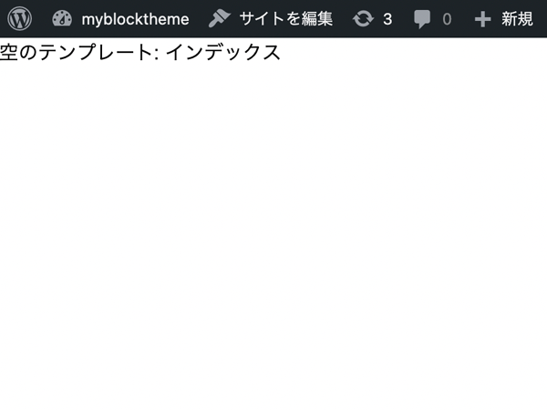

## 構成ファイル theme.json の基本設定
構成ファイル *theme.json* を設定していきましょう。

theme.json はテーマやブロックがサポートする機能・レイアウト・スタイルなど、このJSONファイル一つで管理できます。

```json:title=theme.json(5.9)
{
    "$schema": "https://schemas.wp.org/wp/5.9/theme.json",
    "version": 2
}
```
今回は主に5.9を参考にコードを紹介していくのですが、`$schema` を上記のコードのように設定しておくと、theme.jsonの5.9と6.0のバージョンである *2* を補完(コーディング補助)してくれます。

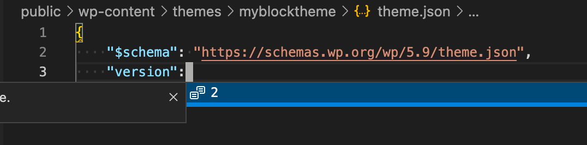

## index.htmlにプロックを追加できる場所を作る

それではテンプレートを作っていきます。

テンプレート *index.html* には以下のようなイメージで、headerとfooterを読み込ませます。

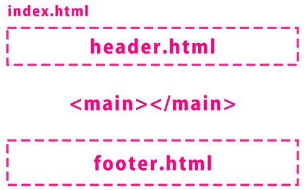

```html:title=templates/index.html
<!-- wp:template-part {"slug":"header", "tagName": "header"} /-->
<!-- wp:group {"tagName":"main"} -->
<main class="wp-block-group"></main>
<!-- /wp:group -->
<!-- wp:template-part {"slug":"footer","tagName": "footer"} /-->
```
テンプレートHTMLには以下のようにブロック名を指定してHTMLのコメントで記述します。

必要に応じて要素を内包します。

```html
<!-- wp:ブロック -->
<!-- /wp:ブロック -->
```
ブロックの書き方ですが、記述を少しでも間違えると、編集画面で以下のように表示されます。


動かない場合、まずスペースが正しく配置されているか確認してみましょう。

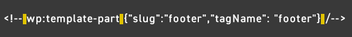

ブロックのオプションは `{}` 内に記述することができます。

たとえば `wp:group` はデフォルトで出力されるHTMLタグを `div` です。 `main` で出力したい場合などあります。`wp:group`　に続けて `{"tagName":"main"}` といったように出力したいタグを指定します。

```html
<!-- wp:group {"tagName":"main"} -->
<main class="wp-block-group"></main>
<!-- /wp:group -->
```
*parts* 内に格納したパーツは `wp:template-part` ブロックで呼び出せます。中に別の要素などを内包する必要がない場合は、次のように自己終了タグで記述することができます。

オプションの中にキー `slug` に、拡張子を除いたファイル名を明記するだけです。

```html
<!-- wp:template-part {"slug":"header", "tagName": "header"} /-->
```
そうすると、以下のようにタグが出力されます。
```html
<div class="wp-site-blocks"><header class="wp-block-template-part"></header>
<main class="wp-container-62a433040090d wp-block-group" id="wp--skip-link--target"></main>
<footer class="wp-block-template-part"></footer>
</div>
```
### header.htmlを編集する
header.htmlでまずはサイト名とサイトロゴを出力します。オプションにレイアウト`{"layout":{"type":"flex"}`をを指定して横並びのレイアウトにします。

```html:title=parts/header.html
<!-- wp:group -->
<div class="wp-block-group">
  <!-- wp:group {"layout":{"type":"flex"}} -->
  <div class="wp-block-group">
    <!-- wp:site-logo {"width":52} /-->
    <!-- wp:site-title /-->
  </div>
  <!-- /wp:group -->
</div>
<!-- /wp:group -->
```
ロゴとサイト名を変更してみます。ブロックテーマではサイトエディターで共通のサイトロゴやサイト名までも変更できます。上部ツールバーに「サイトの編集（サイトエディター）」がありますのでクリックします。

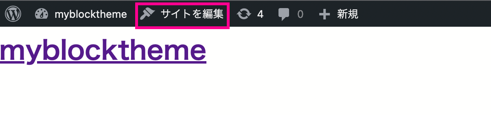

ロゴ画像をアップロードします。ブロックエディターでは自分がどこを選択しているかわからなくなることがあるので迷ったら画面下のパンくずリストを参考にするといいです。
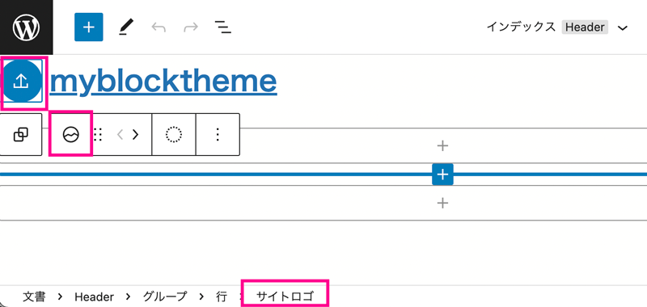

サイトロゴは必要に応じてサイズを調整することもできます。

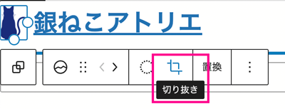

サイト名も変更します。

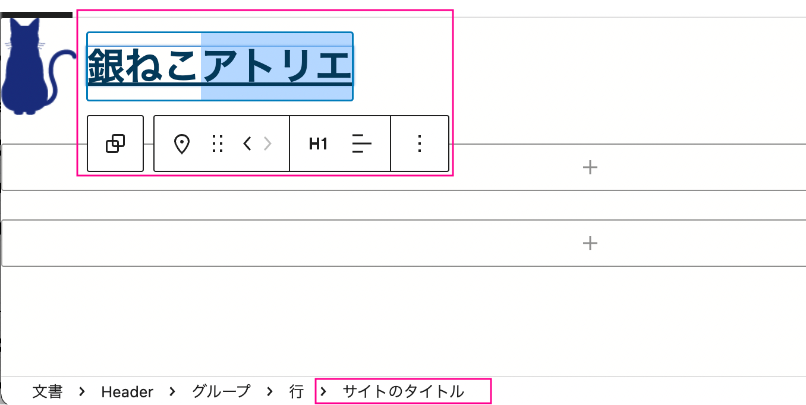

タイトルが変更されました。

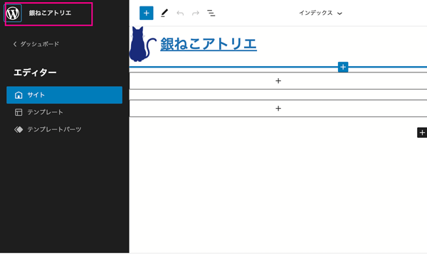

グローバルナビゲーションを追加します。

先程画像サイズなどを変更してしまった方は、headerはもうテンプレートからは更新できなくなっているので、インデックス、一般をクリックして中身がheaderの方の *カスタマイズをクリア* し、変更を保存します。

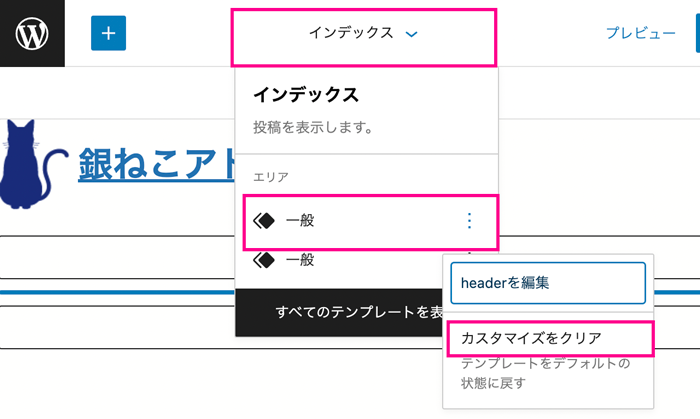

ナビを出力するコードを追加します。ヘッダータイトルとナビを実装します。

```html:title=parts/header.html
<!-- wp:group -->
<div class="wp-block-group">
  <!-- wp:group {"layout":{"type":"flex","justifyContent":"space-between"}} -->
  <div class="wp-block-group">
    <!-- wp:group {"layout":{"type":"flex"}} -->
    <div class="wp-block-group">
      <!-- wp:site-logo {"width":64} /-->
      <!-- wp:site-title /-->
    </div>
    <!-- /wp:group -->
    <!-- wp:navigation {"layout":{"type":"flex"}} -->
    <!-- wp:page-list /-->
    <!-- /wp:navigation -->
  </div>
  <!-- /wp:group -->
</div>
<!-- /wp:group -->
```
ナビゲーションブロックも、サイトエディターから編集可能です。入力したものはクリックから、リンクやテキストを変更可能です。

新規で作成したい場合は、ナビゲーションブロックを選択した状態で、プラスボタンをクリックして項目を追加します。

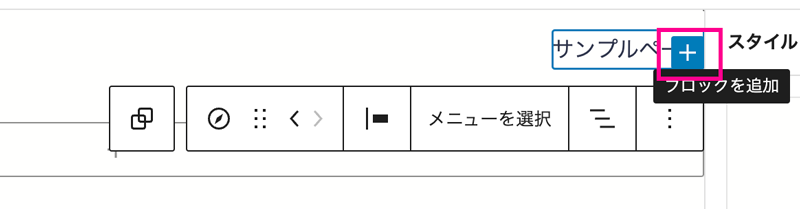

試しにテキトーに項目を追加して保存すると、ちゃんと新しいメニュー項目が追加されています。
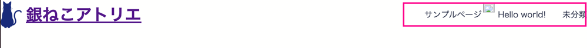


ナビゲーションブロックはレスポンシブ対応もされています。

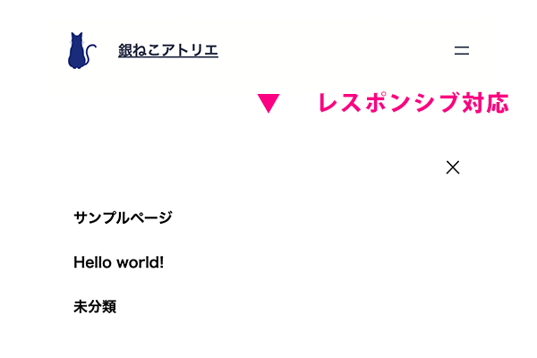

### footer.html
footerにはコピーライトのみを表示します。

```html:title=parts/footer.html
<!-- wp:group -->
<div class="wp-block-group">
  <!-- wp:paragraph {"align":"center"} -->
  <p class="has-text-align-center">(C) Ginneko Atelier.</p><!-- /wp:paragraph -->
</div>
<!-- /wp:group -->
```
文字をセンタリングしたいのでオプションとクラスを以下のように設定しました。右寄せにしたければ `center` を `right` に変更するだけです。
```json
// オプション
{"align":"center"}
// class
has-text-align-center
```

## サイトエディターだけでコンテンツを追加してみる
サイトエディターの魅力は、**サイトを見たままブロックを使って編集できる** ところです。

サイトエディターからコンテンツを追加してみます。

ブロックエディターにあるものはすべて追加できます。
ブロックだけ追加してもサイトっぽいものが作れます。

追加したのは、以下のブロック。

* 画像
* 見出し
* ギャラリー
* 段落

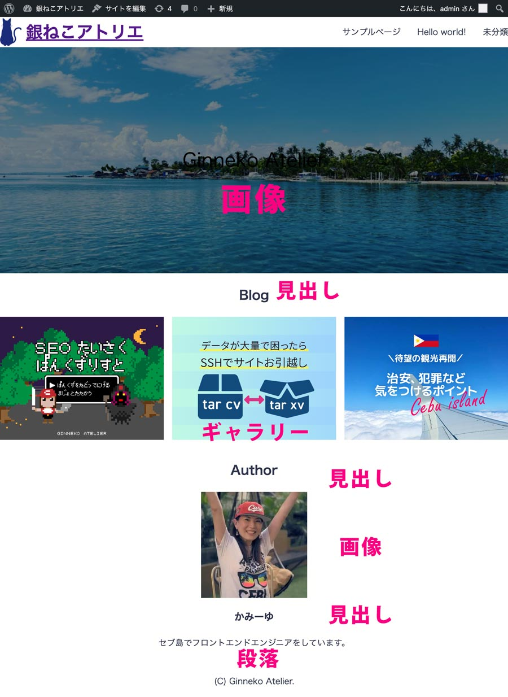

スタイルが入ってないので少しイマイチですが、まあなんとかWebサイトっぽくなりました。

## 色やfontなどサイトの共通の設定をtheme.jsonで行う

theme.jsonから共通の設定をします。

予め言っておきますが、大まかなデザインはtheme.jsonでも行うことができますが、細かいパーツごとの設定ができるわけでは有りません。

### 全体の色やタイポグラフィの設定をする

テーマカラーと、グラデーションと設定してみましょう。

デュオトーンは今回使いませんが、設定の仕方のみ紹介しておきます。

```json:title=theme.json
{
    "$schema": "https://schemas.wp.org/wp/5.9/theme.json",
    "version": 2,
    "settings": {
        "color": {
            "palette": [
                {
                    "slug": "background",
                    "color": "#fffffe",
                    "name": "Background"
                },
                {
                    "slug": "foreground",
                    "color": "#2d334a",
                    "name": "Foregrand"
                },
                {
                    "slug": "primary",
                    "color": "#ffd803",
                    "name": "Primary"
                },
                {
                    "slug": "secondary",
                    "color": "#e3f6f5",
                    "name": "Secondary"
                },
                {
                    "slug": "tertiary",
                    "color": "#bae8e8",
                    "name": "Tertiary"
                }
            ],
            "gradients": [
                {
                    "slug": "aqua-gradient",
                    "gradient": "linear-gradient(to right, #e3f6f5 0%, #bae8e8 100%)",
                    "name": "Aqua Gradient"
                }
            ],
            "duotone": [{
                    "colors": ["#ffd803", "#272343"],
                    "slug": "foregrand-primary",
                    "name": "Foreground and Primary"
                }
            ]
        }
    }
}
```
それぞれ色が追加されました。

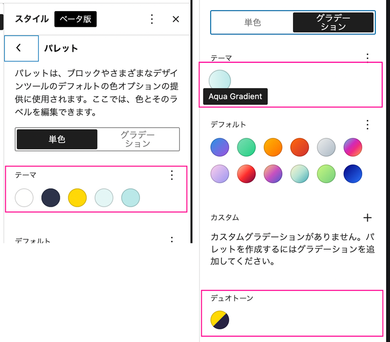

フォントを読み込みます。Googleフォントをheadタグからまとめて読み込みたいので、今回は *functions.php* から追加します。

```
myblocktheme/
  ├ index.php
  ├ templates/
  │  └ index.html
  ├ parts/
  │  ├ header.html
  │  └ footer.html
  ├ functions.php(追加)
  ├ style.css
  └ theme.json
```

```php:title=functions.php
<?php
function set_styles() {
  $theme_version = wp_get_theme()->get( 'Version' );
	wp_enqueue_style( 'wpb-google-fonts', 'https://fonts.googleapis.com/css2?family=Noto+Sans+JP:wght@400;700&display=swap', array(),$version_string );
}
add_action( 'wp_enqueue_scripts', 'set_styles' );
```
`settings`内にフォントサイズとフォントファミリーを追加します。

```json:title=theme.json
{
    "$schema": "https://schemas.wp.org/wp/5.9/theme.json",
    "version": 2,
    "settings": {
        "color": {...},
        "typography": {
            "fontFamilies": [
                {
                    "fontFamily": "\"Noto Sans JP\", sans-serif",
                    "name": "Noto Sans JP",
                    "slug": "noto-sans-jp"
                }
            ],
            "fontSizes": [
                {
                    "size": "10px",
                    "slug": "small"
                },
                {
                    "size": "16px",
                    "slug": "medium"
                },
                {
                    "size": "24px",
                    "slug": "large"
                }
            ]
        }
    }
}
```
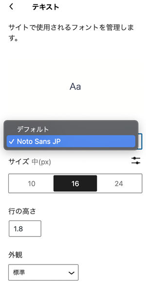

スペースのサイズと単位も追加します。
```json:title=theme.json
{
    "$schema": "https://schemas.wp.org/wp/5.9/theme.json",
    "version": 2,
    "settings": {
        "color": {...},
        "typography": {...},
        "spacing": {
            "units": [
                "%",
                "px",
                "em",
                "rem",
                "vh",
                "vw"
            ]
        },
        "layout": {
            "contentSize": "768px",
            "wideSize": "1120px"
        }
    }
}
```
### 全体のスタイルを当てる
全体のスタイルを当てます。`settings` の後に `styles` というキーを追加します。
```json:title=theme.json
{
    "$schema": "https://schemas.wp.org/wp/5.9/theme.json",
    "version": 2,
    "settings": {
        "color": {...},
        "typography": {...},
        "spacing": {...},
        "layout":  {...}
    },
    "styles": {
        "spacing": {
          "blockGap": "16px"
        },
        "color": {
            "background": "var(--wp--preset--color--background)",
            "text": "var(--wp--preset--color--foreground)"
        },
        "typography": {
            "fontFamily": "var(--wp--preset--font-family--noto-sans-jp)",
            "lineHeight": "1.6",
            "fontWeight": "400",
            "fontSize": "var(--wp--preset--font-size--medium)"
        }
    }
}
```
キー `styles` 直下に指定したスタイルは全体（`body`）に当たります。

セットした各値は `CSS` の変数として以下のように登録されます。

```CSS
/* 名はキャメルケースからケバブケースに */
var(--wp--(設定した場所)-−−(プリセット名)--(slag))
```
`settings` の中に設定した場合は、場所は `preset` になるので注意。
```CSS
/* パレットの色の場合 */
var(--wp--preset--color--(slag))
/* フォントの場合 */
var(--wp--preset--font-family--(slag))
```

`blockGap` でブロックごとのギャップサイズを設定できます。

```json
"spacing": {
  "blockGap": "16px"
},
```

要素やブロックごとにも設定可能です。

```json:title=theme.json
{
    "$schema": "https://schemas.wp.org/wp/5.9/theme.json",
    "version": 2,
    "settings": {
        "color": {...},
        "typography": {...},
        "spacing": {...},
        "layout":  {...}
    },
    "styles": {
        "elements": {
            "h2": {
                "typography": {
                    "fontWeight": "700",
                    "lineHeight": "1.2",
                    "fontSize": "32px"
                }
            },
            "link": {
                "color": {
                    "text": "var(--wp--preset--color--foreground)"
                }
            }
        },
        "blocks": {
            "core/site-title": {
                "typography": {
                "fontSize": "16px"
                }
            },
            "core/navigation": {
                "typography": {
                    "fontWeight": "700"
                }
            }
        }
    }
}
```
ブロックごとにもスタイルを設定可能です。ブロック名で呼び出せるのですが頭に `core/` を付与する必要があります。

```
core/（ブロック名）
```

ブロック名がわからないときはタグのClassを調べるとわかります。`wp-block-` を取り除いたものになります。ブロックをHTMLで開くか、ソースコード開発者ツールなどでみてみましょう。

## ブロックをテンプレートファイル側から装飾する
テンプレート側からパーツごとに装飾可能です。たとえば、ヘッダーの背景や余白を調整したい時、


以下のように感じにコードを書きます。

```html:title=parts/header.html
<!-- wp:group {"layout":{"type":"flex","justifyContent":"space-between"},"style":{"spacing":{"padding":"16px 24px"}},"backgroundColor":"primary"} -->
<div class="wp-block-group has-primary-background-color has-background" style="padding:16px 24px;">
  <!-- wp:group {"layout":{"type":"flex"}} -->
  <div class="wp-block-group">
    <!-- wp:site-logo {"width":32} /-->
    <!-- wp:site-title /-->
  </div>
  <!-- /wp:group -->
  <!-- wp:group -->
  <div class="wp-block-group">
    <!-- wp:navigation {"layout":{"type":"flex"}} -->
    <!-- wp:page-list /-->
    <!-- /wp:navigation -->
  </div>
  <!-- /wp:group -->
</div>
<!-- /wp:group -->
```
プリセットで登録した要素はクラスから利用することができます。
```js:title=option
{"backgroundColor":"primary"}
```
`has-xxx-background-color` と言ったクラス名が生成されるのでそのまま使用可能です。

たとえば背景色に使いたいときは以下のように`has-background`とあわせて使います。
```html:title=クラス名
has-primary-background-color has-background
```

オプション内に色などの記述をあわせてしておきます。

スタイルはタグ内に直書きになりますが、合わせてオプションに記述が必要です。
```js:title=option
// option
{"style":{"spacing":{"padding":"16px 24px"}}}
```
```css:title=インラインcss
/* style */
padding:16px 24px
```

### パターンの追加
画像などのデフォルトのコンテンツの入ったブロックを作るためにはphpファイルで作成する必要があります。

たとえばファーストビューを最初からデフォルト画像を用意しておきたい時。

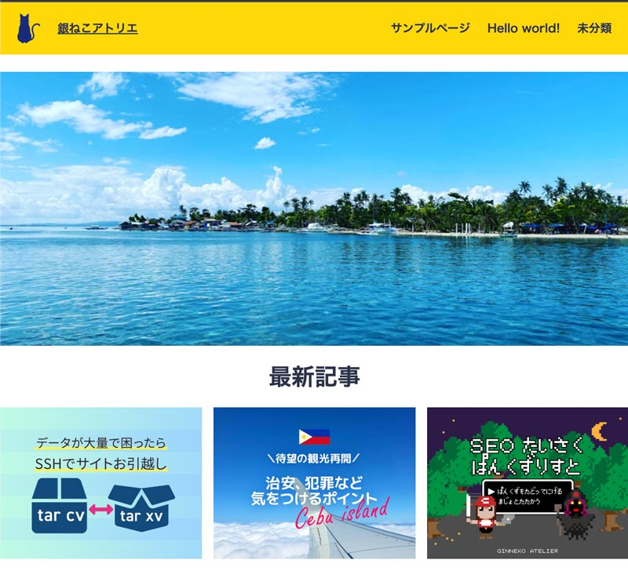

```
myblocktheme/
  ├ index.php
  ├ templates/
  │  └ index.html
  ├ parts/
  │  ├ header.html
  │  ├ mainvisual.html(追加)
  │  └ footer.html
  ├ inc/
  │  ├ patterns/
  │  │  └ home-mainvisual.php(追加)
  │  └ block-patterns.php(追加)
  ├ functions.php(編集)
  ├ style.css
  └ theme.json
```
functions.php から、以下コードを追記して `/inc/block-patterns.php` を 読み込みます。
```php:title=functions.php
...
require get_template_directory() . '/inc/block-patterns.php';
```
`inc/block-patterns.php` で指定したパターンを読み込めるように設定します。

```php:title=inc/block-patterns.php
<?php
function my_register_block_patterns() {
	$block_patterns = array(
		'home-mainvisual',
	);

	$block_patterns = apply_filters( 'my_register_block_patterns', $block_patterns );

	foreach ( $block_patterns as $block_pattern ) {
		$pattern_file = get_theme_file_path( '/inc/patterns/' . $block_pattern . '.php' );

		register_block_pattern(
			'myblocktheme/' . $block_pattern,
			require $pattern_file
		);
	}
}
add_action( 'init', 'my_register_block_patterns', 9 );

```
`parts/mainvisual.html` を読み込みます。
```html{4}:title=inc/index.html
<!-- wp:template-part {"slug":"header","tagName":"header"} /-->
<!-- wp:group {"tagName":"main"} -->
<main class="wp-block-group">
  <!-- wp:template-part {" slug":"mainvisual"} /-->
</main> <!-- /wp:group -->
<!-- wp:template-part {"slug":"footer","tagName":"footer"} /-->
```
`inc/patterns/mainvisual.html` を読み込みます。
```html:title=inc/mainvisual.html
<!-- wp:pattern {"slug":"myblocktheme/home-mainvisual"} /-->
```
`inc/patterns/mainvisual.html` を編集します。
```php:title=inc/patterns/mainvisual.html
<?php
return array(
	'title'    => 'Home main visual',
	'inserter' => false,
	'content'  => '<!-- wp:image {"align":"wide","sizeSlug":"full","linkDestination":"none"} -->
		<figure class="wp-block-image alignwide size-full"></figure>
		<!-- /wp:image -->',
);
```
こうしておくことで、デフォルト画像をサイトエディターから編集できるようになります。
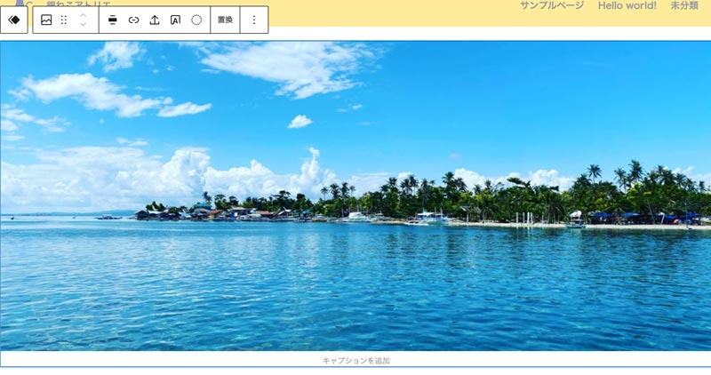

## まとめ

今回ブロックテーマを試してみましたがいかがでしたでしょうか？

細かい部分は正直、CSSから設定したほうが格段に早いです。

が、適宜サイトエディターで変更できるようにしておけばきっとお客様の方である程度変更も可能になります。

[後編・記事一覧出力やページの追加](/blogs/entry509)も合わせてお読みください。

この記事が、ブロックテーマで次世代WordPressを試したい方の一助となれば幸いです。

最後までお読みいただきありがとうございました。


### クラシックテーマとブロックテーマとの比較
今までのクラシックテーマとブロックテーマの違いです。<br><small>※ Google翻訳使いつつ意訳しているので、意味がわかりにくいかもです、、、</small>

|クラシックテーマ|ブロックテーマ|
|-|-|
|PHPファイルで各パーツを作成|ブロックはHTMLファイルで作成。HTMLファイルがない場合はPHPファイルを使用。<br>例）single.html=single.php|
|テンプレート階層|テンプレート階層|
|PHPのテンプレートタグ使用|すべてにブロック使用<br>ポストコンテンツブロックはテンプレートタグ `the_content` と同じ。|
|PHPでテキストを出力|HTML内のテキストの出力できない。ブロックパターンでPHP上で出力させる。|ブロックで異なる出力結果を設定する|
|ループを使って異なる投稿やポストタイプを表示|クエリブロックとテンプレートブロックを使う|
|サイドバーやウィジェットが使える|ブロックでジェットを使用。使えるウィジェットはブロックによる|
|カスタマイザーが使える|サイトエディターが使える。オプションでカスタマイザー使用可能|
|ナビゲーションメニューでメニューを登録できる|ナビゲーションブロック使用|
|カスタムヘッダーを登録できる|サイトヘッダーを画像を含めてブロックで設定可能|
|サイトヘッダーをカスタマイザーなどから登録できる|サイトヘッダーは画像を含めてブロックで設定可能|
|カスタマイザーなどからロゴを登録できる|サイトヘッダーは画像を含めてブロックで設定可能|
|CSSやJSをfunctions.phpなどで登録可能|全体のCSSやJSをfunctions.phpなどで登録し、ブロック単位やtheme.jsonにも設定できる|
|theme.jsonを使えるがCSSの設定は必要|theme.jsonを使ってエディターや見た目を編集可能|
|テンプレートファイルはテーマ直下に格納|テンプレートファイルはtemplates内に格納|
|テンプレートパーツはテーマ以下ならどこに格納してもOK|テンプレートファイルはparts内に格納|
|404ページやアーカイブはサイトエディタで作成や編集不可|404ページやアーカイブもサイトエディターで編集可能|
|テーマサポートなしではテンプレートエディターでブロックテンプレートを編集したりできない|テーマサポートなしでテンプレートエディターでブロックテンプレートを編集できる|

### 参考サイト
[【WordPress5.9 / 6.0版】theme.json 全解説](https://qiita.com/TetsuakiHamano/items/1cff973739039e5efc18)
