## Clarityで分かること、できること
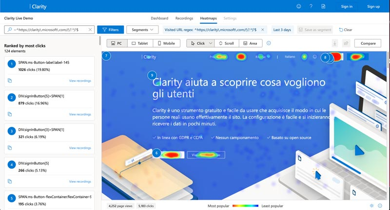

Clarity を使うとスクロール率やクリック箇所などが可視化されるので直感的に改善すべき箇所が探しやすくなります。

私がよく見ている機能です。Google アナリティクスではわからない箇所を中心に見ています。

* ページごとのスクロール率
* ページごとのクリック箇所
* ユーザーの動きの動画
* デッドリンク（クリックする必要のない箇所なのにクリックされている場所）などの発見

ぜひ Clarity の[デモサイト](https://clarity.microsoft.com/demo/projects/view/3t0wlogvdz/dashboard?date=Last%203%20days)で確認してみてください。

ただ、英語なので英語が苦手な方はGoogle翻訳などのChromeなどの拡張機能を入れて使うと良いかもしれません。

### ClarityはUIの改善に役立つ

リンクやボタンじゃないのにクリックされている要素をデッドリンクといいます。

大抵の原因はデザインが紛らわしくてクリックしている箇所があるとユーザーはストレスを感じ離脱の原因になります。

Clarityではこのデッドリンクを始めとするユーザーの行動箇所などを特定できます。デッドリンクが見つかれば、どう紛らわしいか確認し、デザインを改善することができます。

## 導入方法
Google、Facebook、Microsoftのアカウントがあればすぐに始めることができます。

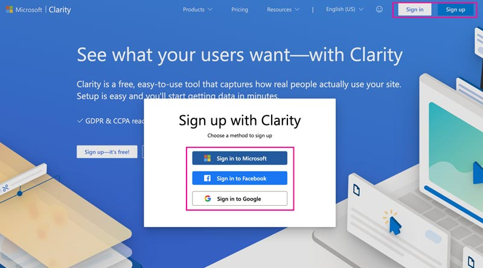

[Microsoft Clarity](https://clarity.microsoft.com/)

新規登録では *Sign Up* を選びます。

* *Sign Up サインアップ* = 新規登録
* *Sign In サインイン* = 登録済みの人のログイン

Google Tag ManagerやGoogle アナリティクスと連携しやすいので、Googleアカウントを使って登録することをオススメします。

メールアドレスを入力します。

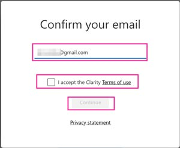

> I accept the Crarity Terms of use.
利用規約に同意を求められるので、チェックを入れます。

### プロジェクトの追加
プロジェクトを追加します。

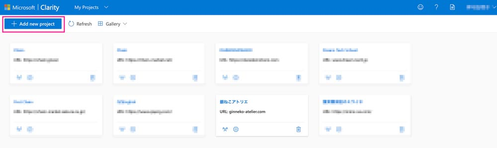

名前とサイトのURLとサイトカテゴリーを登録します。
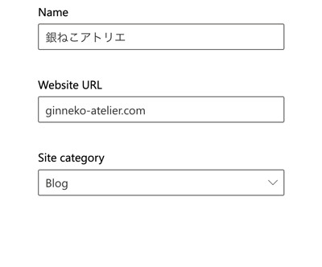

* *E-Commerce* ... ネットショップとか
* *SaaS* ... SaaS
* *Marcketing* ... マーケ
* *Consulting* ... コンサル
* *Media* ... メディア
* *Education* ... 教育関連
* *Comuunity* ... コミュニティ
* *None-profit* ... 非営利
* *Other* ... その他

### Clarityのインストール

> To see how users engage with your site, you need to install a Clarity tracking code. It can take up to 2 hours to start seeing data.<br>
> <small>サイトのユーザーのエンゲージを観測するためにはトラッキングコードをインストール（埋め込み）してください。最初のデータが見れるまでに2時間かかります。</small>

直接タグを埋め込む方法とタグマネなどを介してインストール（トラッキングコードを埋め込む）する方法があります。

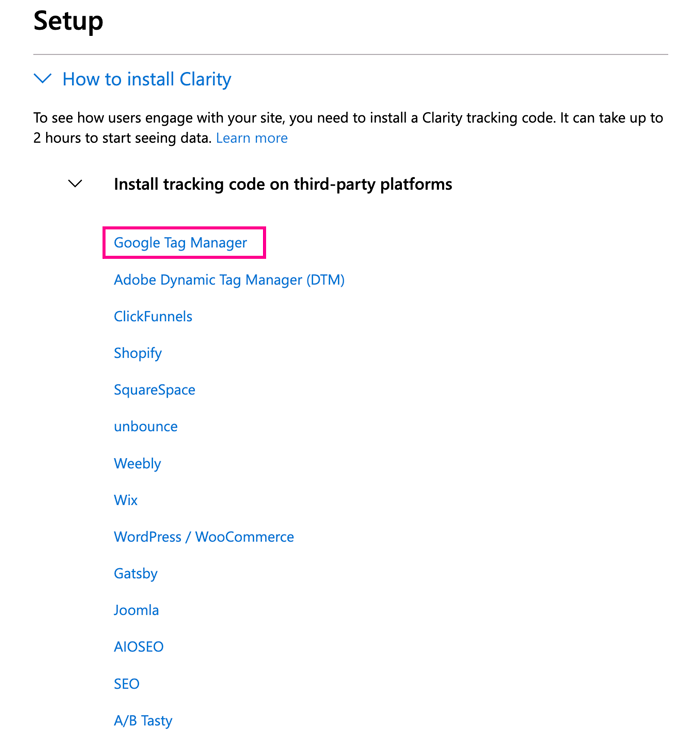

個人的にはタグマネを介してインストールするのがラクなのでおすすめです。

Googleアカウント経由でタグマネアカウントとGTMコンテナ名を取得して設定します。

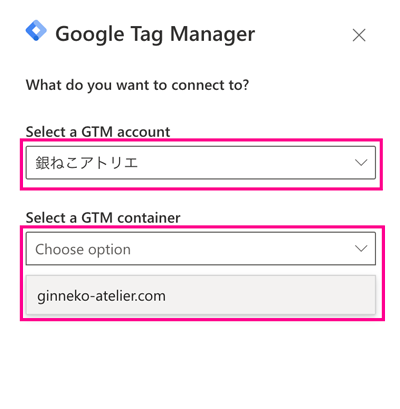

2時間経ってデータが取れない場合にはちゃんとタグが埋め込まれているか確認し直します。

タグマネでの確認方法を以下記事にまとめてます。参考にしてください。

<card id="/blogs/entry501/"></card>

### IP blocking（IPブロック） のセットアップ
チームメンバーなどのIPアドレスをブロックできます。

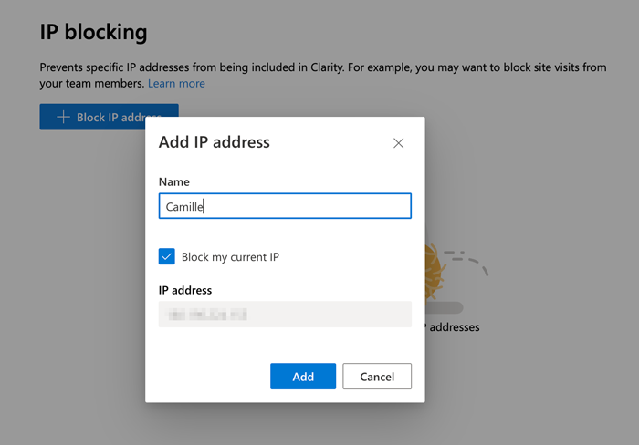

Block my current IPにチェックを入れると現在の自分のIPを追加できます。

### Masking（マスキング） のセットアップ
Clarity にはコンテンツのマスキング（隠す）機能があります。

> We mask all sensitive data on your site by default. You can mask additional content, too.<br>
> <small>すべてのセンシティブなデータはマスキングで隠されています。マスキングはカスタマイズできます。</small>

センシティブなコンテンツはデフォルトでマスキングされています。

*Strict*、*Balance*、*Relaxed* とモードが3つあり、デフォルトは *Balance* です。


* *Strict* ... すべてのテキストがマスク
* *Balance* ... フォームや数字、iframe（Google map YouTube Google広告）はマスク
* *Relaxed* ... マスクなし

さらに要素ごとにマスク有りなしをカスタマイズしてセットできます。録画されて困るものなどは個別にマスキングしておきます。

*add element* からマスクしたい要素を指定します。

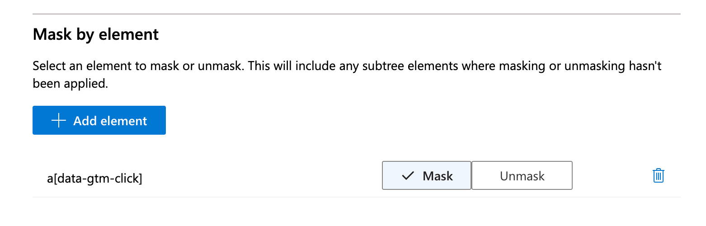

### Content insights card のセットアップ
Clarity には Content Insights（コンテンツの洞察） と言って記事エリアのエンゲージメントを計測していくことができます。
<br><small>※ 何が観測できるかは <a href="#Contents insights">Dashboard（ダッシュボード）の Contents insights</a> で詳しく説明します。</small>

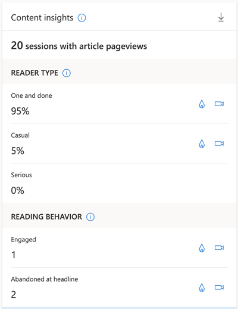

> Content insights card is automatically applied for most WordPress blog sites. To view content insights on your Clarity dashboard, add the following attribute to the article element or tag on the DOM for article pages.<br>
> <small>Content insights カードはほとんどの WordPress では自動的に設定されます。もし Content insights カードが表示されない場合、専用の属性を手動で追加してください。</small>

ほとんどの WordPress では自動的に設定される Content insights カードが表示されるのですが、私のブログみたいに GatsbyJS 製など WordPress 以外のWebサイトではきちんと表示されないことがあります。

表示させるためには記事が格納されているタグにカスタムデータ `data-clarity-region="article"` を付与する必要があります。

```html:title=HTML
<html>
   <head>
   <body>
              ...
              <article data-clarity-region="article">
              ...
              </article>
   </body>
</html>
```

### Google アナリティクスと連携
アナリティクスと連携することもできます。

連携しておくと Clarity 側でもデータが見れるのと、アナリティクス側でも Clarity のイベントを取得できるようになります。ただし現在連携できるのはユニバーサルアナリティクスのみです。

<msg txt="Clarityに表示されるGoogle アナリティクスのデータは見ていません。アナリティクスで見ればいいことだし。"></msg>

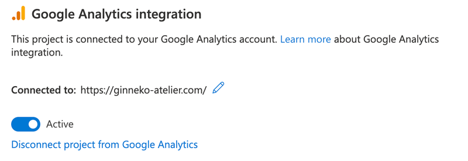

## Clarityの使い方
セットアップが終わったら実際に使ってみましょう。

Dashboard（ダッシュボード）、Recording（録画）、 Heatmaps（ヒートマップ）の3つが確認できます。

Filters（フィルター）の機能を使って期間やページ項目などを絞れます。かなり細かく絞り込めます。

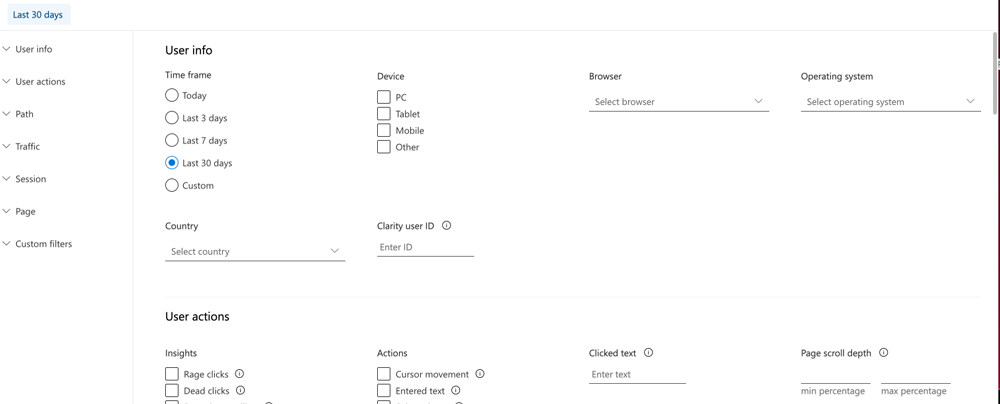

|フィルター|説明|
|-|-|
|*User info*|Time Frame（期間）、Device（ディバイス）、Browser（ブラウザ）、Operation system（OS）、Country（国）、Clarity user ID|
|*User actions*|[Insights(洞察)、Actions（行動）](#insights)、Clicked text（クリックしたテキスト）、 Page scroll depth（スクロール率・最大値と最小値）、Goal setup（Google アナリティクスのコンバージョン。ステータスはReached（達成）かDidn't reach(未達)か選択可能）|
|*Path*|Entry URL(ランディングページ)、Exit URL(離脱ページ)、Visited(訪問ページ)|
|*Traffic*|Referring site(URL直接入力)、Source(選択)、Medium(ダイレクト、オーガニック、リファラーから選択)、Campaign（キャンペーン）、Channel（チャネル）|
|*Session*|Session duration(セッション時間・最大値と最小値)、Session click count(セッション内でのクリック数)、Session page count(1セッションのページ遷移数)|
|*Page*|Page duration(ページ滞在時間・最大値と最小値)、Page click count(クリック数)、Error（JSと画像）、Page size(ページサイズ)、Screan resolution（解像度）、Visible page(ユーザーへのページ表示時間)、Hidden page(ページは開かれているのに見られてない時間。たとえば別タブで開いているだけとか)|
|*Custom filter*|カスタムでCustom tagsでフィルターを作れる。Custom tagsに関するドキュメントは[こちら](https://docs.microsoft.com/en-us/clarity/custom-tags)。|

<span id="insights"></span>

*User actions* の「Insights」「Actions」をもう少し掘り下げます。Clarity における Insights は **いわゆるユーザーのネガティブな行動** です。

|Insights|説明|
|-|-|
|*Rage clicks*|狭いところを何度もカチカチクリック|
|*Dead clicks*|リンクやボタンなどのクリック要素ではないところをクリック|
|*Excessive scrolling*|急なスクロール|
|*Quick backs*|前のページに即座に戻られる|

|Actions|説明|
|-|-|
|*Cursor movement*|カーソルの動き|
|*Entered text*|文字入力（ペーストも含む）|
|*Selected text*|ページの中で文字を選択|
|*Resized page*|ページのリサイズ|

実際にFilters（フィルター）を使ってみましょう。


日付を30日にし、「Actions」の「Selected text」にチェックを入れます。

「Apply」をクリックすると条件に絞られた状態になります。

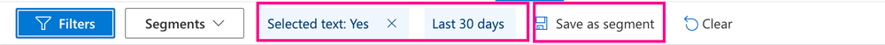

よく使う Filters（フィルター）は Segments に登録して再利用します。

<span id="path"></span>

#### Path フィルターでの絞り込み方法

Path からはページを絞り込めるのですが、方法は3種類あります。

1.最初から `*` の手前まで一致するURL。

```bash
https://ginneko-atelier.com/blogs/entry473/*
```

2.正規表現は `~` を頭につけます。

パラメーターを含むすべてのページを取得したい場合。


```bash
~^https://ginneko-atelier\.com/blogs/entry473/(\?.*)?$
```

正規表現に関してはこちらを参考に。

<card id="/blogs/entry336/"></card>

3.何もつけなければ完全一致。
```bash
https://ginneko-atelier.com/blogs/entry473/
```

### Dashboard（ダッシュボード）
ダッシュボードでは全体を確認することができます。

私は Google アナリティクスで見れる箇所は飛ばして見るようにしています。

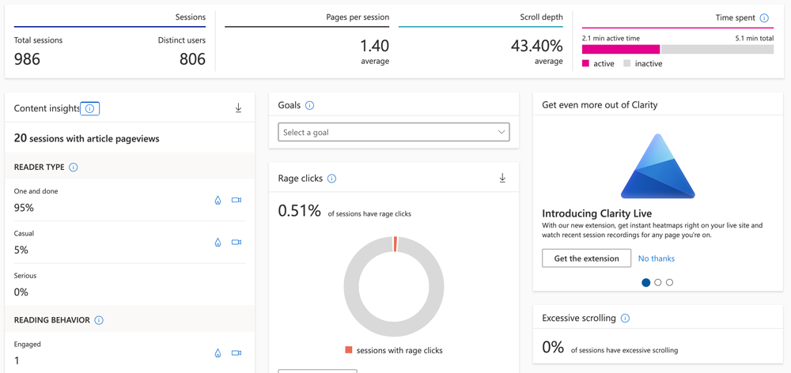

私が主に見る箇所は「Scroll depth」、「Contents insights」、「JavaScript errors」とユーザーの行動（Insights）を中心とした「Dead clicks」「Rage clicks」です。

先程 Filters（フィルター）で「Actions」の「Selected text」を絞り込みましたが、この銀ねこアトリエでは、コードサンプルが掲載されているページが圧倒的にデッドクリックがあることが分かります。

これはユーザーがソースコードのコピペの過程で起こっているデッドリンクです。

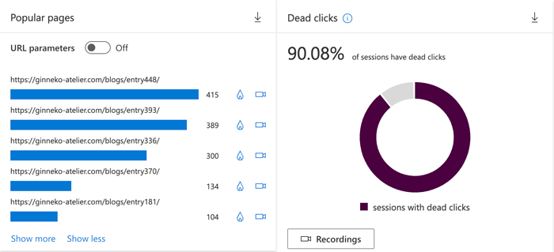

デッドリンクを減らすためにはソースをコピーボタンをつけるなど、対策を考えることができます。

<span id="Contents insights"></span>

#### Contents insights

Contents insights では READER TYPE（読者のタイプ）、READING BEHAVIOR（読んでる最中の行動）など、記事中のエンゲージメントの中でキーとなる指標が確認できます。


|READER TYPE（読者のタイプ）|説明|
|-|-|
|*One and done*|1セッションにつきたった1回|
|*Casual*|1セッションにつき2~3記事|
|*Serious*|1セッションにつき4記事以上|

|READING BEHAVIOR（読んでる最中の行動）|説明|
|-|-|
|*Engaged*|記事を最後まで読んだ|
|*Abandoned at headline*|記事の見出しだけしか読んでない|

以前、【GA4】タグマネで設置したイベントが計測できないときの対処法という記事で[要素の表示イベントを利用して「読了」を計測するタグ作成](/blogs/entry501/#要素の表示イベントを利用して「読了」を計測するタグ作成)を紹介しましたが、Clarity が入っていれば必要ないかもですね。

まだ計測し始めたばかりですが、CLARITY CALLOUTS 内に分析結果をテキストで教えてくれます。

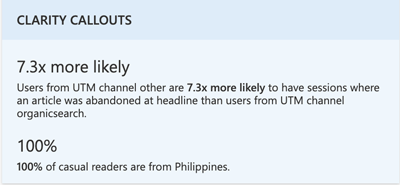

ざっくり翻訳すると以下の事が書いてあります。

1. オーガニックサーチ以外のチャネルからの訪問者は見出ししか読まずに離脱する可能性が7.3倍高い
2. Casual（1セッションにつき2~3記事）な読者は100％フィリピンからの訪問

<msg txt="フィリピンからの訪問…そりゃ私だよ！"></msg>

### Recording（録画）

録画されたユーザーの行動を見ることができます。

動画は Recording（録画）に移動すると、左側にカードが並んでいます。

日時、撮影時間、Entry/Exit、ページ遷移数、クリック数等細かい情報が掲載されています。

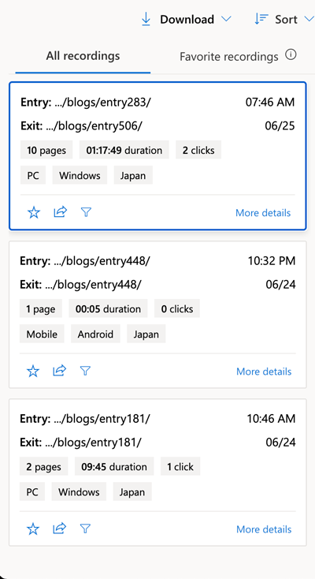

見たい動画をクリックします。

おすすめの再生設定方法です。

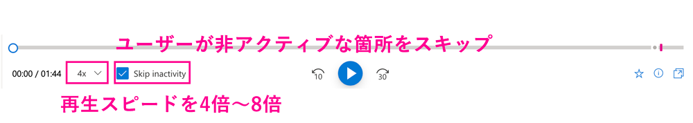

再生スピードを *4倍から8倍*、*Skip inactivity にチェック* を入れておけばサクサク動画を確認できます。

<msg txt="動体視力がない人は2倍ぐらいにしておきましょう"></msg>

再生中は以下のような感じで、ユーザーの動きがわかります。

PCの場合
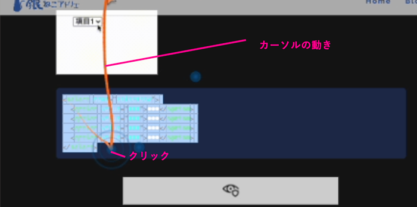

SPの場合
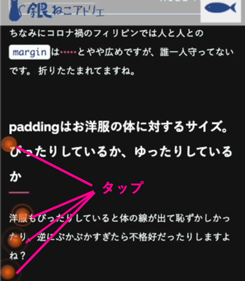

### Heatmaps（ヒートマップ）

Heatmaps（ヒートマップ）はクリック（タップ）、スクロール状態をヒートマップで可視化できます。

Filters（フィルター）を使わなくても、左上の検索窓に直接URLを打ち込んでページを検索できます。もちろん、高度な絞り込みができます（絞り込み方法は<a href="#path">Path フィルターでの絞り込み方法</a>参照）。

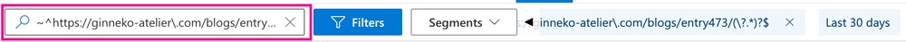

* *ディバイス* ... PC、Tablet、Mobile（スマホ）
* *ヒートマップの種類* ... クリック（タップ）、スクロール、エリアの3つ

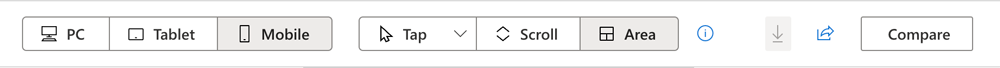

画面下のバーでページビュー数とクリック（タップ）数が確認できます。
一番活発な箇所は赤、さほど活発ではない箇所は青色で表示されます。

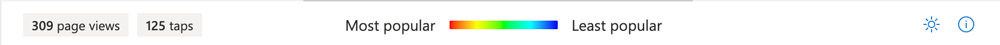


クリック（タップ）です。どの要素がどのくらいクリックされているかも分かります。

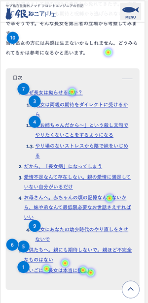

クリック（タップ）数が多い順に番号が振られ、要素の詳細は左のバーで確認できます。
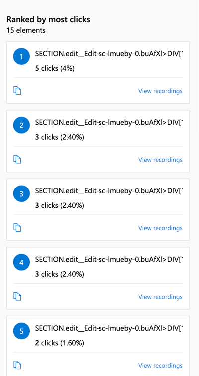


スクロール量です。どのページもだいたい上の方が赤く下に行くにつれて青くはなりますが、早く離脱が起こっているページはすぐ青色になります。

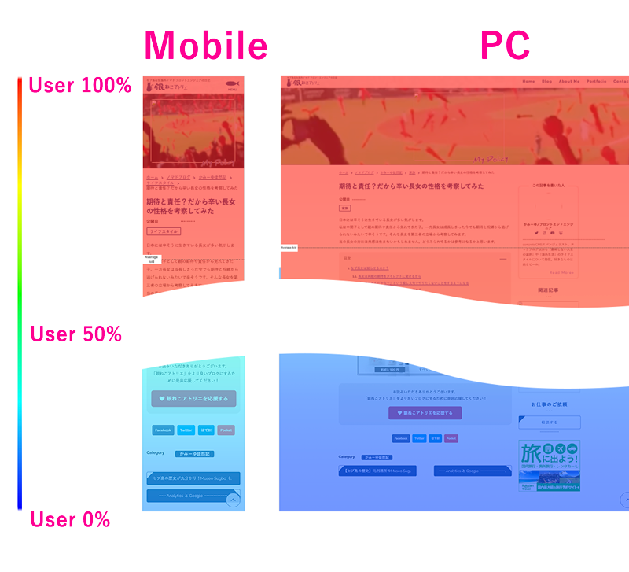

<small>※ この銀ねこアトリエの画像は一部の画像が遅延読み込みされているので画像が記録されていないですが、問題有りません。</small>

<br>左のバーでスクロール5％ごとに何人ユーザーが残っているかが分かります。

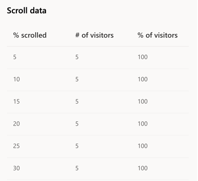

エリアです。要素ごとのトータルクリック数（タップ）をパーセンテージで視覚化してくれます。

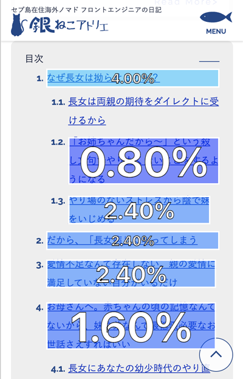

左のバーからサイトに表示されている順番で確認できます。

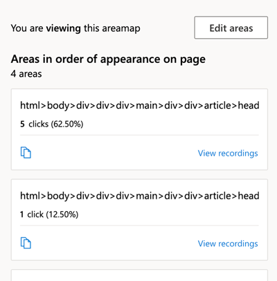

## ヒートマップ表示されない場合（２０２２年１２月追記）
<msg txt="あれれ？！ヒートマップ表示されないだけど。。。"></msg>

Clarityではせっかくタップ/クリック箇所やヒートマップを見ようとしても「We couldn't find any clicks.」や「We couldn't find any scroll information.」とヒートマップ表示されなくなる事が多いです。

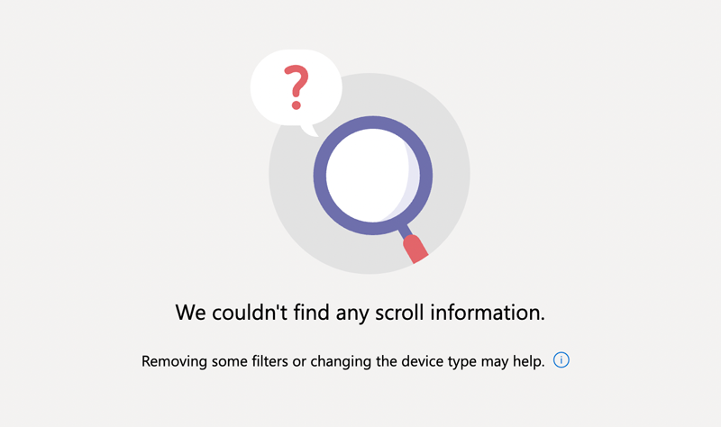

この場合の私の対処方法のご紹介です。

Clarity はページごとにヒートマップの状態を確認できます。

一覧に表示されているURLは正規表現を使って抽出されたページです。

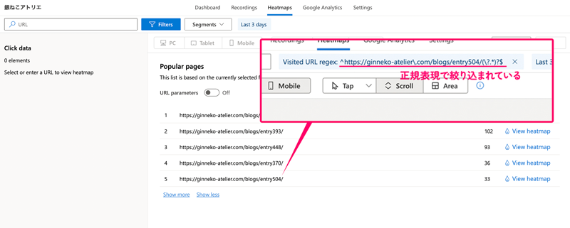

ヒートマップを見たいページを<a href="#path">Path フィルターでの絞り込み方法</a>で紹介した方法、以下いずれかでページを抽出し直します。<br><br>

* 1.最初から * の手前まで一致するURL
* 3.何もつけなければ完全一致の方法

こうするとたいていヒートマップやタップ/クリックか所を表示できるようになります。

ページが絞り込めない理由はあくまで私の仮説ですが、正規表現を用いると処理に時間がかかりすぎてヒートマップを生成できなくなるのだと思われます。

## まとめ・ヒートマップを活用するとより深くユーザーの行動を分析できる
英語だからとっつきにくいと思っている方のために、かなり設定やツールの使い方をかなり詳しく説明しました。

具体的に Clarity を使って、いくつか UI も改善したことがあります。

まだまだ紹介しきれてない機能もありますが、また機会があれば追記しようと思います。

相当長くなってしまいましたが、最後までお読みいただきありがとうございました。

### 参考
[Clarity Docs(英語)](https://docs.microsoft.com/en-us/clarity/)
