## GCashとは？
GCash とはお店にあるQRコードや自分のアプリでQRコード決済できるフィリピンで使えるサービスです。

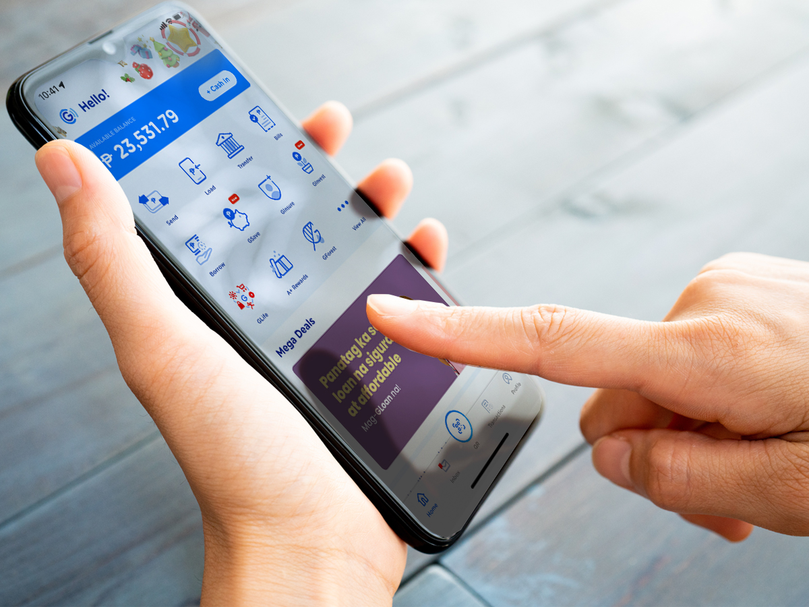

GCash を利用するためには [iPhone](https://apps.apple.com/ph/app/gcash/id520020791) もしくは [Android](https://play.google.com/store/apps/details?id=com.globe.gcash.android&hl=en_US&gl=US) から GCash アプリをダウンロードします。

以下の手順でアカウント作成します。

1. 電話番号入力（現地の電話番号）、SMSから届く認証用コード入力
2. 氏名、住所、生年月日、メールアドレスを登録
3. 4ケタの暗証番号（MPIN）を登録

<small>※アプリを開く度に暗証番号の入力が必要です。</small>

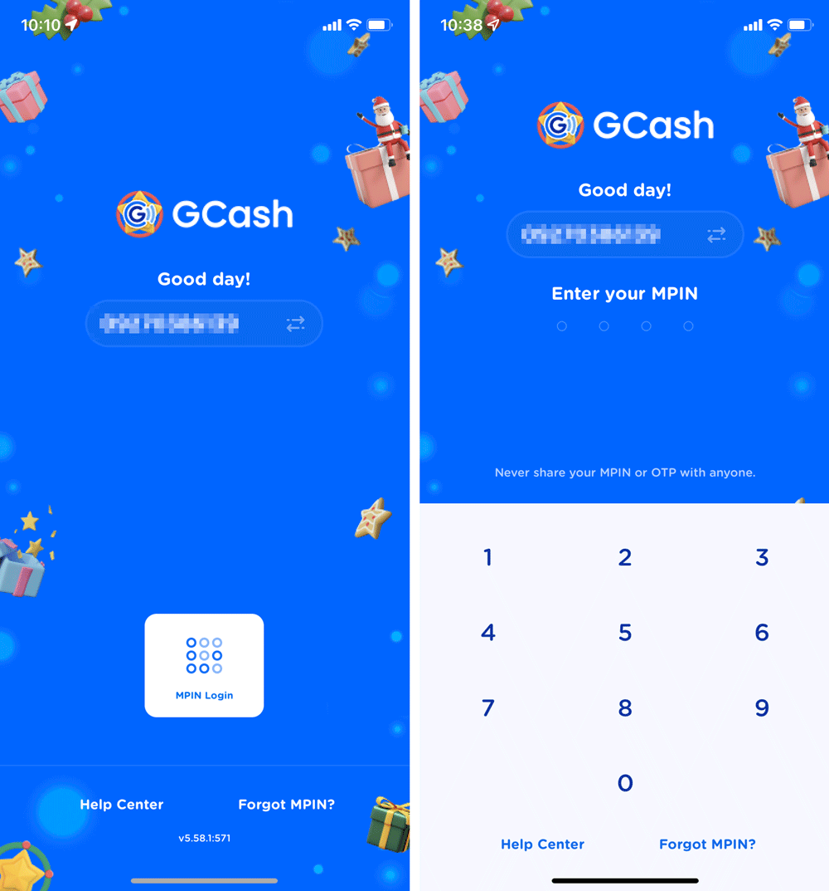

GCash を完全につかえるようにするためには、パスポートなどの身分証を使ってFully Verified処理をする必要があります。

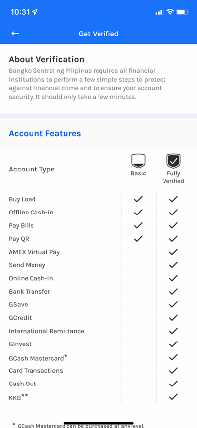

### GCash でできること
GCash は個人間のお金の送金、水道代などの料金の支払い、携帯のロードなどで重宝します。

*引き出し、預け入れ等、最大月額10万ペソ（日本円で24万くらい）* 取引きできます。

フィリピン人は銀行を持っていない人も多いので、GCash で給料の受け取りをしている人も多いみたいです。

<msg txt="大きな買い物はできませんが、ちょっとした長期滞在する人には十分な額ではないでしょうか？"></msg>

### フィリピンでのキャッシュレス決済のデメリット
GCash を使う上での問題は*ネットが使える場所でしか使えない*ということです。 
通常、日本では考えにくいかもしれませんが、セブ島のインターネットは不安定（特にモバイル）。

携帯の電波がつながらない or 弱くて GCash が使えなくなることがしょっちゅうあります。

また、お店のネットの問題や GCash の読み取り用端末が壊れていて使えないことも。。。

## GCash Card を作ると ATM から 現金が引き出せる
GCash アプリから 専用マスターカード（GCash Card） を作ることができます。費用は215ペソです。

このカードはクレジットカードとしてもキャッシュカードとしても使えます。

### GCash Card の入手方法
カードはコンビニでも販売しているらしいのですが、私は手に入らなかったのでアプリからカードの配達依頼をしました。

依頼の仕方です。GCash アプリを開いてView All → Cash Out を開きます。

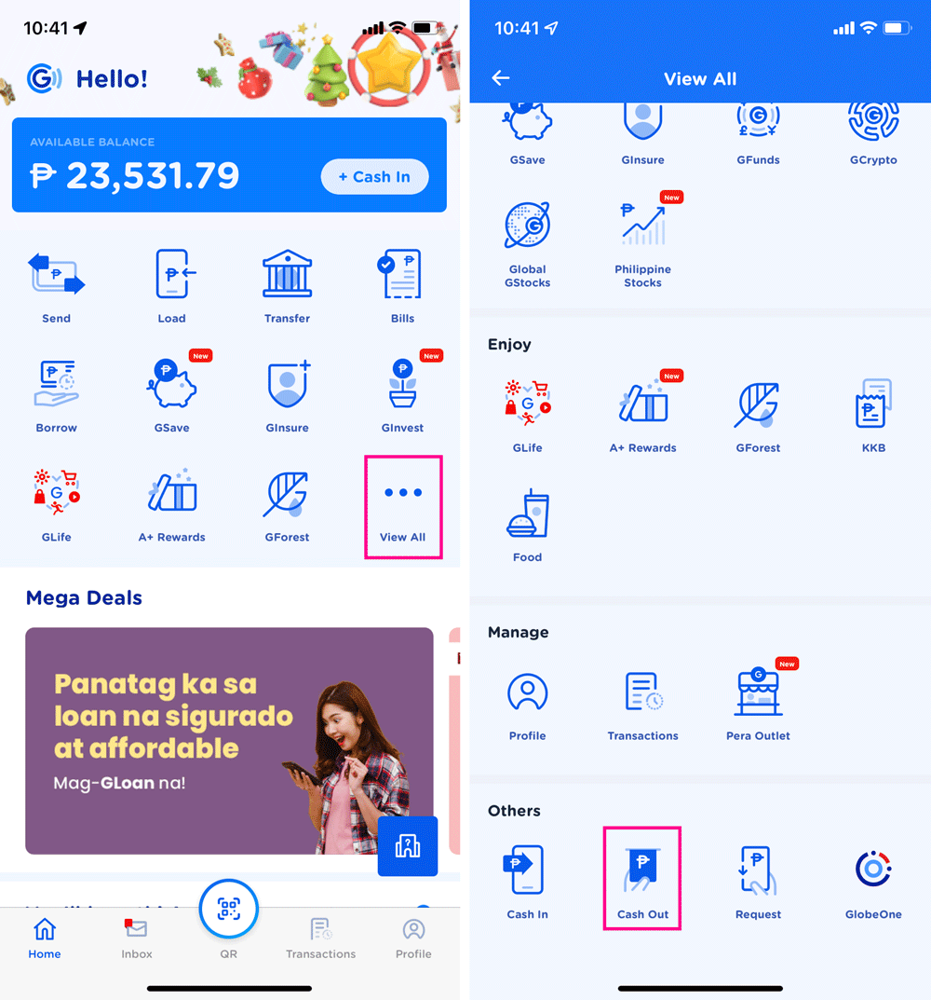

DELIVERを選択。

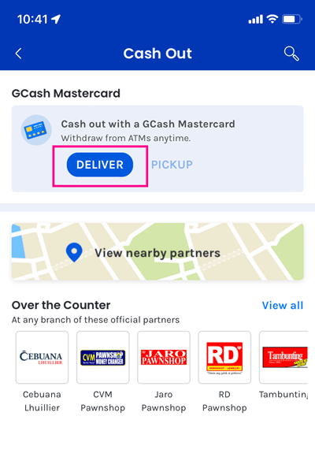

お届先情報を入力。GCash の残高が215ペソ以上無いと作れないのでご注意を。

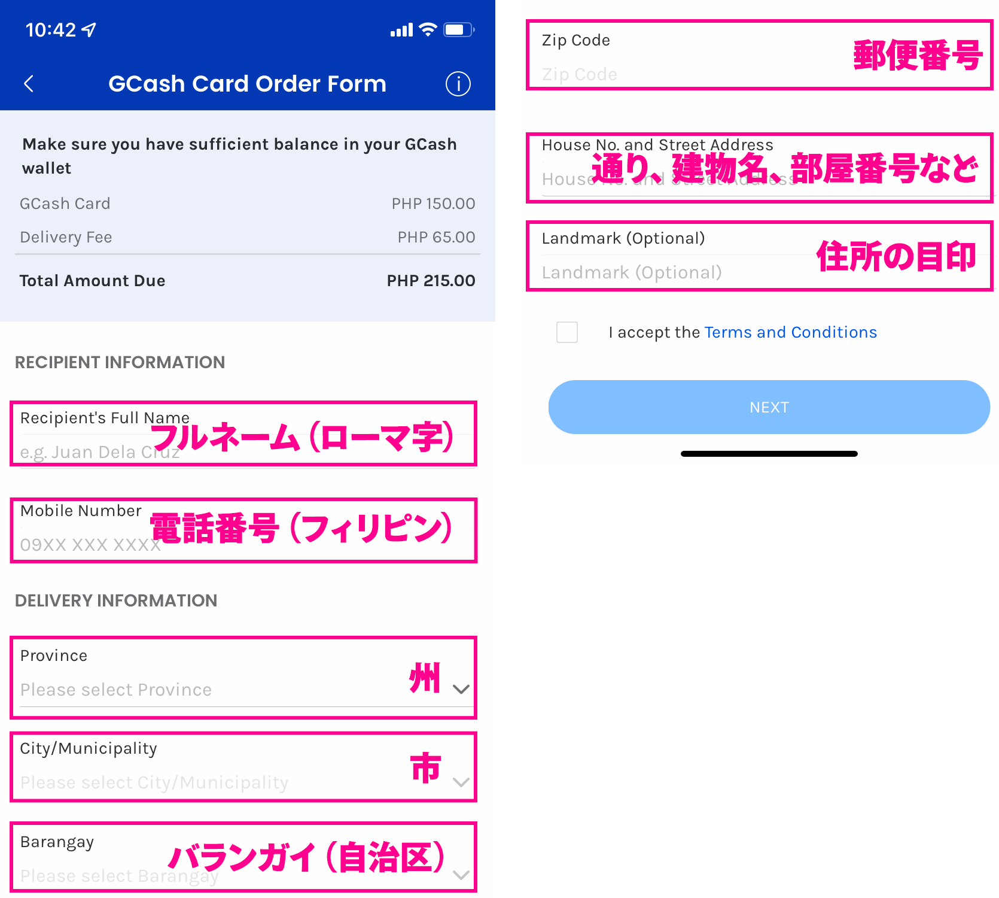

1. 名前（フルネーム、ローマ字）
2. 電話番号（現地の番号）
3. 州
4. 市
5. バランガイ（バランガイとは、フィリピンの都市と町を構成する最小の地方自治単位です。わからない場合は大家さんなどに聞いてみてください）
6. 郵便番号
7. 住所の細かい情報（ストリート名、建物と部屋番号など）
9. ランドマーク（住所の目印になる建物など）

利用規約に同意して申し込みます。すると、2週間位で自宅に届くはずです。

## GCash Card でお金を引き出してみる
届きました！

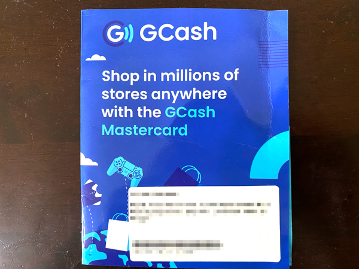

こちらが届いたカードです。パッケージにはしつこくカードが糊付けされていたせいか、粘着が完全に取れませんでした笑

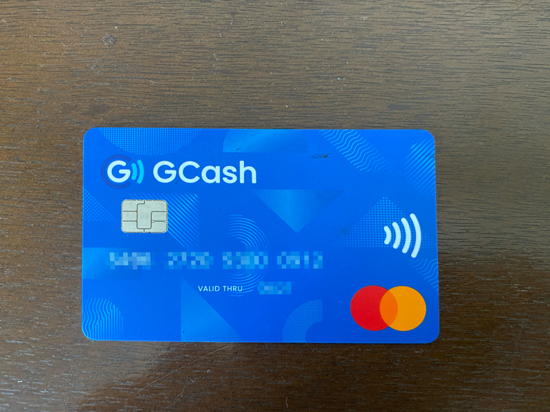

## GCash Card をアクティベートする
カードが届いただけだと使えないのでアクティベートします。

右下の Profile をタップし、My Linked Accounts を開きます。 
（私はDELIVERからアクティベートした記憶がありますので、そちらからでも多分できると思います）

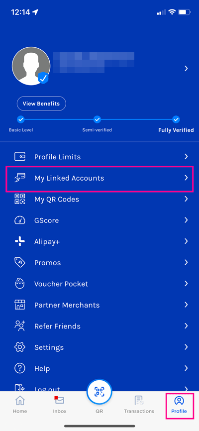

GCash Card を開きます。
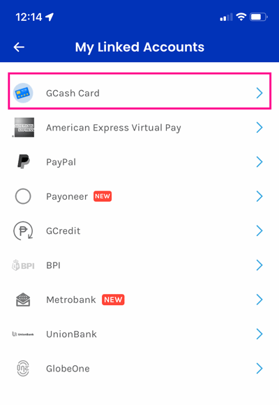

GCash Card を追加します。最大3つ追加できるようです。

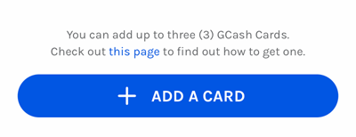

SMSから届く認証用コード入力し、アクティベート画面に進みます。

届いたカードの下4ケタと、パッケージの裏左下に記載されているVirtual Account Number（12ケタ）を入力します。

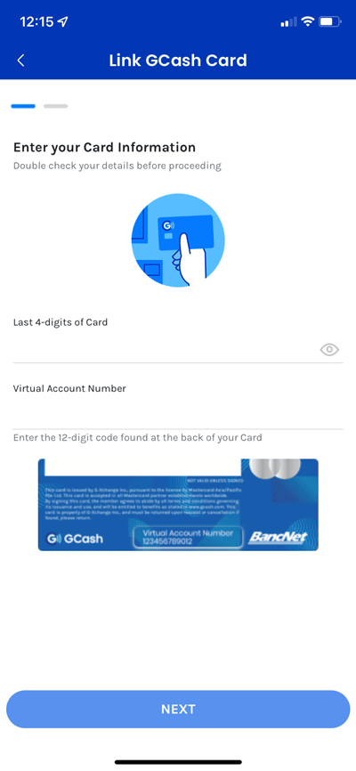

NEXTボタンを押し、次の画面で引き出す際に使う6ケタの暗証番号（Card PIN）を登録しアクティベートすれば完了です。

この暗証番号（Card PIN）ですが、アプリログイン時に使うものとは違うものを登録してください。

 一度アクティベートしたカード情報は My Linked Accounts → GCash Card から確認できます。

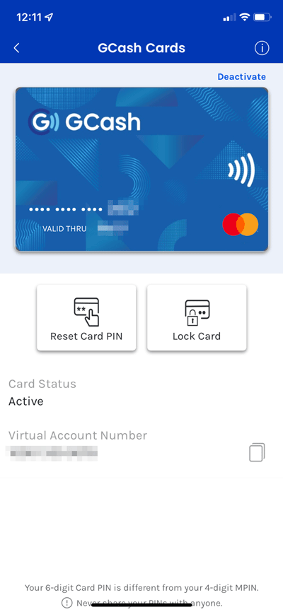

ここから暗証番号（Card PIN）を変えたり、ロックしたりなどもできます。

## GCash Card で実際にお金を引き出してみる

基本主要銀行では使えるみたいですが、**銀行によって手数料が違う**ので注意が必要です。

<msg txt="ちなみにセブンイレブンのATMでの手数料は10ペソでした!!"></msg>

### GCash Cardはクレジットカードとしても使える
カードはクレジットカードとしても使えます。

私は今のところQR決済で事足りているのでまだ使ったことありませんが、いつか試してみようと思います。

## GCashはフィリピン移住、長期滞在では必須のおすすめアプリ
GCash はロックダウン中に使うようになりましたが、現金を持ち歩かなくていいのでとても重宝します。

フィリピン移住、6ヶ月以上の長期滞在する方にはぜひ使っていただきたいアプリです。

この記事が、フィリピン留学中や現在在住の方にお役に立てれば幸いです。

最後までお読みいただきありがとうございました。
