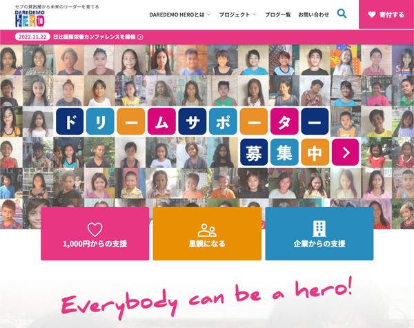

## プロボノってご存知ですか？
プロボノとは特殊技能を持っている人間が、お金ではなくスキルを提供し支援する人たちのことを指します。

> ### プロボノ
> プロボノ（Pro bono）とは、各分野の専門家が、職業上持っている知識やスキルを無償提供して社会貢献するボランティア活動全般。または、それに参加する専門家自身。プロボノとはラテン語で「公共善のために」を意味する pro bono publico の略で、最初は弁護士など法律に携わる職業の人々が無報酬で行う、ボランティアの公益事業あるいは公益の法律家活動を指した。弁護士による無料法律相談、無料弁護活動などが含まれる。現在も弁護士の業界において、もっとも浸透している。 
> [プロボノ | Wikipedia](https://ja.wikipedia.org/wiki/%E3%83%97%E3%83%AD%E3%83%9C%E3%83%8E)

非営利団体といえど、会計やWebサイト制作など、ボランティア団体にも活動以外の費用がかかります。

たとえば支援を募集するためにWebサイトを作ろうとしたら費用が30万円かかるとします。

子ども食堂を運営する団体であれば、できればこのお金を食材購入に充てたいはずです。これが団体の本音です。

このWebサイト制作をプロボノが担うことで、費用を本来使いたい活動費用に充てることができます。

プロボノが専門領域でボランティア団体などを支援すると、間接的ではありますがインパクトの強い貢献ができるわけです。

## エンジニアの私がプロボノとして実際にしていることをご紹介
では、実際にIT業界10年・エンジニアの私がしているプロボノとしてのボランティア活動をご紹介します。

私が実際にお手伝いしている団体はセブ島の貧困層の主に子どもたちの教育を支援している「[DAREDEMO HERO](https://daredemohero.com/)」です。

エンジニアやデザイナーは全般的に団体のボランティア団体のプロモーション活動に貢献することができます。

### Webサイトの作成やアドバイスができる
ボランティア団体はボランティア活動に関してはプロですが、殆どの団体がITの知見が無いことが多いです。

小さなボランティア団体は、予算も少ないのでできるだけ活動費用に充てたいと考えています。

なので自分たちで何とか自団体のWebサイトを作っているなんてことも多いです。 
中には未だSSL対応（インターネット上の通信を暗号化する技術）していないドメインのボランティア団体のウェブサイトも結構あります。

ただウェブサイトがあればいいので、セキュリティ、コンテンツの動線、UI/UXなどに配慮する余裕などありません。

それすらできないボランティア団体はWeb制作会社に依頼します。

IT業界の知識がないため、ワケもわからず割高なWebサイト制作費用を払い、不要な保守費用を払い続けてるなんてケースも聞いたことがあります。

なので、ITの専門スキルのあるプロボノがWeb制作に関わるだけじゃなくカンタンなアドバイスをするだけでも貢献することができます。

### パンフレットや名刺などの印刷物の作成のお手伝い
私は、パンフレットや名刺の制作も手伝うことがあります。 
ボランティア団体はIT技術が進んだ昨今でも、基本活動はアナログであることが多いです。

支援の呼びかけにはパンフレットなどの紙の資料が欠かせません。

印刷物やデザイン関連であれば、スポットで手伝うことができます。

## なぜプロボノをしているのか？
以前はセブ島に日本から洋服を送ってもらい、スラム街で配っていました。

<card id="/blogs/entry478/"></card>

それ以外にも炊き出し、支援物資の配布等、肉体労働としてお手伝いもしてきました。

その中で大きな気づきがありました。

批難覚悟で本音を言います。

現地へ赴き、炊き出し、支援物資の配布等など支援すれば、とても見栄えはいいパフォーマンスにはなります。 
しかし、素人の私が現地入りしてもたもたしながら手伝うことは、スタッフの邪魔になるかもしれないし、ボランティアの効率が悪いのではないかと思うようになりました。

<msg txt="ひょっとしたら現地に慣れてない私が炊き出しや洋服配りをするより、空き時間にホームページやチラシ制作をした方がよっぽど役に立つのでは？"></msg>

どうせなら無駄なく無理なく貢献したいと思ったので、優先してプロボノ活動をするようになりました。

## プロボノをするメリット・デメリット

何事もメリット・デメリットがあります。

この記事を読んでいる方はプロボノに興味があると思うので、メリットデメリットも紹介します。

### プロボノをするメリット

#### 1. 自身のスキルを思う存分アウトプットできる
これが一番私にとって大きなメリットです。

私はエンジニアなので、常に新しい技術には興味があります。試してみたい技術を積極的に試させてもらえます。

#### 2. 仲間ができる
ボランティア活動は内容が濃いです。 
同じことに共感できる仲間や友だちをもちやすいと感じています。

#### 3. 間接的ではあるけど社会貢献していることを実感できる
誰かの役に立つことは、人が幸せを感じる瞬間の一つではないでしょうか？ 
ボランティア団体にスキルを提供することは、間接的ではありますが社会貢献していることになります。

### プロボノをするデメリット
もちろん、プロボノをする上でのデメリットもあります。

#### 1. 貢献度合いが見えにくい。分かってもらいにくい。
プロボノはお金のように数値化されにくいのでどのくらい貢献しているか見えにくいです。 
提供したスキルの価値が理解されないこともあると、モチベーションが下がって続けにくくなる人もいると思います。

#### 2. 時間の制約
本業ではないので、必要とされるスキルを要望通りに提供できないことがあります。 
私は本業が別にあるので、できない時は割り切ってできないと伝えるようにしています。

#### 3. 団体とスキルとのミスマッチング
どんなにスキルがあっても、団体がほしいスキルと違うなどのミスマッチは起こります。 
好意の押し付けほど迷惑なものはないです。なので、私はできるだけ必要とされることだけをやるようにしています。

## まとめ・プロボノはボランティア団体がほしい人材
「*セブのスラム街で洋服配ったら社会貢献できる！*」と思いついたことがきっかけでセブ島現地ボランティア団体に関わるようになり、なんとなく私のプロボノとしても手伝うようになりました。 いつの間にか2年が過ぎようとしています。

プロボノ自体はふわふわ始めたことですが、気がつけばちゃんと貢献できるようになっていました。

私としてはメリットでもお伝えしたように、今のところWeb制作スキルを思う存分やらせてもらっているので申し分ないです。

 とはいえ、活動の一番の原動力は「 **私がやりたいからやっている** 」です。

どんなに社会貢献できてもやりたくないことはやりたくないですからね笑

この記事がプロボノにチャレンジしたい人の一助となれば幸いです。 
最後までお読みいただきありがとうございました。
