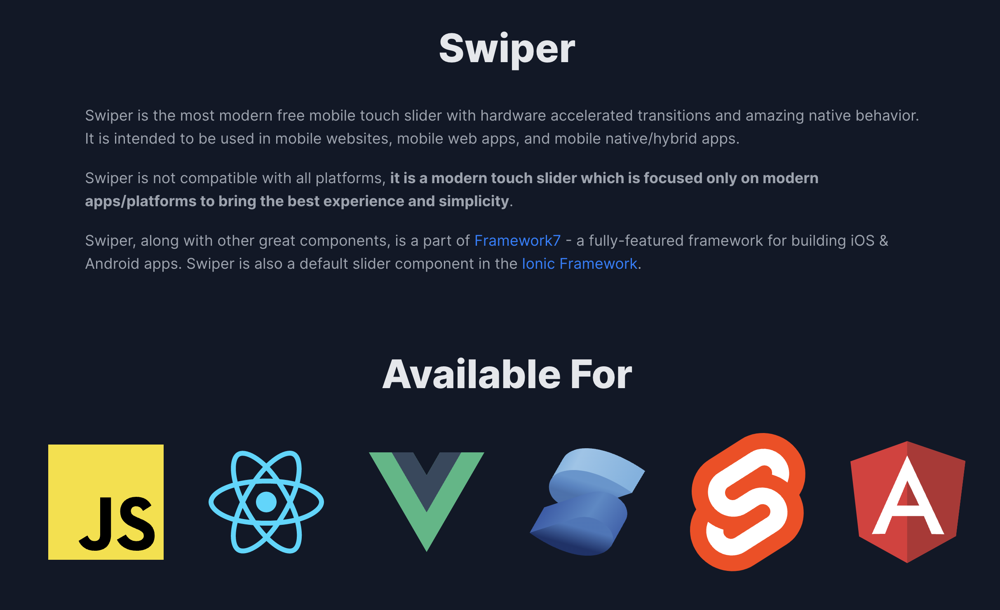
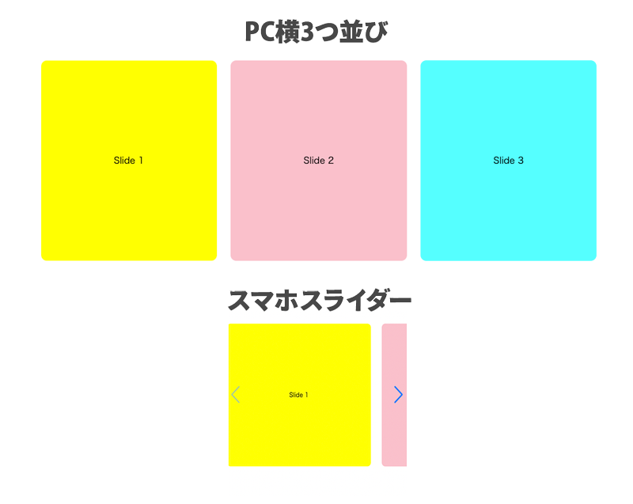
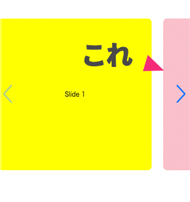

## この記事の対象者
<msg txt="以下心当たりのある方への必見お役立ち記事です。"></msg>

* Swiper を使ったことがある、もしくはJSは使い慣れていてなんとかなりそう
* Swiper をスマホもしくはPCのみで使いたい
* 表示切り替えが必要なSwiperがページ内に複数ある
* スライダーを実装したいけどスマホで次のスライドをほんの少し見せたい
* jQuery は使いたくない

## Swiper とは？
Swiper とは、最新の無料で使えるモバイルタッチに対応したスライドショー用の JavaScript の jQuery 不要の軽量ライブラリです。

npm や CDN も用意されています。Angular、React や Vue などからも使うことができます。


## Swiper 基本の使い方
実装方法です。

ざっくり使い方を紹介します。

今回紹介するのは、CDN のリンクを貼るだけの簡易的な方法です。<br>他の方法は [Get start](https://swiperjs.com/get-started) をご確認ください。

<br>CDN の JS&CSS のリンクを を head タグ内などに読み込みます。

```html:title=html
<link
  rel="stylesheet"
  href="https://cdn.jsdelivr.net/npm/swiper@8/swiper-bundle.min.css"
/>
<script src="https://cdn.jsdelivr.net/npm/swiper@8/swiper-bundle.min.js"></script>
```
<small>CDNソースへのリンクは2022年12月現在参照です。必ず [Get start](https://swiperjs.com/get-started) から最新のリンクをご確認ください。</small>

<br>スライダーの HTML は以下。今回はクラス `swiper` を付与した要素にスライダーを適応します。もちろん、IDなどでも指定可能です。ページネーションなどの部品を追加したい場合はクラスを指定した要素を追加します。

```html:title=html
<!-- Slider のメインのコンテナー -->
<div class="swiper">
  <!-- ラッパー -->
  <div class="swiper-wrapper">
    <!-- 各スライド -->
    <div class="swiper-slide">Slide 1</div>
    <div class="swiper-slide">Slide 2</div>
    <div class="swiper-slide">Slide 3</div>
    ...
  </div>
  <!-- ページネーションが必要な場合 -->
  <div class="swiper-pagination"></div>

  <!-- 次へ前へ（ページネーション）ボタンが必要な場合 -->
  <div class="swiper-button-prev"></div>
  <div class="swiper-button-next"></div>

  <!-- スクロールバーが欲しい場合 -->
  <div class="swiper-scrollbar"></div>
</div>
```

JSは以下のように指定します。ページネーションやその他の部品が必要な場合は要素にクラスを指定します。
```JavaScript:title=JavaScript
const swiper = new Swiper('.swiper', {
  // オプション、ループしたい場合は以下
  loop: true,

  // ページネーションが必要な場合要素のクラスを指定する場合
  pagination: {
    el: '.swiper-pagination',
  },

  // 次へ前へ（ページネーション）ボタンが必要な場合要素のクラスを指定
  navigation: {
    nextEl: '.swiper-button-next',
    prevEl: '.swiper-button-prev',
  },

  // スクロールバーが必要な場合
  scrollbar: {
    el: '.swiper-scrollbar',
  },
}, false);
```

## Swiper でスマホ、PCで切り替える方法（単体）
では実際に一つのSwiperを切り替えてみましょう。

仕上がりイメージは以下のような感じです。


`destroy()` で一度作ったスライダーを破棄できます。SPサイズに切り替えたときにスライダーを再構築します。

```JavaScript:title=JavaScript
window.addEventListener('DOMContentLoaded', () => {
  // option は使い回すので別に書く
  const options = {
    navigation: {
      nextEl: '.swiper-button-next',
      prevEl: '.swiper-button-prev',
    },
    spaceBetween: 30,
    slidesPerView: "auto",
  }
  const breakPoint = 768;
  let swiper;
  if ( window.innerWidth <= breakPoint ) {
    swiper = new Swiper('.swiper', option);
  } else {
    swiper = undefined;
  }
  window.addEventListener('resize', () => {
    if ( window.innerWidth <= breakPoint ) {
      if( swiper ) return;
      swiper = new Swiper('.swiper', option);
    } else {
      if( !swiper ) return;
      swiper.destroy();
      swiper = undefined;
    }
  }, false);
}, false);
```

PC表示で適宜スタイルを打ち消します。

```css:title=css
@media screen and (min-width: 768px) {
  .swiper-button-prev, .swiper-button-next {
    display: none;
  }
  .swiper-wrapper {
    display: flex;
    gap: 24px;
  }
  .swiper-slide {
    width: calc(33.333% - 16px);
  }
}
```
### PCのみにスライダーを適応したい時
今回はスマホになったときにスライダー表示に切り替えていますが、コードを変えれば逆も可能です。

```JavaScript:title=JavaScript
if ( window.innerWidth <= breakPoint )
↓↓↓
if ( window.innerWidth > breakPoint )
```
### 補足・次のスライダーを少しだけ見せたい
スマホなどではよく次にスライダーがあることを示唆するために、次のスライダーをチラ見せする手法をよく使います。



その場合は、`option` の `slidesPerView` を `"auto"`に指定し

```JavaScript:title=JavaScript
const options = {
  slidesPerView: "auto",
}
```
`width` を任意の幅に指定します。
```css:title=css
.swiper-slide {
  width: 80%;
}
```

デモサンプル [Swiper for SP | CodePen](https://codepen.io/camille-cebu/pen/BaPBGxm)
## 複数のSwiperをスマホ、PCで切り替える方法
複数の場合は各スライダーにユニークな指定をする必要があります。

この場合はそれぞれのスライダーにIDを `swiper01` 、 `swiper02` とします。
```html:title=html
<div class="swiper" id="swiper01">
  <div class="swiper-wrapper">
    <div class="swiper-slide">Slide 1</div>
    <div class="swiper-slide">Slide 2</div>
    <div class="swiper-slide">Slide 3</div>
  </div>
  <div class="swiper-button-prev"></div>
  <div class="swiper-button-next"></div>
</div>

<div class="swiper" id="swiper02">
  <div class="swiper-wrapper">
    <div class="swiper-slide">Slide 1</div>
    <div class="swiper-slide">Slide 2</div>
    <div class="swiper-slide">Slide 3</div>
  </div>
  <div class="swiper-button-prev"></div>
  <div class="swiper-button-next"></div>
</div>
```
IDとともに `.swiper` も付与します。そのスライダー `document.querySelectorAll` で取得し、配列に格納します。

配列に格納した配列をコントロールします。

このコードであれば、1〜複数のスライダーをコントロール可能です。

```JavaScript:title=JavaScript
let swipersItems = [];
const breakPoint = 768;
let swipers = document.querySelectorAll('.swiper');
window.addEventListener('DOMContentLoaded', () => {
  const options = {
     navigation: {
      nextEl: '.swiper-button-next',
      prevEl: '.swiper-button-prev',
    },
    spaceBetween: 30,
    slidesPerView: "auto",
  }
  // IDを格納
  swipers.forEach((element, index) => {
    if ( window.innerWidth <= breakPoint ) {
      swipersItems[index] = new Swiper('#' + element.id, options);
    } else {
      swipersItems[index] = undefined;
    }
  });
  window.addEventListener('resize', () => {
    swipers.forEach((element, index) => {
      if ( window.innerWidth <= breakPoint ) {
        if( swipersItems[index] === undefined ) {
          swipersItems[index] = new Swiper('#' + element.id, options);
        }
      } else {
        if( swipersItems[index] !== undefined ) {
          swipersItems[index].destroy();
          swipersItems[index] = undefined;
        }
      }
      return;
    })
  }, false);

}, false);
```

デモサンプル [Swiper for SP2 | CodePen](https://codepen.io/camille-cebu/pen/RwBbqEV)

## まとめ
今回スライダーを複数切り返したかったけど、同じクラス名をSwiper生成したせいで `destroy` 処理の時に関数エラーでドハマリしました。

同じクラスで指定したのが原因で、ユニークな指定（ID）であればすんなり実装できました。

<msg txt="2時間くらい、仮説と検証を繰り返しやっとエラーを抜け出せました。。。"></msg>

同じことでハマっている人への一助となれば幸いです。

最後までお読みいただきありがとうございました。
