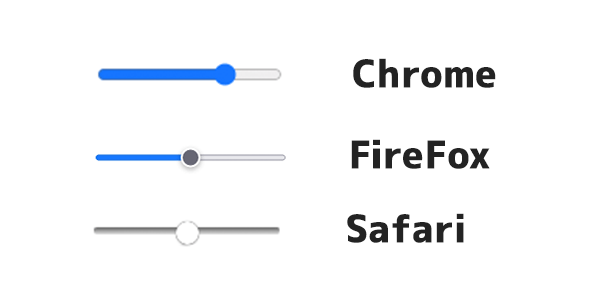
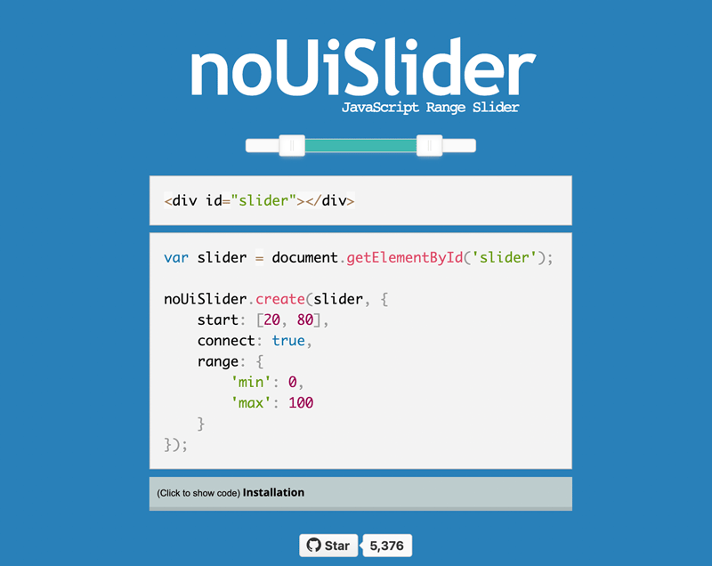
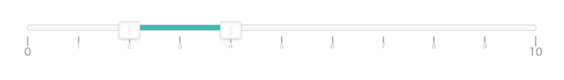
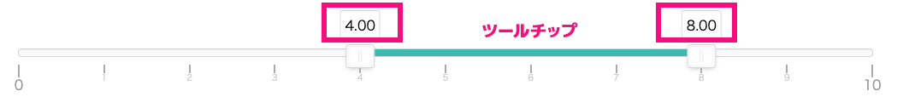
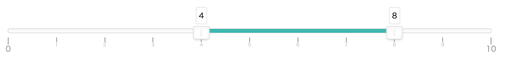
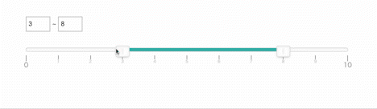
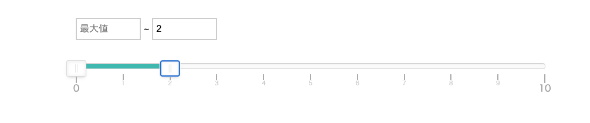
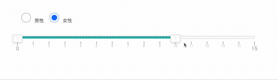

## この記事の対象者

* JavaScript の基礎は分かる
* レンジスライダーを実装したい
* ２個以上の値をレンジで実装する必要がある
* 範囲内で直感的に使えるフォームを実装したい
* jQueryを使いたくない

## レンジスライダーとは？

レンジスライダーとは範囲（レンジ）内で値を選択できるフォームの一種です。

HTMLでもレンジスライダーのフォームパーツはあります。

```html:title=HTML
<input type="range" min="0" max="100">
```
が、ご覧の通り、見た目がマチマチです。



<msg txt="今回はサクッとJavaScriptのライブラリで解決します。"></msg>

## noUiSlider 導入方法
早速、noUiSliderの導入方法をご紹介します。



[noUiSlider公式サイト](https://refreshless.com/nouislider/)

noUiSlider はよくjQueryと紹介されてますが、実際にはjQueryなしで実装可能です。

### 基本の導入方法
もっとも簡単な noUiSlider 導入方法は JavaScript とCSSのソースを読み込む方法です。ソースは [GitHub](https://github.com/leongersen/noUiSlider) にありますが、今回はお気軽にCDNを読み込む方法をご紹介します。

※ [オプション](#おまけオプション) について解説はこの記事の一番最後にまとめています。



```html:title=HTML
<!-- css -->
<link rel="stylesheet" href="https://cdnjs.cloudflare.com/ajax/libs/noUiSlider/15.6.1/nouislider.css">
<!-- js -->
<script src="https://cdnjs.cloudflare.com/ajax/libs/noUiSlider/15.6.1/nouislider.min.js"></script>
```

```html:title=HTML
<div class="range-wrapper">
  <div id="range"></div>
</div>
```
```CSS:title=CSS
#range {
  height: 10px;
}
.range-wrapper {
  width: 800px;
  margin: 0 auto;
  padding: 50px;
}
```


```JavaScript:title=JavaScript
const range = document.getElementById('range');
noUiSlider.create(range, {

    range: {
        'min': 0,
        'max': 10
    },
    step: 1,
    start: [2, 4],
    connect: true,
    behaviour: 'tap-drag',
    pips: {
        mode: 'steps',
        stepped: true,
        density: 10
    }
});
```
オプションの`pips`でメモリと数字が表示されます。

小数点をつけたくない場合は　`pips` の詳細オプションを `density` を `10` にします。

※ [オプション](#おまけオプション) について解説はこの記事の一番最後にまとめています。

コードサンプル　[noUiSlider Basic | CodePen](https://codepen.io/camille-cebu/pen/XWBbgPB)



上のスクショのように、ツールチップ（つまみの上の数字）を表示したい時は、オプション `tooltips` を `true` にします。
```JavaScript:title=JavaScript
const rangeSlider = document.getElementById('values-slider');
noUiSlider.create(range, {
  range: {
      'min': 0,
      'max': 10
    },
    step: 1,
    start: [2, 4],
    connect: true,
    behaviour: 'tap-drag',
    tooltips: true,
    pips: {
      mode: 'steps',
      stepped: true,
      density: 10,
    }
});
```

メモリやツールチップ（つまみの上の数字）を任意の数字にしたい場合はメモリを配列で値を自作します。

※ [オプション](#おまけオプション) について解説はこの記事の一番最後にまとめています。

```JavaScript:title=JavaScript
const rangeSlider = document.getElementById('range');
const valuesForSlider = [0,1,2,3,4, 5,6,7,8,9,10]

const format = {
    to: function(value) {
        return valuesForSlider[Math.round(value)];
    },
    from: function (value) {
        return valuesForSlider.indexOf(Number(value));
    }
};

noUiSlider.create(rangeSlider, {
    start: [4, 8],
    range: { min: 0, max: valuesForSlider.length - 1 },
    step: 1,
    connect: true,
    tooltips: true,
    format: format,
    behaviour: 'tap-drag',
    pips: {
      mode: 'steps',
      stepped: true,
      density: 10,
      format: format,
    }
});
```
コードサンプル　[noUiSlider Tooltip | CodePen](https://codepen.io/camille-cebu/pen/vYaOJEN)


## Events:動的に値やオプションなどを変更する
noUiSliderでは、スライダーの変化やオプションの書き換えなどができるメソッドが用意されています。

### スライダーが更新されたら、フォームの値を変更

noUiSliderのイベントを利用して、スライダーの変化を受け取ることができます。

`noUiSlider.on()` メソッドを使って、フォームの値をリアルタイムでレンダリングさせます。



```html:title=HTML
<div class="range-wrapper">
  <div class="range-num">
    <input type="number" min="0" max="10" id="num-min" step="1" value="5" readonly> ~
    <input type="number" min="0" max="10" id="num-max" step="1" value="8" readonly>
  </div>
  <div id="range"></div>
</div>
```
```css:title=CSS
#range {
  height: 10px;
}
.range-wrapper {
  width: 800px;
  margin: 0 auto;
  padding: 50px;
}
.range-num {
  margin-bottom: 40px;
}
.range-num input{
  border: 2px solid #ccc;
  height: 32px;
  padding-left: 5px;
  width: 50px;
  font-size: 16px;
}
```
```js:title=JavaScript
const range = document.getElementById('range');
const min = document.getElementById('num-min');
const max = document.getElementById('num-max');
noUiSlider.create(range, {
    range: {
        'min': 0,
        'max': 10
    },
    step: 1,
    start: [min.value, max.value],
    connect: true,
    behaviour: 'tap-drag',
    pips: {
        mode: 'steps',
        stepped: true,
        density: 10
    }
});

range.noUiSlider.on('update', function( values, handle ) {
  min.value = Math.trunc(values[0])
  max.value = Math.trunc(values[1])
})
```
セットできるイベントは<br>
'start'、'slide'、'drag'、'update'、'change'、'set'、'end' の７つです。



最大値、最小値の場合値自体を表示しない処理も可能です。分かりづらいので値がない場合の `placeholder` 属性を追加します。

```js:title=JavaScript
<input type="number" min="0" max="10" id="num-min" step="1" value="5" readonly placeholder="最大値"> ~
<input type="number" min="0" max="10" id="num-max" step="1" value="8" readonly placeholder="最大値">
```
```js:title=JavaScript
range.noUiSlider.on('update', function( values, handle ) {
  min.value = Math.trunc(values[0]) === 0 ? '' : Math.trunc(values[0])
  max.value = Math.trunc(values[1]) === 10 ? '' : Math.trunc(values[1])
})
```
コードサンプル　[noUiSlider Update | CodePen](https://codepen.io/camille-cebu/pen/dyjoVMz)

### オプションを変更する
noUiSlider では、オプションの変更もあとから可能です。

たとえば、チェックボックスの値が変更されたタイミングでレンジの最大値を変えるなども可能です。



```html:title=HTML
<div class="range-wrapper">
  <div class="range-num">
    <label><input type="radio" name="gender" value="male" checked>男性</label>
    <label><input type="radio" name="gender" value="female">女性</label>
  </div>
  <div id="range"></div>
</div>
```

```js:title=JavaScript
const valuesSlider = document.getElementById('values-slider');
const genders = document.querySelectorAll('input[name=gender]');

noUiSlider.create(range, {
    range: {
        'min': 0,
        'max': 10
    },
    step: 1,
    start: [5, 8],
    connect: true,
    behaviour: 'tap-drag',
    pips: {
        mode: 'steps',
        stepped: true,
        density: 10
    }
});

genders.forEach(function(item){
  item.addEventListener('change', function(){
    let maxLevel = item.value === 'female' ? 15 : 10
    range.noUiSlider.updateOptions({
      range: {
        'min': 0,
        'max': maxLevel
      },
    });
  }, false);
}, false);
```
コードサンプル　[noUiSlider UpdateOption | CodePen](https://codepen.io/camille-cebu/pen/LYBVzgQ)

## まとめ
たまたま見つけて使ってみたのですが、公式サイトを見ると全くjQueryじゃない上に高機能で感動したのがきっかけでご紹介させていたきました。

この記事が皆さんのコーディングライフの一助となれば幸いです。

最後までお読みいただきありがとうございました。
### おまけ・オプション
オプションです。

|オプション名|説明・使用用途|値|例|
|-|-|-|-|
|*range*|範囲の最小値と最大値の指定。デフォ値なし|-|`range: {min: 0, max: 10}`<br>`range: {min: [0], max: [10]}`<br>(0~8が選ばれた状態)|
|*start*|初期値。デフォ値なし|-|`start: [0, 8]`(0~8が選ばれた状態)|
|*connect*|バーに色を付けるか否か。lowerが手前で、upperがつまみより後にバーに色がつく。２点以上つまみがある場合はtrue。複数ある場合は配列で指定。。デフォ値false。|-| lower, upper,true, false, 配列内に入れ子|`connect: 'lower'`<br>`connect: [true, false, true, true]`|
|*margin*|２つのハンドルの最大の間隔。デフォ値なし。|number|`margin: 30`2間の値は30以下にはならない。|
|*limit*|２つのハンドルの最小の間隔。デフォ値なし。|number|`limit: 30`2間の値は30以上にはならない。|
|*padding*|スライダーのそれぞれの端からの値。デフォ値は0。スライダーを端まで動かしたくない等の場合。|number,array[number],array[number, number]|`padding: [10, 15]`最小値が0の場合は10以上下げらず、最大値が100の場合は85以上には増やせない。|
|*step*|ステップスライダーの1ステップあたりの移動範囲。デフォ値なし。|number|`step: 10`10ずつ増減できる。|
|*orientation*|スライダーの方向。デフォはhorizontal|"vertical", "horizontal"|`orientation: 'vertical'`縦方向。|
|*direction*|スライダーの方向。デフォはltr（左から右、もしくは上から下）|"ltr", "rtl"|`direction: 'rtl'`右から左に動かすと数値が増える。|
|*tooltips*|ツールチップを表示するか否か。デフォはfalse。`removeTooltips() `メソッドで削除可能。|false, true, formatter|`tooltips: 'true'`|
|*animate*|スライダーをアニメーションさせるか否かです。初期値はtrueです。クリックイベントなどとセットで使います。アニメーションの間隔（duration）を調整したい場合はCSSの調整が必要です。|false, true|`animate: true,`|
|*handleAttributes*|aria-label等、ハンドル（つまみ）に属性を付与できます|false, true|handleAttributes: [`{ 'aria-label': 'lower' },{ 'aria-label': 'upper' }]`|

その他、キーボードサポートなどのオプションもありますが、きりがないので[Option | noUiSlider](https://refreshless.com/nouislider/slider-options/)をご確認ください。

### おまけ・スライダーの挙動
オプションの中でも、スライダーの挙動のみ詳しく説明します。

```
behaviour: "drag"
```

|値|スライダーの挙動|
|-|-|
|*drag*|範囲をドラック可能でいつもつまみをドラッグできる|
|*drag-fixed*|範囲をドラック可能。範囲を変えることができないので、ツマミのみを動かす。|
|*tap*|スライダーをタップすると近くにハンドルが動く。|
|*tap-drag*|タップしたところにハンドルが動く。|
|*hover*|バーの上をペンやカーソルを当てるとホバーでイベント発火。|
|*unconstrained-tap*|ハンドルが互いに通りすぎることができる|
|*none*|基本の挙動を除いて、他はすべてオフ|
