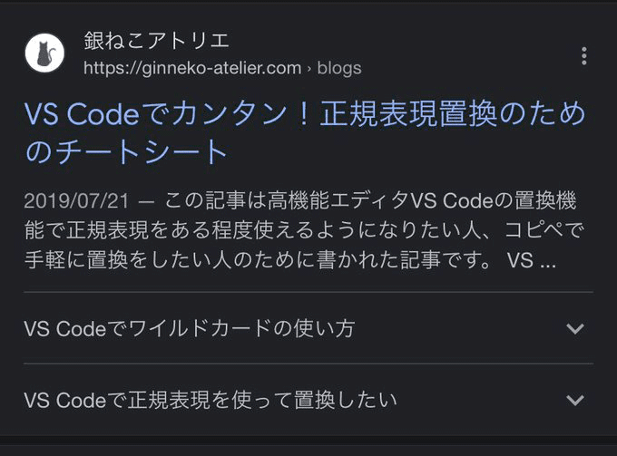
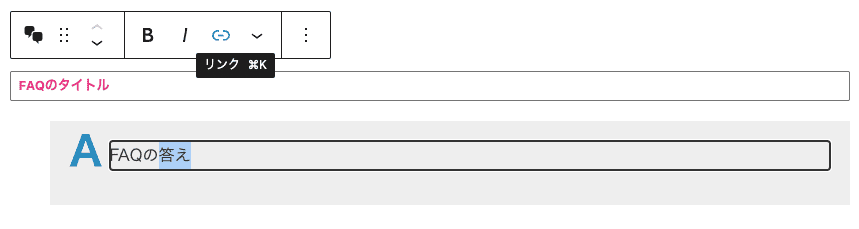
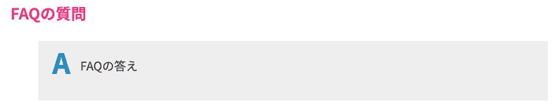
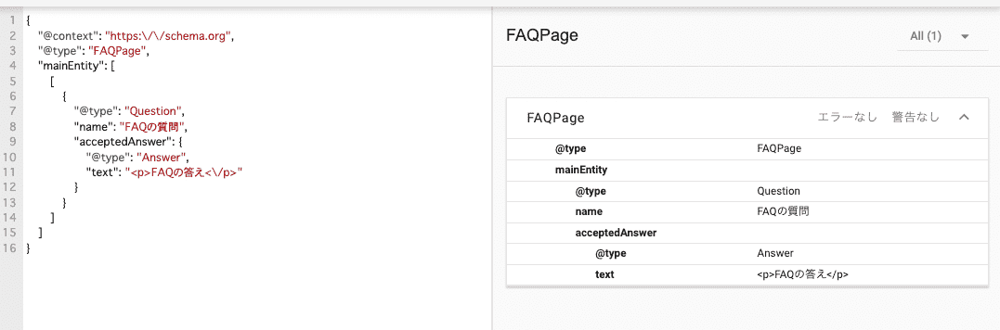

FAQPageという構造化データをご存知ですか？

FAQPage構造化データを実装するとGoogle検索一覧でアコーディオンが出るようになります。表示されるようになるとクリック率が120%アップしたウェブサイトもあるとかで、**SEOにはかなり有用なパーツ** です。



FAQPage構造化データは実装しても必ず表示されるわけではありません。ですが、実装する価値はあります。

このFAQPage構造化データ、もっと気軽にWordPressで取り扱えないかなーと思い、Gutenbergでブロックを作ってみました。

今回はブロックエディタでFAQが手軽に作れ、さらに構造化データを出力するブロック作成方法についてご紹介します。

<prof></prof>

@wordpress/scripts を使ったブロック開発環境構築方法は以下にまとめてるので、今回は端折って紹介していきます。

<card id="/blogs/entry488/"></card>

*前提条件*

* npmなどを使って @wordpress/scripts（React） を導入できる
* ある程度WordPressをカスタマイズできる
* PHP、JSの記述方法をある程度知っている

今回は登録したデータを構造化データ出力したかったので、記事に挿入されるFAQのコードはPHPで出力しました。

## ブロックエディタ側のブロックを作成する

今回のファイル構造です。環境やお好みによって変えてください。

```
ルートディレクトリ/
  └ wp-content/
    └ themes/
      └ your-theme/（実装したいテーマフォルダ）
        ├ editor-style.css（ブロックを読み込む）
        ├ functions.php（ブロックを読み込む）
        └ faqblock/（ここにブロックを作成）
          ├ package.json（コマンドで作成）
          ├ src/（新規作成）
          |  └ index.js
          └ build/（自動生成）
            ├ index.js
            ├ index.js.map
            └ index.assets.php
```

src/index.jsに、ブロックエディタを作るためのコードを書きます。

今回は質問はテキスト、解答はリッチテキストでの入力形式にします。

```js:title=src/index.js
import { registerBlockType } from '@wordpress/blocks';
import { RichText } from '@wordpress/block-editor';
import {TextControl} from '@wordpress/components';

registerBlockType( 'myblock/faq-block', {
  title: 'FAQ',
  icon: 'format-chat',
  category: 'layout',
  attributes: {
    question: {
      type: 'string',
      default: '',
      default: '',
    },
    answer: {
      type: 'html',
      default: '',
    },
  },

  edit: ( props ) => {
    const {
      attributes: {  question, answer },
      setAttributes
    } = props;

    return (
      <div>
        <h3 className="c-faq__heading"><TextControl
          value={ question }
          onChange={ (newQuestion) => setAttributes({ question: newQuestion }) }
          placeholder= 'タイトル'
        /></h3>
        <div className="c-faq__content">
          <RichText
            value={ answer }
            onChange={ (newAnser) => setAttributes({ answer: newAnser }) }
            tagName='div'
            multiline= 'p'
            placeholder= '答えを入力'
          />
        </div>
      </div>
    );
  }
});
```
コマンドを走らせると、管理画面にFAQブロックのためのフォルダが自動生成されます。コマンドの使い方等わからない方は先に[こちらの記事](/blogs/entry488/)をお読みください。

その中に自動生成された `index.asset.php` を `functions.php` にインクルードします。

```php:title=functions.php
/**
 * Faq -----------------------------------------
 */
function my_gutenberg_faq() {
	$asset_file = include __DIR__ . '/faqblock/build/index.asset.php';

	wp_enqueue_script(
		'my-gutenberg-faq-script',
		get_theme_file_uri( '/faqblock/build/index.js' ),
		$asset_file['dependencies'],
		$asset_file['version'],
		true
	);
}
add_action( 'enqueue_block_editor_assets', 'my_gutenberg_faq' );
```

FAQブロックが使えるようになります。



## FAQをページに出力する
FAQはindex.js側ではなくPHP出力します。
<p><small>※ PHPじゃないとブロックからの値がうまく取れませんでした。もっとスマートな方法があれば、他の方法があれば追記します。</small></p>

FAQの質問（見出し）はテキストですが、答え（コンテンツ）はリッチテキストを使っているのでリンクや強調も入力も可能です。なので `wp_kses` を使って不必要なタグを取り除きます。

WordPressにはその他、HTMLタグのエンティティ化（無害化）する方法がいくつかあります。必要に応じて使い分ける必要があるので、詳しく知りたい方は以下記事をご参照ください。

<card id="/blogs/entry452/"></card>

```php{33}:title=functions.php
register_block_type(
	'myblock/faq-block',
	array(
		'attributes'   => array(
			'question'    => array(
				'type'     => 'string',
			),
			'answer' => array(
				'type'    => 'html',
			),
		),
		'render_callback' => function( $attr, $content = '' ) {
			$attr = wp_parse_args(
				$attr,
				array(
					'question'   => '',
					'answer' => '',
				)
			);

			$allowed_html = array(
				'a' => array(
					'href' => array(),
					'target' => array(),
				),
				'strong' => array(),
				'p' => array(),
				'ol' => array(),
				'ul' => array(),
				'li' => array(),
			);

			return '<h3 class="c-faq__heading">' . esc_html( $attr['question'] ) . '</h3><div class="c-faq__content">' . wp_kses( $attr['answer'], $allowed_html ) . '</div>';
		}
	),
);
```

## 構造化データを出力する
headタグ内JSON+LD形式で、構造化データを出力します。

`has_block` メソッドを使ってページにFAQブロックの有無を判定し、ブロックの中から必要な値だけ取り出しPHPの配列にします。

さらに `json_encode` でJSON形式に形成し直します。

```php:title=functions.php
add_action( 'wp_head', function() {
  if ( has_block( 'myblock/faq-block' ) ) {
    $post = get_queried_object();
    $blocks = parse_blocks( $post->post_content );
    $faqs = array();
    foreach ($blocks as $block) {
      if( $block['blockName'] === 'wdl/block-07' ) {
        $faq = array(
          "@type" => "Question",
          "name" => $block["attrs"]['question'],
          "acceptedAnswer" => array(
            "@type" => "Answer",
            "text" => $block["attrs"]['answer']
          )
        );
        $faqs[] = $faq;
      }
    }

    if( 0 !== count($faq) ) {
      $faqPage = array(
        "@context" => "https://schema.org",
        "@type" => "FAQPage",
        "mainEntity" => array($faqs)
      );
      echo '<script type="application/ld+json">'."\n";
      echo json_encode( $faqPage , JSON_PRETTY_PRINT|JSON_UNESCAPED_UNICODE) . "\n";
      echo '</script>'."\n";
    }
  }
});

```
head内にJSONが出力されます。
```html:title=出力結果
<script type="application/ld+json">
{
  "@context": "https:\/\/schema.org",
  "@type": "FAQPage",
  "mainEntity": [
    [
      {
        "@type": "Question",
        "name": "FAQの質問",
        "acceptedAnswer": {
          "@type": "Answer",
          "text": "<p>FAQの答え<\/p>"
        }
      }
    ]
  ]
}
</script>
```
JSONに変換すると */(スラッシュ)* などの特殊記号はエスケープされてしまいますが、問題なく解析できるますのでご安心ください。

出力結果を[スキーマ マークアップ検証ツール](https://validator.schema.org/)を使ってテストします。



### FAQPage構造化データで使用できるHTMLタグ

FAQPage構造化データでは一部のHTMLが使用できます。

リンクも貼れるし強調もできるので、適宜使い分けると目立つのでオススメです。

|FAQPage構造化で使用できるHTML|
|-|
|`<h6>`, `<br>`, `<ol>`, `<ul>`, `<li>`, `<a>`, `<p>`, `<div>`, `<b>`, `<strong>`, `<i>`, `<em>`|


## まとめ・FAQはサイト訪問者にも優しい
FAQはコンテンツとしてウェブページ上でも実装することが多いですが、ヒートマップなどで解析しても圧倒的にクリックされるウェブパーツです。<br>つまり、ユーザーに取って役立つ情報だということで、Googleも構造化したのだろうなあと思っています。

構造化データがSEOにどの程度影響するかなどはまた改めて記事化しようと思います。

この記事が、WordPressでのブロック開発の一助となれば幸いです。

最後までお読みいただきありがとうございました。
