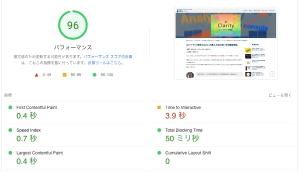
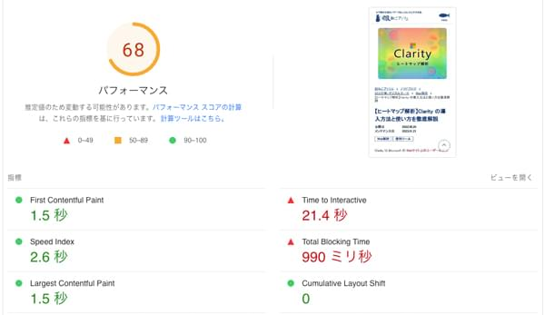
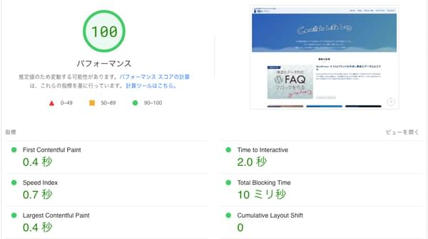
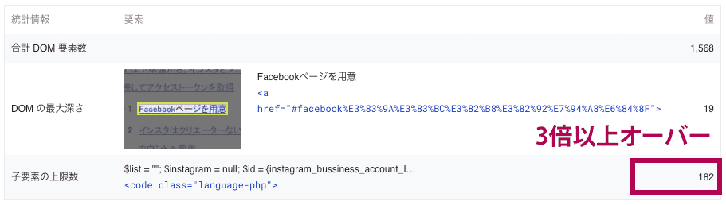
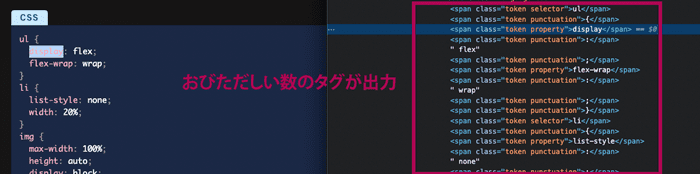

Search Console をチェックしていたら、すべてのページが **コアウェブバイタル上「改善が必要」** とのアラートが出てました汗。

3つの指標のうち、CLS が 0.1 超で不合格とのこと。。。

* **LCP（Largest Contentful Paint）** 一番大きいコンテンツ（画像やテキスト）が時間をかけずに表示されるか
* **FID（First Input Delay）** ユーザーがページ内で初めてクリック等のアクションを起こした際の応答時間
* **CLS（Cumulative Layout Shift）** 予期しないページレイアウトのずれが起きないか

細かく [PageSpeed Insights](https://pagespeed.web.dev/) で見ても、パフォーマンス評価がいつの間にかモバイル21まで落ちていて驚愕しました。

*改善前のPageSpeed Insightsによるパフォーマンス評価*

|パソコン|モバイル|
|-|-|
|69/100|21/100|

このWebサイトはそもそもスピード改善のために2年位前に静的サイトジェネレータに苦労して移行しました。

静的ジェネレータだし、ほっといても大丈夫と思い特に何もしてなかったです。

絶望的だったのですが、、、

<msg txt="PageSpeed Insights のアラートを解消したら、ボトルネックだったCLSは0になりました！"></msg>

この記事ではフロントエンド側でできることを中心に、PageSpeed Insights のパフォーマンス評価をモバイルで **最大40以上スコアアップし改善した方法** をご紹介します。

<toc id="/blogs/entry518/"></toc>

*改善後PC*


*改善後モバイル*


トップページは記事とは違ってコンテンツは少ないので、PC版ではパフォーマンス100まで行きました！



## CLS（Cumulative Layout Shift）の改善
画像や広告などが遅れて読み込まれ、突然レイアウトがズレたり変わったりする現象のことを **レイアウトシフト** と呼びます。

起きる原因としては、

* 読み込みが遅れた画像・動画等のメディアコンテンツ
* Webフォント

等です。

<p>CLSはそのズレの大きさを指し、0.1未満が理想です。<br><small>※ CLS の数値「ずれが生じた表示領域の比率 × 距離の比率」</small></p>


ちなみに 0.1以上で *改善が必要*、 0.25 以上で *不良* となります。


*チェックポイント*
* 画像・動画等のheight・width属性などのサイズに関する記述漏れはないか？
* Reactなどの再レンダリングによるレイアウトシフトはおこっていないか
* Webフォントの読み込み対策はされているか？

Webフォントは今回全ての指標に悪影響があったので使うのを諦めました。ベストプラクティスが見つかれば後日追記します。

### 画像・動画等のheight・width属性などのサイズを指定する
画像や動画（iframe含む）はheight・widthやアスペクト比を指定します。

```HTML

<!-- もしくは -->

```
CSSから直接指定してもOKです。

### Reactなどによる再レンダリングを防ぐ
React のコンポーネントが再レンダリングされることによっておこることがあります。その場合は `useMemo` を使って解決できることもあります。

`useMemo` 利用方法は以下記事に記載しています。

<card id="/blogs/entry430/"></card>

## 画像をギリギリまで小さくし、徹底的に圧縮
すべての指標において画像圧縮は即効性があります。

<msg txt="表示スピード改善には画像リサイズと圧縮が効果的。PageSpeed Insight のスコアが落ちたらすぐできる対策です。"></msg>

*チェックポイント*
* 画像は可能な限り圧縮し、ギリギリまで小さくリサイズする
* 画像フォーマットは適切なものを使う
* `picture` タグを使ってユーザーの環境に応じて画像を出し分ける
* スクロールするまで見えない箇所の画像には `loading=lazy` や `decoding=async` を付与する


### 画像は可能な限り圧縮し、ギリギリまで小さくリサイズする
オンライン画像圧縮サービス、Photoshop など何でもツールはあるので使いやすいものを使って圧縮します。

私のケースではCLスクリプトを使ってまとめて画像を圧縮します。

<card id="/blogs/entry423/"></card>

画像は圧縮したから適切とは限りません。元画像が大きいと限界があります。表示場所に適切なサイズにリサイズも行います。

リサイズもオンラインやソフトなどいくらでもあります。お好みのツールを使ってください。

### 画像フォーマットは適切なものを使う
画像の種類によってフォーマットを使い分けます。

フォーマットの使い分けの基本は主にはPNGとJPEGです。

使い分けの目安としては色数が少ないのっぺりした画像はPNG、写真のような色数が細かいは JPEG にするようにしています。

また、最近では IE のことも気にしなくて良くなり、Safari にも対応したので WebP も積極的に使うようにしています。


*GatsbyImage を使う場合*

|プロパティ|値|
|-|-|
|*gatsbyImageData*|width: 400|
|*quality*|40|

アイキャッチは最大表示より大きくならないようにし、さらに画質を落とす設定をしています。

ただ、GatsbyImage は画像出力もJSが使われているので少なからず負荷はかかります。

小さく、画層サイズの切り替えなど必要ないサムネイルに関しては、切り替えの必要のない場合は GatsbyImage を使わず、固定サイズにする等設置する場所によって変えました。

```html

```

#### GIFアニメ は古い。画像フォーマットを WebP に変える
GIFアニメ はサイトの表示スピードを遅くする原因となります。

GIFアニメを使っていましたが、 WebPアニメーションに変更しました。

*アニメ画像に変換する君* というフリーソフトをICSメディアさんが出しているらしいのですが、Mac の M1チップには対応していないらしく今回はオンラインツールを使いました。

まずは[gifから動画に変換](https://express.adobe.com/ja-JP/tools/convert-to-mp4)し、[動画からアニメWebP生成](https://ao-system.net/videowebp/)に変換。

<p><small>※ gatsbyImage で圧縮すると、アニメーションがなくなってしまったので直起きしました。</small></p>

```html:title=WebPアニメ用
<figure>
  
</figure>
```

WebPアニメーションは FireFox、Chrome、Safari でも動くし、このブログに関してはユーザーはほぼPCなので問題なし。

*追記*

以前タイムラプスを作るために ffmpeg を Homebrew 経由でインストールしたことがあったのを思い出し、コマンドですべて処理することにしました。

```bash
ffmpeg -i ***.gif -movflags faststart -pix_fmt yuv420p -vf "scale=trunc(iw/2)*2:trunc(ih/2)*2" ***.mp4

ffmpeg -i ***.mp4 -vf fps=5 -c:v libwebp -loop 0 -lossless 0 -quality 75 -preset 5 -an -vsync 0 e***.webp
```
これでかなり時短ができるようになりました。また機会があれば記事にまとめます。

### picture タグを使ってユーザーの環境に応じて画像を出し分ける

このWebサイトは GatsbyImage で画像出力しているので基本は WebP で軽量化された状態で出力されます。

しかも、srcset などでユーザーの環境&ディバイスに応じて出し分けされています。

画像のサイズがある程度大きな場合に重宝します。

```html:title=pictureタグ
<picture>
  <source type="image/WebP"
  srcset="***.WebP 50w,***.WebP 100w,***.WebP 200w,***.WebP 400w"
  sizes="(min-width: 200px) 200px, 100vw">
  
</picture>
```

WordPress でも picture タグを使った画像フォーマットやサイズの出し分けができます。WebPも対応する場合はプラグインなどを使うといいと思います。

## DOMの整理
過剰なタグ数やネスト（入れ子）の深さは **過大な DOM サイズ** となり、レンダリングに悪影響を及ぼします。

ページが読み込めないので、ページを読み込んだもののボタンがクリックできない等 FID（First Input Delay）などにも悪影響を及ぼします。

各項目がこちらの表以上の数になると、PageSpeed Insight で警告が出ます。

|項目|数|
|-|-|
|*DOMの最大深さ*|32 以上|
|*子要素の上限数*|60 以上|
|*合計DOM要素数*|1,500 以上|

*チェックポイント*
* タグのネスト（入れ子）を浅くする
* タグ数を減らす

このサイトは最大200近くタグが使われていることがわかりました。



### タグのネスト（入れ子）を可能な限り浅くする

Gatsby も React なのでコンポーネントはいちいち `div` などでラップする必要がありますのでネストが深くなります。不必要なタグは可能な限り取り除きます。

### ユーザーに見向きもされないパーツは削除
Clarityなどのヒートマップを使ってユーザーにクリック/タップされていない要素を削除します。Clarityの使い方は以下記事で解説しています。

<card id="/blogs/entry510/"></card>

解析した結果、[せっかく苦労して実装した Gatsby のタグクラウド](/blogs/entry486/)ですが、*無駄にタグが生成されるくせにほとんどクリックされていないことが発覚* しました。


要素が虚しく増えるだけなので削除。

### コードハイライターの自動出力がネック
当サイトではコードハイライターを利用していますが、これが結構クセモノで、コードをハイライトするために無数の `span` タグが自動生成されます。



もし、WordPress などの CMS であれば CodePen などの埋込外部サービスを使うのもありかもです。

React であれば `react-window`、`Effect` を使っている場合は `shouldComponentUpdate`、`PureComponent`、`React.memo` あたりで不要な再レンダリングを抑える事ができるらしいです。

今回は対応できなかったので次回の宿題です。

## 第三者リソース読み込みの改善

*チェックポイント*
* 可能なものは遅延読み込みする
* 不要であれば削除

第三者リソースとはGoogleタグマネージャー、Googleアナリティクス、Clarity や Googleフォントなどです。
切ないくらいボトルネックとなります。

### Adsense のみ遅延読み込み
タグマネージャーなどの Google のJSはかなり足を引っ張ります。解析系のタグは遅延読み込みで誤ったデータが取れては困るので対応策が講じれませんが、 *AdSense なら遅延読み込みで改善* できます。

AdSense を入れている方なら、これだけでも随分改善が見込めます。

*ユーザーが画面を少しでもスクロールしたらソースを読み込み* ます。<br>Googleタグマネージャー経由、あるいは WordPress などでプラグイン経由で読み込んでいる場合は外します。

```JS:title=JavaScript
let lazyloadads = false;
window.addEventListener("scroll", function() {
  if ((document.documentElement.scrollTop !== 0 && lazyloadads === false) || (document.body.scrollTop !== 0 && lazyloadads === false)) {
    (function() {
        const ad = document.createElement('script');
        ad.setAttribute('data-ad-client', "****")//AdsenseのID
        ad.async = true;
        ad.src = 'https://pagead2.googlesyndication.com/pagead/js/adsbygoogle.js';
        const sc = document.getElementsByTagName('script')[0];
        sc.parentNode.insertBefore(ad, sc);
    })();
    lazyloadads = true;
  }
}, true)
```

上記コードだと Gatsby コンパイルでコケます。 Helmet 内に以下のように記載します。
```JS:title=Gatsby/Helmet
if( typeof window !== "undefined") {
    let lazyloadads = false;
    window.addEventListener("scroll", function() {
     if ((document.documentElement.scrollTop !== 0 && lazyloadads === false) || (document.body.scrollTop !== 0 && lazyloadads === false)) {
        (function() {
            const ad = document.createElement('script');
            ad.setAttribute('data-ad-client', "****")
            ad.async = true;
            ad.src = 'https://pagead2.googlesyndication.com/pagead/js/adsbygoogle.js';
            const sc = document.getElementsByTagName('script')[0];
            sc.parentNode.insertBefore(ad, sc);
        })();
        lazyloadads = true;
      }
    }, true)
  }
```
### Webフォントを使うのをやめる
Googleフォントも結構ネックでした。

Webフォントは[レイアウトシフト](#clscumulative-layout-shift改善を図る)を起こす原因にもなります。

<msg txt="テックブログにデザインを求めてくる人はおるまい！"></msg>

ポートフォリオページ以外、思い切って使うのをやめました。

## メインスレッド処理の最小化・不要なJSを削除する
**メインスレッド処理の最小化** するようにアラートが出たら、主に JavaScript の解析、コンパイル、実行に時間がかかっているということです。

*チェックポイント*
* 主に負荷をかけているJSの改善、不要であれば削除
* 使っていないプラグインは削除し、CSSで代用できるものは置き換え


私のサイトでは改善前は *Script Evaluation(JSの評価)* に 6,000ms 以上かかっていました。

使っていないサイズの大きな JavaScript のコードを整理したり削除し、半分の 3,000ms 前後に抑えることができました。

Gatsbyの場合はどの JS が負荷をかけているか `gatsby-plugin-webpack-bundle-analyser-v2` で解析できます。

インストール方法などは[こちら](https://www.gatsbyjs.com/plugins/gatsby-plugin-webpack-bundle-analyser-v2/)を参考に。

<p><small>※ Gatsby v5にアップグレードして使えなくなりました。v4の方は使えます。他の方法が見つかったら追記します。</small></p>

### 主に負荷をかけているJSの改善、不要であれば削除
サイズの大きなコンポーネントを見直します。

#### FontAwesome が負荷をかけていたので使うのをやめる
解析した結果、React経由で実装した FontAwesome がすべてのページで一番負荷をかけていました。

<msg txt="あ、あんな豆粒程度のアイコンごときがこんなにページに付加をかけているなんて。。。"></msg>

大した数を使っていなかったのでアイコンはすべてSVGで実装、スタイルはCSSで整えました。

#### 意外なコンポーネントのサイズが大きなことも。必要に応じて改修もしくは削除
当サイトの記事ではではサムネイルの横にカテゴリーに応じて小さな文字を出力していたのですが、これが想像以上に負荷をかけていました。

一旦は削除しましたが気に入っていたのでCSSで実装し直すことも検討しています。

### 使っていないプラグインは削除、CSSで代用できるものは置き換え
上に戻るボタンにしか使っていないプラグインは削除し、CSSの `scroll-behavior: smooth;` に置き換えました。

## まとめ・PageSpeed Insights の警告を一つづつ読み解けば必ず改善する
今回は PageSpeed Insights の問題だったCLSを0まで改善し、モバイル最大で40以上パフォーマンススコアを改善させました。

<msg txt="忙殺されていて、長い間ひどい状態で放置してしまいました。。。"></msg>

幸いなことにこの銀ねこアトリエ、ユーザーの殆どは今どき珍しくPCユーザー。なので表示スピードでの大きなご迷惑はかけていないと信じています。

ひとまずマシになって良かったです。

今後の課題は巨大なDOMをどうするかです汗。まだまだ課題はありますので引き続き、改善に取り組み詳細をレポートしていきます。

この記事が、皆さんのWebサイト改善にお役に立てれば幸いです。

最後までお読みいただきありがとうございました。

<prof></prof>
