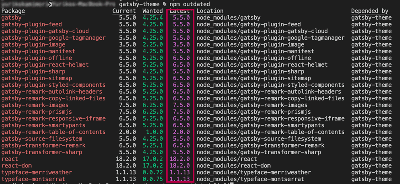
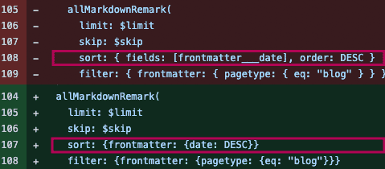

Gatsby のV52022年末くらいにリリースされていました。そこで最新版にアップグレード、Netlify にデプロイしました。

公式サイトの [Migrating from v4 to v5](https://www.gatsbyjs.com/docs/reference/release-notes/migrating-from-v4-to-v5/) に沿ってやったら簡単だったのでやり方をまとめました。

Netlify の Nodeバージョンの変更方法（超簡単）もご紹介しています。


公式サイトによるとv4→v5に切り替えるには、Node v18　React v18に切り替えてビルドし直して、とのこと。

### どこが変わったの？
Node v18　React v18 に対応しました。さらに以下3つが大きく変わった箇所です。

* **[Slice API](https://www.gatsbyjs.com/docs/reference/release-notes/v5.0/#slice-api)**<br>高度に共有されたコンポーネントのコンテンツを変更する際のビルド時間を最大90%短縮。
* **[Partial Hydration (Beta)](https://www.gatsbyjs.com/docs/reference/release-notes/v5.0/#graphiql-v2)**<br>必要なJavaScriptのみをブラウザに送信することを可能（Reactのサーバーコンポーネント利用）。
* **[GraphiQL v2](https://www.gatsbyjs.com/docs/reference/release-notes/v5.0/#graphiql-v2)**<br>新機能追加（ダークモード、タブ、localStorageを使用したステート/タブの永続化、検索とマークダウンのサポートによる、より良いドキュメントエクスプローラー、プラグインエコシステム）

Slice API には期待します。

<prof></prof>

## 先に Node と npm のバージョンを確認し必要に応じてアップグレード
私は最近メンテしていなくて Node のバージョン が v16.13.1 と低かったです。

<p><small>ハイドレーション（Hydration）とは、サーバから送られてきた静的 HTML を引き継いで、クライアントサイドのデータ変更に対応できる動的な DOM に変換するクライアントサイドのプロセスのこと。</small></p>
## 先に Node と npm のバージョンを確認し必要に応じてアップグレード
私は最近メンテしていなくて Node のバージョン が v16.13.1 と低かったです。

```bash
node -v

```
Node の場所を確認すると、どうやら nvm(Node Version Manager) でメンテナンスしているらしい（そんなことすら忘れていた）。 nvmインストール方法は[こちら](https://qiita.com/ffggss/items/94f1c4c5d311db2ec71a)を参考に。

```bash
which node
↓↓↓
/Users/*****/.nvm/versions/node/v18.9.0/bin/node
```
Homebrewの方がメジャーだけど、面倒なのでそのまま使う。現在使われているNodeの確認。

```bash
nvm ls
```
ほしいバージョンを指定してインストール。
```bash
nvm install v18.9.0
```
インストールしてあるNodeで特定のバージョンを一時的に使いたいときは以下コマンド。
```bash
nvm use v18.9.0
```
デフォルトとして指定したいときは、以下コマンドを叩いてターミナルを再起動。
```bash
nvm alias default v18.9.0
```
いらないバージョンのNodeは必要に応じて削除。
```bash
nvm uninstall v16.13.1
```
その後、念の為 npm もアップデート。
```bash
npm update -g npm
```
## 今使っている node modules をアップデート
v5 に対応するために、今使われている、node modules をすべて最新版にアップデートする。

```bash
npm outdated
```


公式では、*Update Gatsby related packages（Gatsbyのパッケージは最新にしろ）* とあります。<br>私はフツーにReactのパッケージなんかも使っています。

ひとつづつ確認してアップデートするのは面倒。<br>ターミナルから上記テキストをすべてコピーし、VSコードの矩形選択なんかを駆使して必要な文字だけ取り出しJSONに形成し直し、そのまま package.json に貼り付けます。

```JSON
"dependencies": [
  "babel-plugin-styled-components": "^2.0.7",
  "gatsby": "^5.5.0",
  "gatsby-plugin-feed": "^5.5.0",
  "gatsby-plugin-gatsby-cloud": "^5.5.0",
  ・
  ・
  ・
]
```
`node_modeles` と `package-lock.json` を削除し改めてインストール。

```bash
npm install
```

## GraphQLの記述方法が変更された
GraphQLのアップデート(graphql 16)に伴い記述方法が変わったので、公式サイトが用意されている codemod コマンドでマイグレーションしました。
```bash
npx gatsby-codemods@latest sort-and-aggr-graphql .
```
具体的には Sort や Aggregation の記述が変わりました。



## ビルドする
開発環境では知らせてみて問題なければ、
```bash
npm start
or
gatsby develop
```
```bash
npm run build
or
gatsby build
```
ビルドもして、問題なければ デプロイします。
### ビルドでコケる場合
GraphQL 依存のパッケージが問題でコケているかもしれないので、異存のあるパッケージを調べます。
```bash
npm ls graphql
```
公式によると、`node_modeles` と `package-lock.json` を削除して以下コマンドでうまくいくとのこと。
```bash
npm install --legacy-peer-deps
```
それでもダメなら、graphqlそのものを明示的にインストールしたら解決することもあるみたいです。
```bash
npm i -D graphql
```
[個人ブログで使っているGatsbyのバージョンを4系から5系にあげた](https://blog.okaryo.io/20221121-raise-version-of-gatsby-in-personal-blog-from-4-to-5)

## Netlify 側で Node バージョンを指定する
以前、[Gatsbyブログサイト移行物語インストールからNetlifyデプロイまで・Node のバージョンにご注意](/blogs/entry401/#node-のバージョンにご注意20211212追記)では Netlify 側からバージョンを指定すると紹介しましたが実はリポジトリ側からも指定できることがわかりました。

以下コマンドで、Nodeのバージョンを指定するファイルを作成できます。
```bash
node -v > .nvmrc
```

ルートディレクトリに .nvmrc が作成されます。

あとは push ディプロイするだけ。

## まとめ・Gatsby v4→v5 のアップグレードは簡単だった
アップグレード後、こころなしかWebサイト表示も早くなった気がします。

この記事はすぐ忘れる自分のための備忘録としてまとめましたがが、皆さんのコーディングライフの一助となれば幸いです。

最後までお読みいただきありがとうございました。
