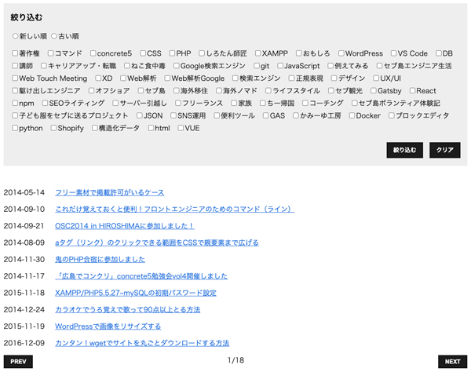
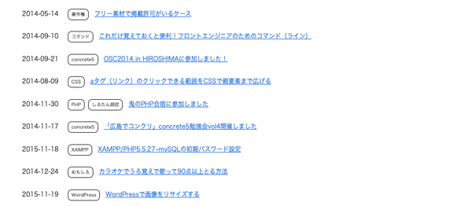
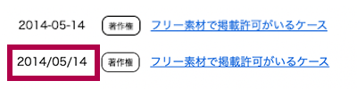
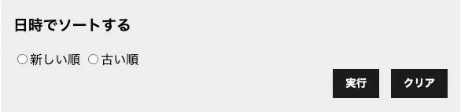
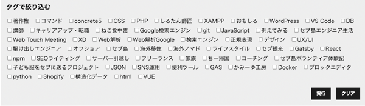
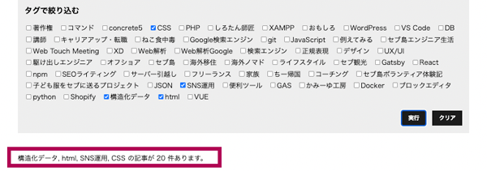

最近 WordPress で部分的に Vue.js を組み込みました。最初は React を組み込もうとしましたが、大規模になりそうだったので Vue.js に切り替えました。やってみると驚くほど手軽でした。

<msg txt="Vue.js は Vanilla JS に比べると簡潔に書け、React よりも気軽に導入できます。<br>Vue.js はちょっとした<strong>動的機能をHTMLやPHPに組み込むのに最適</strong>。"></msg>

Vue.js のバージョン3(V3)からは、デフォルトで Compostion API が使えます。Compostion とは **構成 という意味** で、リアクティブな値やその値に関連した処理をコンポーネントから分割して扱えるコンポーネントの形式です。

当記事ではその導入方法の詳しい解説と、実践にも転用できるサンプルコードをご紹介します。

*前提条件*

* JSON データを利用したい
* JavaScript がある程度理解でき、実際に書いたこともある
* 日にちなどのソート（昇順、降順）機能を実装したい
* タグやカテゴリーなどで絞り込みたい
* 数千件以上のデータを取り扱う可能性がある

完成イメージはこんなかんじ。



<prof></prof>


## Vue.js Compostion API 基本の書き方（Options API と比較）

V3から使える Compostion API は Options API と比べると、記述を分ける必要がなく、変数・関数などをスッキリまとめることができる印象です。

`new Vue()` (Options API) と `createApp()` (Compostion API) といった感じでインスタンスの作り方が違います。

```js:title=OptionsAPI
 const vueA = new Vue({
  data: () => ({
    // 変数など
  }),
  methods: {
    // 関数処理
  },
});
```
```js:title=CompostionAPI
const app = createApp({
  setup() {
    // 変数や関数
    return {
      // 設定した変数や関数の戻り値
    }
  }
})
app.mount("#app");
```

## JSON データを用意する
JSON データを用意します。

スプレッドシートから出力した JSON や WordPress REST API などを利用してもOK。

```json:title=JSON
[
  {
    "slug":"https://ginneko-atelier.com/",
    "tags": [
      "セブ島",
      "海外移住"
    ],
    "title": "セブ島で日本語が通じる歯医者さんに行った話",
    "date": "2022-06-28"
  },
  {
    "slug":"https://ginneko-atelier.com/",
    "tags": [
      "JavaScript",
      "html"
    ],
    "title": "軽量スライダーSwiperでスマホ（SP）のみスライダー表示にする方法（複数対応）",
    "date": "2022-12-17"
  },
  {
    "slug":"https://ginneko-atelier.com/",
    "tags": [
      "セブ島ボランティア体験記",
      "ライフスタイル"
    ],
  //続く…
  }
]
```
スプシデータを使いたい場合は GAS で JSON を生成する事もできます。以下記事を参考にしてください。

<card id="/blogs/entry481/"></card>

## JSON データから一覧を作る
今回は以下のような単純なディレクトリ構造を用意しました。
```
vue-sourt-sample/
  ├ index.js
  ├ articles.json
  └ index.html
```
まずは `articles.json` (JSON) から一覧を作ります。今回は配布されている Vue.js の CDN を使いました。使う機能をディレクティブで `import` します。

```js:title=index.js
import {
  createApp,
  ref,
  onMounted,
} from "https://unpkg.com/Vue.js@3.2.4/dist/Vue.js.esm-browser.prod.js";

const jsonUrl = 'articles.json';

const app = createApp({
  setup() {
    const articles = ref(null);
    const sortArticle = async () => {
      let result;
      result = await fetch( jsonUrl );
      result = await result.json();
      articles.value = result;
    }
    onMounted( async () => {
      await sortArticle();
    })
    return {
      articles
    }
  }
})

app.mount("#app");
```
`index.js` ファイルを外部ファイルとして読み込む際、`import` を利用したいので属性 `type="module"` を付与します。

```html:title=index.html
<!DOCTYPE html>
<html lang="ja">
<head>
  <meta charset="UTF-8">
  <meta http-equiv="X-UA-Compatible" content="IE=edge">
  <meta name="viewport" content="width=device-width, initial-scale=1.0">
  <title>Sort JSON</title>
</head>
<body>
  <div id="app" v-cloak class="contaienr">
     <ul class="articles">
      <li v-for="article in articles">
        <time :datetime="article.date">{{article.date}}</time>
        <a :href="article.slug">{{article.title}}</a>
      </li>
    </ul>
  </div>
  <script src="./index.js" type="module" defer></script>
</body>
</html>
```
すべての記事が表示されます。



### 属性に変数や処理を入れる方法

Vue.js では `:属性名` とすると、値に変数や処理を入れることができます。
```html
<!-- :属性名="変数等" -->

<a :href="article.slug">{{article.title}}</a>
<time :datetime="article.date">{{article.date.replace(/-/g, "/")}}</time>
```
`replace` で日付フォーマットを変えることもできます。



### チラツキ防止
Vue.js ではページ読み込み時処理が間に合わず、一瞬コードがむき出しになるチラツキがよく起こります。チラツキを抑えるために以下 CSS を追加しておきましょう。

```css
[v-cloak] {
  display: none;
}
```

### ref とは？
久々に Vue.js を使うと `ref` なるものが登場してきました汗

`ref` を使うと、内部の値を受け取ることができ、リアクティブで変更可能な変数の型を返すことができます。値を取り出すときは `value` プロパティを使います。

```js
const array = ref([1, 20, 30])

console.log(array.value)
// 結果[1,20,30]
```
[ref 関連 | Vue.js](https://v3.ja.vuejs.org/api/refs-api.html#ref)

## ページ送り（ページネーション）をつける
このままだとページが長くなり、ひたすらスクロールしなければならないので、ページネーションをつけます。

```js:title=index.js
const paged = 10 //何ページごとに表示するか
const total = ref(null) //ページ総数
const currentPage = ref(1) //現在のページ
const maxPage = ref(null) //最大ページ数
// 省略
const sortArticle = async () => {
  // 省略
  total.value = result.length;
  maxPage.value = Math.ceil(total.value / paged)
  articles.value  = result.slice( paged *  (currentPage.value - 1), paged * currentPage.value)
}
```

ページネーションボタンのための関数。

```js:title=index.js
const pagination = async (dir) => {
  if(dir === 'prev') {
    if (perPage.value === 1) {
      return;
    }
    perPage.value--;
  }
  if(dir === 'next') {
    if (perPage.value === maxPage.value) {
      return;
    }
    perPage.value++;
  }
  await sortArticle();
};
```
それぞれの値や関数を HTML 側で受け取れるよう戻り値に追加します。
```js:title=index.js
return {
  pagination,
  currentPage,
  total,
  maxPage,
}
```
ページネーションを HTML 側に組み込みます。`:disabled` で `currentPage` (現在ページ)が1以下になったり、`maxPage` (最大ページ数)以上にならないよう制御します。

```html:title=index.html
<div class="patination">
  <button @click="pagination(`prev`)" :disabled="currentPage === 1">PREV</button>
  {{currentPage}}/{{maxPage}}
  <button @click="pagination(`next`)" :disabled="currentPage == maxPage">NEXT</button>
</div>
```


## 記事を新しい・古い順でソート（並べ替え）する
記事を新しい・古い順でソートするための機能を作成します。



```js:title=index.js
// 省略
const sortDate = ref(null)
// 省略
const sortArticle = async () => {
  // 省略
  if(sortDate.value !== null) {
    // 省略
    result = await result.json();

    result = result.sort((a, b) => {
      if(sortDate.value === 'desc') {
        return (a.date < b.date ? 1 : -1);
      } else if(sortDate.value === 'asc') {
        return (a.date > b.date ? 1 : -1);
      }
    });
    total.value = result.length;
    // 省略
  }
}
// 省略
```

日付を選んた時にソートできる関数を追加します。今回はソート解除もできるようにしました。
```js:title=index.js
const sort = async () => {
  currentPage.value = 1;
  await sortArticle();
}
const clear = async () => {
  currentPage.value = 1;
  sortDate.value = null
  await sortArticle();
}
```
HTML 側で使えるように戻り値を追加します。
```js:title=index.js
return {
  // 省略
  sortDate,
  clear,
  sort,
}
```
昇順降順の UI を追加します。V3も `v-model` （データの双方向のやり取り）の記述方法は変わりません。

選択した項目は `sortDate` に格納されます。

```html:title=index.html
<div class="sort">
  <h3>日時でソートする</h3>
  <label for="desc" class="sortBtn">
    <input type="radio" value="desc" v-model="sortDate" name="date" id="desc">新しい順
  </label>
  <label for="asc" class="sortBtn">
    <input type="radio" value="asc" v-model="sortDate" name="date" id="asc">古い順
  </label>
  <div class="sortBtns">
    <button @click="sort">実行</button>
    <button @click="clear">クリア</button>
  </div>
</div>
```
Vue.js では `@アクション名="処理"` でクリックなどのイベントに対して様々な処理をすることができます。
```html
<!-- @アクション名="処理" -->

<!-- クリックで処理 -->
<button @click="sort">絞り込む</button>

<!-- 値が変わったことを感知して処理 -->
<label><input type="checkbox" @change="checked">プライバシーポリシーに同意する。</label>
```

## 複数のタグで絞り込む
今回は複数のタグを選んで広域に絞り込める（OR検索）ようにします。



### タグだけ抜き取る
まずは記事から、タグだけ抜き取ります。重複は JS の `reduce` を使って取り除きます。
```js:title=index.js
const tags = ref(null)

const getTags = async () => {
  let tagList;
  tagList = await fetch( jsonUrl );
  tagList = await tagList.json();
  tagList = tagList.reduce((tags, article) => {
    if (article.tags) {
      article.tags.map(item => {
        if (tags.find(i => i === item)) {
          return false;
        }
        tags = [...tags, item]
      })
    }
    return tags
  },[])

  tags.value = tagList
}
onMounted( async () => {
  await getTags();
})

return {
  // 省略
  tags
}
```
その他の配列操作についてさらに詳しく知りたい場合はこちらをご覧ください。

<card id="/blogs/entry482/"></card>

`v-for` を使ってループでHTML側に出力します。

### タグの絞り込み機能を作る
複数のタグの記事を絞り込めるようにします。

```js:title=index.js
// 省略
const selectedTags = ref([])
const sortArticle = async () => {
  if(selectedTags.value.length !== 0) {
    // 省略
    result = result.filter((i) => {
      const article = i.tags.map(k => {
        if(selectedTags.value.includes(k)) return true;
      })
      if(article.includes(true)) return i;
    })
  }
  total.value = result.length;
}
return {
  // 省略
  selectedTags
}
```
タグの絞り込み解除できるようにしておきます。

また絞り込んだ時に、何件になったか、どのタグで絞り込んだかなどを、表示できるようにします。


```js:title=index.js
// 省略
const message = ref(null)
// 省略
const sort = async () => {
  currentPage.value = 1;
  await sortArticle();

  // 選択したタグが0じゃない場合、メッセージを表示
  message.value = selectedTags.value.length !== 0 ? `${selectedTags.value.join(", ")} の記事が ${total.value} 件あります。` : null;
}
const clear = async () => {
  currentPage.value = 1;
  selectedTags.value = []
  sortDate.value = null
  message.value = null

  await sortArticle();
}
```
絞り込み部分の HTML。選択した項目は `v-model` で `selectedTags` に格納されます。

```html:title=index.html
<div class="sort">
  <h3>タグで絞り込む</h3>
  <!-- 省略 -->
  <ul class="select-tags">
    <li v-for="tag, n in tags">
      <label :for="`tag-${n}`">
        <input
          type="checkbox"
          :value="tag"
          v-model="selectedTags"
          name="tag" :id="`tag-${n}`"
        >{{tag}}
      </label>
    </li>
  </ul>
  <!-- 省略 -->
</div>
```

`v-if` で、絞り込み件数と、どのタグで絞り込んだか表示させます。<br>`message` が　`null` の場合は非表示にします。

```html:title=index.html
<p v-if="message">{{message}}</p>
```


## すべてのコード
すべてのコードは Github にあげています。

* [HTML](https://github.com/yuririn/vue-sourt-sample/blob/main/index.html)
* [JS](https://github.com/yuririn/vue-sourt-sample/blob/main/index.js)

## まとめ・Vue.jsはちょっと機能を足すのに便利

実は4年ぶりに Vue.js を使いました。V3になって書き方も諸々バリエーションが増えていてビビりました。

<msg txt="書き方も簡潔になっており、初学者にも React よりはとっつきやすいかなぁという印象です。"></msg>

この記事が、みなさんのコーディングライフの一助となれば幸いです。

最後までお読みいただき、ありがとうございました。

コンポーネントを使ったデータバインドについてはこちらをお読みくだだい。
<card id="/blogs/entry523/"></card>

参考 : [HTMLにちょい足しでできる！Vue.js.jsでサクッと動きをつける方法](https://ics.media/entry/210908/)
