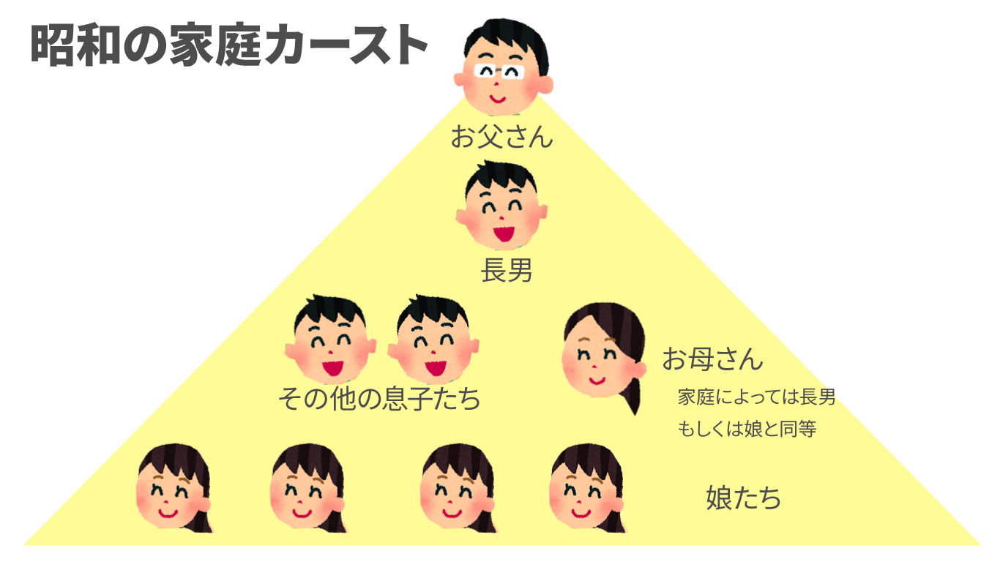
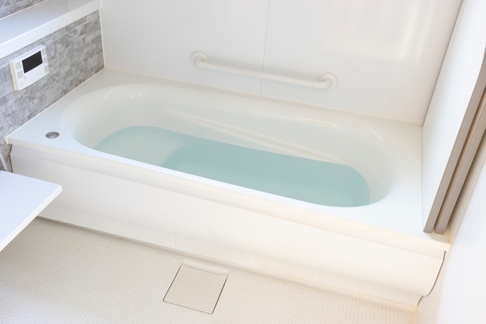
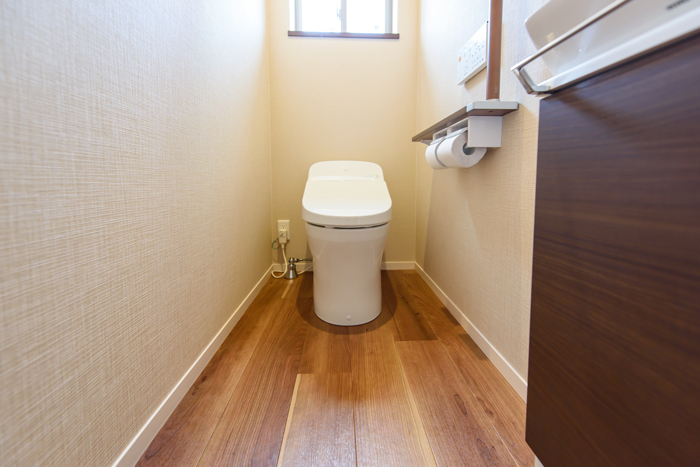
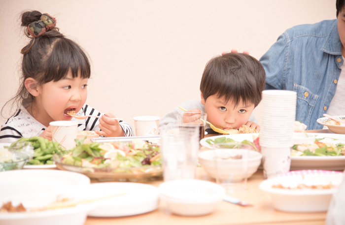
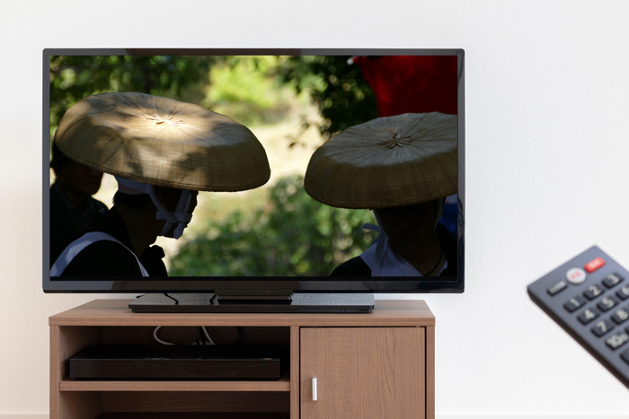
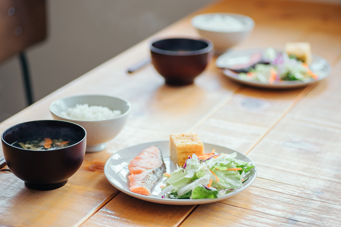
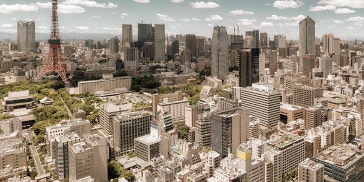
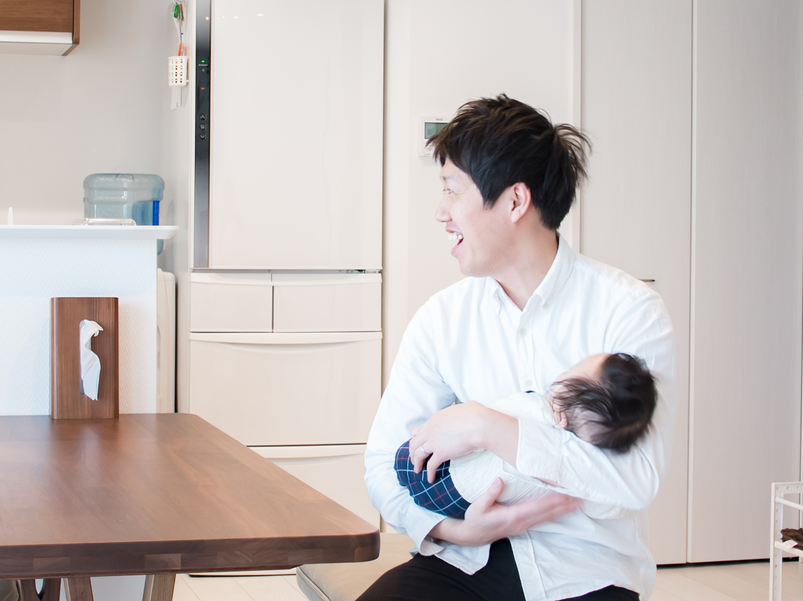
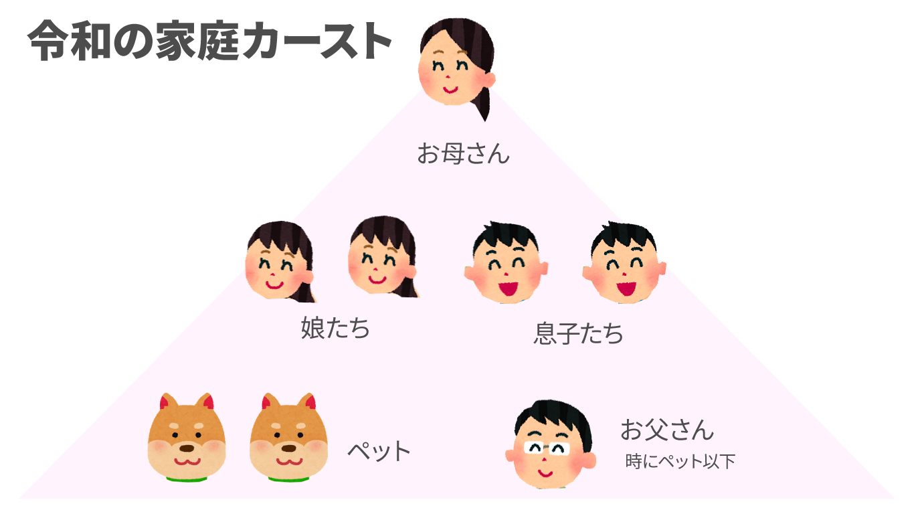

突然ですがみなさん、父親のイメージって怖いですか？優しいですか？

私の父は典型的な **昭和のお父さん** でした。

頑固、自分勝手、理不尽、お父さんは正義。昭和の父親ってそんなイメージありませんか？

今となっては珍しい昭和のお父さんですが、昭和後半にはまだたくさんの昭和のお父さんがいました。

そこで今日は昭和の父の特権5つと昭和のお父さんを作り上げた歴史的背景、日本の文化を考察しようと思います。

<prof></prof>

## 昭和の家族は父を中心に回っている？昭和のお父さんの特権5つ

昭和の時代はお父さんが一番偉い！

昭和では上記のような家庭内カーストが存在しました。

<msg txt="わしゃーおとうさんじゃ！お父さんは何をしてもえーんじゃ！！" img="common/father.png" name="お父さん" cls="right"></msg>

うちの父を例に、昭和の父の謎の特権についてご紹介します。

### 一番風呂は父親の特権

一番風呂とは沸かしたてのお風呂に一番最初に入ること。

日本人はこの一番風呂に神聖さや優越を感じます。言わずもがな、一番風呂は家庭カーストナンバー1父親の特権でした。

父親が先にお風呂に入りおわるまでまで、どんなにお風呂に入りたくてもみんな待っていました。

現在では「一番風呂は体に悪い」みたいですけどね。

### 誰が苦しんでいようと、長時間トイレを占拠
うちの父親は、トイレに入って新聞を読む習慣がありました。

しかも長い。

子供の頃、父親がトイレから出てきてくれないとき、小のときは仕方なく庭やお風呂でしていました。

大を我慢している時は地獄。トイレの前でのたうち回ってました。

それでもお構いなしで家庭カーストナンバー1の父はトイレで新聞を読了することを優先。苦しすぎて早く出るように懇願すると、逆ギレすることもありました。

<msg txt="ぐぉぉ、死ぬ！死ぬる！！早く出て！" img="common/camille-kid.jpg" name="かみーゆ（子供）"></msg>

<msg txt="ああ！！もう！！ トイレぐらいゆっくり入らせろ！！！" img="common/father.png" name="お父さん" cls="right"></msg>

もう十分ゆっくりいたやろ。。。

### お父さんは正義。何をしても許される

幼少期、私は玉ねぎを食べることができませんでした。

母親に注意された私は父親の皿に目をやりました。

父が玉ねぎを皿の隅っこにまとめて残しているのを発見しました。

<msg txt="お父さんは玉ねぎ食べてないのになんで私は食べなきゃいけないの？" img="common/camille-kid.jpg" name="かみーゆ（子供）"></msg>

すると父親は。。。

<msg txt="お父さんはいーの！" img="common/father.png" name="お父さん" cls="right"></msg>

<msg txt="ファッ！！！？（心の声）" img="common/camille-kid.jpg" name="かみーゆ（子供）"></msg>

自分はお金も稼いで家族を養っているから許されるという **全く道理の通らない言い訳** です。

必殺のセリフ「 *お父さんはいーの！* 」を父は連発します。

### テレビのチャンネル主導権は常に父にあり
昔はテレビなんて一家庭に1、2台しかありませんでした。

リビングのテレビチャンネルはいつも父の趣味。

我が家は家族全員揃って、テレビを見ながら夕飯を食べる習慣がありました。

ご飯を食べ終わるまで、つまらないNHKニュースや水戸黄門を見なければならないことも多かったです。

たまに見たい番組を懇願すると、

<msg txt="お父さん、たまにはドリフが見たい！" img="common/camille-kid.jpg" name="かみーゆ（子供）"></msg>

<msg txt="あいつらは生卵を投げる。 わしゃ食べ物を粗末をするやつはきらいじゃけダメじゃ！" img="common/father.png" name="お父さん" cls="right"></msg>

という感じで見せてもらえませんでした。

### 基本、家事・子育てには参加しない

<msg txt="かーさん、お茶ー" img="common/father.png" name="お父さん" cls="right"></msg>
<msg txt="かーさん、おかわりー!!" img="common/father.png" name="お父さん" cls="right"></msg>

昭和のお父さんは座ったまま、こんなしょうもないことを嫁に指図します。なぜならば「 **一家を支える大黒柱** 」だから。

そして食べ終わった食器も自分で下げることはありませんでした。

令和、平成のお父さんは子育てに参加してオムツ替えしたりしないと、嫁だけでなくフェミニスト団体などからも叩かれるので想像もできないでしょう。

母が入院した時、慣れない家事を僅かな期間やっていたことがあると聞きました。でも母が戻ったらすぐ元通り。ふんぞり返るようになりました。

## 「昭和のお父さん」を作り上げた時代と日本の文化

「昭和のお父さん」が如何に家では自分勝手だったかをおわかりいただけたと思います。

こんな威厳たっぷりの昭和のお父さんが生まれたのは時代的背景が強いと私は考察します。

### 高度経済成長期の親父（オヤジ）達は日本経済を支える高いプライドと自負があった

第一次ベビーブームに生まれた団塊の世代。父もその中のひとりで、終戦5年後に生まれ復興の最中育ちました。

父の幼少期、ちょうど朝鮮戦争（1950年〜）が勃発し、日本では朝鮮特需（補給物資の支援、戦車や戦闘機の修理請負などの特需）が経済復興の追い風となりました。その後、オリンピック開催など立て続けに好景気が続きました。

団塊の世代の若い労働者は *金の卵* と言われるようになりました。

戦後ボロボロの日本を高度経済成長させた団塊の世代は自信に満ち溢れていました。

特にお父さんたちは日本の経済を支える労働力の象徴でした。

### 仏教・儒教の教えが色濃く残る時代
日本は千年以上前に中国古来の仏教や儒教などの教えが伝来・浸透し、父系社会です。

女性は男性と歩くときは10歩下がって歩くのが美徳だった時代もあるほど、日本では男女格差が大きいです。

現在も格差は存在しますが、昭和はより色濃かったです。

戦後に生まれた人たちはまだまだ父親が一番偉く、長男が一番大切にされる環境で育ちます。

昭和の家庭では父親を頂点とした、次に長男、その他の男の子ども、母親と娘の順番のピラミッドができたのです。

## なぜ、昭和のお父さんはいなくなったのか
昭和のお父さんは理不尽で暴君でしたが、頼もしい存在でした。身を粉にして働いて家族の生活を支えました。

しかしながら平成・令和のお父さんは昭和のお父さんほど威厳を保つことができません。

その理由はなぜでしょうか？

大きな理由の1つは **時代とともに女性の権利に世の中がセンシティブになった** こと、2つ目は **経済が悪化し昭和より単純に稼げなくなった人が増えた** ことだと私は考えています。

### 増えるフェミニズム団体。お父さんは世間体を気にしている

実は最近昭和を代表するアニメ・ガンダムを見ました。男性（スレッガー・ロウ）が女性（ミライ・ミシマ）を平手打ちするシーンがありました。

すでに現代社会に適応してしまった私は反射的に思いました。

<msg txt="平手打ちって、今こんなシーン放送したらフェミニスト団体に訴えられ、即放送中止になるんじゃないか。。。"></msg>

昔に比べ、女性や子供の人権を訴える人たち、団体が増えました。女性や子供の人権をないがしろにすると、現在では世の中が許さない風潮もあります。

家事・育児に参加しない男性に対して世間からの風当たりは強いので参加せざるを得ない。

実際、**家事や育児に非協力的な発言や行動** をする芸能人・政治家は *Twitter で即炎上* です。

男性はむやみに家庭でふんぞり返りにくくなりました。

### バブルが弾けて以降、日本の経済はずっと悪い

1990年代後半、バブル経済が崩壊しました。

バブル前とあとでは日本は完全に変わりました。 具体的にどのくらいの差があるかというと、

* **バブル全盛期** 地方女子短大卒で使えないかもしれない新人にボーナスを100万円払う時代。タクシーも捕まらないから一万円札を見せて捕まえるほど。
* **バブル崩壊後** 就職氷河期だった私の世代は履歴書100枚書いて就職が一社決まれば良い方。父の周りの経営者もお金が回らなくなり倒産したり最悪自殺する方も。

たった４、5年違うだけで天国と地獄ほどの差があります。

その後も日本経済はリーマンショックなど悪いことが続きます。 リーマンショックの頃の様子が知りたい方はこちらも併せてお読みください。

<card id="/blogs/entry382/"></card>

経済特需のような奇跡は、もう日本には起こりませんでした。

今までの昭和のお父さんのように一馬力じゃ稼げない家庭がどんどん増えました。

しかも男性は昭和の時代のように *男性だからという理由* だけでは、優位な仕事を得ることができなくなったのです。

### 令和の新しい家庭内カーストでのお父さんの立ち位置

一人では家族を養えるほどお金を稼げなくなり、世間が女性や子供の人権に過敏になり、お父さんは家でふんぞり返るどころか肩身も狭くなりました。

長い間好景気を知らない平成・令和のお父さんは、そもそも威張ろうっていう気持ちも持ち合わせていないのかもしれません。

家族に威厳を誇示できなくても十分幸せかもしれませんしね。

## まとめ・昭和のお父さんは無茶苦茶…、けどサイコーに頼れる父親（オヤジ）だった

トイレは入れないし自分だけが優位なルールを適応する父親に、若い頃は反感を持ちました。

そんな父親にも強いポリシーがありました。

* 男たるもの絶対女性に暴力をふるってはいけない
* 男たるもの家庭を養わないといけない
* 男たるもの家族を守らなければならない

母に対しても絶対お金で不自由させないと言って結婚しました。

有言実行でお金で苦労させることはありませんでした。悪い面では家事も子育ても手伝いませんでしたが、いずれにせよ昭和だからできたのだと思います。

昭和のお父さんは無茶苦茶だけど、サイコーに頼れる父親（オヤジ）でした。

昭和と平成、令和のお父さん。どのお父さんがいいとは言いません。どちらも良い部分も悪い部分があると思うので。

時代は変わります。 典型的な昭和気質のうちの父も、仕事をリタイアしてからは家事を積極的にするようになりました。 母の薬の管理などまで献身的に尽くしているようです。嬉しい反面、少しさみしい気もします。

昭和の魂（ソウル）を持った威厳あふれるお父さんたち、少しでも日本に存在し続けることを願ってこの記事を締めくくります。

最後までお読みいただきありがとうございました。

 ぜひ関連記事もお読みください。

<card id="/blogs/entry420/"></card>

<card id="/blogs/entry473/"></card>

<card id="/blogs/entry505/"></card>
