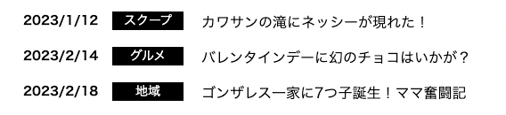
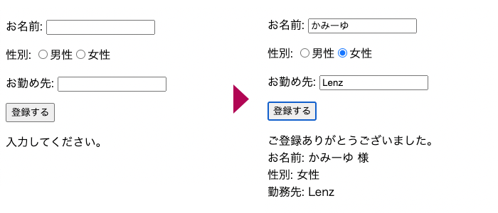
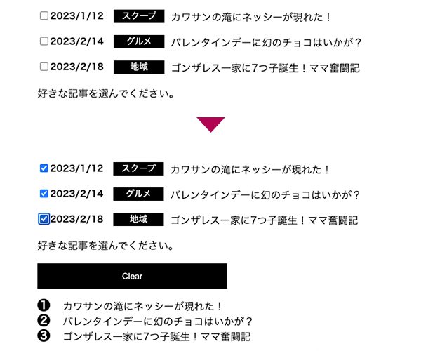
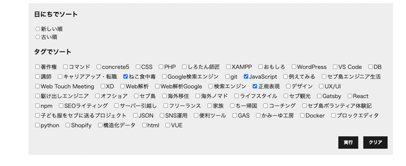

最近 Vue.js を使っているのですが、コンポーネント化し、あれこれ拡張する必要に迫られました。どうしてもパーツをコンポーネント化して管理したかったので、そのやり方をまとめます。

親コンポーネントから子コンポーネント、子コンポーネントから親コンポーネントへのデータ受け渡し方法についても解説していきます。

まずは開発環境があることが前提条件なので以下参考にしてください。
<card id="/blogs/entry522/"></card>

開発環境は作らなくてもVueは使えます。手軽にVue.jsを導入する方法はこちらです。
<card id="/blogs/entry520/"></card>

<toc id="/blogs/entry523/"></toc>

<prof></prof>

*前提条件*
* Vue.jsのファイルをコンパイルできる環境がある
* Vue.jsのコンポーネントを使いたい
* Node や npm をインストールしていて、コマンドが使える
* コマンドの使い方がある程度わかっている
* Compostion API を使いたい

## 親（DOM）からコンポーネントに値を渡す
親コンポーネントから、子コンポーネントへの値の渡し方はシンプルです。

以下のようなサンプルを作成します。



```js:title=./js/index.js
import {
  createApp,
  ref,
  onMounted,
} from 'vue';

import PostItem from './components/PostItem.vue'

const app = createApp({
  components:{ PostItem },
  setup() {
    const posts = ref(
      [
        { date : '2023-1-12', title:'カワサンの滝にネッシーが現れた！', cate: 'スクープ'},
        { date : '2023-2-14', title:'バレンタインデーに幻のチョコはいかが？', cate: 'グルメ'},
        { date : '2023-2-18', title:'ゴンザレス一家に7つ子誕生！ママ奮闘記', cate: '地域'}
      ]
    );
    return {
      posts
    }
  }
})
app.mount("#app");
```

```html:title=index.html
<div id="app">
  <ul>
    <li v-for="post in posts"><post-item :post="post"></li>
  </ul>
</div>
```
今回はシンプルにHTML(DOM)上で、コンポーネントを使ったのでケバブケースで記載しました。

通常はテンプレート（コンポーネント）同士でやり取りが発生するのでキャメルケースで記述します。

```HTML
<!-- DOM上 -->
<post-item :post="post">

<!-- テンプレート内 -->
<template>
  <PostItem :post="post">
</template>
```
では実際に格納された値を小コンポーネントに渡します。`:post="post"` に格納された値を `props` で受け取ります。
```html:title=./components/PostItem.vue
<template>
    <time datetime="post.date">{{setDateString}}</time><span>{{post.cate}}</span>{{ post.title }}
</template>
<script>
import { computed } from "vue";
export default {
    props:{
        post: { type: [Array, []] }
    },
    setup(props) {
        const setDateString = computed(() =>{
            return props.post.date.replace(/-/g, '/')
        })
        return {
            setDateString
        }
    }
}
</script>
```

[親（DOM）からコンポーネントに値を渡す　コードサンプル](https://github.com/yuririn/vue-sourt-sample/tree/sample)

## コンポーネントから親（DOM）にクリックイベントなどで値を渡す

コンポーネントから、親(DOM)への値の渡し方はシンプルです。

フォームを入力したら、親に値を渡します。




親から子に渡すときは `emit` を使います。まずはコンポーネントから作成します。

```html:title=./components/InputItem.vue
<template>
    <p>お名前: <input type="text" name="name" v-model="name"></p>
    <p>性別:
        <label><input type="radio" name="gender" value="男性" v-model="gender">男性</label>
        <label><input type="radio" name="gender" value="女性" v-model="gender">女性</label>
    </p>
    <p>お勤め先: <input type="text" name="company" v-model="company"></p>
    <p><button @click="getYourInfo">登録する</button></p>
</template>
<script>
import { ref } from "vue";
export default {
    setup(_, {emit}) {
        const name = ref(null)
        const gender = ref(null)
        const company = ref(null)
        const getYourInfo = () => {
            emit('info', {name: name.value, gender: gender.value, company: company.value})
        }
        return {
            name,
            gender,
            company,
            getYourInfo
        }
    }
}
</script>
```
コンポーネント側のボタンがクリックされると、渡したい値を `emit` にセットされます。

`emit` は第一引数がイベント名です。キャメルケースは使えませんので注意です。第二引数以降は渡したい値としてセットできます。
```js
emit(イベント名)
emit(イベント名, 値)
emit(イベント名, 値1, 値2, 値3)
```

DOM側でイベント `@info` に `showYourInfo` をセットしておきます。
```html
<input-item @info="showYourInfo"></input-item>
```
`showYourInfo` を作成し、値を受け取り処理します。
```js:title=./js/index.js
import {
  createApp,
  ref,
} from "vue";

import InputItem from './components/InputItem.vue'

const app = createApp({
  components: {InputItem },
  setup() {
    const yourInfo = ref(null)
    const showYourInfo = (info) => {
      yourInfo.value = info
    }
    return {
      yourInfo,
      showYourInfo
    }
  }
})
app.mount("#app");
```
コンポーネント側から `emit` で渡した値は、第一引数はそのままイベント名となるので、第二引数以降を受け取ることができます。

今回は値を受けとりたいので以下のような記述としました。

```js
const showYourInfo = (info) => {
  yourInfo.value = info
}
```
渡す値がなくボタンをクリックしたことのみを、キャッチしたい場合は受け取り側の引数は不要です。
```js
const func = () => {
  //処理
  alert(`ボタンがクリックされました`)
}
```
受け取った値を利用して親側にも動的に表示します。

```html:title=index.html
<div id="app">
    <input-item @info="showYourInfo"></input-item>
    <p v-if="yourInfo === null">入力してください。</p>
    <p v-else>
      ご登録ありがとうございました。<br>
      お名前: {{yourInfo.name}} 様<br>
      性別: {{yourInfo.gender}}<br>
      勤務先: {{yourInfo.company}}
    </p>
  </div>
```

[コンポーネントから親（DOM）にクリックイベントなどで値を渡す　コードサンプル](https://github.com/yuririn/vue-sourt-sample/tree/sample2)

## 双方向のデータのやり取り
では相互データのやり取りをしてみましょう。

一番最初に作った、親（DOM）からコンポーネントに値を渡すを改造します。

今回は `v-model` を使います。

サンプルはお気に入りの記事に投票するというものです。選んだ記事のタイトルが下に表示されます。



```html:title=index.html
<ul>
  <li v-for="post in posts">
    <post-item :post="post" v-model="selectedPost">
  </li>
</ul>
<p>好きな記事を選んでください。</p>
<ol v-if="selectedPost.length > 0">
  <li v-for="n in selectedPost">{{n}}</li>
</ol>
```
`selectedPost` という選択した記事タイトルの値を格納する変数を用意します。
```js{18,21}:title=./js/index.js
import {
  createApp,
  ref,
} from 'vue';

import PostItem from './components/PostItem.vue'

const app = createApp({
  components:{ PostItem },
  setup() {
    const posts = ref(
      [
        { date : '2023-1-12', title:'カワサンの滝にネッシーが現れた！', cate: 'スクープ'},
        { date : '2023-2-14', title:'バレンタインデーに幻のチョコはいかが？', cate: 'グルメ'},
        { date : '2023-2-18', title:'ゴンザレス一家に7つ子誕生！ママ奮闘記', cate: '地域'}
      ]
    );
    const selectedPost = ref([])
    return {
      posts,
      selectedPost
    }
  }
})
app.mount("#app");

```
コンポーネント側です。選んだ値を格納する `modelValue` を `props` に作り、親から渡ってきた値を受け取ります。

チェックボックスが操作されたら `votePost` で、値を形成し直して `emit` で親に渡します。

```html:title=./components/PostItem.vue
<template>
   <label>
      <input type="checkbox" v-model="votePost" :value="post.title">
      <time datetime="post.date">{{setDateString}}</time>
      <span>{{post.cate}}</span>{{ post.title }}
    </label>
</template>
<script>
import { computed } from "vue";
export default {
    props:{
        modelValue: { type: [Array, []] },
        post: { type: [Array, []] }
    },

    setup(props, { emit }) {
        const setDateString = computed(() =>{
            return props.post.date.replace(/-/g, '/')
        })
        const votePost = computed({
            get: () => props.modelValue,
            set: (value) => {
                emit('update:modelValue', value)
            },
        })
        return {
            setDateString,
            votePost,
        }
    }
}
</script>
```
HTML（DOM）側にクリアボタンを作ります。

クリアボタンを押すと、コンポーネント内の選択も外れます。

```html:title=index.html
<button @click="selectedPost =[]" v-if="selectedPost.length > 0">Clear</button>
```


[双方向のデータのやり取り　コードサンプル](https://github.com/yuririn/vue-sourt-sample/tree/sample4)


## 実際にサンプルで作ってみる　

以前作ったjsonデータの記事の絞り込みのサンプルを改造してテンプレート化します。

<card id="/blogs/entry520/"></card>

今回テンプレート化する場所は、検索部分のみです。


ファイル構造はこんな感じです。

```
vue-sample/（ルートディレクトリ）
  ├ node_modules/
  ├ gulpfile.js
  ├ webpack.config.js
  ├ package.json
  ├ package-lock.json
  ├ js/
  | ├ components/
  | | ├ Search.vue(新規追加)
  | | ├ TagItem.vue(新規追加)
  | | └ TagItem.vue(新規追加)
  | └ index.js(修正)
  └ public/
    ├ js/
    | └ index.min.js(自動生成)
    └ index.html(修正)
```
コードを書く前のソースコードを以下に格納してあります。

[vue-sourt-sample　Git](https://github.com/yuririn/vue-sourt-sample/tree/add-gulp)

### 大枠の親コンポーネントを作る

タグのチェックボックスのもととなるデータ親から渡せるようにします。
```html:title=index.html
<search :tags="tags"></search>
```

日にちで並べ替えと、タグで絞り込み用に作ったコンポーネントを読み込みます。

タグはチェックボックスでこのあとの作業が何かと不便なので、`Search` コンポーネントの実装の時点で繰り返し処理で出力します。

```html:title=Search.vue
<template>
    <div class="sort">
        <h3>日付で並べ替え</h3>
        <ul class="select-tags">
            <SortDate v-model:sort="sortDate"></SortDate>
        </ul>
        <h3>タグで絞り込み</h3>
        <ul class="select-tags">
            <li v-for="tag in tags" :key="tag"><TagItem :tag="tag" v-model:tagvalue="selectedTags"></TagItem></li>
        </ul>
    </div>
</template>
<script>
import TagItem from './TagItem.vue'
import SortDate from './SortDate.vue'
import { ref } from "vue";
export default {
    components: {TagItem, SortDate},
    props: {
        tags: Array,
    },
    setup(_, { emit }) {
      const sortDate = ref(null)
        const selectedTags = ref([])
        return {
            sortDate,
            selectedTags
        }
    }
}
</script>
```
### 日付ソート部分をコンポーネント化する
日にちのソート機能をコンポーネント化します。

```html:title=SortDate.vue
<template>
  <label v-for="item in sortValue">
    <input type="radio" :value="item.value" name="date" v-model="setSortDate">{{ item.label }}
  </label>
</template>
```
`Search` コンポーネントで作成した、変数 `sortDate` とデータをやり取りできるようにします。

`props.sort` に格納し、双方向の通信をできるようにします。

```js:title=SortDate.vue>
import { computed, ref } from "vue";
export default {
  props:{
    sort:  String,
    value: String,
    label: String
  },
  emits:["update:sort"],
  setup(props, { emit }) {
    const setSortDate = computed({
      get: () => props.sort,
      set: (value) => {
          emit('update:sort', value)
      },
    })
    const sortValue = ref([
      {
        label:"新しい順",
        value: 'desc',
      },
      {
        label:"古い順",
        value: 'asc',
      }
    ]);
    return {
      setSortDate,
      sortValue
    }
  }
}
```
### タグ絞り込み部分をコンポーネント化する

`Search` コンポーネントから受け取った `tag` の値を利用してチェックボックスを出力します。

```html:title=TagItem.vue
<template>
  <label><input type="checkbox" :value="tag" v-model="narrowDown" name="tag"/>{{ tag }}</label>
</template>
```
日付ソートとあまり変わりません。

```js:title=TagItem.vue
import { computed } from "vue";
export default {
    props: {
        tag: String,
        tagvalue: Array
    },
    emits:["update:tagvalue"],
    setup(props, { emit }) {
        const narrowDown = computed({
            get: () => {
                return props.tagvalue
            },
            set: (value) => {
                emit('update:tagvalue', value)
            },
        })
        return {
            narrowDown
        }
    }
}
```
### 検索とクリアボタンの処理をする。

検索と絞り込みで、親に更に値を渡して絞り込み処理をさせます。

```html:title=Search.vue
<div class="sortBtns">
  <button @click="sort">実行</button>
  <button @click="clear">クリア</button>
</div>
```

ボタンのクリックイベントには、それぞれ `emit` で更に親に値を渡します。

`sort`　には引数に検索条件を渡します。 `clear`　は絞り込みを解除するだけなので、引数は指定しません。
```js:title=Search.vue
const sort = () =>{
  emit('search', {'tags': selectedTags.value, 'date': sortDate.value})
}
const clear = () =>{
  selectedTags.value = []
  sortDate.value = null
  emit('clear')
}
return {
  sort,
  clear
}
```
`search` コンポーネントの属性に `@search="sort"` と `@clear="clear"` を追加します。

検索とクリアボタンに子コンポーネントでクリックなどのアクションを起こしたときに、値を受け取れるようになります。

```html:title=index.html
<search :tags="tags" @search="sort" @clear="clear"></search>
```

各ボタンのクリックされたあとの処理をします。

`sort` では元々あるコードを少し変更します。

`clear` は特に触らなくて大丈夫です。

```js{1,3-4}:title=index.js
const sort = async (args) => {
  currentPage.value = 1;
  sortDate.value = args.date
  selectedTags.value = args.tags
  await sortArticle();
  message.value = selectedTags.value.length !== 0 ?
    `${selectedTags.value.join(", ")} の記事が ${total.value} 件あります。` : null;
}
const clear = async () => {
  currentPage.value = 1;
  selectedTags.value = []
  sortDate.value = null
  message.value = null
  await sortArticle();
}
```

### 完成版のコード
完成版のコードはこちらです。

* [JS](https://github.com/yuririn/vue-sourt-sample/blob/sample3/js/index.js)
* [HTML](https://github.com/yuririn/vue-sourt-sample/blob/sample3/public/index.html)
* [コンポーネント](https://github.com/yuririn/vue-sourt-sample/tree/sample3/js/components)

## まとめ・Vueコンポーネントを使うとコードが整理でき、メンテナンス性も上がる
今回はVueで値を受け渡す、サンプルをいくつか作ってみました。

やっつけで作ってしまったので、時間があるときにコードをもう少し整理できればと思います。

この記事が皆さんのコーディングライフの一助となれば幸いです。

最後までお読みいただきありがとうございました。

