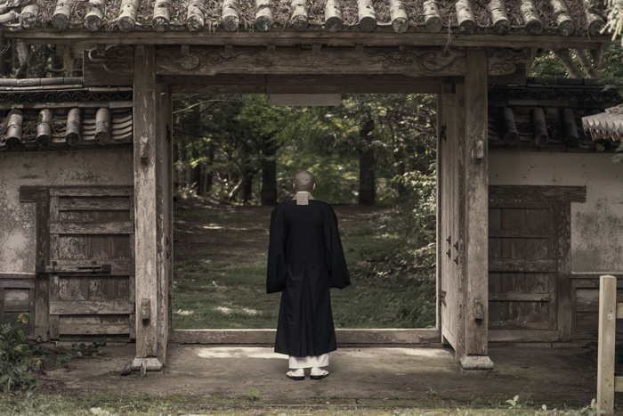

「_後悔しない人生を歩みたい。_」

後悔のない人生なんてない。ですが、誰しもがそう願っています。

私は「後悔」という言葉から、 1 歳の頃に他界した母方の祖父のことを思い出します。

私が生まれて初めて参列した葬式がその祖父のものです。

<prof></prof>

祖父の人生は後悔そのもので、自ら命を絶ちました。

両親は祖父の自死を隠してましたが、私が 10 代の頃、姉が教えてくれました。未だに我が家では死因に触れることはタブーのようで、私も両親に聞かないようにしています。

今日は祖父の後悔の人生と、私がそこから学んだことを綴っていきます。

## 親戚に反対され、しぶしぶ夢を諦めた祖父

祖父は山口の片田舎の家の長男として生まれました。

祖父には夢がありました。役者になることです。母曰（いわ）く器用に何でもこなす人だったそうです。

当時は昭和初期で戦争が終わったばかり。特に田舎では、男がフラフラと役者になるなんてとんでもない話でした。

上京するつもりだったみたいですが、親戚一同に大反対されました。

ここから祖父の諦めきれなかった夢と、無念の人生の始まります。

### 酒に溺れ、家族に暴力を振るう祖父

手先の器用だった祖父はその後左官業で身を立てていたそうです。

祖父は嫁と、私の母を含めた 4 人の子どもを持ち、夢を諦めて一旦落ち着いたかのように見えました。

毎夜酒に溺れ、家族に暴力を振るうようになりました。

末から 2 番目の私の母は「包丁が飛んできて足に刺さった」「真っ暗な夜道酒を買いに行かされた」などと当時のことをよく話してました。

ついに、母の母である私の祖母は 3 人の娘を置いて、乳飲み子だった母の弟だけ連れて逃げ出したそうです。

ここから母のさらなる地獄の子供時代が始まったそうです。

### 仮説・祖父は自分の気持ちに折り合いがつかなかった

祖父が酒に溺れるのも、暴力もすべて、決して許されることではありません。

しかしここであえて、祖父の気持ちを考察します。

- もし、無理にでも上京していれば
- もし、親戚の反対を押し切ることができたなら

**自分の夢は叶えれたかもしれないのでは？**

祖父は自分の置かれている現実と夢にチャレンジできなかった「後悔」に折り合いがつかなかったのではないだろうか。

受け止められない現実と無念が後悔になり、酒に溺れ、家庭内暴力に走り、最後には自殺に至ったのではないか。

すべて私の憶測です。なんせ会ったこともなく、手がかりは母からの話だけですから。

母はたまに「心が弱かった」と祖父のことを言います。

深い、深い後悔は人生を狂わせるのではないでしょうか。

<ad location="/blogs/entry529/"></ad>

## 後悔のない人生なんてない。ても、できることを模索できるのでは？

祖父は心では夢を諦められず、人生を狂わせてしまった。

死ぬまで、矛盾する気持ちに折り合いがつきませんでした。  

私も実は若い頃、心との折り合いがつかないまま「やりたいこと」を諦めてきた人間でした。

私は学生の頃漫画家やイラストレーターになりたくて、働きながら専門学校へ行くつもりでした。しかしデキ婚で夢を追うことはできなくなってしまいました。

子どもができたとき、若い頃やりたかったことの殆どのことを諦める覚悟をしました。でも心の底ではどこか諦めきれない気持ちを抑えられませんでした。

家族の中では死んでもなお腫れ物のような存在だった祖父でした。自分が同じ立場になり初めて気持ちがわかりました。

<ad location="/blogs/entry529/"></ad>

それから、祖父のような後悔しないためにはどうすればいいか、、、考えるようになりました。

### 自分のやりたいことを忘れなければいつかチャンスは巡ってくる

<msg txt="やりたいことはやり尽くして死ぬ"></msg>

これは私の人生の目標の一つです。

20 代後半、子どもが原因で他の仕事を探すことにしました。

不幸中の幸い、この求職中にまとまった時間が作れる事に気が付きました。仕事が決まるまでの _期間限定_ で漫画を描こうと心に決めました。出版社に 8 本くらい短編(30 ページ程度)を送り、ありがたいことに 2 度奨励賞をもらいました。

すぐに失業保険受給期間も終わりが近づき、仕事を本腰を入れて探さなければならなくなりました。

夢だった漫画家やイラストレーターになることは再び諦めましたが、達成感もありとても清々しい気持ちになれました。短期間でも夢へチャレンジできたからだと思います。おかげで **「漫画家やイラストレーターになる夢」を _諦めた無念から開放_** されることができました。

その後も、過去諦めた夢を叶えるチャンスは巡ってきます。

学生の頃の「海外で働く夢」も、 20 年以上たった今、叶えることができています。  

チャンスとは眼の前の大縄跳びを想像します。

1 回目の大縄の中に飛び込めなくても、縄が回っているうちはチャンスがあるはずです。1000 回目でもいいから飛び込めばいいんです。

うまく飛び込めなくても機会が巡ってくれば、またチャレンジすればいい。

<ad location="/blogs/entry529/"></ad>

人生には回っている大縄がたくさんあって、生きているうちはいつか何かのチャンスが巡ってきます。

### やりたいことができなくても、それに近いことをする

子どもを出産してしばらくして、ネイルにアートができるネイリストという職業があることを知りました。

<msg txt="これならなんとかできそう！紙からキャンバスを爪に変えればいいだけの話！！"></msg>

私は絵が描きたかった。どんなキャンバスでも良かったのかもしれないです。

やってみたら性に合っていて、漫画家やイラストレーターになるためにしてきた絵を描く練習も役に立ちました。

私はすぐにネイルに夢中になり、難関であるネイリスト検定一級合格だけでなく NAIL EXPO で入賞することもできました。

大学中退・デキ婚。社会で圧倒的弱者だった私ですが、ネイリストにチャレンジしたおかげで世間的に認められ、自信をつけることもできました。

### 最終的に自分のことは自分で決める

祖父は家族に説得させられて役者の夢を諦めました。

田舎に残ることは祖父にとって押し付けられた人生です。頭では納得できなかったことと想像します。

現実との心の矛盾が祖父の人生を狂わせたのだと。  

人生では納得できないことをしなければならないこともあります。

私はデキ婚です。子どもができてしまったから結婚し、やりたいことを諦めざるを得ませんでした。しかし心の底のどこかで納得できませんでした。

祖父の人生と重ね、この納得できない気持ちはどこから来るのか考えました。人や不可抗力のせいにしているからです。納得できずに選んだ道やレールを歩かされていると自分で思っているうちは、いつまでも納得できないのです。

出産も結婚も、選択肢がなかったにせよすべて自分が決めたこと。すべての責任は自分にある。

選択肢がなかったとしても、自分の決めたことだと肚（はら）をくくれば覚悟もできます。
<ad location="/blogs/entry529/"></ad>

## まとめ・後悔の正体を知り、後悔と向き合う

後悔って一体何なんでしょうか？

自分の過去に失敗したりできなかったことを残念に思ったり、後から悔やむことです。

私の人生だって後悔だらけといえば後悔だらけです。  

私の昔勤めていた会社の上司がよくこんなことを言ってました。

「**あのとき、〇〇しておけば良かった。**」

その言葉を聞くたびに過去できなかったこと失敗したことをいつまでも悔いていることが健全じゃないと感じるようになりました。

過去はどうあがいても物理的にやり直しできない。できないことをやろうするのは、ノイローゼみたいなものです。  

後悔のない人生なんてないです。

自分のことは最終的に自分で決める。選択するときは、責任を持ち覚悟をする。そして、やりたいことはすべてやり尽くす。そうすれば自ずと人生で蓄積される後悔は減っていくはずです。  

私の先に、後悔に苦しんだ生涯を過ごした祖父がいたからそう思えるようになりました。祖父とは生きて会うことはできませんでしたが、たくさんの学びをもらえたことを感謝しています。

この記事が、あなたの後悔との向き合い方の一助となれば幸いです。

<ad location="/blogs/entry529/"></ad>

最後までお読みいただきありがとうございました。

<card id="/blogs/entry505/"></card>

<card id="/blogs/entry473/"></card>
