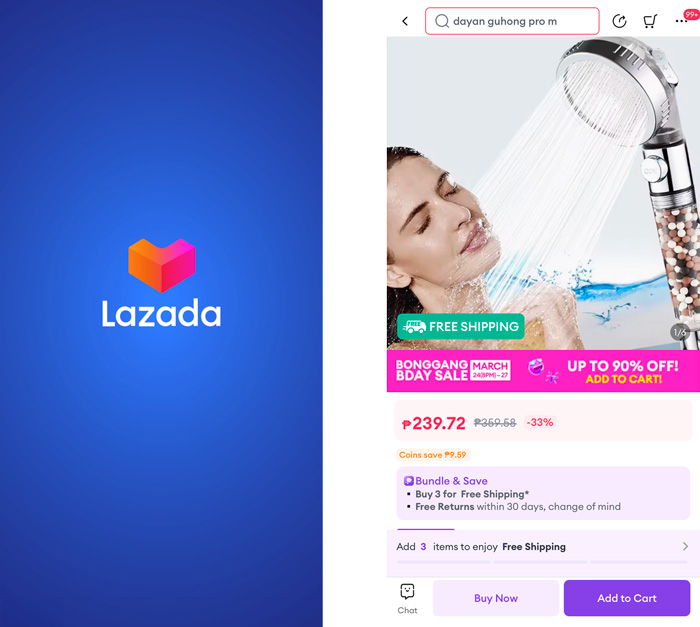
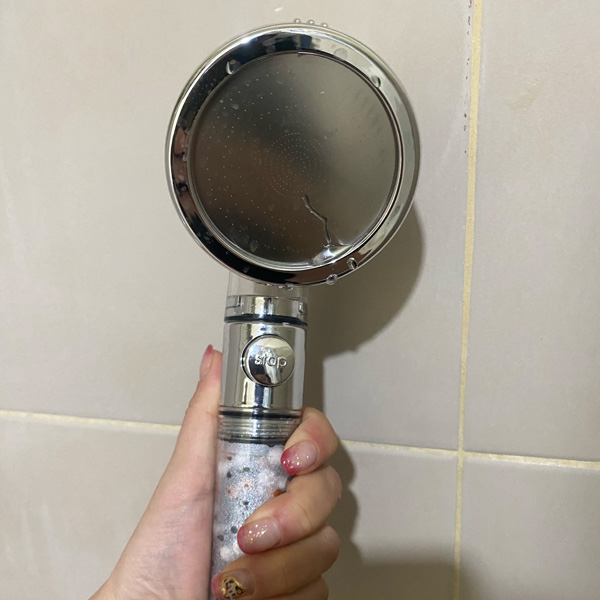
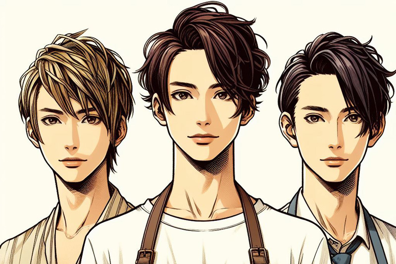

セブに住んで 5 年経ちますが、悩みは髪の傷みです。

特に髪が干し草みたいに傷んでしまって、オイルなしではお出かけできない状態でした。

対策としては美容院に行ったときは必ずトリートメントはしているものの、数日立つと元通りの干し草に。

紫外線も浴びないようにお出かけ時は必ず帽子を被るなど、とても気を使っていましたが全く効果なし。

せめて、傷んだ髪をカットすることでひどくなるのを防ぐくらいしかできませんでした。

<prof></prof>

そこで今回はセブ島で髪が傷む原因やその対処法などを実体験を元に記事にしてみました。

セブにいてもすぐできることなのでぜひ、興味のある方は試してみて下さい。

## 髪の痛みの原因は?美容師さんとの会話が水道水と発覚

ある日知り合い（美容師）と話をしていて、ふと髪が傷む原因の話になりました。

<msg txt="髪が傷む原因は多分水質ですよ。セブの水はアルカリ性ですから。" img="common/biyoushi1.jpg" name="美容師さん" cls="right"></msg>
<msg txt="へー、知らなかった！"></msg>

<msg txt="2、３日に一度のシャンプーで我慢すればいいんですよ！" img="common/biyoushi1.jpg" name="美容師さん" cls="right"></msg>

<msg txt="常夏の国でそれはちょっと。。。"></msg>

傷む髪のことで周囲に聞き込みしているとボロボロと証言があり、もっと深刻な悩みも。。。

<msg txt="実は髪が抜けるんですよね。もうね、結構深刻なくらい。◯ゲるんじゃないかって心配。" img="common/biyoushi4.jpg" name="30代男性" cls="right"></msg>

<msg txt="僕もセブに来た頃より生え際が後退してきた気がします。" img="common/biyoushi3.jpg" name="20代男性" cls="right"></msg>

<msg txt="うぅ、若いのにかわいそう。。。。"></msg>

水こわー！！！

## 髪が痛むメカニズム

髪が傷む原因はどうやら、アルカリ性というところまでたどり着きました。

そこでなぜアルカリ性の水で傷むのか、調べてみました。

### 健康な髪は弱酸性

健康は髪は弱酸性（pH4.5 〜 5.5）で、アルカリ性に傾くと髪のキューティクルが開いた状態になります。

髪がアルカリ性に傾いた状態が続くと、もちろんキューティクルが開きっぱなしになり本来髪の中に蓄えられていた水分などが抜けてパサパサになるのです。

### 水道水がなぜアルカリ性に傾くのか

塩素がたっぷりはいったプールに入った後、髪がガシガシになる経験はしたことはありませんか?

アルカリ性に傾くのは、**水の殺菌などに使われる*塩素*** が原因です。

日本の水道水も実は pH 値７～８で中性からアルカリ性で、フィリピンと pH 的には変わらないはずなんですけどね。。。。

ただ、日本と比べるとフィリピンの水道水は飲めないので塩素の量・水の汚染度合いは格段に違うとは思います。
<msg txt="私は鼻がいいので分かる（炭治郎ほどではない）！ ぶっちゃけフィリピンの水道水は日本に比べてカルキ（塩素）臭い。"></msg>

美容師さんは、pH コントロールしてキューティクルを開いたり閉じたりしてカラーやパーマしたりするので pH が原因だと思ったんでしょうね。

## そこで、フィルター付きシャワーヘッドを買って使ってみる

フィルター付きのシャワーヘッドを [Lazada（フィリピンの通販アプリ）](https://www.lazada.com.ph/)で探すことにしました。

pH 調整できて不純物を取り除けるシャワーヘッドを見つけたので早速購入。

約 240 ペソでした。値段も値段なので効果も期待せず、「ダメだったらまた別のものを探せばいい」ぐらいの気持ちで試してみることにしました。

そもそも、このアプリではそんなに高いものは売ってないので、ちゃんとしたものを買いたいならメーカーから取り寄せたり、日本で購入したほうがいいかもです。

### 結論・髪の毛がマシになった

以下のような改善が見られました。

- シャンプーの泡立ちが良くなった
- シャワー中のカルキ（塩素）臭さが減った
- ドライ後のオイルが必要なくなった

シャワーヘッド取り替えて 4 週間後、美容院に行ってみると。。。

<msg txt="以前よりマシになりましたね！指通りが違います。" img="common/biyoushi2.jpg" name="美容師さん" cls="right"></msg>

ヤ*｡٩(ˊᗜˋ*)و\*｡ター！効果あったみたいです！！！

コスパからするとかなりいいんじゃないでしょうか?

## どうやら硬水の方がもっとヤバいかも

日本の水は軟水、フィリピンの水は硬水です。

石灰が含まれているので、水回りのあちこちが白くなります。

実は、この _硬水がもっとヤバい_ かもということが発覚しました。

### 【弊害その 1】髪や頭皮が極度に乾燥する

洗浄剤のミネラルと反応していわゆる石鹸カスが肌や髪に付着して落ちなくなってしまうそう。

この石鹸カスはアルカリ性という爆弾付き。

しかも水で洗い流せなくなってしまいます。その結果ゴワゴワ感が残るようです。

### 【弊害その 2】ヘアカラーが持たない

降水に含まれる金属イオンがカラー剤と反応して、発色が悪くなったり色ムラができたりすることもあるそう。

### 【弊害その 3】シャンプーが泡立ちにくい

硬水に含まれる金属イオンがシャンプーの成分と反応し、界面活性剤の働きを妨げるそうです。

セブに来たての頃、シャワーのたびに「なんでこんなに泡立たないんだ」って思ってたけど、そういうことだったのね。。。

### 【弊害その 4】石鹸カスが邪魔してトリートメントがきかない

水でも流せない石鹸カスが残っている髪に、もちろんトリートメントは効きません。

私は何回トリートメントをムダにしてきたんだ。。。

### 日本のシャンプー＆トリートメントを使っている人は要注意

わざわざ日本からシャンプー・トリートメントを持ってきて使っている人、日本で使われているシャンプーヤトリートメントの多くは、日本の水、つまり軟水用に開発されています。

なので、硬水と相性が悪い可能性があるので注意が必要で、むしろ現地のシャンプー・トリートメントを使ったほうが良いこともあります。

## まとめ・高いトリートメントでヘアケアするよりまず、使用している水を見直す

まだまだ回復には時間がかかりそうですが、髪はだいぶ回復しました！

現地で調達した LUX のさほど高くないシャンプー・トリートメントを使っていますが、髪を乾かした後もまとまるようになりました。

<msg txt="人間は何かを解決しようとするとき、足し算の発送になるけど足せばいいってもんじゃない。引き算も大事。"></msg>

実は硬水は軟化させる装置ヤフィルターもあるみたいなので、もっと髪をいたわりたいならそういうものも用意したほうがいいかもしれません。

今回は、海外生活で髪が傷んだり抜け毛に悩んでいる人のために現地で対処できることを記事にしました。

この記事が、みなさまの海外生活の一助となれば幸いです。

最後までお読みいただきありがとうございました。

参考: [健康的な髪の毛は「弱酸性」｜髪の毛と pH の関係について解説！](https://quickpcr.jp/contents/womanhair/hair-ph-detail/)

### おまけ・イラストや図は Colipot で作成

今回は Colilot に含まれる Designer という AI ツールでイラストを作らせました。

ものの数分（秒かも）で 4 枚イラスト完成。

ただ「_3 人の 20 代のオシャレな正面を向いた男性_」と依頼したら **ホストチックな見た目のトリオが爆誕** してしまいました。

「オシャレ」とか抽象的な言葉を使ったせいで、ホストチックになってしまったので言葉選びは気をつけねばと思いました。
