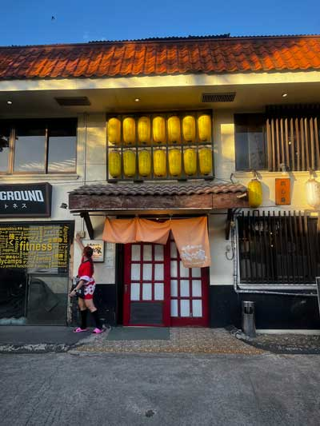
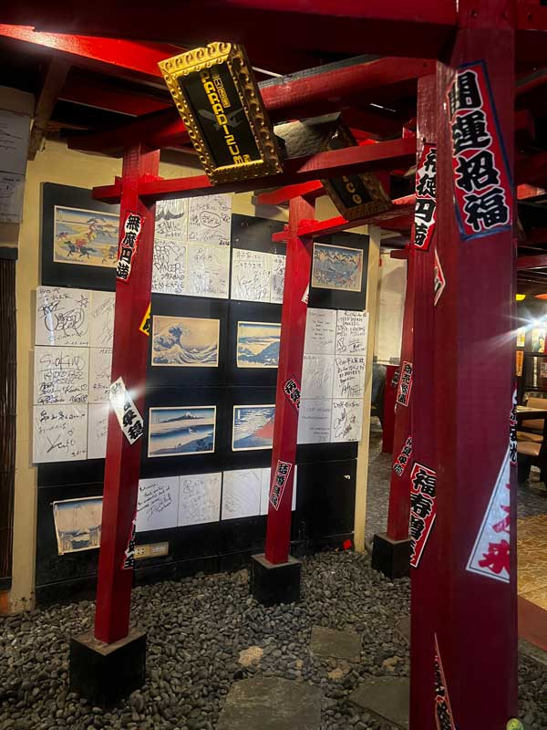
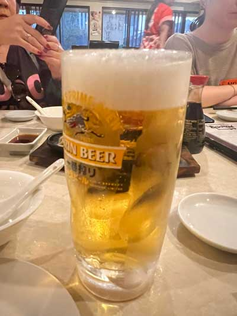
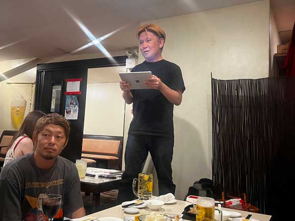
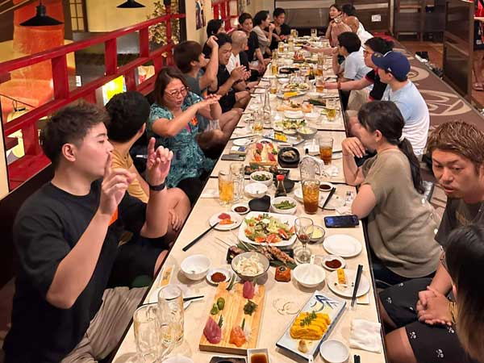
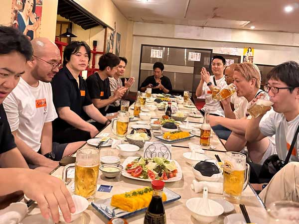
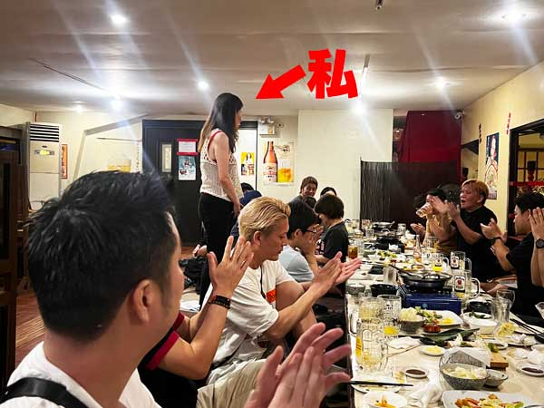
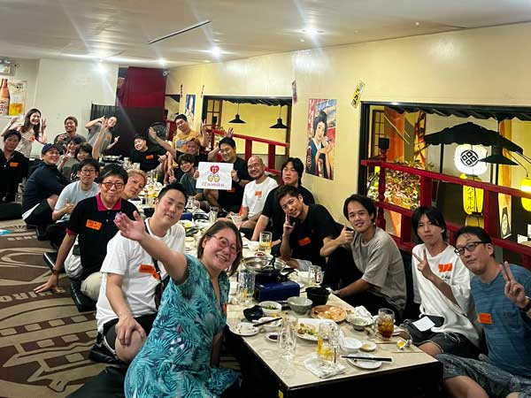

2024 年 4 月 13 日、セブ島で 11 年ぶりに IT 飲み会を開催いたしました。 
この度、セブ島だけでなく日本や、その他の国からも 24 名もの方にご参加いただきました。

[セブ島 IT 飲み会飲み会](https://itnomikai.com/event/cebu)

<prof></prof>

## 当日の様子

今回、セブ島 IT 飲み会 Spring の会場はビールだけではなく、ハイボールやレモンサワーも飲み放題ができるという理由で日本食の老舗レストラン・松乃家で行いました。

セブで飲めるジョッキの生ビールはめっちゃ価値がありますよ！！日本在住の方にはわからないかもですが笑

18:00 より挨拶（副代表・近藤さん）からスタートし、各自 1 分の持ち時間で自己紹介をしました。

歓談の様子です。みなさんあっという間に打ち解けました。お酒の力は偉大ですね笑 ラストオーダーの 19:30 以降もしばらく盛り上がりは続きました。

最後に、セブ島 IT 飲み会言い出しっぺの私の挨拶で締めさせていただきました。

## 開催概要

| 　                 | 詳細                                                                                                                                                               |
| ------------------ | ------------------------------------------------------------------------------------------------------------------------------------------------------------------ |
| 主催               | Lenz Technologies Inc. 神守 由理子 フリーランスエンジニア 近藤　祐志                                                                                            |
| 開催日時           | 2024 年 4 月 13 日(土)                                                                                                                                             |
| タイムスケジュール | 17:30 　受付 18:00 　乾杯の挨拶（運営・近藤） 18:05 　自己紹介（各自 1 分ほど名前・所属・PR などあれば） 18:40 　歓談 19:30 　締めの挨拶（運営・神守） |
| 料金               | 1,700 ペソ / コース飲み放題 ※申し込みなしでのご来場は 2,000 ペソ                                                                                                |
| 会場               | [Japanese Restaurant Matsunoya Cebu 和食ダイニング 松之家 セブ店](https://maps.app.goo.gl/FxDrZUw29jRPvy5K6)                                                       |
| その他             | ハッシュタグ #itnomikai_cebu                                                                                                                                       |

## セブ IT 飲み会とは？

[IT 飲み会](https://itnomikai.com/)

IT 飲み会は日本国内だけでなく世界各地で展開する「_売上を上げるための情報交換_」「_売上を上げるための人脈づくり_」「_そして飲み会中に売上を上げる_」などを目的とした飲み会です。

セブの IT 飲み会は、プラス、「**セブ在住のエンジニアみなさんの技術面や生活面の頼れる場所を作りたい！**」と願って開催に踏み切りました。

### 私がセブ IT 飲み会を始めた理由

- 日本からセブに来たばかりの若いエンジニアは心細い
- 技術面で相談できる人がいなくて困ってる人もいるかも知れない

たとえば、セブ島にそんな人がいるかもしれない。

同じ IT の仲間同士で、困った時に助け合える場所があったらいいなぁとはぼんやり思っていました。

実は、私自身 30 代半ばで子どもの病気をきっかけに IT 転職しました。右も左もわからなかった私でしたが、なぜかコミュニティの仲間がスキルを磨くサポートしてくれて、なんとか生き残ってこれました。

私の事を助けてくれた先人たちは私が足元も及ばない素晴らしい技術の持ち主で、到底恩返しはできそうにありません。 
せめて、 _恩送り_ したいと常日頃頭の片隅にはありました。

2024 年 1 月、私が日本に出張に行った際に、たまたま福岡 IT 飲み会主催のクライマーの池田さんとお会いしました。

「**IT 飲み会セブでもやったら？**」

日本だけでなく世界各国で IT 飲み会が開催されていることを知り、チャンス！！だと感じた私は、すべての IT 飲み会の取りまとめをしている大崎さんと繋いでいただき、セブでの IT 飲み会を復活させることができました。

## 告知・次回は 8 月 17 日（土）開催予定です！

多少トラブルはありましたが、参加者のみなさんのお陰でなんとか無事終了することができました。

次回は 8 月 17 日（土）開催予定です！また詳細が決まりましたら、告知させていただきます。

次回のセブ IT 飲み会でお会いしましょう！みなさんのご参加、お待ちしております！！

[セブ島 IT 飲み会飲み会](https://itnomikai.com/event/cebu)
