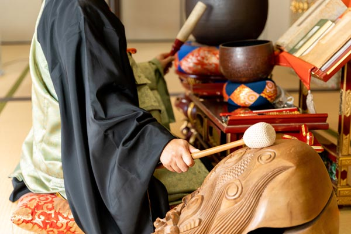

幼少期、和尚（おしょう）さんの説法に反論したことがあります。和尚さんには滅茶苦茶怒られましたが、和尚さんのロジックがどうしても納得がいかなくて自分が正しいと主張したかったんです。今考えても向こう見ずな子どもでした。

今日はそんな子供の頃の思い出話をつらつらと綴ってみつつ、「正しさの証明」について考察してみようと思います。

<prof></prof>

## 幼少期：家族でお寺を先祖供養のために訪れるお盆

子どもの頃、毎年お盆になるとお寺を訪れていました。 うちは決して信心深い方ではないのですが、なんとなく日本の慣習に従っていただけだと思いますが、通年行事になっていました。

子どもにとってのお寺なんて退屈なだけ。

長時間の正座で足が痺（しび）れるし、意味もわからないお教を黙って聞くのも苦痛。
唯一、そのあと出される甘いお菓子（お供え物のおさがり）とお茶が楽しみでした。

読経が終わったら、定番で和尚さんの説法（せっぽう）が始まります。

> 説法（せっぽう）とは、仏の教え（法）を説き伝えること。 説教、演説、法談、談義、勧化(かんけ)、唱導(しょうどう)などともいう。 釈迦(しゃか)は聞き手の能力に応じ、その場合に適した教え方で、理解できるように説法した。

その日の和尚さんの説法は賽（さい）の河原の石積をする子どもたちに関するお話でした。

## 和尚さんの説法：親よりも先に死ぬ罪
子どもの頃の思い出なので少し曖昧です。ある程度、ネットの力を借りて補完しています。

<msg txt="概ね記憶と間違いなさそうでホッとしました。"></msg>

賽の河原とは三途の川の手前にある河原です。仏教では親よりも先に死ぬことは親不孝。そのため子どもたちは賽の河原で石積という苦行をしなければならないとのこと。

仏教の世界では親より先に死ぬ=親を苦しめる、これは五逆罪（ごぎゃくざいの罪）にあたるそうです。

> 5種の最も重い罪。 一般には、父を殺すこと、母を殺すこと、阿羅漢 (あらかん) を殺すこと、僧の和合を破ること、仏身を傷つけることをいい、一つでも犯せば無間地獄 (むけんじごく) に落ちると説かれる。

子どもたちはいくら石を積んでも鬼たちに石を崩されてしまう。三途の川を渡りたくても、いつまでも河原で苦行を続けなければならない。

この説法を通じて和尚さんの伝えたかったことはこうでしょう。

「*親より長生きしなさい*」

和尚さんの説明で腑に落ちなかった私はつい反論してしまいました。

### 疑問：子どもだって泳いで渡ればいいんじゃないの？

<msg txt="賽（さい）の河原の子どもは川を泳いで渡ればいいんじゃないの？" img="common/camille-kid.jpg" name="かみーゆ（子共）"></msg>

<msg txt="子どもだから泳げないよ。" img="common/bozu.png" name="和尚さん" cls="right"></msg>

<msg txt="（最近の）子どもは泳げるよ。" img="common/camille-kid.jpg" name="かみーゆ（子供）"></msg>

反論した私の言い分はこうです。

<h4>そもそも子どもが泳げないって何で決めつけるんよ</h4>
単純に和尚さんの子どもに対する決めつけが不服でした。実際、泳ぎが得意な周りの子はたくさんいました。

私は1970年代以降で子どもが多かった時代に生まれました。高度成長期で周りも裕福な家庭が多く、周りの子どもたちも習い事に通ってました。特にピアノや水泳が人気で、スイミングスクールの送迎バスが町内を走っていました。

<h4>なんで何も悪いことをしていない子どもが理不尽な苦行しなければならないの？</h4>子どもだって好きで親より早く死にたいわけではない。たとえ仏の教えかもしれないけど、子どもが理不尽な罰を受けなくてもいいじゃないか。せめて、三途の川を泳いで逃げれることができればいいのに。

## 自分の正しさを証明しようとした結果、和尚さんを怒らせてしまった

食い下がる私に和尚さんはついに怒ってしまいました。

和尚さんはいつぞやの説法で「瞋怒（しんぬ）」は罪と、解いていました。
> 瞋怒（しんぬ）とは自分の心に反するものをはげしく怒り、恨むこと。 「シンニ」とも読む。

子どもの私は怒られたことを根に持ち、和尚さんのことを影で「瞋怒（しんぬ）和尚」と呼ぶようになりました。

<msg txt="子どもの屁理屈。無礼や目上を敬うとか、わかっていなかった幼少期だった。"></msg>

私もいい年なので和尚さんを擁護しておきますが、普段は私達子どもが広いお寺の中をダーっと走り回っても怒らない方です。

<msg txt="そもそも、なんでうちの親は和尚さんに反論する私を止めなかったのかwww"></msg>

## 正論はときに人を傷つける
あれから40年以上経過し、さすがに十分すぎるくらい大人になりました。 世の中には人それぞれの立場があって、どんなに *正しい* と思っていても、言っていいときと悪い時があると流石にわかってきました。

<msg txt="気づくのが遅いwww"></msg>

とはいえ、今でも子どもの頃の私の主張は正しくないとは思いません。もちろん、仏門を専門的に学んだ和尚さんの主張も正しいと、今では思います。

私は子どもの頃から信念が強すぎて、よく他人に正論をぶつけていました。セブに来てしばらくし、正論をぶつけることが本当に正しいのか？と疑問に思うようになりました。

Q. 正論をぶつける時、相手に何を求めているか？

大抵は、*相手に考えを改めて欲しかったり、正してほしいから* ではないでしょうか。

Q. 伝えたあとに相手が改心したことはあるか？

おそらく、ほとんどありません。

大体は逆効果に終わります。**正論は人は傷つける**から。

正しいのはわかっていてもできない人が大半。正論をぶつけられた時、能力的にできなくて劣等感を感じる人もいます。自分が否定された気持ちも生まれる人もいます。たまに逆ギレする人もいます。実際、私は和尚さんを怒らせてしまいました。

Q. それでも自分が正論をぶつける理由を考えたことがあるか？

自分の主張が正しいと証明したい。その先には、満足、勝利、優越感を得たくありませんか？正すことができない上、他人にネガティブ（たまに恨まれる）な感情を抱かせるくらいなら、**正論をぶつけないほうがよい**のではないでしょうか。

自分も他人も観察してみると、 
大抵は論破が目的になっていて、*自分の正しさを証明できれば快感なだけ* なんですよ。

「自分の主張が正しいと証明したい」と微塵（みじん）でも頭をよぎったなら、正論をぶつけるのは今すぐやめるべきです。

## 正論を他人にぶつけないためにできること
人と生きている以上、誰かの行動を正したくなります。だからこそ今では、正論をぶつけないためにできることを実践する努力をしています。

### そもそも、人を正そうとしない
過去と他人は変えられないもの。他人の人生を変えられるなんて、できないというかやろうとしている事自体がおこがましい。

### 100 人いれば 100 通りの正しさがある事を忘れてはいけない
100人いれば100通りの正しさがあります。「私の正しさ」「その人の正しさ」が違うだけ。無理に受け止める必要もありませんし、「あ、進む道が違うのね」くらい思って割り切ります。

### どうにも衝突するぐらいなら距離を置く
お互いの価値感や正しさが違いすぎて衝突するぐらいなら距離を置きます。多少は仕方ないですが、あまりにも揉めるぐらいなら、付き合わないほうがいいです。人間関係において、闘ってもいいことは何一つありません。 生きていれば、水と油くらい混じり合えない人とも遭遇します。

## まとめ：正論をぶつけなくなってからの方が自分の気持ちも楽になった
正論は人を傷つけると気づいたのは、ここ 2、3 年の話です。今でも昔のクセで正論をぶつけてしまうことがありますが、おそらく減ったと思います。

自分自身が心穏やかになり、おかげさまで快適です。

こんなことを思えるようになったのも、セブで出会った友だちたちのおかげだと感謝しています。また、経営者になったからこそ気づいたこともあります。

実は今年でこの銀ねこアトリエブログを始めて11年です。ブログは自分の頭を整理するのに良い手段です。

最近はYouTubeやったり、イベントしたりでブログ執筆も遠のいていましたが、良いので時間を見つけて書いてみようと思います。

この記事が皆さんの一助となれば幸いです。

最後までお読みいただきありがとうございました。
