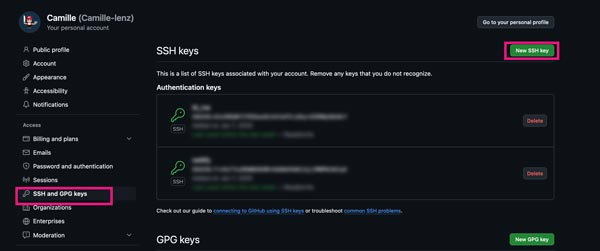
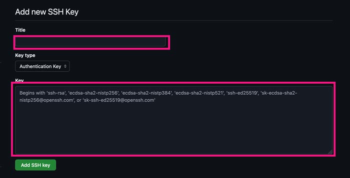
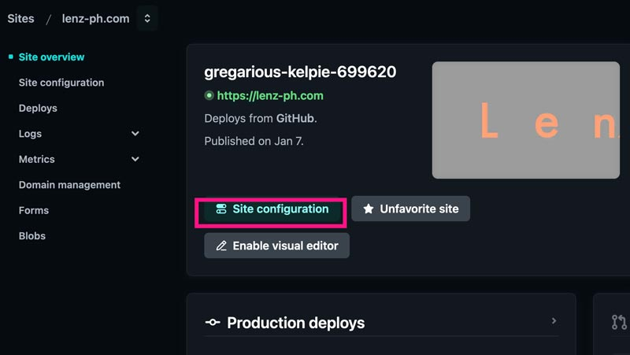
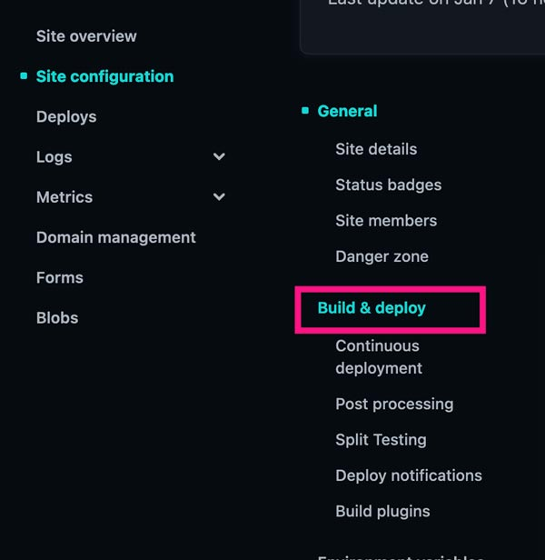
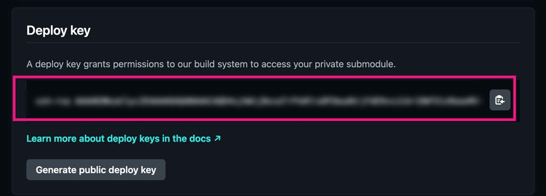
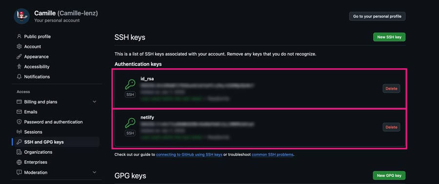

1年前に公開した自社サイトを更新しようとしたら、 Netlify にデプロイできなくなっていました。

SSHのキー認証でコケてただけだったのですが、時間が見事に溶けてしまいました。

解決法は単純。ローカルと Netlify 側のキーを Github に設定するだけでした。しかも原因はおそらく、ローカルのプロジェクトを整理している際に、うっかりSSHのキーを削除してしまったからです。

多分またやらかすので、メモ程度に記事で残しておきます。

<prof></prof>

mac前提でお話を進めます。

## こんな症状がある人は項目ごとに確認してみて
* Github の接続方法が SSH
* Github に Push できない
* Github に Push できるけど Netlify でビルドする前にコケる

長い間放置したり、サービスによってはSSHのキーが無効になり、上記と同様の作業が必要になることもあるみたいです。

また、Netlify の Free & Starter Plan では GitHub の organization の Private リポジトリがサポートされていないそうです。

> private repositories owned by an organization account (This feature is available on Core Pro and Enterprise plans, depending on Git provider.)<br>
> [Git repository support](https://docs.netlify.com/git/overview/#git-repository-support)

## ローカルの SSH ペアキーを作り直す

まずはローカルのペアキーを作成します。公開鍵、秘密鍵でペアになり、秘密鍵はローカル環境で保管し、公開鍵はリモート（サーバー）に保管します。

秘密鍵：id_rsa<br>
公開鍵：id_rsa.pub

### SSH ペアキーが一つだけの場合
.sshのディレクトリに移動。

```shell:title=コマンド
cd ~/.ssh/
```
macであればUsers/Users/[ユーザー名]直下にあると思います。

.ssh/ ディレクトリがfinderから目視できない場合は `Command + Shift + .` で表示させます。なれないうちは目視でも確認しながら、作成することをおすすめします。

ペアキーを作成します。普通は多分これだけでも良い。

```shell:title=コマンド
ssh-keygen -t rsa
```

github アカウントのメールアドレスを付与。
```shell:title=コマンド
ssh-keygen -t rsa -C xxx@xxxxx.com
```
2、3行目の質問はパラフレーズの設定（パスワード設定）が必要か゚聞かれていますが、とりあえず全部未入力リターンでオーケーです。

```shell
Generating public/private rsa key pair.
Enter file in which to save the key (/Users/(username)/.ssh/id_rsa):
Enter passphrase (empty for no passphrase):
Enter same passphrase again:
```

これで ~/.ssh ディレクトリに id_rsa と id_rsa.pub の2つの鍵が生成されていると思います。

Github にログインして [SSH and GPG keys](https://github.com/settings/keys) の SSH keysを設定します。*New SSH key* をクリック。



SSH キーのタイトルと設定して公開鍵（id_rsa.pub）の内容をコピーして貼り付けます。


普通にVSコードとかのテキストエディタでファイルを開いてコピーすればいいです。よく、コマンドでコピーしろという記事を見ますが、そのほうが間違いないです。

タイトルは SSH key for my blog とか *なんのキーかわかるように名前をつけておきます*。私はここで不明な名前をつけていたので困ったクチです。

接続テストします。
```shell:title=コマンド
ssh -T git@github.com
```
以下のようなレスポンスが帰ってきたらOKです。
```
Hi (account名)! You've successfully authenticated, but GitHub does not provide shell access.
```
### SSH ペアキーが複数管理する必要がある場合
もちろん、管理するサイトが複数有れば、管理するSSHのキーも複数あることがあります。SSH のキーは複数持っている場合は、キーの名前を他のものと差別化しましょう。

```shell
Generating public/private rsa key pair.
Enter file in which to save the key (/Users/(username)/.ssh/id_rsa): id_rsa_company
```

すると ~/.ssh ディレクトリに id_rsa_company と id_rsa_company.pub が作成されます。

公開鍵をGithubでコピペして登録するところまでは一緒です。

~/.ssh/ディレクトリにconfigファイルを作成します。すでにファイルがある場合は作成不要です。

```shell:title=コマンド
touch config
```

```md:title=config
Host companysite
  HostName github.com
  IdentityFile ~/.ssh/id_rsa_company #秘密鍵ファイルのパス
  User git
```
接続テストは以下です。
```shell:title=コマンド
ssh -T companysite
```
接続がうまく行ったら、そして実際にリポジトリがおいてあるディレクトリに移動。
```shell:title=コマンド
git remote set-url origin [Host名]:[ユーザID]/[リポジトリ].git
```
ここでは Host 名は ~/.ssh/config で設定した companysite にります。

普通にファイルを.git/configファイルを編集してもオーケーです。

```
[remote "origin"]
	url = git@[Host名]:[User]/[リポジトリ]
```
これで push できるようになっていたらOK。

## Netlify 側のキーを Github に追加する
Netlify 側のキーを設定していない場合、以下のようなメッセージが出て、Initializingの時点でコケます。

> Please make sure you have the correct access rights and the repository exists.

Netlify の対象のサイトに移動。Site configuration をクリック。 



Build & Deploy に移動。スクロールダウンしてDeploy Keyを探す。


Deploy Key をコピーします。


Githubに新たなSSHキーを作成し、貼り付けます。


キーが2つ登録されました。ブログにも残したし、今度は絶対忘れない！w


## さいごに
今回はローカルのファイルを整理しようとしてわちゃわちゃして間違えてキーを削除してやらかしました。

多分今までも、あーでもないこーでもないと作業していることは多く、記録が残ってないから同じことを繰り返すんだと反省しました。

今年はきちんとした文章じゃなくても、備忘録として、仕事のためにブログを残していこうと思います。

こんな走り書き程度のメモですが、お役に立てれば幸いです。

最後までお読みいただきありがとうございました。
