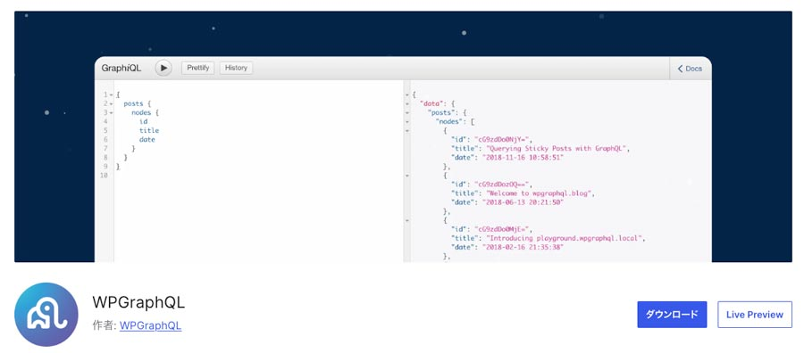
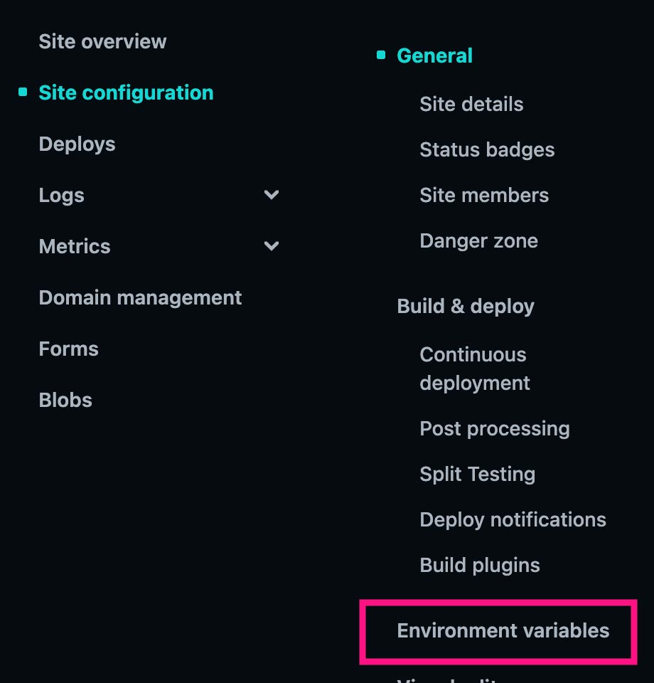

Next.jsで headless CMS を作る機会があったので概要をまとめました。シリーズに分けて紹介していきます。今回はとりあえず環境構築です。
Lint（自動でコードをきれいにしてくれるやつ）とかの設定はやりすぎるとPCのスペックによっては辛いしめんどくさいし、省きました。必要に応じて適宜やってください。

<prof></prof>
まずは Headless CMS とはなんぞや、から。

> Headless CMS は、コンテンツ管理（バックエンド）と表示部分（フロントエンド）が分離されたCMSです。バックエンドで管理されたデータはAPIを通じて提供され、ReactやVue.jsなどの好きな技術でフロントエンドを構築可能です。

*メリット*
* フロントエンドの自由度が高い
* マルチチャネル対応が容易（ウェブ、アプリなど）
* セキュリティやスケーラビリティが向上

*デメリット*
* APIや開発スキルが必要
* 従来型CMSより運用が複雑

*代表例*
* [Contentful](https://www.contentful.com/): 使いやすいUI
* [Strapi](https://strapi.io/): オープンソースで自由度が高い
* [Sanity](https://www.sanity.io/): リアルタイムコラボが可能

## フレームワークと制作方法
今回はとりあえず、SSG（Static Site Generator）で Headless CMS 作成していきます。

ちなみに、SSG以外にもこんなものを作成可能です。

* CSR: シングルページアプリケーション（SPA）向け
* SSR: リアルタイムデータが必要なサイトやSEO重視のページ向け
* SSG: コンテンツが固定で頻繁に更新されないサイト向け
* ISR: 頻繁に更新されるがリアルタイム性は不要なサイト向け

項目|CSR|SSR|SSG|ISR
|-|-|-|-|-|
レンダリング時期|ユーザーのブラウザ|サーバーでリクエスト時|ビルド時|ビルド時 + ユーザーアクセス後
速度|遅い（初回表示後は速い）|初回表示がやや遅い|非常に速い|非常に速い（キャッシュ更新が可能）
データ更新|即時|即時|ビルド時のみ|指定時間ごとに再生成
主な用途|インタラクティブなアプリ|SEOが必要な動的ページ|更新頻度の低いサイト（ブログやポートフォリオ）|更新頻度の中程度のコンテンツ（商品リストなど）
SEO対策|弱い|強い|強い|強い


SSGは一昔前であればMovable Typeがそれに当たるんじゃないかと思いますが、今は情報を追っていないのでちょっとわからないでです。

### Next.js とは？
Next.jsは、高速かつ柔軟なモダンウェブアプリケーションを構築したい開発者に最適です。

Next.jsは、Reactをベースにしたフレームワークで、サーバーサイドレンダリング（SSR） や 静的サイト生成（SSG） を簡単に実現できます。高速なウェブサイトやアプリケーションを開発するための機能が豊富に揃っています。

* ハイブリッド対応: SSGとSSRをページごとに選択可能
* 高速レンダリング: パフォーマンスに優れたページ生成
* 使いやすさ: ファイルベースのルーティングやAPIルートが標準搭載
* SEOに強い: サーバーサイドでのHTML生成が可能

## Docker で WordPress 環境作成

まずはローカルに、WordPress 環境を作ります。普通にすでに WordPress で記事が溜まっている人は不要かも。<br>
ここはあまり触らないので、普通にLocalなどのアプリを使って作るのもありだと思います。必要ない人はすっ飛ばしてください。

以下のようなファイルをプロジェクトディレクトリ（自分のプロジェクトを置きたい場所のディレクトリ）直下に置きます。
> YAML（ワイエムエーワイエル）ファイルは、構造化データを文字列として表現したデータ形式で、設定ファイルやデータの保存、転送などに使用されます。拡張子は「.yml」「.yaml」です。

```yaml:title=compose.yml
version: "3.7"

services:
  db:
    image: mysql:8.0
    volumes:
      - ./db_data/:/var/lib/mysql
    restart: always
    ports:
      - "3306"
    environment:
      MYSQL_ROOT_PASSWORD: pass
      MYSQL_DATABASE: wordpress
      MYSQL_USER: user
      MYSQL_PASSWORD: pass

  wordpress:
    depends_on:
      - db
    image: wordpress:latest
    ports:
      - "8000:80"
    restart: always
    volumes:
      - ./public/:/var/www/html/
    environment:
      WORDPRESS_DB_HOST: db:3306
      WORDPRESS_DB_USER: user
      WORDPRESS_DB_PASSWORD: pass
```
DockerのWordPress環境をインストールします。
```shell:title=コマンド
docker-compose up -D
```
インストールが終わったら http://localhost:8000 にアクセスします。アクセスできたらインストールを進めます。<br>データベース情報以外は適当で問題ありません。

* サイト名：任意
* ユーザー名：任意
* パスワード：任意
* 管理者メールアドレス：任意
* データベース名: wordpress
* データベースユーザー名: users
* データベースパスワード: pass

### サイトをindexされないようにしておく
Headless CMS にした WordPress はもう記事を公開する場所ではなくなるので *重複コンテンツ* を避けるために noindex にし、検索エンジンからクロールされないようにしておきます。
> 重複コンテンツとは、同じ内容が複数のURLで公開されている状態を指します。これにより、検索エンジンがどのページを優先すべきか判断できず、SEO評価が分散する可能性があります。


### GraphQL プラグイン
データの取得のために、GraphQLを導入します。
[WPGraphQL](https://ja.wordpress.org/plugins/wp-graphql/)



### せっかくなので画像の保存場所を変更する
このままだと画像パスが WordPress のフォルダ構成丸出しなので、フォルダ構成を変更したいところですよね？

アップロードファイルのパス名を変える方法はいくつかありますが、今回はWordPress `wp-config.php` からパスを変更します。

```php:title=wp-config.php
define( 'UPLOADS', 'images' );
```
## Next.js インストール
早速、Next.jsをインストールしましょう。
```shell:title=コマンド
npx create-next-app@latest
# または
yarn create next-app
```
コマンド実行後は対話式でインストール作業が進めます。

今回は以下のとおり進めました。慣れてのもありSASSを使いたかったので、`Tailwind` も使わないことにしました。

```shell
✔ What is your project named? … [PROJECT NAME] ⇒ 任意の名前
✔ Would you like to use TypeScript? … No / Yes ⇒ No
✔ Would you like to use ESLint? … No / Yes ⇒ No
✔ Would you like to use Tailwind CSS? … No / Yes ⇒ No
✔ Would you like to use `src/` directory? … No / Yes ⇒ Yes
✔ Would you like to use App Router? (recommended) … No / Yes ⇒ Yes
✔ Would you like to customize the default import alias (@/*)? … No / Yes ⇒ No
```
上記で`Would you like to use App Router? (recommended)`で`yes`としているのですが、以前 Pages Router で作成した事があるので簡単にその違いをまとめておきます。


項目|App Router|Pages Router
-|-|-
導入バージョン|Next.js 13 以降|Next.js 12 以前から
フォルダ構造|app/ フォルダ|pages/ フォルダ
レンダリング方式|デフォルトで React Server Components を使用|クライアント側で動作する React Components
データ取得|fetch() で直接データ取得可能|getStaticProps や getServerSideProps を使用
ルーティング|ファイルベース + レイアウト共有（layout.jsが利用可能）|ファイルベースのみ
柔軟性|SSR、SSG、ISRがさらに効率的に統合|従来のSSR、SSG、ISR
推奨される用途|新規プロジェクト、最新のアプローチ|既存プロジェクトやレガシーサポート

```shell:title=コマンド
npm run dev
```
インストール後、このコマンドで Next.js の画面が見れたらOKです。

## 環境準備
環境準備です。SASSとローカルと本番環境で諸々の設定をします。

### 環境変数用のファイル追加

* .env.development
* .env.production

#### リモートの設定・デプロイをNetlifyでの管理する場合
.env*は.gitignoreに設定されているので、デプロイされても反映しません。

Netlifyでは、環境変数をサイト側から設定できます。



### SSG出力用の設定

インストールした Next.js プロジェクトの直下 `next.config.mjs` を編集します。

```js:title=next.config.mjs
const nextConfig = {
  "output": 'export',
};
```

ビルドできるかテストしてみます。outフォルダが作成されていたら成功です。

```js:title=コマンド
npm run build
```

### SASS をインストール
SASSをインストールします。

```shell:title=コマンド
npm install --save-dev
```
`src/`に`styles`ディレクトリを作成してSASSの変数を格納する`_variables.scss`ファイルを作成します。

`next.config.mjs` ですべてのSASSファイルからこのファイルの関数を参照できるように設定します。

```js:title=next.config.mjs
/**
 * Sass の変数設定
 */
import path from "path";
import { fileURLToPath } from "url";

const __dirname = path.dirname(fileURLToPath(import.meta.url));

const nextConfig = {
  sassOptions: {
    prependData: `@import "${path.resolve(__dirname, "src/styles/_variables.scss")}";`,
  },
  "output": 'export',
};
```

## 最後に
今回は Next.js × WordPress で Headless CMS をつくるための環境構築までをまとめました。

まだまだ加筆の余地はあると思うので、気がついたことがあれば更新していきたいと思います。

この記事が皆さんのコーディングライフの一助となれば幸いです。

最後までお読みいただきありがとうございました。
