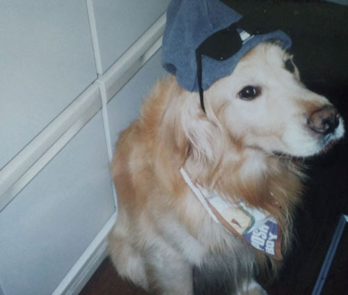

この記事は、「[老い、病気。何度も犬を介護し、看取って感じたこと](/choco-blog/dog-funneral/)」の続編です。

私の家族は比較的大きな犬を自宅で介護し、看取ってきました。

前回は「[脳の癌で死んだゴールデンレトリバー](/choco-blog/dog-funneral#たった5歳脳の癌で死んだゴールデンレトリバー)」と「[高齢で足腰が立たなくなったダルメシアン](/choco-blog/dog-funneral#高齢で足腰が立たなくなったダルメシアン)」の介護体験について綴りました。

この記事では、具体的に大型犬の介護で役に立ったアイテムや介護方法などを紹介していきます。

この記事でわかること
  <ul>
    <li>ペットを自宅で看取るために必要な条件</li>
    <li>介護に必要なものはカンタンに手に入る</li>
    <li>具体的な床ずれ対策</li>
    <li>寝たきりの犬排泄介護について（老犬・病気）</li>
    <li>寝たきりの犬の体臭対策</li>
  </ul>

## ペットを自宅で看取るのは、手助けなしでは難しい
この記事は、自宅で看取ることを前提として話を進めます。

断言しますが、ペットの介護は一人では厳しいです。特に大型犬になると肉体的な負担が大きいです。

私は運良く6人家族だったのでみんなで協力しあい、大型犬を介護し看取ることができました。

それでも基本的には専業主婦だった母に大きな負担がかかりました。

ペットの介護も手助けなしだと厳しいものです。特に大型犬になると、排泄の処理や床ずれ予防など、定期的にやらないといけないことがたくさんあります。

できるだけ自宅で看取りたいのは分かります。しかし自宅で看取りたい方は覚悟してください。

日中家にいることができない方はペットシッターさんにお願いしたり、無理せず老犬・老猫ホームに預けることをおすすめします。

## 介護に準備しておくと便利なもの
介護が必要になったら、最低限の準備が必要です。

すべてホームセンターやアマゾンで手軽に手に入ります。

* おむつ
* おしっこマット
* おしりナップ（人間用でOK）
* クッション
* 柔らかいベッド
* ブランケット

まとまった量をストックしておくと安心です。なので、アマゾンで頼むのが一番手っ取り早いです。

### 寝たきりの犬の床ずれ対策
大型犬の介護は大変です。とくに寝たきりになった場合は床ずれを起こします。

絶対に床などに寝かしっぱなしにしないで、柔らかいベッドを用意してあげてください。

ペット用の床ずれ防止クッションなどもありますが、我が家は座椅子を代用していました。

大型犬のが寝たきりになったベッドは自重ですぐクッションのふかふか感がなくなってしまいます。

しかも、おしっこが漏れて汚してしまうこともあります。

頻繁に買い換える必要があります。消耗品と割り切り、5000円位を上限にできるだけふかふかしたものを用意することをおすすめします。

ベッドやクッションを用意してあげるだけでは床ずれは防止できません。

定期的にマッサージしたり向きも変えてあげます。スキンシップも兼ねてやってあげると喜びます。

ブランケットも床ずれ対策に役立ちます。すぐ臭くなるので複数用意しておくといいです。

老犬は体温調節機能が下がるので、冬場は寒さ対策にもなります。

### 犬の排泄を介助する
犬の排泄介助必需品といえば、犬用おむつです。

大型犬でいちばん大変なのは排泄の介助です。

<a href="https://hb.afl.rakuten.co.jp/hgc/g000001d.j0byi5ae.g000001d.j0byj7d4/kaereba_main_202303292002342985?pc=https%3A%2F%2Fproduct.rakuten.co.jp%2Fproduct%2F-%2F074c85887dea424e4149ac6ad8d0b2bc%2F&m=http%3A%2F%2Fm.product.rakuten.co.jp%2Fproduct%2F074c85887dea424e4149ac6ad8d0b2bc%2F" target="_blank" >ドギーマン ペットの紙オムツ LLサイズ(10枚入)</a>
posted with <a href="https://kaereba.com" rel="nofollow" target="_blank">カエレバ</a>

<a href="https://hb.afl.rakuten.co.jp/hgc/g000001d.j0byi5ae.g000001d.j0byj7d4/kaereba_main_202303292002342985?pc=https%3A%2F%2Fproduct.rakuten.co.jp%2Fproduct%2F-%2F074c85887dea424e4149ac6ad8d0b2bc%2F&m=http%3A%2F%2Fm.product.rakuten.co.jp%2Fproduct%2F074c85887dea424e4149ac6ad8d0b2bc%2F" target="_blank" >楽天市場で探す</a>

<a href="https://www.amazon.co.jp/gp/search?keywords=%E3%83%89%E3%82%AE%E3%83%BC%E3%83%9E%E3%83%B3%20%E3%83%9A%E3%83%83%E3%83%88%E3%81%AE%E7%B4%99%E3%82%AA%E3%83%A0%E3%83%84&__mk_ja_JP=%E3%82%AB%E3%82%BF%E3%82%AB%E3%83%8A&tag=camille603-22" target="_blank" >Amazonで探す</a>

おもらし対策のおむつは必須ですが、それ以外にも役立ったグッズを紹介します。

#### 寝たきりになった犬のトイレ介護

寝たきりの犬のトイレ介護におしっこシートが大活躍します。

<a href="https://hb.afl.rakuten.co.jp/hgc/g000001d.j0byi5ae.g000001d.j0byj7d4/kaereba_main_202303292006467606?pc=https%3A%2F%2Fproduct.rakuten.co.jp%2Fproduct%2F-%2F1761aec79214edfc4c22d3ba161adb26%2F&m=http%3A%2F%2Fm.product.rakuten.co.jp%2Fproduct%2F1761aec79214edfc4c22d3ba161adb26%2F" target="_blank" >ケース販売 デオシート しっかり超吸収 無香消臭タイプ ワイド(54枚入*4袋セット)</a>
posted with <a href="https://kaereba.com" rel="nofollow" target="_blank">カエレバ</a>

<a href="https://hb.afl.rakuten.co.jp/hgc/g000001d.j0byi5ae.g000001d.j0byj7d4/kaereba_main_202303292006467606?pc=https%3A%2F%2Fproduct.rakuten.co.jp%2Fproduct%2F-%2F1761aec79214edfc4c22d3ba161adb26%2F&m=http%3A%2F%2Fm.product.rakuten.co.jp%2Fproduct%2F1761aec79214edfc4c22d3ba161adb26%2F" target="_blank" >楽天市場で探す</a>

<a href="https://www.amazon.co.jp/gp/search?keywords=%E3%81%8A%E3%81%97%E3%81%A3%E3%81%93%E3%82%B7%E3%83%BC%E3%83%88&__mk_ja_JP=%E3%82%AB%E3%82%BF%E3%82%AB%E3%83%8A&tag=camille603-22" target="_blank" >Amazonで探す</a>

ペット用おむつはあまり役に立たないこともあります。特に大型犬だとずれたり外れてしまうことがあるからです。

しかし、おしっこシートも完璧ではありません。

中〜大型犬は床ずれ防止で向きを変えたりしていると位置がずれてしまうことがあります。

おむつが外れたりやおしっこシートがずれていることに気づかず、ベッドの中がおしっこだらけになってしまうことも。しかも大型犬はおしっこの量も多く、シートで吸収しきれないこともあります。

中〜大型犬のおもらし対策には *防水シーツ* が役立ちます。ペット用もありますが少し高いので、人間用のおねしょシーツで代用することもできます。

#### てんかんなどの発作でおもらしする場合の対処法

[脳の腫瘍で亡くなったボブ](/choco-blog/dog-funneral#たった5歳脳の癌で死んだゴールデンレトリバー)は発作のたびにおしっこを漏らしていました。

ただ発作を起こしている時以外は元気だったので、おむつを付けませんでした。つけてもすぐに脱いでしまうからです。

仕方ないのでおもらしのたびに床を水で拭いたあと、乾拭きしました。臭くなるので拭いた後ペットのおしっこ用消臭スプレーを使います。

<a href="https://hb.afl.rakuten.co.jp/hgc/g000001d.j0byi5ae.g000001d.j0byj7d4/kaereba_main_202303291958168935?pc=https%3A%2F%2Fproduct.rakuten.co.jp%2Fproduct%2F-%2F966e01d645126e2e66224b04b2460a63%2F&m=http%3A%2F%2Fm.product.rakuten.co.jp%2Fproduct%2F966e01d645126e2e66224b04b2460a63%2F" target="_blank" >ペティオ ハッピークリーン 犬オシッコ ウンチのニオイ 消臭＆除菌(800mL)</a>
posted with <a href="https://kaereba.com" rel="nofollow" target="_blank">カエレバ</a>

<a href="https://hb.afl.rakuten.co.jp/hgc/g000001d.j0byi5ae.g000001d.j0byj7d4/kaereba_main_202303291958168935?pc=https%3A%2F%2Fproduct.rakuten.co.jp%2Fproduct%2F-%2F966e01d645126e2e66224b04b2460a63%2F&m=http%3A%2F%2Fm.product.rakuten.co.jp%2Fproduct%2F966e01d645126e2e66224b04b2460a63%2F" target="_blank" >楽天市場で探す</a>

<a href="https://www.amazon.co.jp/gp/search?keywords=%E3%83%9A%E3%83%86%E3%82%A3%E3%82%AA%20%28Petio%29%20%E3%83%8F%E3%83%83%E3%83%94%E3%83%BC%E3%82%AF%E3%83%AA%E3%83%BC%E3%83%B3%20%E7%8A%AC%E3%82%AA%E3%82%B7%E3%83%83%E3%82%B3%E3%83%BB%E3%82%A6%E3%83%B3%E3%83%81%E3%81%AE%E3%83%8B%E3%82%AA%E3%82%A4%20%E6%B6%88%E8%87%AD&__mk_ja_JP=%E3%82%AB%E3%82%BF%E3%82%AB%E3%83%8A&tag=camille603-22" target="_blank" >Amazonで探す</a>

発作は多いときは一日に2回以上あり、とても大変でした。

掃除がしやすい場所に移してゲージに入れてしまえばいいのでは？と思いますよね？

ボブが動けるうちはできるだけ自由にしてやりたかったという、家族みんなの気持ちもあったのでしませんでした。

### 老犬の食事
高齢の犬には、我が家ではドックフードをお湯でふやかして与えました。

エサ箱から食べるのが難しい場合は、手で与えると食べてくれることがあります。

それでも食べない場合は、老犬専用の介護食に切り替えるか、高カロリーなものを与えるのが一般的です。

<a href="https://hb.afl.rakuten.co.jp/hgc/g000001d.j0byi5ae.g000001d.j0byj7d4/kaereba_main_202303292015195277?pc=https%3A%2F%2Fproduct.rakuten.co.jp%2Fproduct%2F-%2Fe239298f9114330ce98e1ca34d9761be%2F&m=http%3A%2F%2Fm.product.rakuten.co.jp%2Fproduct%2Fe239298f9114330ce98e1ca34d9761be%2F" target="_blank" >デビフ 愛犬の介護食 ささみ＆すりおろし野菜(85g)</a>
posted with <a href="https://kaereba.com" rel="nofollow" target="_blank">カエレバ</a>

<a href="https://hb.afl.rakuten.co.jp/hgc/g000001d.j0byi5ae.g000001d.j0byj7d4/kaereba_main_202303292015195277?pc=https%3A%2F%2Fproduct.rakuten.co.jp%2Fproduct%2F-%2Fe239298f9114330ce98e1ca34d9761be%2F&m=http%3A%2F%2Fm.product.rakuten.co.jp%2Fproduct%2Fe239298f9114330ce98e1ca34d9761be%2F" target="_blank" >楽天市場で探す</a>

<a href="https://www.amazon.co.jp/gp/search?keywords=%E7%8A%AC%E3%80%80%E4%BB%8B%E8%AD%B7%E9%A3%9F&__mk_ja_JP=%E3%82%AB%E3%82%BF%E3%82%AB%E3%83%8A&tag=camille603-22" target="_blank" >Amazonで探す</a>

食事は命に関わることなので、素人判断せず獣医さんに相談しましょう。

### 老犬の飲水
歩けなくなったらスポイドで水を与えます。水も手で少しずつ与えると飲んでくれることがあります。

### 寝たきりの犬の体臭対策
寝たきりの犬は匂いも臭くなります。

我が家では体臭対策に水のいらない犬用のシャンプーを使っていましたが、あまり効果を感じられませんでした。

おすすめは **ホットタオルで拭いてあげること** です。タオルを水で濡らして固く絞り、レンジで30秒くらいチンします。熱さを確かめて、全身を拭いてあげます。きれいになるだけではく、血行も良くなります。

また老犬は新陳代謝も落ちるので、口や耳、目の周りも汚れて臭くなります。

耳や目周りの専用の洗浄グッズもありますが、うちでは人間の赤ちゃん用のおしりナップを重宝しました。低刺激で安心して使えます。

<a href="https://hb.afl.rakuten.co.jp/hgc/g000001d.j0byi5ae.g000001d.j0byj7d4/kaereba_main_202303292016002684?pc=https%3A%2F%2Fproduct.rakuten.co.jp%2Fproduct%2F-%2Ff6d2be8aaaa255e08b480bef1e4ea4e0%2F&m=http%3A%2F%2Fm.product.rakuten.co.jp%2Fproduct%2Ff6d2be8aaaa255e08b480bef1e4ea4e0%2F" target="_blank" >ピジョン おしりナップ やわらか厚手仕上げ 詰めかえ用(80枚*6コ入)</a>
posted with <a href="https://kaereba.com" rel="nofollow" target="_blank">カエレバ</a>

<a href="https://hb.afl.rakuten.co.jp/hgc/g000001d.j0byi5ae.g000001d.j0byj7d4/kaereba_main_202303292016002684?pc=https%3A%2F%2Fproduct.rakuten.co.jp%2Fproduct%2F-%2Ff6d2be8aaaa255e08b480bef1e4ea4e0%2F&m=http%3A%2F%2Fm.product.rakuten.co.jp%2Fproduct%2Ff6d2be8aaaa255e08b480bef1e4ea4e0%2F" target="_blank" >楽天市場で探す</a>

<a href="https://www.amazon.co.jp/gp/search?keywords=%E3%81%8A%E3%81%97%E3%82%8A%E3%83%8A%E3%83%83%E3%83%97&__mk_ja_JP=%E3%82%AB%E3%82%BF%E3%82%AB%E3%83%8A&tag=camille603-22" target="_blank" >Amazonで探す</a>

また、頻繁におしっこを漏らしたり、おむつの中で排泄するのでどうしても体は臭くなりました。

たまに匂いにたまりかねて洗っていましたが、これが骨の折れる作業でした。

犬を洗うのと乾かすのはセットです。

特に老犬は体温調節が苦手なので濡れたままにしておくことはNGです。

母はたまに一人で洗ってましたが、かなり大変だったと思います。

## 最後の日を一緒に過ごすために

大型〜中型犬の介護についておわかりいただけたと思います。

特に肉体的に大変でした。が、命の尊さ、生き物の老いなど学ぶことが多かったです。

そして一緒に過ごした時間は宝物でした。

旅立つ間際まで一緒にいてくれて心から感謝しています。

私の体験記があなたの愛犬の介護に役に立つことを願っています。最後までお読みいただきありがとうございました。

