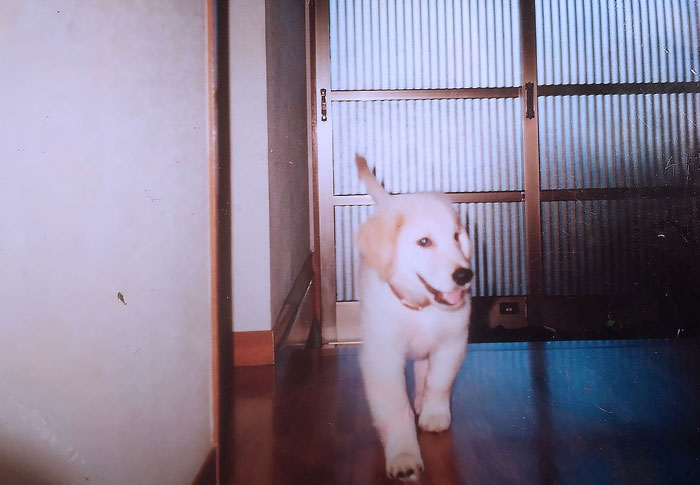
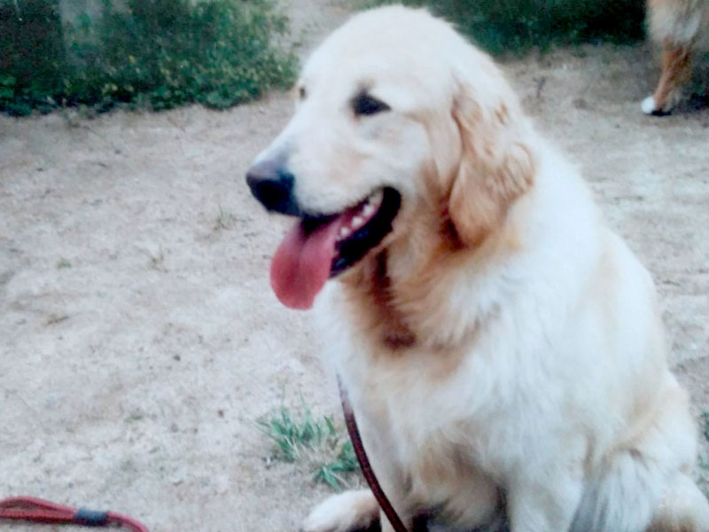
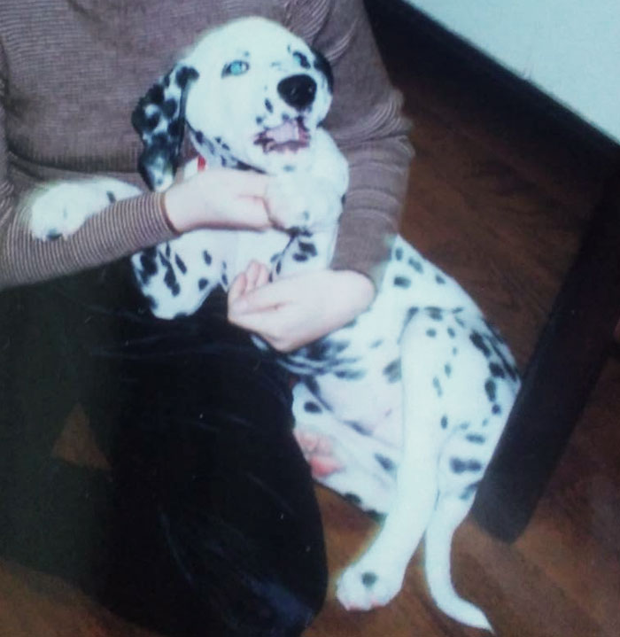
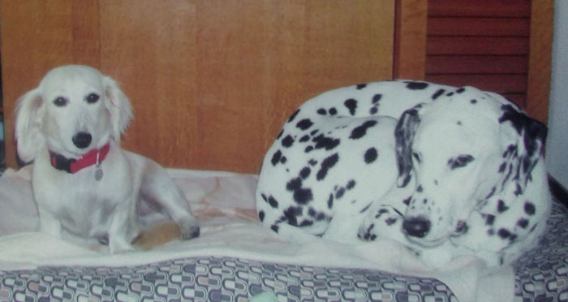

私の家にはセントバーナード、ゴールデンレトリバー、ダルメシアン、ミニチュアダックスフンドといつも家族の一員として犬がいました。

昔は兄弟の誰かが子犬欲しい！と言い出して飼い始めるという、よくある家庭でした。

当たり前ですが、ペットも老いていきますし病気もします。

この記事では私たち家族がペットの老いや病気にどう向き合ってきたかを綴ります。

先に言っておきますが、私は専門家ではありません。犬の介護し、看取ってきた、あなたと同じ立場の人間です。

そしてこの記事を読んでいるあなたは、現在ペットの介護で悩んでいる方だと思います。

私の体験があなたの助けになれば幸いです。

この記事でわかること
  <ul>
    <li>先天性の病気で発作を起こす大型犬を看取った話</li>
    <li>老衰で寝たきりになった中型犬を看取った話</li>
    <li>ペットロスにならないために。飼うときの心構え</li>
  </ul>

具体的なケア方法は「[老い、病気。何度も犬を介護し、看取るためにやったこと](/choco-blog/dog-funneral-preparetion/)」にまとめました。

## ペットは可愛いだけじゃない。病気や老衰で看取るということ

特に記憶に残った2匹のお話をします。

### たった5歳。脳の癌で死んだゴールデンレトリバー
私が中学ぐらいだったと思います。オスのゴールデンレトリバーが我が家にやってきました。

兄弟の誰かが飼いたいと言い始めのがきっかけだったと思います。

まだ当時はバブルで、今では考えられませんけどペットは **ペットショップで血統証付きで購入する** というのがステータスでした。

我が家も血統証付きのゴールデンレトリバーを購入し、ボブと名付けました。

賢くて人懐こく、家族みんなに愛いされていました。

#### 脳腫瘍ができ水頭症を発症

成犬してしばらくして、先天性の脳の障害があることが分かりました。

ボブはさらに脳に腫瘍ができたせいで、「水頭症」を併発しました。

水頭症のせいで何度も何度もてんかん発作を起こしました。

#### 「てんかん」で暴れるボブ
具体的な発作の症状です。気を失って倒れたかと思うと、白目をむいて手足をジタバタさせて暴れます。これが30秒くらい続きます。

発作中は泡を吹き、収まると失禁しました。

ゴールデンレトリバーは大きな犬種です。しかも室内で飼っていたので、発作を起こすたびに廊下の床が傷つき、壁に穴が空きました。家族で発作に居合わせた人が暴れるのを抑えました。ボブは30キロ以上あったので抑えるのが大変でした。

正気に戻ったボブいつも、「くーん、くーん」としばらく不安そうに泣いていました。

動物病院にも頻繁に連れていきました。母親一人で通院するのは大変です。しかもいつ発作が起こるか分からない。なので動物病院へよく一緒について行きました。

治療は続けるも、ボブの病気は一向に良くなりませんでした。当時の医療では無理だったのかもしれません。

ボブの医療費は相当かかりました。母親いわく *車が一台買えるほど* だったそうです。

#### わずか5歳で天国に旅立ったボブ

ボブを家族に迎え入れて5年。たしか土曜か日曜日の朝でした。目覚めるとボブは冷たくなっていました。

闘病生活も虚しく、たった5年で天国へ旅立ってしまいました。

### 高齢で足腰が立たなくなったダルメシアン
しばらくして、私達は新しいダルメシアンの子犬を迎え入れました。

ボブの介護は大変だったけど、新しい犬を飼いと兄弟たちが言い始めたからです。

父は犬を飼うことを反対していましたが、なんとか説得して飼うことになりました。

12月生まれらしいのでノエル（フランス語でクリスマス）と名付けました。

#### 気性の荒い若い犬

ダルメシアンは見た目こそ愛らしいですが、一般的に気性が荒いと言われています。

ノエルも例外ではなくよく家族に噛みつきました。力も強い犬でした。

私も政権になったノエルの散歩中に引きづられ、怪我をしたことがあります。

犬も当然性格が違います。ノエルは内向的で攻撃的。ボブに比べて扱いにくい子でした。

#### 高齢になった大〜中型サイズの老犬は足腰がやられる
気性の荒かったノエルですが年齢を重ねるに連れ、少しづつ性格も丸くなってきました。

ノエルはよく転ぶようになりました。

転ぶ回数が増えれば増えるほど、後ろ足がだんだん立たなくなりました。

ちょっと水が飲みたい、飼い主になでてもらいたいから近か寄りたい。そんなカンタンなことができなくなりました。

最初は後ろ足を引きずって何とか移動していましたが、次第に自力で歩けなくなりました。

#### おむつで意地でもおしっこしないノエル
ノエルは排泄は散歩中にするようにしつけてました。

ノエルは室内飼いだったので、長時間外出する時はおしっこマットを用意していました。しかし、誰かが帰ってきて散歩に連れて行ってもらうまで我慢するような犬でした。

自分のポリシーを貫く頑固な犬でした。

そんな頑固な犬が高齢化したらどうなるのでしょうか。

当然おむつを履かせてもおしっこを我慢します。膀胱炎になるのがとても心配でした。

しかたないのでおしっこさせるために、ノエルを抱きかかえて外に連れ出しました。

ダルメシアンの成犬は20キロ近くあります。この介護で母親はノエルの介護で肘を痛めました。

犬用車椅子があるのでは？と思われるかもしれませんが、我が家は段差だらけだったので使えませんでした。

さすがに最終的には動けなくなり寝たきりで排泄することもありましたが、数は少なかったです。

我が家での具体的な「[寝たきりになった犬のおもらし対策](/choco-blog/dog-funneral-preparetion/#寝たきりになった犬のトイレ介護)」について詳しく紹介しています。

#### 寝たきりになり床ずれを起こすノエル
足腰が立たず、寝ている時間が増え、筋力が弱り、更に足腰が立たない。

そんな悪循環を繰り返し、ノエルはついにほぼ寝たきりになりました。

クッションのあるベッドで寝てはいましたがノエルは中-大型犬です。寝たきりになると、自重で床ずれを起こします。

定期的にマッサージしたり、向きを変えたりしてあげなければなりませんでした。

「[寝たきり中-大型犬の床ずれ対策](/choco-blog/dog-funneral-preparetion/#寝たきりの犬の床ずれ対策)」についての解説もあります。

#### 老衰で死を迎える犬
ノエルは死期が近くなると水、食事の量が極端に減りました。

そして今まで嗅いだことのないひどい匂いがするようになりました。

ある日のことです。いつもおとなしくしているノエルが、なにかに向かって吠えていました。

息も荒くなり、意識が朦朧としていますがたまに何かにとりつかれたように吠えました。

そんな状態を数回繰り返し、家族に見守られて静かに息を引き取りました。

## ペットロスにならないために。飼うときの心構え

ペットの死因は老衰が44%です。病気、事故、色んな理由はありますが *必ず死にます*。

大抵の人は **ペットが死ぬことを想定して飼うことはありません**。

私たち兄弟も子供の頃はただ「可愛い」という理由で、親にねだって子犬を飼い始めました。

家族として迎え入れた瞬間、いずれ来る死を覚悟しておかないと「**ペットロス症候群**」になることがあります。

### ペットがどんな死を迎えるか分からない

ボブが死んだ頃の私はまだ10代でした。当然、ボブの死が受け入れられませんでした。

老衰ならまだしも、**納得できない死** だったからです。

* まさか難病とは思わなかった
* まさか車に引かれるとは思わなかった

ペットの **納得できない死** ってたくさんあると思います。

学校も休みました。ショックが大きすぎてなかなか立ち直れませんでした。

どうあがいてもボブの命を取り戻すことはできないのは分かっています。でも心で納得できないという状態が長く続きました。

時間とは不思議です。

悲しみは時間とともに薄らいでいきました。

今ペットロス症候群で悩んでいる方も多いと思いますが、大抵は時間が解決してくれます。

### ペットの生涯を通じて生き物が老いることを学ぶ
もちろんノエルが死んだときも悲しかったです。が、それ以上に感謝の気持ちが強かったです。

*寿命を全うしてくれたから* です。これ以上ありがたいことはありません。

ノエルの一生が「生き物がどう老いていくか」を教えてくれました。どんなに愛らしくても生き物は、年月が経てばいずれ老います。

誰かに助けてもらえないと水も飲めない、トイレも行けない。ボケてしまうこともあります。

生きている以上避けることはできないです。人間も一緒です。

## まとめ・いずれ死ぬことを覚悟し準備をしておくことが大事

ペットはたくさんの思い出や癒やしもくれますが、お別れのときはとてもつらいです。

ペットを飼うということは、病気・高齢化・死もセットです。準備や備えをし、後悔のないようにしっかり看取ってあげたいものです。

私の経験があなたのペット介護に役立てば幸いです。

「[老い、病気。何度も犬を介護し、看取るためにやったこと](/choco-blog/dog-funneral-preparetion/)」で大型犬の介護に役立つ情報をご紹介しているので併せてお読みください。
