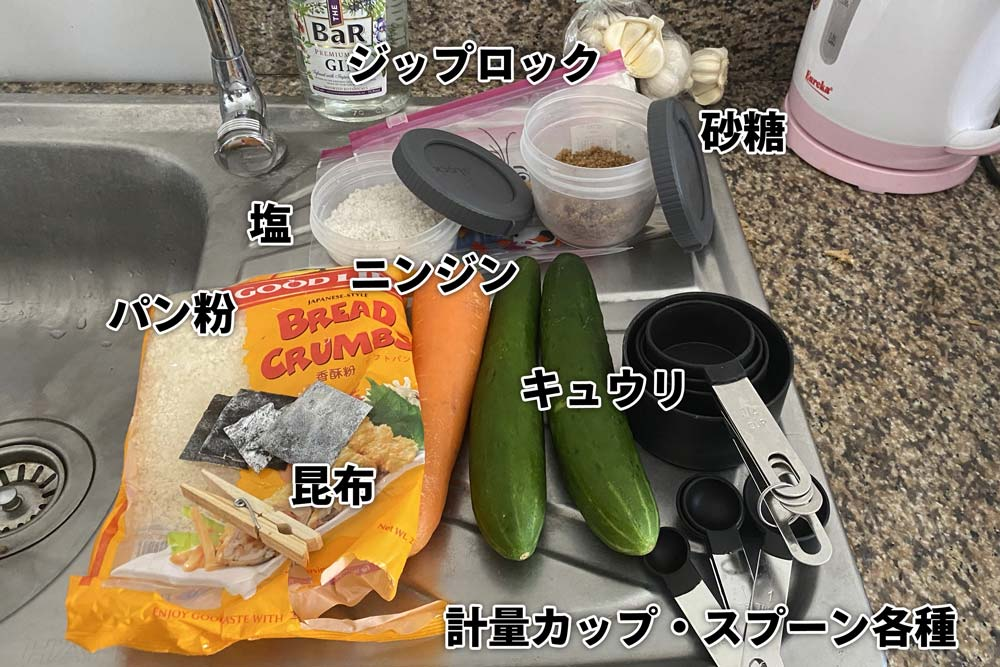
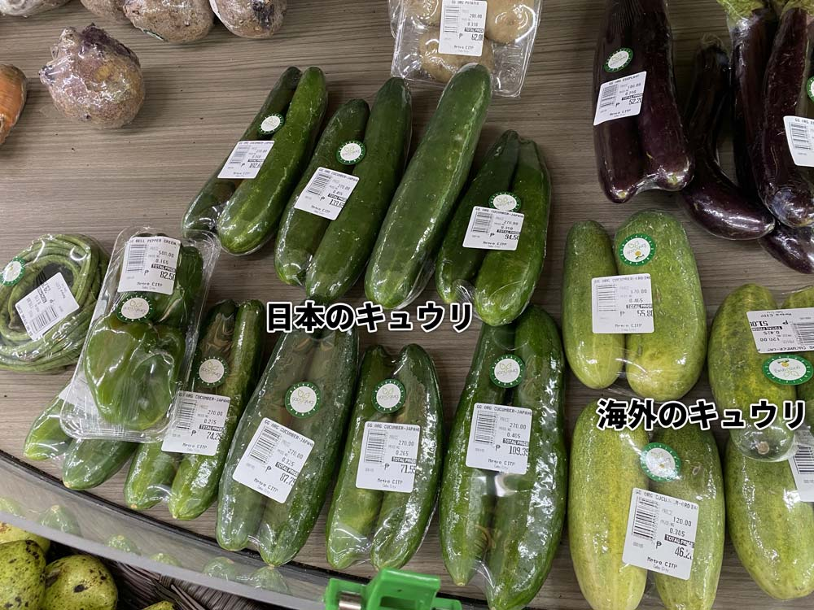
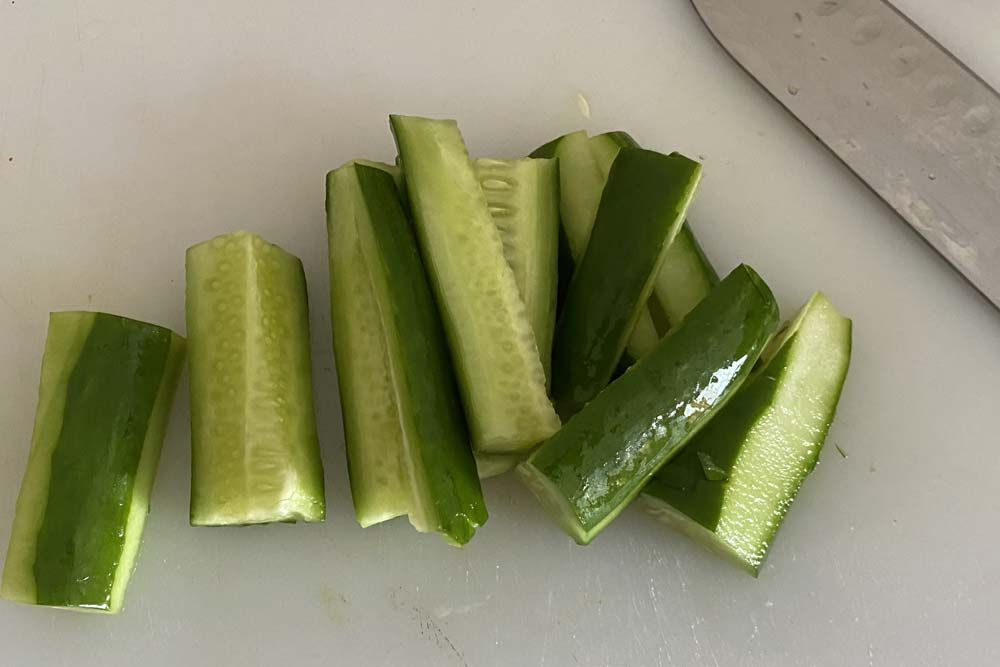
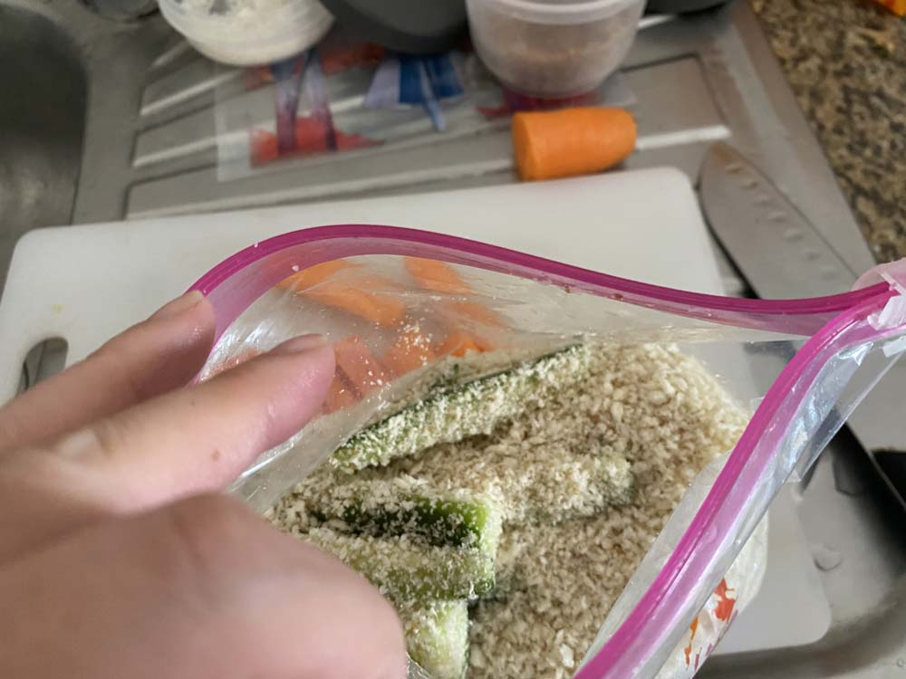
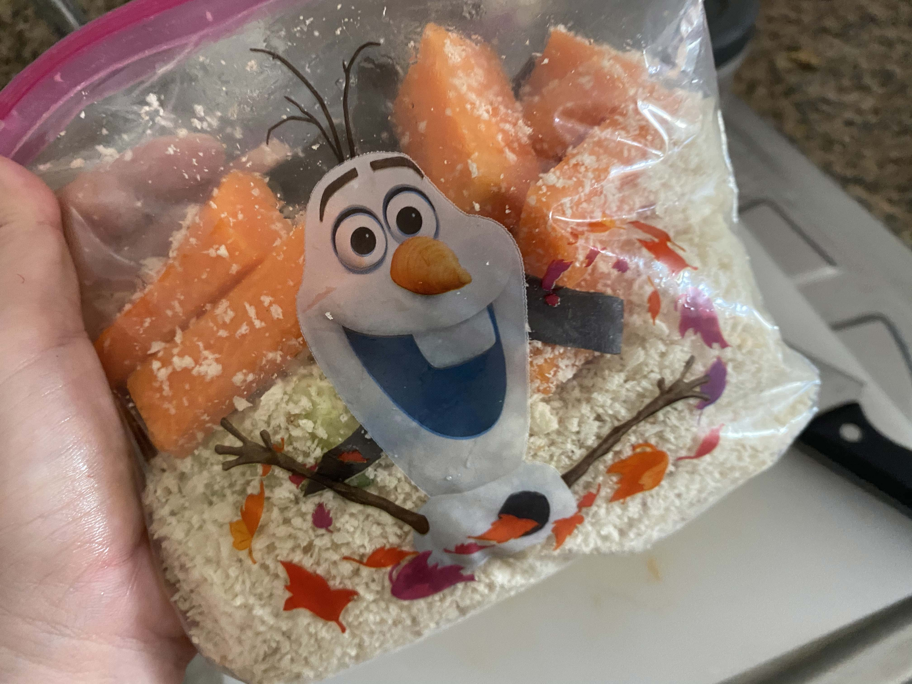
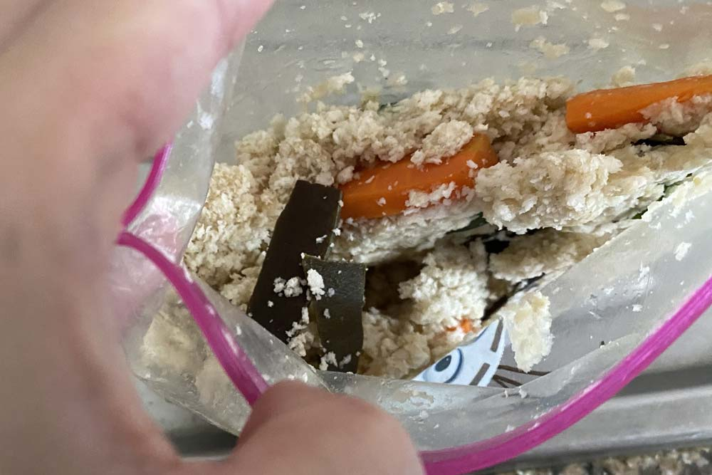
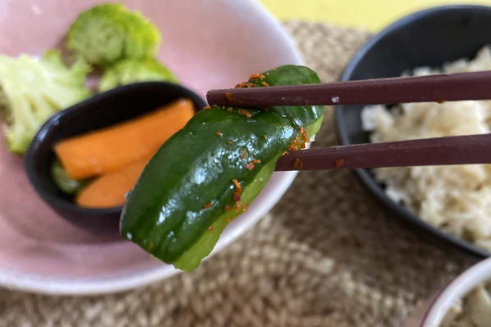
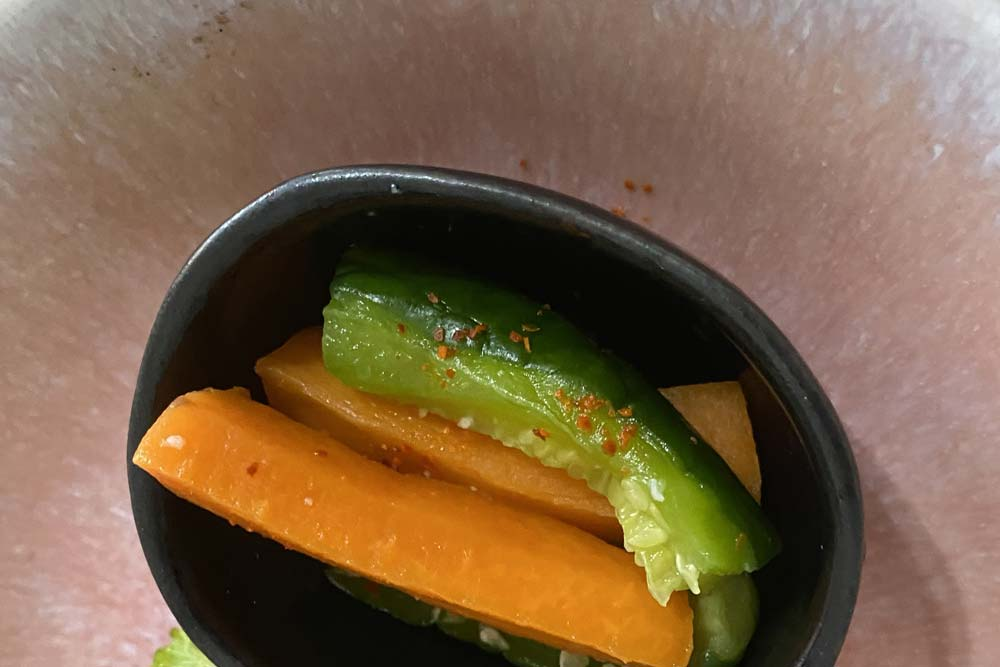
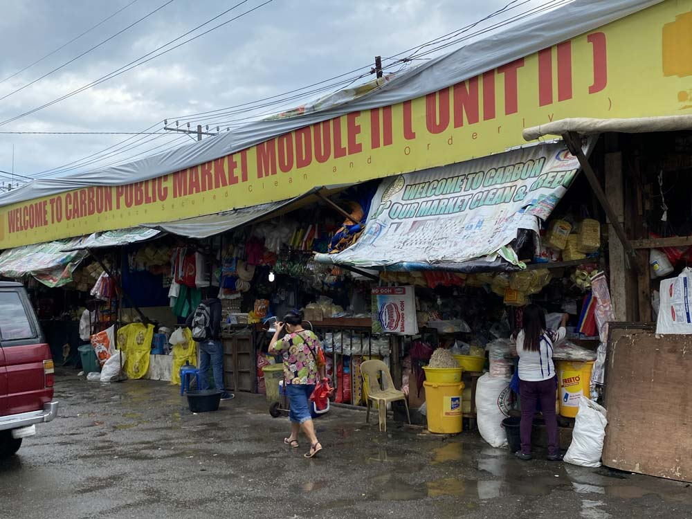

私は海外生活4年めです。憧れの海外生活も長くなってくると、とても恋しくなるのがが和食です。 私は現在セブ島に住んでますが、もちろんぬか床なんてかんたんに手にはいりません。

どの国でも手に入る食材を使って、パン粉で代用したぬか漬けレシピをご紹介します。

この記事でわかること
<ul>
  <li>海外で手に入る食材を使ったぬか漬けの作り方</li>
  <li>海外生活で日本人の体や口にあった料理の作り方</li>
  <li>セブ島の手軽に日本食が手に入るスーパー</li>
</ul>

## パン粉ぬか漬けを作るために用意するもの
まずは材料などのご紹介。どこのスーパーでも手軽に手に入ります。

* にんじん　1本
* キュウリ（ジャパニーズキューカンバー）　1本
* パン粉　2カップ
* 砂糖　大さじ2杯
* 塩　大さじ2分の1程度
* あれば昆布　3 ~ 4かけ
* ジップロック　大きめ

ジャパニーズキューカンバー（日本のキュウリ）は、大きめのスーパーで手に入ります。 
ただ、海外の日本キュウリ（2本で50ペソ前後）に比べて約2倍のお値段です。。。

## 作り方
### 1. 野菜のカット
野菜の皮を剥き4センチ程度にカットします。さらに縦に4等分に切ります。

フィリピンの野菜は日差しが強いせいかキュウリに限らず*野菜全般皮が硬い*です。 
日本ではあまりきゅうりの皮を剥いて食べることはありませんが、ストライプになるように部分的に剥いておいた方がいいです。

入手できたら昆布も使いましょう。 
使う場合は軽く洗って細くカットしておくとダシが出やすくなります。

私はさらに包丁で昆布の表面に小さな切り目をたくさん入れておくようにしています。

### 2. 材料をジップロックへ
まずはパン粉、塩、砂糖を入れてシェイク。

そこに野菜を投入し、軽く揉んで放置します。

常温の方が発酵は早いですが、セブ島のように常夏の国では出来るだけ冷蔵庫に入れておいた方が良いです。

### 3. 一日放置
1日経ったら充分漬かって食べられるようになります！

こんな感じでパン粉に水が出てきたら食べ時です。

パン粉を水で洗ってお皿に盛ったら完成。

  

一味がなければチリペッパーをかけて食べると美味しいです。

### 材料の入手先
材料の入手先です。

* ITパーク：スーパーメトロ（[MAP](https://goo.gl/maps/LXTrtdawLKAq3niu8)）
 安心・安定で日本のグロサリーも手に入ります。 
* コロン：カーボンマーケット（ [MAP](https://goo.gl/maps/w5TBTCnB2U2fPeTQ9) ]
  塩はカップの計り売りで15ペソで入手しました。ウズラの卵は1個2ペソ！季節外れのアボカドも入手可能です。セブで治安が悪いエリアなので日本人だけでの出入りはオススメしません。
* ロビンソン：フエンテ（ [MAP](https://goo.gl/maps/1Z65ht5tPteGJSg6A) ）
引越して最も近所のスーパー。メトロよりも全体的に安い印象。
* サリナスドライブ：ビッグプラスマート（[MAP](https://goo.gl/maps/WurCQhBLWNo1tB387)）
韓国系グロサリーストア。昆布なんかも手に入ります！キレイな牛肉もお肉やニラなども入手可能。

## ロックダウンで食生活を制限されたのでレシピを公開したくなった
2020年コロナウィルスの蔓延で世界はパニックとなりましたね。しかもフィリピンは世界最長の6ヶ月もの間ロックダウンで街は封鎖されました。

誰しもが思うように外に出られなくなりました。  

ロックダウンの規制がもっとも酷い時、私は会社の寮に住んでいました。 
デリバリーか寮の一階にある食堂が主な食事を得られる場所です。

フィリピン人の食生活は米米米、たまに肉ぐらい炭水化物と肉。野菜はレアキャラで、塩分過多。お皿に食材を盛ると茶色くなりがちです。  

**大抵のフィリピン人はとてもタンボ（チャビー）** です。

日本の一汁三菜彩豊かな食文化の中育った私にとって、ロックダウンの食生活は地獄でした。
しかも体調を壊しました。

私のように、海外に住む日本人は日本食が恋しかったり体に合わなかったり健康に気遣いたい人もいるのではと思います。

私のレシピがお役に立てれば幸いです。

## まとめ：海外でも工夫すれば節約しながら日本食を味わえる
最近ではフィリピンだけでなく各国に日本のグローサリーストアはあるでしょうし、和食のレストランもあります。

とはいえ、日々のこととなると出費が気になりますね。
海外でも上手に工夫して、食生活をエンジョイしたいですね。  

最後までお読みいただきありがとうございました。
