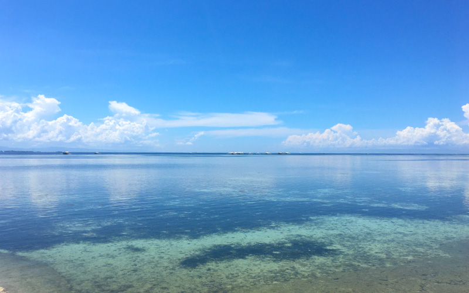

<msg txt="将来海外に住みたい。でも、住む場所関係なく働くにはどうすればいいんだろう。" img="common/man.png" name="ノマド目指す人"></msg>

こんな気持ちを抱いている方、いませんか？

私もずっと海外で暮らすのが夢でした。

実際、海外に移住したところで仕事をして生活費を確保できるのか、言葉は通じるのか。。。行動に移せない理由はたくさんありますね。

私は海外移住4年目です。私の場合は、チャンスがあって海外転職し、一年で仕事をやめました。

それからプラプラしつつフリーランスしつつ、またひょんなことから会社を立ち上げセブ島にいます。

日本で会社員→海外で会社員（1年）→今海外ノマド歴3年の私が、将来海外ノマドとして生きていきたい方にオススメの職種をご紹介します。

この記事でわかること
<ul>
  <li>生活費たった10万円以下！？フリーランスノマドは東南アジアで始めるとお得な理由</li>
  <li>海外でノマドワーカーになりたいけど、できる仕事が。。。未経験でも始められる仕事もあります！！</li>
  <li>初心者海外でもフリーランスで稼げる職種のご紹介</li>
</ul>

## 私が海外ノマドワーカーになった経緯

唐突に説明してもアレなので少し私のお話をさせてください。

私は子供の頃から海外に住むのが夢でした。大学で英語英米文学科に進学し中退、しばらくして出産し、海外に行く夢を諦めました。

出産後は美容関係の仕事をしていましたが、子供の喘息（ぜんそく）がきっかけで、職業訓練校を経てWebエンジニアに転職しました。

理由は、**Web関連の仕事であれば *ネットが繋がればどこでも仕事ができるから*** です。

その後も会社員したりフリーランスしたり生計を立てていました。

最初の海外で働くきっかけは[Wantedly](https://wantedlyinc.com/ja) でスカウトされたことです。

私はワクワクして海外日系企業で働き始めましたが結局退職。国によっては日本のように *労働基準局* のような厳しい法律がない場合もあり、精神や肉体の安定は保証されないというのが現実です。

疲れ果てて会社をやめ、プラプラしてたらいつの間にか海外ノマドワーカーになってました。

## 海外に多いノマドワーカー
ノマドとは、場所に縛られず「遊牧民（ノマド）」のように働く人のことをいいます。PCやスマホ一台で仕事ができるので「デジタルノマド」とも呼ばれます。

### ノマドワーカーの気になる職種

海外ノマドで一般的に多い職種は、

* 投資家
* webエンジニア
* webデザイナー
* イラストレーター
* ライター
* アフェリエイター
* ブロガー
* Youtuber
* インスタグラマー

などです。

私の住むセブ島は非常にノマドワーカーが多く、普通に世界各国から来た Youtuber なんかもそこらへんで撮影していることもあります。

## フリーランスじゃなくてもノマドワーカーになれるの？

<msg txt="今日本で会社員してるんだけど、こんな私でも海外でノマドワーカーになれるのかな？" img="common/woman.png" name="OL" cls="right"></msg>

<msg txt="もちろん可能性はなくはありません！！！ 私も会社に属してますが<em>れっきとしたノマドワーカー</em>です。"></msg>

さらに私の周りにいるノマドワーカー（予定も含む）の人達にはこんな人達がいます。

* 日本のIT企業で勤めるエンジニア。奥さんがフィリピン人なのでセブに拠点がある。
* 日本でフルリモートで働くPM。現在セブ島で働けるよう会社に交渉中。

 Web関係だと圧倒的に働く場所に融通がきくので、会社次第でノマドワーカーになれます。しかも給料も固定なので安心して働くことができます。

<em>会社員で海外ノマドワーカーになるのは会社次第</em>

## フリーランスノマドワーカーの気になる収入と支出

ではフリーランスであればどうなるのでしょうか？

自分で仕事をとらないといけないので収入は不安定になります。

<msg txt="フリーランスは自由？！！そ〜〜〜んな生易しい世界じゃありません！！"></msg>

フリーランスなりたての頃なんて **少なくとも1ヶ月位は仕事がなく収入0なんて人もザラ** です。

さらに家賃、水道代、光熱費と生活費が毎月出ていきます。

### 海外でフリーランスをするメリット

海外でノマドワーカーになりたい人には国内よりも断然海外、しかも物価が安い東南アジアが有利です。

<em>圧倒的に生活費をおさえることができる</em>

現在の私の生活費です。私が住んでいるのはセブ島ITパークという経済特区の場所の一つです。周りにモールや病院、レストラン、何から何まで揃っています。しかもガードマン付きのコンドミニアムに住んでます。

|項目|費用（日本円に換算）|
|-|-|
|家賃|39,680|
|光熱費|3,720|
|水道代|1,240|
|インターネット|4,955|
|携帯代|1,240|
|食費など|32,240|
|*合計*|**83,750**|

どうでしょう？悪くない生活ですが、合計で10万円切ります。

フリーランスもノマドワーカー初心者であっても、物価の安い東南アジアであれば **圧倒的にコストを節約** できます。

100万円くらい軍資金があれば、*案件が一件も獲得できなくても* 半年はなんとか生きていけます。

## 未経験でもなれるノマドワーカーは？
それでは未経験でもなれるノマドワーカーの職種をご紹介します。

### Webライター

WebライターはWebサイト上の記事を書く仕事です。

フリーランスにはWebライティングを生業としている方も多く、一番始めやすいです。海外ノマド初心者にもおすすめの職種です。

#### メリット
* 参入ハードルが低いので未経験でも始めやすい
* スキルが上がったら高単価になる
* 初期投資（お金）がかからない

#### デメリット
* 初心者のうちは単価が低い
* 慣れるまでは記事を書くのに時間がかかる

Webライターの仕事を得るために<em>クラウドソーシングの登録は必須</em>です。ライターのお仕事が豊富なクラウドソーシングに登録しておきましょう。

<ul>
  <li><a href="https://px.a8.net/svt/ejp?a8mat=3H9TGE+3C9KZ6+2OM2+TZ6B6" rel="nofollow">CrowdWorks（クラウドワークス）</a></li>
  <li><a href="https://px.a8.net/svt/ejp?a8mat=3H9TGE+3BO5DE+3QHY+5YJRM" rel="nofollow">Bizseek</a></li>
</ul>

### ブロガー＆アフェリエイター
ブロガーとは自身の記事で、Google AdSenseなどの収入を得たり、記事内で商品を紹介して売れた分報酬を受け取ります。

アフェリエイターとは、アフィリエイト広告を自分のサイトやブログ、SNSなどで紹介し、そこから商品が売れたときに支払われる成果報酬を広告主から得ている人のことです。

超絶有名なブロガーとしてマナブログのマナブさんもいます。

ブロガー&アフェリエイターは月間100万円以上稼ぐ人もいます。私の知り合いのアフェリエイターの話によると **主婦で年間1000万円以上稼いでいる人もいる** そうです。

ブロガー&アフェリエイターで稼ぐとなると、Webライティングよりぐっとハードルが上がります。

#### メリット
* 参入ハードルが低いので未経験でも始めやすい
* スキルが上がったら高額を稼げる
* 初期投資（お金）がそこまでかからない

#### デメリット
* 初心者のうちはまーーーーったく稼げない
* 成果が出るまで相当な忍耐が必要
* 売る商品の情報収集や深いSEOの知識も必要

 ブロガーに興味のある方は、まずライターの仕事をやってみて、余裕が出たら自身のブログを開設して始めることをおすすめします。

一度作ったブログは財産になります。間違えても、*アメブロなど外部サービスではじめないでください*。先ずはレンタルサーバーを借り、WordPress などでブログを構築しましょう。

そしてエンジニアの私からのアドバイスです。*コードが書けない人は自分でWordPressを自分で構築しないほうがいい* です。最近の **SEO周りの設定は複雑** で、*とても素人の知識で構築できる代物ではありません*。あなたのお金を稼ぐ大事なブログの土台となるWordPress。ケチらずにテーマを買いましょう。

<strong>成果を出したい人</strong>は有料のWordPressのテンプレートを買い、レンタルサーバーを借りてブログを始めましょう。

<ul>
  <li><a href="https://px.a8.net/svt/ejp?a8mat=3T465Q+84XAEQ+4CL8+60OXE" rel="nofollow">国内最高峰の SEO  最適化 WordPress  テーマ 【ザ・トール】</a></li>
  <li><a href="https://px.a8.net/svt/ejp?a8mat=3T2LTE+5ZIXRM+CO4+61JSI" rel="nofollow">レンタルサーバー エックスサーバー</a></li>
</ul>

## スキル次第で経験が少なくてもノマドワーカーになれる職種は？
今すぐ海外ノマドワーカーとまではいきませんが、未経験でも自分のスキル次第でノマドワーカーになれる職種をご紹介します。

### デザイナー
デザイナーは、Webサイトやパンフレットなど印刷物のデザインをする仕事です。

私の周りにもデザイナーのリモートワーカーは国内外問わずたくさんいます。

ある程度経験が無いと仕事を得るのは難しいかもしれません。

しかし、スキルを身につけるためスクールで学んだ後、しばらくしてフリーランスという手もあります。実はこのパターンでうまく仕事を獲得している人もたくさんいます。

#### メリット
* オンラインも含めデザインスクールがたくさんあり知識を得やすい
* ノーコードツールをつかえば1人でも仕事を獲得して納品まで完結できる
* 印刷物のデザインもできるとWebサイトの案件獲得など、横展開して仕事を得ることができる

#### デメリット
* たくさんのデザインツールがあり、アップデートのたびに機能が増えるので学習が大変
* 実績を積むまで大きな仕事を得にくい
* 納品期間が長くなると報酬を受け取るのが遅くなる

未経験者もチャンスはあります！！デザインのオンラインスクールで学びつつ、クラウドソーシングで<strong>見せかけだけでも経験を積んでおきましょう</strong>。

<ul>
  <li><a href="https://px.a8.net/svt/ejp?a8mat=3T465R+4BZL9U+4UAG+5YJRM" rel="nofollow">Webで「食っていくため」に特化したデザイン・プログラミングのオンラインスクール</a></li>
 <li><a href="https://px.a8.net/svt/ejp?a8mat=3BHPWW+3KMEQ+2PEO+1HO86Q" rel="nofollow">アウトソーシングサービス・ココナラ</a></li>
</ul>

### プログラマー （ITエンジニア）

プログラマー（ITエンジニア）はプログラミングで、WebシステムやWebサイトなどを構築する仕事です。

私の仕事も一種のプログラマーです。Twitterやブログから仕事依頼が来ることもあり、海外ノマドワーカーとの相性が良いです。

私の周りにはスクールに在籍しつつクラウドソーシングで実績を積んでフリーランスになった初心者の方もいます。しかし、このようなケースは稀（まれ）です。

経験ゼロでもやれなくはないですが、**ガッツリ稼ぎたければ経験が必要**になります。

#### メリット
* 高度なスキルを身につければかなり稼げる
* 人材不足のため仕事を得やすい

#### デメリット
* スキルの習得難易度が高い
* 技術進化の早いので常に学び続ける必要がある

未経験で始めたい方へ。プログラミング学習は、生半可ではないので<strong>由緒あるスクールで学ぶことをおすすめ</strong>します。今ならテックアカデミーで無料体験ができるみたいです！！

<ul>
  <li><a href="https://px.a8.net/svt/ejp?a8mat=3H9TGC+AM8B5E+3GWO+6BU5U" rel="nofollow">テックアカデミー無料体験</a></li>
  <li><a href="https://px.a8.net/svt/ejp?a8mat=3BQLBS+BCFDRM+4LXM+626XU" rel="nofollow">フリーランスエンジニア向け案件紹介サービス【IT求人ナビ フリーランス】</a></li>
</ul>

## まとめ・初心者ノマドワーカーは海外だとコストを抑えてはじめられる！
今回は海外ノマドでフリーランスをするメリットと、海外でフリーランスができるオススメの仕事を紹介しました。

フリーランスであれば、行きたい国はもちろん自分の好きな働き方ができるので精神的にも安定するのでおすすめです。

<msg txt="自由に生きたい、日本から出て閉塞感から開放されたい。" img="common/man.png" name="ノマド目指す人"></msg>

そんな方は、*出費を抑えてフリーランスをはじめられる **東南アジアでの海外ノマド*** をはじめてみてください。

半年やってダメならやめて、会社員に戻ればいいんです笑

 フリーランスでノマドワーカーを始めたい人に、海外ノマド3年の私から海外ノマド生活の感想を伝えておきます。

一言でいうと「*心から自由*」です。この **自由な生活をもう二度と手放したくない** です。

この記事が、皆さんの海外ノマドの第一歩を踏み出すきっかけになれば幸いです。

最後までお読みいただきありがとうございました。
