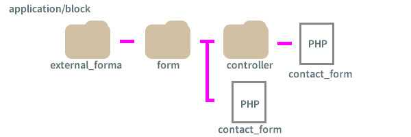

concrete5（concreteCMS）の外部フォームを使ってフォーム作りました。

2022年にAjax対応する記事執筆に伴い、大幅にリライトと加筆しました。フォームヘルパーやメールヘルパーの詳しい使い方も紹介しています。
<p>
  <small>
    ※この記事ではconcrete5と表現してますが、現在concreteCMSに名前が変わりました。<br>
    ※ver8のみで検証済み。
  </small>
</p>

<prof></prof>


## 外部フォームとは？
concrete5には外部フォームというブロックがあります。<br>
ここに自分でphpをゴリゴリ書いて独自のフォームを作成することができます。

もちろん、デフォでもフォームブロックは用意されておりも管理画面でお問い合わせ内容などの管理もできて便利です。…が、デザインの自由度も効かないし自動返信もできませんので今一歩な使い勝手。。。。

ということでやはりお好みのフォームを作りたいときは外部フォームブロックがおすすめです！！

## 下準備
フォーム送信の流れは以下の通り。

1. フォーム項目の登録
2. バリデート（文字数とかきちんとアドレスを登録をできてるかなど）を判定して問題なければ送信
3. メールがサイトオーナーとフォーム送信者の両方に届く
4. thanksメッセージを表示

例えば今回下記のようなフォームにします。

* ニックネーム
* アンケート（3択）
* メールアドレス
これを実現するために必要なのは以下のファイル。

* フォームのコントローラー（挙動の制御）
* フォームのビュー（見た目）
* メールの中身

今回は Controller、Wiew は `application/block/external_form` 内にformというフォルダを新規作成してその中に配置します。

今回はファイル名をcontact_form.phpとしました。
見た目を整形していく用のビューのファイルはform直下に配置します。挙動の制御をするコントローラーファイルはさらにその直下にcontrollerフォルダを作って同じ名前のファイルを置きます。

見た目を整形していく用のビューのファイルはform直下に配置します。挙動の制御をするコントローラーファイルはさらにその直下にcontrollerフォルダを作って同じ名前のファイルを置きます。



## コントローラー、ビュー、メールのテンプレを作る
concrete5のブロックはMVC（モデル・ビュー・コントローラー）モデルとなっており、コアをオーバーライドして作成します。

### フォームヘルパーを使ってフォームの見た目（view）を作成
まずはviewのコードです。

ヘルパーを使ってフォームのタグを作ります。今回はBootstrapを使いました。htmlやCSSの説明は割愛します。

```php:title=contact_form.php
<?php
$form = Loader::helper('form');
defined('C5_EXECUTE') or die("Access Denied.");
?>
<form method="post" action="<?=h($view->action('send')) ?>">
  <?=Core::make('token')->output('send');?><!--トークン発行-->
  <div class="container form">
      <div class="row">
          <div class="col col-md-3">ニックネーム</div>
          <div class="col col-md-9"><?=$form->text('nickname', ['placeholder'=>'Camille'])?></div>
      </div>
      <div class="row p-3">
          <div class="col col-md-3">アンケート</div>
          <div class="col col-md-9">
              <span class="form-check form-check-inline">
                  <?=$form->radio('radio', h('魚'), ['id'=>'radio1', 'class'=>'form-check-input' ])?>
                  <label class="form-check-label" for="radio1">魚</label>
              </span>
              <span class="form-check form-check-inline">
                  <?=$form->radio('radio', h('肉'), ['id'=>'radio2', 'class'=>'form-check-input'])?>
                  <label class="form-check-label" for="radio2">肉</label>
              </span>
              <span class="form-check form-check-inline">
                  <?=$form->radio('radio', h('野菜'), ['id'=>'radio3', 'class'=>'form-check-input'])?>
                  <label class="form-check-label" for="radio3">野菜</label>
              </span>
          </div>
      </div>
      <div class="row">
          <div class="col col-md-3">メールアドレス</div>
          <div class="col col-md-9"><?=$form->email('email', ['placeholder'=>'camille@sample.com'])?></div>
      </div>
      <p><button class="btn btn-primary">Send</button></p>
  </div>
</form>
```


見た目は完成しました。

これでフォームヘルパーを使ってControllerとのデータのやり取りができるようになります。

フォームヘルパーの使い方です。

```php
$form = Loader::helper('form');//ヘルパー呼び出し

$form->radio([name属性], [value属性], [その他の値を配列で]);
```
例えばニックネームのコードは以下のように出力されます。
```html
<input type="text" id="nickname" name="nickname" value="" placeholder="Camille" class="form-control ccm-input-text">
```
各フォームパーツは以下のように呼び出せます。
|名前|コード|
|-|-|
|*テキスト*|`$form->text([name], [value],[属性])` |
|*メール*|`$form->email([name], [value],[属性])` |
|*labelタグ*|`$form->label([name], [value])` |
|*hidden*|`$form->hidden([name], [value])` |
|*password*|`$form->password([name], [value], [属性])` |
|*チェックボックス*|`$form->checkbox([name],[value], [checked], [checked],[属性])` |
|*ラジオボタン*|`$form->radio([name],[value], [checked],[属性])` |
|*テキストエリア*|`$form->textarea([name], [value],[属性])` |
|*セレクトボックス*|`$form->select([name], [option], [checked],[属性])` |
|*送信*|`$form->submit([name], [value], [属性], [class])` |

今回は送信ボタンを `button` タグ直書きで使ってますが、`input` タグに変えたい場合は以下のようにして、 `disabled` などの属性を付与することもできます。
```php
<?=$form->submit('send', 'Submit', ['disabled'=>'true'], 'btn-primary')?>
```
これでいったんは値のcontrollerに渡すことができるようになりました。

チェックボックスなどは以下のように配列に値を格納します。
```php
<?=$form->checkbox('checkbox[]', h('魚'))?>
```
### controllerで送信などの処理
フォームのバリデート、送信後の挙動などをこのファイルで設定します。

今回application/block直下に置くので `namespace` を `Application\Block\ExternalForm\Form\Controller` とします。

```php:title=controller/contact_form.php
<?php
namespace Application\Block\ExternalForm\Form\Controller;

use Concrete\Core\Controller\AbstractController;
use Core;

class ContactForm extends AbstractController
{
    public function view()
    {
        /**
         * あらかじめViewに渡したい値があれば
         */
    }

    public function action_send($bID = false)
    {
        $error_message =[];
        $token = \Core::make('token');
        if ($this->bID == $bID && $token->validate('send')) {
          /**
           * ここに送信の処理
           */
        } else {
          /**
           * ここに送信失敗時の処理
           */
        }
    }

}
```
先程書いたview側のコードです。
```php
<?=Core::make('token')->output('send');?>
```
`\Core::make("token")`でトークンを発行し、


controller側でトークンが一致しなければフォームの送信自体をできなくします。
```php
$token = \Core::make('token');
var_dump($token->validate('send'));
//トークンが一致すればTrueを返す
```

`Core::make('helper/validation/strings')`でバリデーション処理をします。

```php:title=controller/contact_form.php
<?php
namespace Application\Block\ExternalForm\Form\Controller;

use Concrete\Core\Controller\AbstractController;
use Core;

class ContactForm extends AbstractController
{
    public function action_send($bID = false)
    {
        $error_message = [];
        $token = \Core::make('token');
        if ($this->bID == $bID && $token->validate('send')) {
            $validation = Core::make('helper/validation/strings');

            if (!$validation->email($this->post('email'))) {
                $error_message[] = h('メールアドレスが正しくありません');
            }
            if (!$validation->notempty($this->post('radio')) || !$validation->notempty($this->post('nickname'))) {
                $error_message[] = h('必須項目を入力してください');
            }
            if (!empty($error_message)) {
                $this->set('errorMsg', $error_message);
            } else {
                /**
                 * メール送信後の処理
                 */
            }
        } else {
            $error_message[0] = '送信に失敗しました';
            $this->set('errorMsg', $error_message);
        }
    }
}
```
`Core::make('helper/validation/strings')`にあるバリデーションを使って判定ができます。

```php
$validation = Core::make('helper/validation/strings');
var_dump($validation->email($this->post('email')));
// EmailだったらTrueを返す
```

|名前|コード|
|-|-|
|*空かどうか*|`$validation->notempty([値])`|
|*メール*|`$validation->emal([値])` |
|*最大文字数*|`$validation->max([値],[数])`|
|*数字を含む*|`$validation->containsNumber([値])`|

パスワードの判定ではないのでとりあえずこのくらい。

文字数に関しては日本語の場合誤差が出るかも。

view側で値を受け取り、表示します。

```php:title=contact_form.php
<?php if (!empty($errorMsg)) {?>
<div class='alert alert-danger'>
    <ul>
        <?php foreach ($errorMsg as $error) {
            ?>
            <li><?=h($error)?></li>
            <?php
        }?>
    </ul>
</div>
    <?php
}?>
```

`h()` は値をエンティティ（無害）化する、concreteCMSのメソッドです。出力、受け取る値を必ずエンティティ化します。

エラーを表示できるようになりました。


## メールヘルパーを使ってメール送信する
`application/mail`直下に送信するメール内容のテンプレートになる *mail_complete.php* という名前でファイルを配置します。

```
application/
  └ mail/
    └ mail_complete.php（mail template）
```
```php{3-20}:title=controller/contact_form.php
if (!empty($error_message)) {
    $this->set('errorMsg', $error_message);
} else {
    $adminUserInfo = UserInfo::getByID(USER_SUPER_ID);
    $adminEmail    = $adminUserInfo->getUserEmail();
    $mh            = Core::make('helper/mail');

    $mh->to(h($this->post('email')));//登録者への自動返信
    $mh->bcc(h($adminEmail));//サイトオーナーへbcc送信
    $mh->from(h($adminEmail), h('銀ねこアトリエ'));//メール送信元

    // メールのテンプレートへ送るパラメーターをセット
    $mh->addParameter('nickname', h($this->post('nickname')));
    $mh->addParameter('radio', h($this->post('radio')));

    $mh->load('mail_complete');//メールテンプレの読み込み
    @$mh->sendMail();//メール送信

    $this->set('thanks', true);//送信完了
}
```
メール本文を格納します。
```php:title=mail_complete.php
<?php
defined('C5_EXECUTE') or die(_("Access Denied."));
$content   = $nickname" 様r\nアンケートのご協力ありがとうございます。r\n";
$content   .= 'アンケート' . $radio . "r\nr\n";
$signature = "銀ねこアトリエ\r\nWebsite https://ginneko-atelier.com/";
$subject   = h('アンケートのご協力ありがとうございました');
$body      = h($content . $signature);
```
メール本文が短い場合は、パラメーターを使わず、contact_form.phpへ以下のように直書きもできます。
```php:title=controller/contact_form.php
$mh->setSubject(h('アンケートのご協力ありがとうございました'));//表題
$mh->setBody(h($this->post('nickname')). '様のアンケート結果は' . h($this->post('radio')));
```

## Thanksメッセージを表示する
view側で `$this->set('thanks', true)` の値を受けとり、送信完了メッセージを表示させます。
```php{11-15}:title=contact_form.php
<?php if (!empty($errorMsg)) {?>
    <div class='alert alert-danger'>
        <ul>
            <?php foreach ($errorMsg as $error) {
              ?>
                <li><?=h($error)?></li>
                <?php
            }?>
        </ul>
    </div>
  <?php } elseif ($thanks === true) { ?>
    <div class='alert alert-success'>
        <p>お問い合わせが完了しました。</p>
    </div>
    <?php }?>
</div>
```


## view、controllerのすべてのコード
```php:title=contact_form.php
<?php
/**
 * ContactForm
 */
$form = Loader::helper('form');
defined('C5_EXECUTE') or die("Access Denied.");
?>
<form method="post" action="<?=h($view->action('send')) ?>">
    <?=Core::make('token')->output('send');?>
    <div class="container form">
        <div class="row">
            <div class="col col-md-3">ニックネーム</div>
            <div class="col col-md-9"><?=$form->text('nickname', ['placeholder'=>'Camille'])?></div>
        </div>
        <div class="row p-3">
            <div class="col col-md-3">アンケート</div>
            <div class="col col-md-9">
                <span class="form-check form-check-inline">
                    <?=$form->radio('radio', h('魚'), ['class'=>'form-check-input','id'=>'radio1' ])?>
                    <label class="form-check-label" for="radio1">魚</label>
                </span>
                <span class="form-check form-check-inline">
                    <?=$form->radio('radio', h('肉'), ['class'=>'form-check-input','id'=>'radio2'])?><label class="form-check-label" for="radio2">肉</label>
                </span>
                <span class="form-check form-check-inline">
                    <?=$form->radio('radio', h('野菜'), ['class'=>'form-check-input', 'id'=>'radio3'])?>
                    <label class="form-check-label" for="radio3">野菜</label>
                </span>
            </div>
        </div>
        <div class="row">
            <div class="col col-md-3">メールアドレス</div>
            <div class="col col-md-9"><?=$form->email('email', ['placeholder'=>'camille@sample.com'])?></div>
        </div>
        <p><button class="btn btn-primary">Send</button></p>
        <?php if (!empty($errorMsg)) {?>
        <div class='alert alert-danger'>
            <ul>
                <?php foreach ($errorMsg as $error) {
                    ?>
                    <li><?=h($error)?></li>
                    <?php
                }?>
            </ul>
        </div>
            <?php
        } elseif ($thanks === true) { ?>
            <div class='alert alert-success'>
                <p>お問い合わせが完了しました。</p>
            </div>
            <?php
        }?>
    </div>
</form>
```

```php:title=controller/contact_form.php
<?php
namespace Application\Block\ExternalForm\Form\Controller;

use Concrete\Core\Controller\AbstractController;
use Core;
use UserInfo;

class ContactForm extends AbstractController
{
    public function view()
    {
        $this->set('radio', '');
    }
    public function action_send($bID = false)
    {
        $error_message = [];
        $token = \Core::make('token');
        if ($this->bID == $bID && $token->validate('send')) {
            $valStrings = Core::make('helper/validation/strings');

            if (!$valStrings->email($this->post('email'))) {
                $error_message[] = h('メールアドレスが正しくありません');
            }
            if (!$valStrings->notempty($this->post('radio')) || !$valStrings->notempty($this->post('nickname')) || !$valStrings->notempty($this->post('email'))) {
                $error_message[] = h('必須項目を入力してください');
            }
            if (!empty($error_message)) {
                $this->set('errorMsg', $error_message);
            } else {
                $adminUserInfo = UserInfo::getByID(USER_SUPER_ID);
                $adminEmail    = $adminUserInfo->getUserEmail();
                $mh            = Core::make('helper/mail');

                $mh->to(h($this->post('email')));//登録者への自動返信
                $mh->bcc(h($adminEmail));//サイトオーナーへbcc送信
                $mh->from(h($adminEmail), h('銀ねこアトリエ'));//メール送信元

                // メールのテンプレートへ送るパラメーターをセット
                $mh->addParameter('nickname', h($this->post('nickname')));
                $mh->addParameter('email', h($this->post('email')));
                $mh->addParameter('radio', h($this->post('radio')));

                $mh->load('mail_complete');//メールテンプレの読み込み
                @$mh->sendMail();//メール送信

                $this->set('thanks', true);
            }
        } else {
            $error_message[0] = '送信に失敗しました';
            $this->set('errorMsg', $error_message);
        }
    }
}
```
## ver8をお使いの方必読！脆弱性対策
外部フォームを使わなくても以下対策をしておきましょう！
> Concrete CMS Version 9 未満のサイトを運営している方は、Nginx や Apache の設定に、ヘッダーを一つ追加することで対策をしていただくことをお勧めします。<br>
> Cross-Origin-Resource-Policy を「same-origin」か「same-site」に設定してください。どちらかが最適かがわからない場合は、以下のドキュメントを参考にしてください。<br>
> https://developer.mozilla.org/ja/docs/Web/HTTP/Cross-Origin_Resource_Policy_(CORP)


Nginx の場合: location ブロックの中に
```
add_header Cross-Origin-Resource-Policy "same-origin";
```

Apache の場合 (.htaccess もしくは同等の場所で)
```
Header set Cross-Origin-Resource-Policy "same-origin"
```
元記事は以下となります。

[CVE-2021-22954 と V9 以前の Concrete への対応について](https://concrete5-japan.org/news/cve-2021-22954/)

## まとめ・外部フォームブロックを使えばCSRFへの対応をしたフォームを作成可能
今回Ajaxのフォームを作ったことをきっかけに7年前に書いたこの記事もリライトしました。

<card slug="entry497"></card>

<msg txt="ついでに今更書きかけで、放置していたことも思い出しました！"></msg>

外部フォームブロックを使えばCSRFへの対応をしたフォームを作成可能です。
> *「クロスサイトリクエストフォージェリ（CSRF）」とは？*<br>
> クロスサイトリクエストフォージェリ（CSRF）とは、Webアプリケーションに存在する脆弱性、もしくはその脆弱性を利用した攻撃方法のことです。掲示板や問い合わせフォームなどを処理するWebアプリケーションが、本来拒否すべき他サイトからのリクエストを受信し処理してしまいます。<br>
> [クロスサイトリクエストフォージェリ（CSRF）](https://www.trendmicro.com/ja_jp/security-intelligence/research-reports/threat-solution/csrf.html)

最近ではブラウザ側でXSS対策をされるようにはなっていますが、下手なコードを書くより、CSRFを防ぐための処理はCMSにできるのであればCMSに任せたほうがいいです。

この記事がみなさんのCMSライフの一助となれば幸いです。

最後までお読みいただきありがとうございました。

参考サイト<br>
[外部フォームブロックをカスタマイズし、入力・確認・完了画面のフォームを作る](https://macareux.co.jp/blog/how-to-customize-external-block)<br>
[Sending Mail::legacy-documentation concrete5](https://legacy-documentation.concrete5.org/developers/helpers/mail/)
