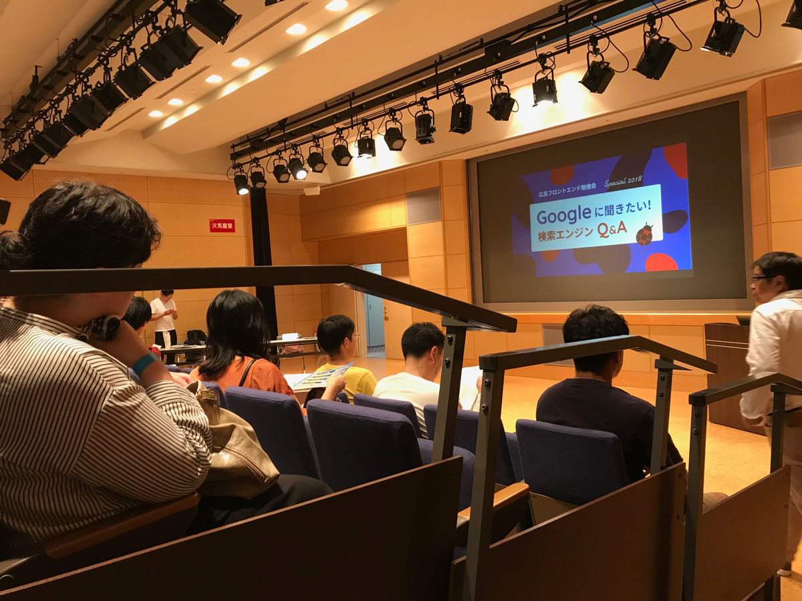

突然ですがみなさん、被リンク購入のブラックハットでペナルティを食らったサイトの運用を任されたことはありますか？

私は過去つとめた会社で、運悪くブラックハットでボロボロのサイトに出くわしたことがありました。

古いSEO手法のせいで 80位以下 だったボロボロに傷ついたサイトを 10位以内まで改善したお話をまとめました。

<small>※ 実際の会社名や案件に関してはコンプラ上、名前を伏せてお話を進めていきます。</small>

<prof></prof>

## 調査：最初はまったくブラックハットが使われているとは気づかなかった

ソースコード、コンテンツ、サイトマップ、Analytics、search console でごくごく当たり前のことを調べました。

調べれば出るわ出るわ、悪質なSEO手法。

### 安易なSEOその1：お問い合わせ見出しがすべてh1
ほぼ全てのページにお問い合わせフォームがあり、その「お問い合わせ」という見出しが  h1（大見出し） でした。

h1 は SEO というかサイトの構造上、大切な要素。

スポーツ新聞を購入する時、一番に見るのはでっかい見出し。興味のあるコンテンツが書かれているかここで判断しますよね？

誰が「お問い合わせ」っていうタイトルに対しての内容に興味ある？

ぶっちゃけて

**アホか！！！** とツッコミを入れたいレベル。

### 安易なSEOその2：コンテンツが限りなく薄っぺらくて雑
すべてのページ、見出しが違うだけでコンテンツが一緒でした。ページ数が多ければいいわけじゃない。
Google は**人に役立つ、有用なコンテンツを評価**するとガイドラインでも言うとるがな。

### ひどすぎる：悪質（ブラックハット）なSEO対策
いかがわしいサイトから大量に被リンク貼られていました。
search console で見れば一目瞭然です。

昔は被リンクさえ多ければいいということで、リンクが売買されてました。

個人ブロガーでも「相互リンクお願いしまーす」と気軽に声かけるする人もいました（やっちゃダメ）。

今は通用しません。Google は頻繁に検索エンジンのアルゴリズムをアップデートしています。

* 意図的に貼られた不自然な被リンクを検索エンジンは見抜く
* 被リンク先が悪質なサイトであれば、リンクされているサイトの評価も下がる
自然にかつ良質なサイトからの被リンク数が評価に繋がるのでこれ、完全にアウトです。

#### ブラックハット・未だに被リンクの売買がされているらしい
昨年の10月時点ですが、そのようなお話も聞けました。結構大手でもやってるらしいですね。

被リンク、 
絶対買っちゃダメ

Google のエンジニア、桁違いに優秀です。
ちょっとやそっとの**浅知恵で勝てると思いますか？**

無理です。バレますよ。やめましょ。

<iframe width="560" height="315" src="https://www.youtube.com/embed/ON3s8CaGOA4" title="YouTube video player" frameborder="0" allow="accelerometer; autoplay; clipboard-write; encrypted-media; gyroscope; picture-in-picture; web-share" allowfullscreen></iframe>

## 既存サイトの改善

まずは、既存のサイトで手を尽くせるところを洗い出しました。

クライアントファースト。すぐにリニューアルするのではなく、今できることを提案するのが先決。

### サイトの軽量化
なので JS、CSS、画像を圧縮し**徹底的に軽量化**。

他の運用サイトでもこれやってみて順位が20位近く上昇した実績も。
### セマンティクスに一部コードを書き直す
マークアップエンジニアは意味のあるタグを選んで、コーディングします。

検索エンジンはタグを見てここは「ナビだ！」とか、「記事だ！」とか判断していますから。

私はリーダブルにするためにもコーディングするとき、結構見出しに気を使います。

健常者であれば視覚的にコンテンツは読めます。でも、そうでない方はリーダーを使って、見出しを見てそれ以降のコンテンツが興味あるか否かを判断します。

そして、いつも心がけてるのがリストタグを適切に使用すること。
プレゼンの時も箇条書きのように言いたいことを列挙すると聴衆が理解しやすいです。
### 記事を追加できるようにする
もともとあったニュース機能を利用して、記事を投稿できるようにしました。

このサービスを使ったらどんなことができるかなど、ユーザーに有用な情報を提供できることは評価につながります。

### ペナルティから回復するためにリンクの否認
まずはいかがわしい被リンクとおさらばしなければいけません。。。。
なので、被リンクを外す「リンク否認」の作業をしました。

本来の被リンク作業は以下。

* リンクされてるサイトに削除依頼を依頼
* それでもダメなら最終手段でリンク否認
リンク否認は search console から行えます。でも、前の制作会社が分からなくて依頼すらできないことも。なのであくまで最終手段ということをお忘れなく。

## やっぱリーサルウェポンはリニューアル
### UI/UX の手法を使う
ソースコードを徹底的に書き直す。UX/UI がそもそもイケてないからマズイんですよね。

ということで、ペルソナを立ててカスタマージャーニーマップなどの UX/UI 手法でコンテンツの動線を改善します。

この事例ではコンバージョンの一つがお問い合わせだったのでお問い合わせボタンへ誘導するデザインとコンテンツの組み立てを試行錯誤しました。
### モバイルファースト、レスポンシブ化
もともとのサイトは PC とスマフォでデザインが分かれてました。コンテンツの更新の手間も二倍です。なので、レスポンシブ化してコンテンツの更新を PC とスマフォ両方しなくても済むようにして更新の負担を減らした。

保守する側（我々）の負担も減りました。
### 構造化データで検索エンジンに適切に情報を伝える
検索エンジンに適切なサイト情報が解析できるように調整しました。

### ユーザーに有用なコンテンツを追加
クライアントからヒアリングして、ユーザーがこのサイトに訪れた時に知りたそうなコンテンツを増やす。

今までオラオラクライアント目線で作られていたサイトをユーザーの知りたいコンテンツを載せることで、ユーザーファーストなサイトに生まれ変わらせました。
## このサイト改善をまとめると
本当にそんなことー？といくらい、、、

当たり前のことしかしていません！
当たり前のことを、丁寧にやるだけです。それが一番大切。

* クライアントのサービスを利用したい人にとって**有用なコンテンツ**を増やす
* **サイトの導線（ユーザビリティ）**や**表示スピード**の改善
* クライアントのサービスのイメージにあったデザインにリニューアル
* クライアントと**コミュニケーション**をとる

### 抜け道や魔法のようなギミックはない
これをやったら一位になるような魔法はありません。あるとしたらそれはズル。つまり、ブラックハット（Google のガイドライン違反）です。被リンクの購買など、ブラックハットを勧めるような SEO 業者と付き合うとその負債はあなたの所有するサイトのドメインが背負うようになります。

* Google のガイドラインに沿う
* ユーザーのことを考えてコンテンツを作る
* ズルをすれば裁かれる
* クライアントとの信頼関係

## 苦しかったからSEOのでっかい勉強会を開催した
2018年、SEOのでっかい勉強会を開きました。私のわがままをみんな聞いてくれ、助けてもらってとても良い勉強会を開催できめちゃめちゃ感謝してます。

そもそも、この勉強会を開こうと思ったきっかけがあります。

古いSEO手法のせいで80位以下だったボロボロに傷ついたサイトを10位以内まで改善するのがめちゃめちゃ大変だったからです。

今だから言えますがサイトを開けてみた時、ホントヤベーと思いましたね。

[広島フロントエンド勉強会 Special 2018 『Googleに聞きたい！ 検索エンジンQ&A』](/blogs/entry279)

## SEO対策を依頼するクライアントの気持ち考えたことありますか？
SEO業者ってうさんくさくないですか？

はい、気持ちわかります。

ぶっちゃけて、コンサルとか言ってる人、 
**ろくなヤツに出会ったことがありません！！** 
（中には仲のいい信用できる人もいます）

私は以前たまたまSEOに特化したWeb制作会社にいましたが、SEO対策を依頼されるのってとても大変です。

クライアントもクライアントで依頼しつつ疑心暗鬼から入ることがあります。

クライアントも自ら勉強しますし、様々なSEO対策の業者に知識を植え付けられることもあります。

順位を保つために「記事を更新しなければ！！！」と焦燥感にかられる、**ブログ中毒のクライアント**もいます。

ケースバイケースですが、世に出回った都市伝説的なSEO対策の知識が蓄積されていることもありますね。

当時は苦しんでるんだなーとひしひしと感じて仕事してました。

この時のクライアントも半分「SEO対策頼んで大丈夫何だろうか？」そんな気持ちだったのだと思います。

## 最後に
今回、スライドをこの記事に起こしたのには理由があります。

Google の金谷氏曰く、未だにこのブラックハットをする業者がいるそうです。これは、ユーザーの SEO への間違った知識が定着しているのも一因とのことでした。

金谷氏は SEO に対するユーザーの知見が変わればという想いで、広島での SEO勉強会への登壇を快く引き受けてくださいました。

最近忙殺されて SEO の勉強はサボりがちでしたが、引き続き頑張ろうと思います。

Webコンテンツが大好きだからね！！

元ネタはこちら

[古いSEO手法のせいで80位以下だったボロボロに傷ついたサイトを10位以内まで改善したお話ダイジェスト](https://docs.google.com/presentation/d/1KSNcIhEt68LKyP2nrcxOGFMyWlsuyhC9hjJzV9ZTQzA/edit#slide=id.p)
