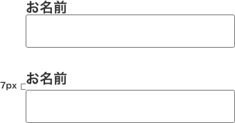

最近、久々にプロのWebデザイナーの仕事（デザインカンプ）をみて感動しました。

そこで私が普段、1px単位で気をつけていることを書き記してみました。わずか数ピクセルで見やすさ、余白の心地よさが変わります。

<prof></prof>

## 良いデザインカンプと出会うとヨダレが出そうになる
普段仕事をしていると、いいデザインカンプに当たるとやったね！て思います。

デザインの良し悪しって余白の開け方で決まるといっても過言ではないと思います。

デザインカンプデータを開いたとき、きちんとガイドを引いたり計算機を叩いて余白を決めている形跡を見ると清々しい気持ちになりますね。感覚に頼らず、アスペクト比も4:3とか16:9を計算してくれているとなおのこといい気分になります。

Webサイトにはレスポンシブデザインといってディバイスやウィンドウ幅でデザインがレイアウトやサイズが変わるものもあります。レスポンシブデザインは今やWebデザインの主流です。

この仕組みを理解してないとなかなかいいデザインカンプはできないし、再現が難しいものになります。

## Webと紙のデザインは似ているけど非なるもの
長い間紙のデザインやっている人で仕事の幅を広げたくてWebデザインを始める人がいます。

正直、そんなにカンタンではないと思います。

Webと紙のデザインは色の出力の仕方がそもそも違う。だから色の設定から違います。

そして1px以下のサイズは作れません。ブラウザによっては細かい色は表現できないこともあります。そして、A4サイズのようなものはなく異なるディバイスサイズに対応しないといけないということ。

ファーストビューに大切な要素を詰め込む必要があること。

フォントの混植はできない。検索エンジンに解析させるために画像よりテキストの方が大切。

などなど挙げればきりがありません。紙に比べてたくさんの制約があります。

RGB（光の三原色）や単位がpxであることはもちろん、カーニングできないことなどWebサイトの仕組みを知っておくべきです。

何度か自分の作ったデザインカンプをコーディングしたら気づくと思います。

## Webサイトはユーザーがコンテンツ（情報）を得る場所
Webサイトの目的って情報を伝えることだと思っています。なのでユーザーにとって、Webサイトの使いやすさやコンテンツの読みさすさはとても重要だと思っています。

ユーザビリティとアクセシビリティです。

これは紙にも共通してますね。

**日本人の男性の5人に1人は何らかの色覚障害**を持っています。誰しもが読みやすいか考慮しなければなりません。

たとえば、主要テキストをとってみても以下があげられます。

* 黒がキツ過ぎないか(#000とか使わない)
* 明る過ぎないか （白黒印刷して一体化していたらダメ）
* 行間(line-height)は十分取れていて読みやすいか
* 文字サイズは十分読めるサイズか？ (推称16px)
* 変な色使ってないか？ （一部の色覚障害者には認識できない色もある）

## 小さな見出しと段落などの行間にも気を遣う
ユーザーのコンテンツを読むときの心地よさは、たかだか数ピクセルで実現できたりします。

たとえばこんな見出しと入力項目があるとします。

デザインに近接という手法があります。本来であれば同じグループであればくっつけますがほんの少し、5px 前後間を開けるだけで可読性が上がります。

こういった小さな気遣いの積み重ねで良いサイトが出来上がります。

## おまけ・スーツの法則
無駄に色数が多いと事故（カオスなWebサイトが出来上がる）が起こります。

メインカラー70%（ジャケット）、サブカラー25%（シャツ）、アクセントカラー5%（ネクタイ）を心がける。スーツと同じ割合になるようにするとバランスがいい感じになるはず。
あと困ったら、同系色（ピンクと茶色など）と無彩色（白黒グレー）を使う。色相や明るさ、彩度を揃える。

そうすれば少なからず事故は防げる。

## まとめると
1pxの気遣いが良いサイトを作ります。だから数ピクセル単位で配慮する必要があるんです。

デザインカンプを作るときは感覚に頼らずガイドを引く。PCのそばに計算機などを置いておく。出来上がったら一度白黒で変換して確認する。

ちょっとした気遣いの積み重ねが仕事の質をグッと上げる。

プロであるほどこういうところに気を使っていると感じたのでこんな記事を書いてみました。小さな仕事にでもそういったところは滲み出るものですね。
