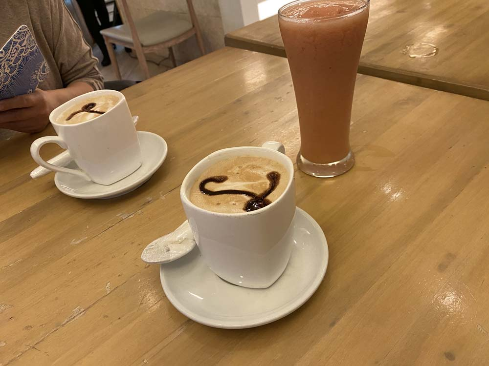
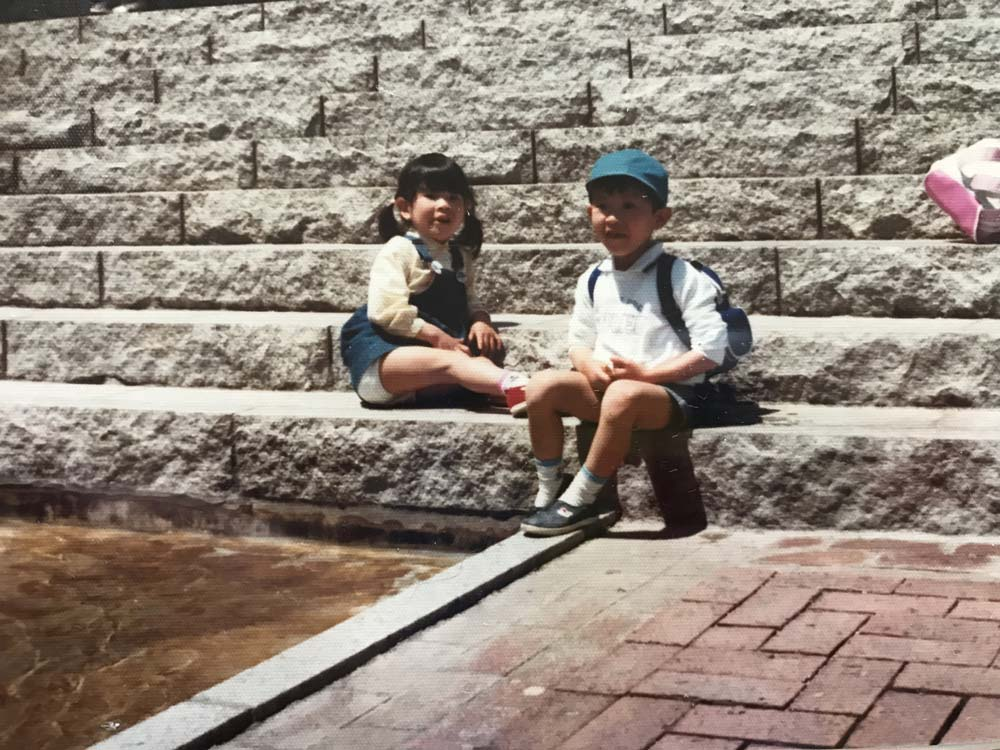
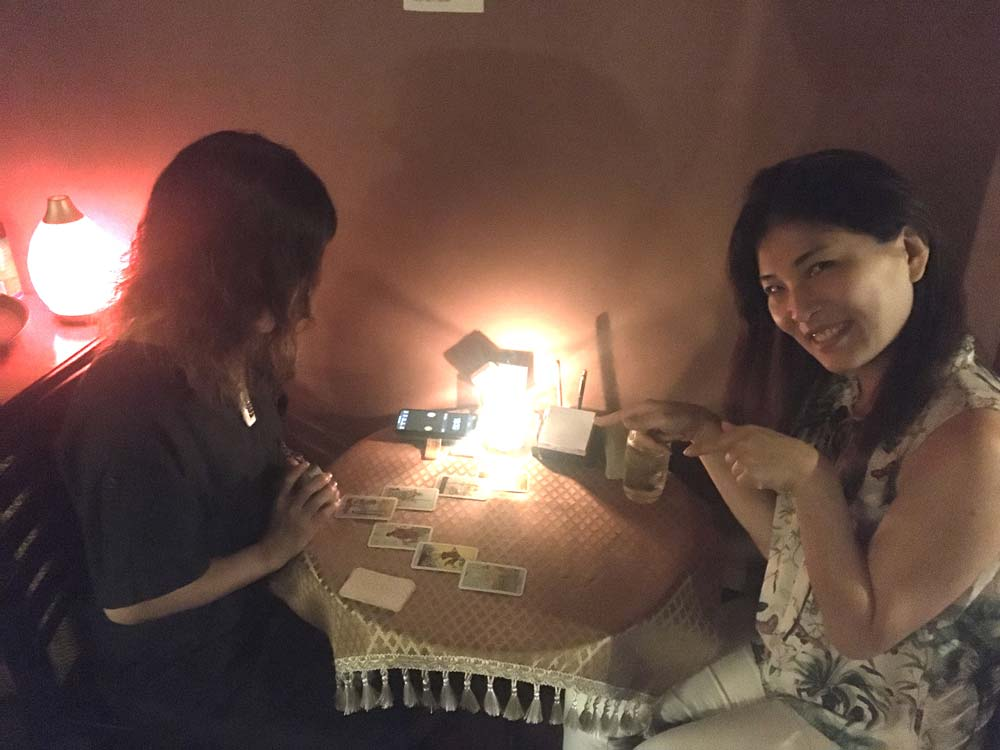
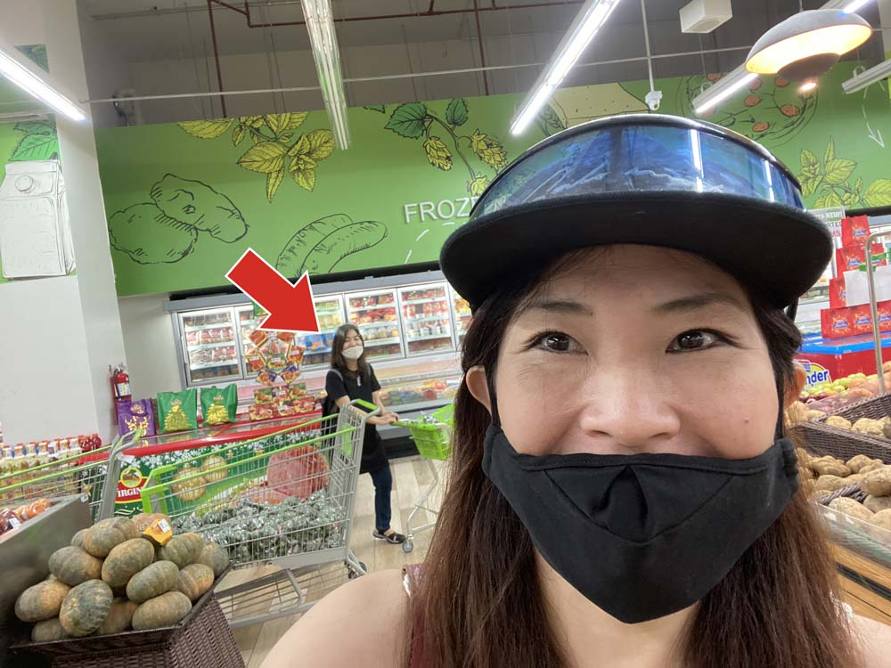

フロントエンドエンジニア、今はプータローのかみーゆです。

たまーにですが、セブ島唯一日本人占い師・さくら庵のマイアさんとお茶してます。

ぶっちゃけ私はプログラマーなのでまったく占い信じてません！！！

こんな私がマイアさんとの付き合いを通じて、占いに対して思ってることなどを綴ります。

<prof></prof>

## 人生の選択に悩んでるのであれば占ってもらえばいい
人生の選択に悩んでるのであれば占ってもらえばいいんじゃないですか？ 
「自分の答え持ってる人」は聞く必要ないかと思います。 
ぶっちゃけそういう人は占いなんて必要ないんです。

（SMモール・カフェラグーナ）

ただ、世の中には私のように自分の道をガンって決められる人の方が少ないようです。 
ほどんどの人が悩み、苦しみ、路頭に迷っています。

苦しいのなら話を聞いてもらう価値はあるんじゃないでしょうか？

## 私が占い師を信用しなかったワケ
ちなみに占いを信じていない私がマイアさんと出会ったのは昨年の10月ぐらいだったかと。

マイアさんとはセブ島にある私の行きつけのバー・リップルに週末出没していました。

はじめて話しかけられたとき、 
「悪いけど占い信じてないから私はいらない」って彼女にすぱっと言ってしまいました。

失礼ですよね。。。

マジでごめんなさい。胡散臭いし、探偵ならまだしも占い師がバーにいるなんてどうしたんだっくらいに思ってましたww

今ではセブ島で仲良しな友だちの1人なので、もちろんマイアさんの仕事に対する姿勢や考えも尊敬しています。

私が占い師への偏見ができた理由もちゃんとあるんです。

## 名付け親？占い師と私の過去の因縁
私の名前の由来について。おばあちゃんがたまたま立ち寄った占い師によってつけられました。 
頭がいい子なら「知恵」、美人になって欲しいなら「由理子」と候補をもらいました。 
で、おばあちゃんは私の名前を「由理子」にしたそうです。

（幼き日の由理子）

今となって思うのは、、、

**結果にコミットしろ！！！占い料金返せ！** 
どうせならもっと**オサレな名前を提案しろ**、ムキーーーー！

です。

ちなみに他の兄弟（実は4人兄弟・名前は伏せます）に関して補足しておきますと、 
「姉・明るい子」「兄・賢い子」「妹・優しい子」という感じで名付けられています。 
両親からは「こんな子に育ってほしい」という想いが込められてますね。

なんで私だけ名付け親が占い師なのかが不明です。 
今は親の重ーーーい願いがこもった名前より、縁も所縁（ゆかり）もない占い師が提案した名前で良かったとも思います。

ナゾに信心深いおばあちゃんは、また別の占い師に私を見てもらったようです。

その無責任な占い師は、「この子は他の兄弟に比べて母親に可愛がられてない」的なことを言いい放ちました。 
その言葉を鵜呑みにしたおばあちゃんは、事実確認もせず母にキツく当たりました。

だから占いはキライでした。

今では、占い師の言葉を鵜呑みにしたおばあちゃんが一番ダメだったとも理解してます。

## 私から見たマイアさんはどちらかというとカウンセラー

（バー・リップルにて占い中）

彼女は**タロットカード**で占ってくれます。
占う前に状況を聞いてくれます。

彼女に占ってもらい、救われた人は何人か知ってます。

私の受けた印象は、**原因や解決方法をかなり分析してその人の状況を判断**して近道を示しているように思います。

タロットカードを介して、ではありますが。

それってカウンセラーじゃない？って感じます。 
マイアさんは基本的に不要な占いはしません。

私もたまに占って欲しいことがありますが大抵言われるのは「かみーゆは占いいらないでしょ、答え持ってるもん」とのこと。

単にマイアさんと話がしたいだけのことも多いです。お見通しですね。

「**占いは責任のある仕事**」

不要な占いをしない理由には彼女が占いに対しての信念があるからなのでしょう。

マイア先生のアドバイスが誰かの人生に影響すると分かっているからなのだと思います。

### タロットカードに「仕事のパートナー」としての尊敬がある
おもしろいことに、マイア先生はタロットカードを尊敬してます。 
**タロットカードが仕事のパートナー**だって思ってるからでしょうね。

つい前も「**この子たち（タロットカード）、私よりよっぽど優秀だから**」と言ってました。 
そしてカードからメッセージを読み取ってどんな言葉を伝えるかも慎重です。

### 過去苦しい時期があったから占いで人を救いたいという想いがある
何度か話をする中で、過去苦しいことがあったそう。 
どんなことがあったかは知りませんし、そこに首をつっこむつもりはありません。 
ただ話できないことほど、辛いことだと勝手に予想しています。

私も辛いことほど口に出せないですし、ね。

マイアさんは占いに出会い救われたので自分が救われた占いで人の力になりたいと考えています。 
**生半可な気持ちでは占っていない**ということは伝わりました。

## 占いをあまり信じていない私の占いとの付き合い方
すでに答えを持ってるので占いが必要ない私ですが、占いに対して3つの見解を持ってます。

### 変わりたいなら、執着を捨てて素直な心で聞くべし
人は共感や同意を求めたい生き物です。 
すでに答えを持っていて、それに同意を求めたいだけなら占ってもらう必要ないんじゃない？という意見です。

営業妨害だったらごめんなさいw

そういう人って大抵悩みを抱え始めた時、周りに相談していると思います。 
そして周りからは自分にとって「納得いかないアドバイス」が周囲から返ってきてるのではないでしょうか？

すでにどうしたいか明確で、「正しさを証明したいだけ」なら他人に意見を求める必要ないんじゃないんですかね？

日本で昔、テレビでたまたま女芸人が「納得いく占い結果が出るまで占いをハシゴする」って言ってたのを見たことがあるります。  

「じゃあ行くなよ」って心の中でツッコミを入れました。  

自分の「正しさを証明したい」という欲求を満たしたいだけなら、**お金のムダなので占ってもらう必要ない**んじゃないですかね。

占い結果やアドバイスを受け入れられるようになり、「私の考え間違ってるかも」って少しでも思い始めたら人生が好転するかもしれませんよ！

### スピリチュアルとかガン無視で本気のアドバイスと捉える
マイアさんの言ってることは当たります。状況を冷静に整理・判断できるからだと思います。

タロットを持ってるだけで、実は一昔前に流行ったFBIのプロファイラーくらいに思ってます。

> #### プロファイラーとは？
>「こういう犯罪の犯人はこういう人間が多い」という統計学である。この犯罪者のパターンを推論する事を「プロファイリング」と言い、推定する専門家（捜査権を持っているとは限らず、外部委託で助言するだけの学者のこともある）を「プロファイラー(profiler)」、推定された結果を通常「プロファイル(profile)」と言う。
>
>犯行や犯罪現場で犯人像を推定する作業は現場の警察官や刑事でも行っている。それら現場の推定が経験によって行われる物である。経験による判断も個人の過去の事実、観察の統計的な裏付けに基づいたものである。しかし、経験によるという場合に、事実・観察を科学的記録している訳ではないことがある。それに対してプロファイリングは行動科学的知見を用いると言う点において異なる。

表情や話し方や態度から、**無意識のうちに性格や癖を事細かに分析してる**んだと思えます。 
メンタリストって一面も感じますね。

あくまで私の見方です！ 
どちらかというと、科学が好きなのでそんな風に思っているだけです。

もちろん**スピリチュアルが大好きな方は、ピュアな気持ちで占ってもらってください**。

### 何をすべきか自分で責任持って選ぶべし
散々占っておきながら、選択できない自分がいることもありますよね。

（ITパーク・スーパーメトロ）

私はマイアさんにアドバイスされても「やりたくないなー」てことはやらないです。

**心の声に従うのが一番**ですよ。

ぶっちゃけマイアさんのアドバイスも人生の一選択肢にすぎません。

**自分の道は自分で切り開かなくてどうするんですか？**

そんな考え方があるって思うだけでも「ものの見方は変わってくる」んじゃないでしょうか？

耳を傾けるだけでも、「**視野が広がる**」ことは間違いないと断言します。

## まとめ・本当に変わりたいならまっさらな気持ちでアドバイスを受け止めよう
私は散々占いを信じてないと言いつつ、マイアさんのアドバイスには一目置いてます。

ただ「自分の正しさを証明したい」だけであれば、ほかを当たってください。

ラッキーなことにさくら庵・マイアさんがこの木曜日から土曜日までキャンペーンしてます！土曜日が満月だからとのこと。

**インスタのフォロワー1000人登録記念！！！10分間無料で占ってもらえるそう**ですよ！ 
LINE@にお問い合わせしてみてください。

## さくら庵・マイアさんの満月リーディング・キャンペーン内容
《フォロワー様1000人突破記念》として、**10分間の満月リーディングを無料**でさせていただきます。 [LINE@](https://lin.ee/mRPHcCj)にご登録いただいて、［満リー希望］とメッセージいただけたら、日時をご相談させていただきます。
