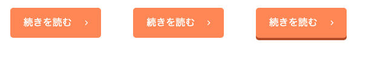
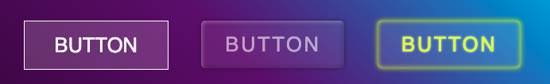
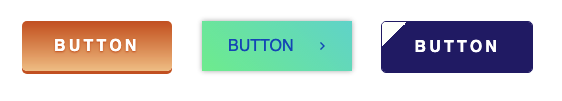
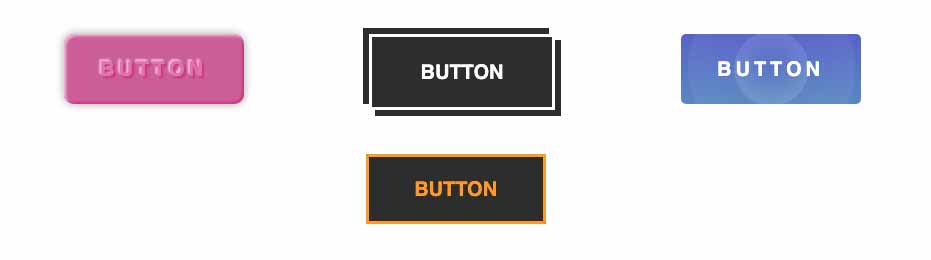

ボタンデザインやコーディングでどうCSSを書いていいか悩むことありませんか？

実用性重視だけどおしゃれなボタンのコードスニペット集をつくりました！<br>UI/UXの観点からどんなボタンが最適であるべきか解説つき！もちろんコピペで今すぐ使えます。

<prof></prof>


## ボタンを実装する上でUX/UI上重要な3つのポイント
ボタンのデザインでボタンのデザインでユーザーのことを考えて大切にしてことがあります。

### 1、サイズは適切か
スマホの時サイズが小さすぎるとタップできません。
**縦横のサイズが44px以上（Googleの推奨サイズ）** というのが鉄板です。

### 2、クリックできそうか
デザインとしてクリックできそうか、がポイントです。<br>
形としてボタンっぽかったらなおわかりやすいかと思います。

よくあるボタンデザインがこんな感じです。<br>
たとえばこんなオレンジのボタンがあるとします。


※ コンバージョン率が高いと言われているのであえてオレンジを使っています。

アイコン、文字をのせたらもうボタンって何と無くわかりますよね？

ユーザーに「**なんかクリックできそう**」って思わせるのがポイントです。

### 3、他のパーツと差別化できているか
ウェブサイトではとくにCVボタンなどであれば、クリックされる事が重要なポイント。<br>
他のパーツ（コンテンツ）との差別化をしっかりしておく必要があります。

## ベーシックなボタンのコード3つ
まずはベーシックなボタンのコードをご紹介します。



この3つレパートリーを持っていればとりあえずどうにかなります。多分。

よくある続きを読むボタンですね。<br>
今回右に配置したアイコンは「Material Design Iconic Font」※ を使っています。

[Material Design Iconic Font](https://zavoloklom.github.io/material-design-iconic-font/index.html)


※ 使うアイコンが少ないのであれば、マテリアルアイコンを使わずCSSだけで対応したほうがサイトが軽量になります。詳しくは[こちら](#簡単なアイコンはclip-pathで実装したほうが軽量2025年1月追記)。


Flexを使って、文字とアイコンを縦横均等に配置してます。

[ベーシックなボタン | Code Pen](https://codepen.io/camile/pen/LYZqzEp)


### pointer-events の使い方と使いどころ
パーツでいえばページネーションや、COMING SOONにしてリンクが貼れないバナーなどに使うことが多めです。<br>
CMSから吐き出すタグを**自分では書き換えられないけどCSS側でクリックを禁止したい**、などのケースで重宝します。

### ホバーで半透明

<figure class="animation"></figure>

```html:title=HTML
<a href="" class="btn--basic">続きを読む<i class="zmdi zmdi-chevron-right"></i></a>
```

```css:title=CSS
/* btnから始まるクラス */
a[class^=btn] { 
  background: #FF9258;
  display: flex;
  width: 150px;
  height: 50px;
  border-radius: 5px;
  justify-content: space-evenly;
  align-items: center;
  color: #fff;
  text-decoration: none;
  transition: opacity .3s;
}

.btn--basic:hover {
  opacity: 0.7;
}
```

<div class="box"><h4>transition にはプロパティを指定する</h4><p>transition の対象のプロパティを指定しない場合、ブラウザに負担をかけ、パフォーマンスに大きな影響を与えてしまうことがあります。 opacity のようなプロパティの使用しましょう。</p></div>

### 色が反転

<figure class="animation"></figure>

ホバーすると、ボーダーが反転します。<br>
他のボタンとサイズを合わせるためにbox-sizing: border-box;でborderを内側に含めています。

```html:title=HTML
<a href="" class="btn--border">続きを読む<i class="zmdi zmdi-chevron-right"></i></a>
```

```css:title=CSS
.btn--border {
  height: 46px;
  background: #FF9258;
  display: flex;
  width: 150px;
  border-radius: 5px;
  justify-content: space-evenly;
  align-items: center;
  color: #fff;
  text-decoration: none;
  transition: background-color .3s, color .3s;
  border: 2px solid #FF9258;
}

.btn--border:hover {
  background: #fff;
  color: #FF9258;
}
```

### 定番の立体感のあるボタンらしいボタン
<figure class="animation"></figure>

定番のボタンらしいボタンを作るとき、私はかならずY軸に向かった`box-shadow`を使います。<br>
クリックしたとき、押した感が出るように`translate`で位置をわずかに下げ、さらに`box-shadow`も同じ分量減らします。<br>
これで不自然な挙動をしないボタンらしいボタンの完成です。

```html:title=HTML
<a href="" class="btn--button">続きを読む<i class="zmdi zmdi-chevron-right"></i></a>
```

```css:title=CSS
.btn--button {
  position: relative;
  height: 50px;
  background: #FF9258;
  display: flex;
  width: 150px;
  border-radius: 5px;
  justify-content: space-evenly;
  align-items: center;
  color: #fff;
  text-decoration: none;
  transition: translate .3s, box-shadow .3s;
  box-shadow: 0 4px 0 #B45624;
}

.btn--button:hover {
  translate: 0 2px;
  box-shadow: 0 2px 0 #B45624;
}
```


<div class="box"><h4>CSSセレクターこんな指定の仕方もあるよ！</h4><p>私、コードが減るという理由で時折トリッキー？な指定方法を使います。参考までに。</p><p>クラスの前方一致<br>セレクタ名[class^=btn]<br>ある文字列から始まるクラスのみを指定できます。この場合btnほにゃららといった感じですね。<br>クラスの後方一致<br>セレクタ名[class$=btn]<br>逆に後方一致だとこんな書き方ができます。<br>部分一致<br>セレクタ名[*=btn]<br>btnが含まれるか否か</p></div>

## 簡単なアイコンはclip-pathで実装したほうが軽量（2025年1月追記）
便利なプロパティがたくさん出てきて、最近一番重宝しているのが`clip-path`です。grid でコードを書いたほうが変な調整もいらないです。


コードに関しては以下の記事で紹介しています。

<card slug="entry536"></card>

## ボタンのCSSコード・スニペット
いくらかわいい、かっこいいと思えてもそのデザイン普通使えないと意味がありませんよね？
実戦で使えそうなものだけピックしてご紹介します。

### スケルトンボタン・ベースから応用まで
背景が黒っぽい場合にスケルトンボタンってかっこいいです。<br>
濃いめのグラデの上に乗っけるのもオススメです。



ベースのスケルトン、クリアソープのようなスケルトン、ネオンのようなスケルトン3つのコードスニペットを作ってみました。

今回のポイントは **rgb関数** ※です。<br>
半透明の白は濃いめの背景のデザインを生かせるのでオススメです。<br>
文字サイズが小さいと見えないので注意です。

<div class="box">
<h4>rgb関数</h4>
<p>指定方法: rgb(255 255 255 / .3)</p>
<ul>	<li>r 赤(0 - 255)</li>	<li>g 緑(0 - 255)</li>	<li>b 青(0 - 255)</li>	<li>/以降 alpha(0 - 1)</li></ul>
<p>RGBカラーモデルのred・green・blueに、/以降にalphaを加えることができます。<br>rgbは数値が高いほど純色となります。aが0だと透明で1に近づくにつれ不透明となります。</p>
</div>


[スケルトンボタン・ベースから応用まで|Code Pen](https://codepen.io/camile/pen/LYZqzjR)

#### ベースのスケルトン

<figure class="animation"></figure>

背景を半透明にしただけで、クリックとともに白っぽさが増します。

```html:title=HTML
<a href="" class="btn--skeleton">BUTTON</a>
```

```css:title=CSS
.btn--skeleton {
  background: rgb(255 255 255 / .2);
  display: flex;
  width: 180px;
  height: 60px;
  font-size: 1.6rem;
  justify-content: space-evenly;
  align-items: center;
  color: #fff;
  text-decoration: none;
  transition: background-color .3s;
  border: 1px solid #fff;
}

.btn--skeleton:hover {
  background: rgb(255 255 255 / .5);
}
```

#### クリアソープのようなスケルトンボタン
<figure class="animation"></figure>

クリアソープのように少し立体感をつけてみました。<br>
box-shadowをinsetにして立体感をつけています。

```html:title=HTML
<a href="" class="btn--skeleton2">BUTTON</a>
```

```css:title=CSS
.btn--skeleton3 {
  background: rgb(255 255 255 / .1);
  display: flex;
  width: 180px;
  height: 60px;
  font-size: 1.6rem;
  border-radius: 5px;
  justify-content: center;
  align-items: center;
  letter-spacing: .1em;
  color: #E5FF1D;
  text-shadow:  0 0 3px rgb(255 255 255 / .8);
  text-decoration: none;
  transition: color .3s, text-shadow .3s, box-shadow .3s, background-color .3s;
  box-shadow: inset 0 0 6px #E5FF1D, 0 0 6px #E5FF1D;
}

.btn--skeleton3:hover {
  color: #E5FF1D;
  background: transparent;
  text-shadow:  0 0 2px #E5FF1D, 0 0 3px #E5FF1D;
  box-shadow: inset 0 0 4px #E5FF1D, inset 0 0 8px #E5FF1D, 0 0 4px #E5FF1D, 0 0 8px #E5FF1D;
}
```

#### ネオンのようなスケルトンボタン
<figure class="animation"></figure>

ボーダーをbox-shadowだけで作って、ライトのようにしています。

```html:title=HTML
<a href="" class="btn--skeleton3">BUTTON</a>
```

```css:title=CSS
.btn--skeleton3 {
  background: rgb(255 255 255 / .1);
  display: flex;
  width: 180px;
  height: 60px;
  font-size: 1.6rem;
  border-radius: 5px;
  justify-content: center;
  align-items: center;
  letter-spacing: .1em;
  color: #E5FF1D;
  text-shadow:  0 0 3px rgb(255 255 255 / .8);
  text-decoration: none;
  transition: color .3s, text-shadow .3s, box-shadow .3s, background-color .3s;
  box-shadow: inset 0 0 6px #E5FF1D, 0 0 6px #E5FF1D;
}

.btn--skeleton3:hover {
  color: #E5FF1D;
  background: transparent;
  text-shadow:  0 0 2px #E5FF1D, 0 0 3px #E5FF1D;
  box-shadow: inset 0 0 4px #E5FF1D, inset 0 0 8px #E5FF1D, 0 0 4px #E5FF1D, 0 0 8px #E5FF1D;
}
```

### グラデーションを利用したボタン


グラデーションはアニメーションが滑らかに行われないのが難点です。<br>
なので、beforeなどで1個要素を作って移動などアニメーションをさせます。

ここでの**ポイントがz-index**です。

擬似要素を文字の下にもぐりこませないと、字が見えないのでz-indexを使って要素の順番を入れ替えます。

* 親要素 z-index: 1
* 擬似要素 z-index: -1

[グラデーションを利用したボタン|Code Pen](https://codepen.io/camile/pen/xxOMXvq)

今回グラデーションを作るのに使ったのはこのジェネレーターです。
[CSS Gradient](https://cssgradient.io/)

#### グラデーション反転

<figure class="animation"></figure>

あらかじめグラデーションを逆にした擬似要素をopacity:0で隠しておき、ホバー時に表示させグラデーションを反転させます。

```html:title=HTML
<a href="" class="btn--gradient">BUTTON</a>
```

```css:title=CSS
.btn--gradient {
  z-index: 1;
  display: flex;
  width: 150px;
  height: 50px;
  justify-content: space-evenly;
  align-items: center;
  color: #fff;
  font-weight: bold;
  border-radius: 5px;
  text-decoration: none;
  position: relative;
  background: rgb(238,198,139);
  background: linear-gradient(0deg, rgb(238 198 139 / 1) 0%, rgb(194 91 24 / 1) 100%);
  letter-spacing: .2em;
  text-shadow: 0 1px 2px #c25b18;
  box-shadow: 0 3px 0 #c25b18;
  transition: translate .3s, text-shadow .3s, box-shadow .3s;
}

.btn--gradient:hover{
  translate: 0 1px;
  text-shadow: 0 -1px 2px #c25b18;
  box-shadow: 0 2px 0 #a44d15;
}

.btn--gradient::before {
  content: '';
  display: block;
  width: 100%;
  height: 100%;
  position: absolute;
  left: 0;
  top: 0;
  z-index: -1;
  border-radius: 5px;
  background: linear-gradient(0deg, rgb(194 91 24 / 1) 0%, rgba(238 198 139 / 1) 100%);
  opacity: 0;
  transition: opacity .3s;
}

.btn--gradient:hover::before {
  opacity: 1;
}
```
#### グラデーションが横にスライド
擬似要素を2倍（200%）のサイズに作り、`overflow: hidden`で隠しておきます。
hoverした時に`left: -100%`でアニメーションさせます。

<figure class="animation"></figure>

```html:title=HTML
<a href="" class="btn--gradient2">BUTTON<i class="zmdi zmdi-chevron-right"></i></a>
```

```css:title=CSS
.btn--gradient2 {
  z-index: 1;
  display: flex;
  width: 150px;
  height: 50px;
  justify-content: space-evenly;
  align-items: center;
  color: #184dc2;
  text-decoration: none;
  position: relative;
  box-shadow: 0 0 5px rgb(0 0 0 / .3);
  overflow: hidden;
}

.btn--gradient2::before {
  content: '';
  display: block;
  width: 200%;
  height: 100%;
  position: absolute;
  left: 0;
  top: 0;
  z-index: -1;
  background: rgb(139, 238, 145);
  background: linear-gradient(45deg, rgb(139, 238, 145) 0%, rgb(109, 199, 255) 100%);
  transition: left .3s;
}

.btn--gradient2 i {
  text-shadow: 0 0 0 transparent;
  transition: translate .3s, text-shadow .3s;
}

.btn--gradient2:hover i {
  translate: 3px 0;
  text-shadow: 4px 0 0 #184dc2, 8px 0 0 #184dc2;
}

.btn--gradient2:hover::before {
  left: -100%;
}
```
#### きっちりセパレートさせた色でアニメーション

<figure class="animation"></figure>

私のこのブログのデザインにも使っている左上のマークがスライドするボタンです。<br>
ポイントはグラデの角度を315度の斜めにし左右の色をそれぞれ50%に設定します。<br>
あとは先ほどのグラデーション横にスライドのようにアニメーションさせるだけです。

```html:title=HTML
<a href="" class="btn--gradient3">BUTTON</a>
```

```css:title=CSS
.btn--gradient3 {
  z-index: 1;
  display: flex;
  width: 150px;
  height: 50px;
  justify-content: center;
  align-items: center;
  color: #fff;
  font-weight: bold;
  border-radius: 5px;
  text-decoration: none;
  position: relative;
  border: 1px solid #211b71 ;
  letter-spacing: .2em;
  overflow: hidden;
  transition: color .3s;
}

.btn--gradient3::before {
  content: '';
  display: block;
  width: 200%;
  height: 100%;
  position: absolute;
  left: -100%;
  top: 0;
  z-index: -1;
  background: rgb(33,27,113);
  background: linear-gradient(315deg, rgb(33, 27, 113) 50%, rgb(254, 255, 251) 50%);
  transition: left .3s;
}

.btn--gradient3:hover {
  color: #211b71;
}

.btn--gradient3:hover::before {
  left: 0;
}
```

## その他よりインタラクティブなボタン
その他型押しのような文字のボタン、shadowを利用したクールなボタン、マウスオーバーすると波紋が広がるボタンなど作ってみました。



[その他よりインタラクティブなボタン| Code Pen](https://codepen.io/camile/pen/QWEYOMb)

### 文字がエンボス

<figure class="animation"></figure>

text-shadowとbox-shadowでエンボス風のボタンです。

```html:title=HTML
<a href="" class="btn--emboss">BUTTON</a>
```

```css:title=CSS
.btn--emboss {
  display: flex;
  width: 180px;
  height: 70px;
  justify-content: center;
  align-items: center;
  color: #de7fb5;
  font-weight: bold;
  border-radius: 10px;
  font-size: 20px;
  text-decoration: none;
  position: relative;
  text-shadow: 2px 2px 2px #c8428f, -2px -2px 2px #f2c4df;
  background: #cb69a2;
  letter-spacing: .2em;
  box-shadow: inset 2px 2px 3px #f2c4df, inset  -2px -2px 2px #c8428f, 0 0 10px rgb(0 0 0 / .3);
  transition: background-color .3s, color .3s, text-shadow .3s;
}

.btn--emboss:hover {
  background: #c15795;
  color: #cb69a2;
  text-shadow: 2px 2px 2px #c8428f, -2px -2px 2px #ecaed2;
}
```
### パキッとした影が広がるボタン

<figure class="animation"></figure>

box-shadowを2個重ねるだけで、クールなボタンができます。
```html:title=HTML
<a href="" class="btn--shadow">BUTTON</a>
```

```css:title=CSS
.btn--shadow {
  display: flex;
  width: 180px;
  height: 70px;
  justify-content: center;
  align-items: center;
  color: #333;
  font-weight: bold;
  font-size: 20px;
  background: #fff;
  text-decoration: none;
  border: 3px solid #333;
  transition: background-color .3s, color .3s, box-shadow .3s, border-color .3s;
}

.btn--shadow:hover {
  background: #333;
  color: #fff;
  border: 3px solid #fff;
  box-shadow: 6px 6px 0 #333, -6px -6px 0 #333;
}
```
### クリックすると波紋が広がるボタン

<figure class="animation"></figure>

クリックすると波紋が広がります。

```html:title=HTML
<a href="" class="btn--bubble">BUTTON</a>
```

```css:title=CSS
.btn--bubble {
  z-index: 1;
  display: flex;
  width: 180px;
  height: 70px;
  justify-content: center;
  align-items: center;
  color: #fff;
  letter-spacing: .2em;
  font-weight: bold;
  border-radius: 5px;
  font-size: 20px;
  text-decoration: none;
  background: rgb(105,147,203);
  background: linear-gradient(0deg, rgb(105,147,203) 0%, rgb(97,110,213) 100%);
  overflow: hidden;
  position: relative;
}

.btn--bubble::before {
  content: '';
  height: 25px;
  width: 25px;
  left: calc(50% - 12px);
  bottom: calc(50% - 12px);
  border-radius: 50%;
  display: block;
  background: rgb(255,255,255);
  background: radial-gradient(circle, rgba(255 255 255 / 0) 0%, rgba(255 255 255 / .5) 100%);
  opacity: 0;
  position: absolute;
}

.btn--bubble::after {
  position: absolute;
  content: '';
  height: 25px;
  width: 25px;
  left: calc(50% - 12px);
  bottom: calc(50% - 12px);
  display: block;
  opacity: 0;
  border-radius: 50%;
  background: radial-gradient(circle, rgba(255 255 255 / 0) 0%, rgba(255 255 255 / .5) 100%);
}

.btn--bubble:hover::before {
  animation: expand 2.5s .5s infinite;
}

.btn--bubble:hover::after {
  animation: expand 2.5s infinite;
}

@keyframes expand{
  0% {
    opacity: .5;
  }
  100% {
    scale: 10;
    opacity: 0;
  }
}
```
### ボーダーがアニメーションするボタン
<figure class="animation"></figure>

ボーダーが左上と右下からアニメーションするボタンです。**heightとwidthを0から100%**に広げることで実現しています。
```html:title=HTML
<a href="" class="btn--border">BUTTON</a>
```

```css:title=CSS
.btn--border {
  display: flex;
  width: 180px;
  height: 70px;
  justify-content: center;
  align-items: center;
  color: #333;
  font-weight: bold;
  font-size: 20px;
  background: #fff;
  text-decoration: none;
  border: 3px solid #333;
  transition: .3s;
  box-sizing: border-box;
  position: relative;
}

.btn--border::before {
  content: '';
  height: 0;
  width: 0;
  right: -3px;
  top: -3px;
  position: absolute;
  border-top: 3px solid orange;
  border-right: 3px solid orange;
  border-left: 3px solid transparent;
  border-bottom: 3px solid transparent;
  opacity: 0;
  transition: background-color .5s, color .3s;
}

.btn--border::after {
  content: '';
  height: 0;
  width: 0;
  bottom: -3px;
  left: -3px;
  position: absolute;
  border-bottom: 3px solid orange;
  border-left: 3px solid orange;
  border-right: 3px solid transparent;
  border-top: 3px solid transparent;
  opacity: 0;
  transition: width .5s, height .5s, opacity .5s;
}

.btn--border:hover {
  background: #333;
  color: orange;
}

.btn--border:hover::before,
.btn--border:hover::after {
  height: 100%;
  width: 100%;
  opacity: 1;
}
```

### グラデーション×シャドーを駆使した立地なボタン(2022/12/17追加)
まるで画像で書き出したようですがCSSのみで実装できるボタンのご紹介です。
<figure class="animation"></figure>

```html:title=HTML
<a href="" class="btn--rich">Button</a>
```
```css:title=CSS
.btn--rich {
  margin-left: 20px;
  margin-top: 50px;
  text-decoration: none;
  color: #fff;
  height: 90px;
  z-index: 1;
  letter-spacing: 0.1em;
  position: relative;
  background: #E77838;
  width: 400px;
  transition: box-shadow .3s, background-color .3s;
  display: flex;
  justify-content: center;
  align-items: center;
  border-radius: 50px;
  font-weight: 900;
  text-shadow: 0 0 2px rgb(0 0 0 / 0.5);
  font-size: 24px;
}
.btn--rich::after, .btn--rich::before {
  content: "";
  position: absolute;
  background: linear-gradient(to bottom, #FF9438 0%, #E77838 100%);
  height: calc(100% - 16px);
  width: calc(100% - 16px);
  z-index: -1;
  display: block;
  left: 8px;
  top: 8px;
  border-radius: 50px;
  box-shadow: 0 0 2px rgb(0 0 0 / 0.5);
}
.btn--rich::after {
  opacity: 0;
  background: linear-gradient(to top, #FF9438 0%, #E77838 100%);
  box-shadow: none;
  transition: opacity .3s;
}
.btn--rich:hover {
  background: #FF9438;
  box-shadow: 0 0 10px rgb(0 0 0 / 0.３);
}
.btn--rich:hover::after {
  opacity: 1;
}
```

## まとめ・ウェブサイトと調和するボタンを設置しよう
ボタンデザインたくさんあって目移りすると思いますが、凝りすぎているとサイトと調和するのが難しい場合もあります。

サイトと調和するかよく考慮した上で、実装するのが◯ですね！

その他チェックボックス やセレクトボックスのフォームパーツ類もコードスニペットあります。
参考にしてください。

<card slug="entry370"></card>

<card slug="entry393"></card>

みなさんのコーディングライフの一助となれば幸いです。

最後までお読みいただきありがとうございました。
