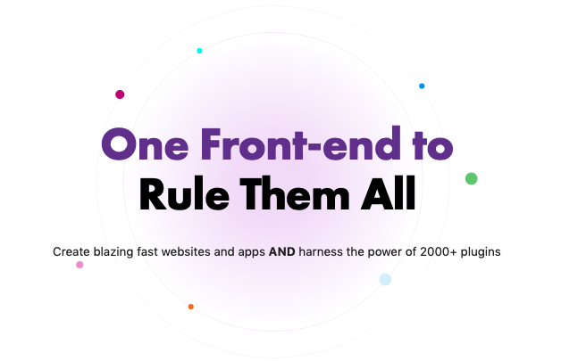
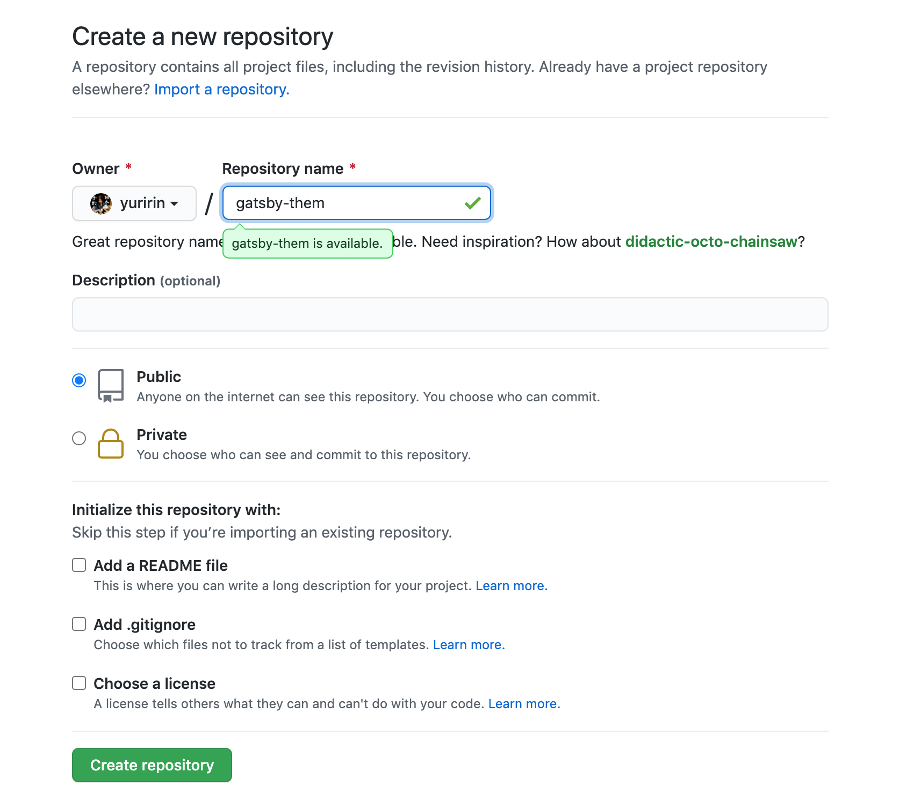
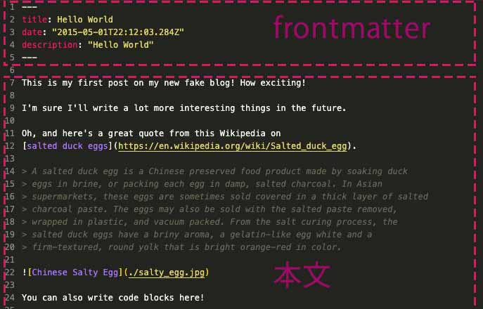
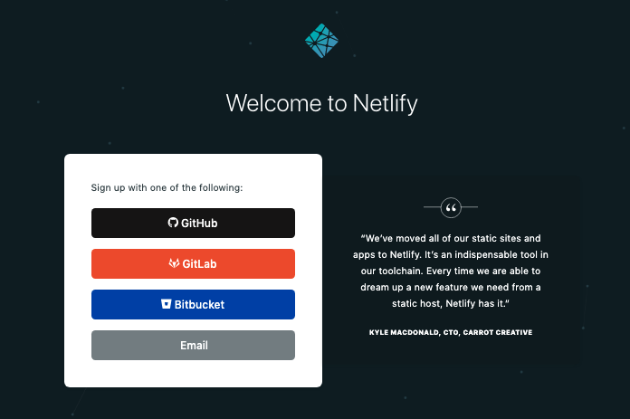
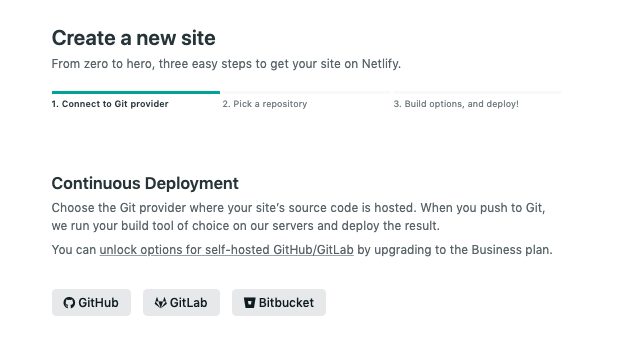

現在、前から気になる静的サイトジェネレーターのGatsbyでブログを作り直しています。

今回はインストールして、Netlifyでデプロイしてウェブサイトを公開するまでの方法をご紹介します。<br>このサイト表示の重さに耐えかねて、サクラのレンサバ×concrete5でブログ書くのを断念することにしました。

<p><small>※ Mac以外では検証してません。ご了承ください。<br>※ 2021年12月28日v4対応のためリライトしました。</small></p>

<prof></prof>

## 今までのGatsbyの記事と注意点
現在ここまで記載しています。<br>制作するまでを目標にUPしていくので順を追ったらGatsbyサイトが作れると思います。

1. *インストールからNetlifyデプロイまで*（←イマココ）
2. [ヘッダーとフッターを追加する](/blogs/entry484/)
2. [投稿テンプレにカテゴリやらメインビジュアル（アイキャッチ）追加](/blogs/entry406/)
3. [ブログ記事、カテゴリ、タグ一覧の出力](/blogs/entry408/)
4. [プラグインを利用して目次出力](/blogs/entry410/)
5. [プラグインナシで一覧にページネーション実装](/blogs/entry413/)
6. [個別ページテンプレート作成](/blogs/entry416/)
7. [プラグインHelmetでSEO調整](/blogs/entry418/)
8. [CSSコンポーネントでオリジナルページを作ろう！！](/blogs/entry421/)
9. [関連記事一覧出力](/blogs/entry430/)
11. [タグクラウドコンポーネントを作成する](/blogs/entry486/)
12. [パンくずリストを追加する](/blogs/entry487/)
13. [記事内で独自タグ（コンポーネント）を使えるようにする](/blogs/entry489/)

v5へのアップグレード方法はこちら。
<card slug="entry519"></card>

<small>※ Gatsbyは2021月12月、v4にバージョンアップしています。随時リライトしています。</small>


このシリーズは[Github・gatsby-blog](https://github.com/yuririn/gatsby-blog)に各内容ブランチごとで分けて格納しています。

今回は[install-deploy](https://github.com/yuririn/gatsby-blog/tree/install-deploy)にあります。

## Gatsby(JS)とは？
Gatsby(JS)はReactで作られた **静的サイトジェネレーター** です。内部的にGraphQLを用いてデータを取得し、markdownからHTMLを生成、などの処理をカンタンに行うことができます。<br>



[公式サイト](https://www.gatsbyjs.com/)

生成される静的サイトは **SPA（シングルページアプリケーション）** でもあるので、表示速度も速く感動します。

### Gatsby(JS)の気になる難易度
難易度はJS触れる人ならなんとかいけると思います。<br>
1から作ること考えたら超楽です！
Reactの入口としてはオススメです。コンポーネント作る練習にもなります。

ES6以上の記述方法がある程度知っている。<br>
あと*GraphQL*の使い方知らないと慣れるまでしんどいかもしれません。

*React*、*GraphQL*についてはこのブログの最後の方に説明足してます。興味あったら読んでください。

## Gatsby JS をインストール
まずは、Gatsbyをグローバルにインストールします。
インストールできない場合は、`sudo`実行してください。

> Minimal Node.js version 14.15.0

現時点でのv4で必要とするNodeの最低バージョンは*14.15.0*です。バージョンの上げ方が分からない方はこちらをご覧ください。

<card slug="entry477"></card>

```bash:title=コマンド
npm install -g gatsby-cli
```
もしくは
```bash:title=コマンド
sudo npm install -g gatsby-cli
```

## スターター用テンプレートをインストール
まずはスターター用テンプレートをインストールしましょう。

[Gatsby Starter Library](https://www.gatsbyjs.com/starters/)

一番メジャーでベーシックな**Gatsby Starter Blog**をインストールします。


公式ページのStarterの中に「[gatsby-starter-blog](https://www.gatsbyjs.com/starters/gatsbyjs/gatsby-starter-blog/)」があるので「Install with gatsby-cli」から以下コードをコピーします。

```bash:title=コマンド
npx gatsby new gatsby-starter-blog https://github.com/gatsbyjs/gatsby-starter-blog
```

gatsby-starter-blog はディレクトリー名なのでお好みで変えてください。

```bash:title=コマンド
npx gatsby new my-project https://github.com/gatsbyjs/gatsby-starter-blog
```

cdコマンドで移動します。

```bash:title=コマンド
cd my-project
```

<msg txt="私は普段 VS Code からコマンドを使います！Gatsbyのディレクトリーができたら、そのディレクトリをVS Codeで開くことをオススメします。"></msg>

Netlifyにデプロイしたいのでgitにも追加します。

今回私はgithubを使い、公開設定で制作することにしました。

[https://github.com/](https://github.com/)


早速新しくリポジトリを作ります。<br>
とくに設定せずデフォルトのままで追加します。



以下は実際制作中のリポジトリです。

[gatsby-theme](https://github.com/yuririn/gatsby-theme)

コミットできるようにしておきます。<br>
まずは「first commit」とコメントしてコミット。
```bash:title=コマンド
git init
git add .
git commit -m 'first commit'
```

リモートと連携します。連携するURLはgithubのリポジトリページから取得しておきます。


以下のコマンドでリモートリポジトリと連携できます。
```bash:title=コマンド
git remote add origin https://github.com/yuririn/gatsby-theme.git
```
gitアカウントを複数使い分けている人は、**ssh接続じゃないとpushできない**ので以下のコマンドで。
```bash:title=コマンド
git remote add origin git@github.com:yuririn/gatsby-theme.git
```
注意！！！

最近、githubのポリシーが変わって複数のアカウントでhttpsでのpushができなくなりました。<br>
その場合は、鍵設定が必要です。<br>
設定の仕方はこちらを参考に。
[GitHubでssh接続する手順~公開鍵・秘密鍵の生成から~](https://qiita.com/shizuma/items/2b2f873a0034839e47ce)

とりあえず今回は mainブランチ へプッシュできるようにしておきましょう！！
```bash:title=コマンド
git push --set-upstream origin main
```
追加できているか確認。
```bash:title=コマンド
git remote -v
```
## Gatsbyを起動してみる
早速Gatsbyを起動してみましょう！

以下コードでタスクランナーが走ります。
```bash:title=コマンド
npm start
```
他にもコマンドがいくつかありますが、頻繁に使うのは`npm run clean`ぐらいです。

|コマンド|詳細|
|-|-|
|*npm start*| 開発サーバーを起動|
|*npm run build*|ビルド|
|*npm run serve*|ビルドした内容を動かす|
|*npm run format*|コードの整形|
|*npm run clean*|ローカルのキャッシュなどの削除|


## 初期設定等を変更しよう
ファイル *gatsby-config.js* から初期設定を変更しておきましょう！

サイトメタ情報変更。お好みで変更してください。

```js:title=gatsby-config.js
siteMetadata: {
  title: `銀ねこアトリエ`,
  author: {
    name: `かみーゆ`,
    summary: `セブ島に住むフロントエンドエンジニア`,
  },
  description: `セブ島に住むフロントエンドエンジニアの気ままな日記`,
  siteUrl: `https://ginneko-atelier.com/`,
  social: {
    twitter: `lirioY`,
  },
},
```
## 記事を追加しよう！
さらに記事を追加します！
記述方法はMarkdownです。

記事はcontent/blog内に格納されています。

```js:title=gatsby-config.js
plugins: [
  {
    resolve: `gatsby-source-filesystem`,
    options: {
      path: `${__dirname}/content/blog`,
      name: `blog`,
    },
  },
],
```
### 投稿：test.mdを追加してみよう
/blogディレクトリー直下に*test.md*を追加してみましょう！

構造は以下の通り。

タイトルやメタ情報を追記できるfrontmatterの部分と、本文に当たる部分の2パートあります。


以下の通りfrontmatterを書いてみます。
```md:title=test.md
---
title: テスト投稿
date: 2020-11-26
description: この記事はテスト投稿です
---
```
以下はSEO的に大切なので抜かりなく記述しておきましょう。

* *title* ... タイトル
* *date* ... 日にち。-（ハイフン）でくぎる
* *description* ... 記事の説明

それに続けて適当に本文を書いてみましょう！

```md:title=test.md
## 見出し2
はじめての投稿です！ワクワク、ドキドキ！

```

今回はテスト練習なので、これでコミット&プッシュしてデプロイしてみます。

**ファイルの追加**
```bash:title=コマンド
git add .
```
通常のコミット。
```bash:title=コマンド
git commit -m '記事追加'
```

今回は次のように**コミットメッセージを概要と詳細**に分けたい時は間に改行を挟みます。


```bash:title=コマンド
git commit -F- <<EOM
>記事追加
>
>テスト記事を投稿する
>EOM
```
EOM入力で終了できます。

もしコミットのコメントを間違えたと思ったらctrl + cで一旦抜けて入力しなおしましょう。

## Netlifyへデプロイする
Netlify を git と連携して mainブランチ に push されたデータが反映するように設定しましょう！

[Netlify公式サイト](https://www.netlify.com/)


右上のSign Upから入って、githubと連携させます。



「New site from Git」からリポジトリを追加します。


Continuous DeploymentからGitHubを選択。




勝手に公開用のディレクトリpublicとbuildコマンド`gatsby build`が選ばれます。<br>
あとは「Deploy site」ボタンをクリックするだけです！


これで少し待ったら、デプロイのステータスがpublishedとなるはずです！！


### Node のバージョンにご注意（2021/12/12追記）
初期デプロイ時にデフォルトで最新の安定バージョンのNodeがインストールされます。以後引き続き最初インストールされたNodeが使用されます。 現段階（2021/12/12）ではNetlifyは現在12.x.x以上でないと使えません。

[Gatsby をアップグレード（v4→v5）して Netlify にデプロイ](/blogs/entry519/#Netlify 側で Node バージョンを指定する)で、リポジトリにファイルを追加するだけで、Node バージョンを変更できる方法を紹介しています。

*ビルドでコケます*。

古くなってしまった場合は、Nodeのバージョンを設定し直します。

Site setting > Build & deploy > Environment に移動。


Environment variables に Key => `NODE_VERSION` value => `x.x.x`（設定したいバージョン）をセットして保存（Save）します。


必ず、Netlifyで使用できるバージョンを確認しておいた方がいいいです。

これで次回のデプロイ時から、新しいバージョンが使えます。


Gatsby ではバージョンごとに*Nodeの求められるversionが違う*ので注意してください。
<card slug="entry477"></card>

## まとめ
いかがでしたでしょうか？<br>
Github と連携して、gitのコマンドで mainブランチ に push するだけで公開できるようになったかと思います。

次回は「[ヘッダーとフッターを追加する](/blogs/entry484/)」をご紹介します！

最後までお読みいただきありがとうございました。

### 参考 & Wiki
今回難しい用語が多かったので、Wikiをつけました。参考にしてください。

#### 静的サイトジェネレーターとは？
静的なHTML/CSS & JavaScriptを生成するツールのこと。

#### Reactとは？
Facebookの開発したJavaScriptのフレームワーク・ライブラリの1つです。
UIのパーツ（構成部品）、いわゆるコンポーネントを作り、組み合わせてウェブサイトなどをできます。
パーツを再利用できるのが最大の特徴です。


[React 公式サイト](https://ja.reactjs.org/)

#### GraphQLとは？
Facebookが開発しているWeb APIのための規格で「クエリ言語」と「スキーマ言語」の2つから構成されています。

* **クエリ言語**は、GraphQL APIのリクエストのための言語で、これはさらにデータ取得系のquery、データ更新系のmutation、サーバーサイドからのイベントの通知であるsubscriptionの3種類があります。なお、この記事では、総称としてのクエリ言語は「クエリ言語」と書き、クエリの3種のひとつであるqueryは「query」と書くことにします。
* **スキーマ言語**は、GraphQL APIの仕様を記述するための言語です。リクエストされたクエリは、スキーマ言語で記述したスキーマにしたがってGraphQL処理系により実行されて、レスポンスを生成します。

[「GraphQL」徹底入門 ─ RESTとの比較、API・フロント双方の実装から学ぶ](https://eh-career.com/engineerhub/entry/2018/12/26/103000)
