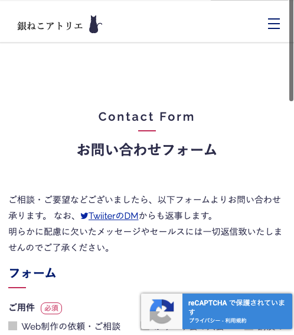
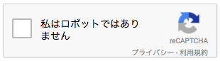
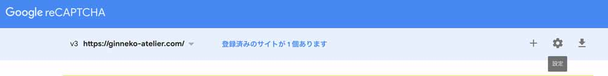
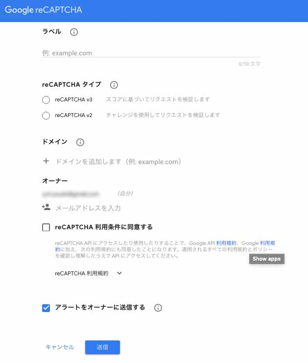
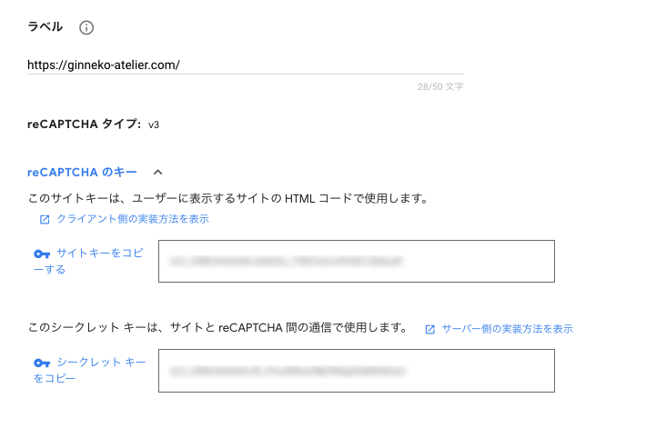

## reCAPTCHA とは？
みなさん、スパム対策してますか？GoogleのreCAPTCHA v3が機械学習で「このメールスパムやで！」って選り分けてくれるようになりました。

リリース当初は喜び勇んで運用しているサイトにガツガツ実装しました。

じつは最近、当ブログサイト「銀ねこアトリエ」に実装してみたのでそのやり方を紹介します。

<prof></prof>


みなさん、このスクショの右下のラベル見たことありますか？

これ、reCAPTCHA v3と言います。


> reCAPTCHA（リキャプチャ）とは、ウェブサイトの制限エリアへのアクセスを試みるボットからサイトを防御するためCAPTCHAを利用するのと同時に、そのCAPTCHAに対する返答を紙の本のデジタル化に活かすシステムである。<br>
> [reCAPTCHA | Wikipedia](https://ja.wikipedia.org/wiki/ReCAPTCHA)

我々の使い道としてはボットを排除して、**スパムからあなたのサイトを守ってくれるありがたい無料サービス**です。

「私はロボットではありません」<br>
「何個信号あるか選べ」

みなさん経験あるんじゃないでしょうか？<br>
↓↓↓こいつ、結構イライラしますよねww↓↓↓



こちらはちなみにreCAPCHA v2の方です。

サイトを守るために必要なサービスです。<br>
Googleも親切で**タダで使わせて使わせもらえる**のでぜひ実装してみたらいいと思います！！

## 実装するために必要なスキル
実装するためには以下必要です。

多少知見があれば、多分そんなに難しくないです^ ^<br>
**四則演算子ができて、関数ぐらい使えれば余裕で実装できる**と思います。多分。

* フロントのコーディングスキル
* PHP&JS知識
* 基本のプログラミングスキル

## concrete5へのreCAPCHAの実装手順
外部フォームブロックでフォームを実装していることが前提です。

```
/application/
  - blocks/
    - external_form/
      contact_form.php
      - controller/
        contact_form.php
```
contact_formという外部ブロックを作ったのであればこんな構造になります。

外部フォームの実装方法は↓↓↓こちら↓↓↓<br>
[コンクリの外部フォームでお問い合わせフォーム作ったよ](/blogs/entry236)

### Googleアカウントからトークン発行
Admine Consoleから新しいサイトの設定をしてトークンを発行しましょう。

[reCAPCHA](https://www.google.com/recaptcha/about/)

右端のプラスマークからreCAPCHAを追加したいサイトを設定します。



サイトのドメインなど、サイトの設定します。

今回はreCAPTHA v3を選びます。<br>
ドメインを追加し、オーナーにgmailを設定。<br>
利用条件の同意にチェックを入れ、送信をします。



トークンを発行できます。<br>
あとは実装するのみです！！！



キーは「サイトキー」と「シークレットキー」の2つです。

### View：HTML側の設定

たとえば、formというIDのformタグをターゲットにしたい場合こんな感じ。
external_form/contact_form.php以下にこちらを追記。

```php
<form method="post" action="<?php echo $view->action('send')?>" id="form" name="form">
// 省略
</form>
```

JSを追加します。<br>
とりあえずFooter付近で大丈夫だと思います。<br>
JSにはrender以降のパラメーター[サイトキー]にreCAPCHAで取得できるサイトキーを記述します。

```js
<script src="https://www.google.com/recaptcha/api.js?render=[サイトキー]"></script>
```

続けてJSを追記します。

```js
<script>
  const rc_form = document.getElementById('form');

  //フォーム要素にイベントハンドラを設定
  rc_form.onsubmit = function(event) {
    //デフォルトの動作（送信）を停止
    event.preventDefault();
    //トークンを取得

    grecaptcha.ready(function() {
      grecaptcha.execute('[サイトキー]', {action: 'contact'}).then(function(token) {
        const token_input = document.createElement('input'); //input 要素を生成
        token_input.type = 'hidden';
        token_input.name = 'g-recaptcha-response';
        token_input.value = token; //トークンを値に設定
        rc_form.appendChild(token_input);
        const action_input = document.createElement('input'); //input 要素を生成
        action_input.type = 'hidden';
        action_input.name = 'action';
        action_input.value = 'contact';  //アクション名を値に設定
        rc_form.appendChild(action_input);
        rc_form.submit();  //フォームを送信
      });
    });
  }
</script>
```

次はPHP側のコントローラーに記述します。[シークレットキー]には取得した値を入力します。<br>
`$result->score`から取れるスコアレベルは０ ~ 1なのでその間で設定します。

```php
if ($this->bID == $bID) {
    // validation/form ヘルパーを呼び出し
    $email = Core::make('helper/validation/strings');
    $recapcha = false;
    // 省略：フォームの上でいろんな設定

    // reCAPCHA
    $ch = curl_init();
    curl_setopt($ch, CURLOPT_URL,"https://www.google.com/recaptcha/api/siteverify");
    curl_setopt($ch, CURLOPT_POST, true );
    curl_setopt($ch, CURLOPT_POSTFIELDS, http_build_query(array(
        'secret' => '[シークレットキー]',   //シークレットキー
        'response' => $_POST[ 'g-recaptcha-response' ]  //トークン
    )));

    curl_setopt($ch, CURLOPT_RETURNTRANSFER, true);

    //転送を実行してレスポンスを $api_response に格納
    $api_response = curl_exec($ch);
    //セッションを終了
    curl_close($ch);

    //レスポンスの $json（JSON形式）をデコード
    $result = json_decode( $api_response );

    // ~ 省略：そのほかのバリデーションなどのコード

    // $result->score が 0.6以下の時はメール送信を弾く
    if(($result->success != true && $result->action != 'contact') || $result->score < 0.6){
        $errormsg .= 'この送信内容はセキュリティ上無効です。<br>';
    }
    else{
        // ~ 省略：問題ない場合の処理
    }
}
```

## まとめ
あとは、スパムが来たらreCAPCHAの管理画面から監視できるようになります！！<br>
ほぼスパムメールは来なくなると思いますが、スパムのスコアレベルはご自身で調整してください。

WPなどではcontact form 7などのプラグインを使えば一発で設定可能ですw

せっかくの大切なあなたのコンテンツ、しっかり守ってあげてくださいね。<br>
そして、最後までお読みいただきありがとうございました。
