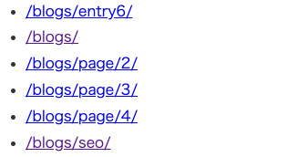

記事数が増えると一覧にペーネーションが欲しくなりますよね？

複数ページネーションを実装するためのプラグインがあるにもかかわらず自作して実装してしまいました。<br>プラグインに頼らず実装したい人のために、やり方をシェアします。

<p><small>※ 2021年12月v4バージョンアップに伴いリライトしました。</small></p>
<prof></prof>

## 今までのGatsbyの記事と注意点
現在ここまで記載しています。<br>制作するまでを目標にUPしていくので順を追ったらGatsbyサイトが作れると思います。

1. [インストールからNetlifyデプロイまで](/blogs/entry401/)
2. [ヘッダーとフッターを追加する](/blogs/entry484/)
2. [投稿テンプレにカテゴリやらメインビジュアル（アイキャッチ）追加](/blogs/entry406/)
3. [ブログ記事、カテゴリ、タグ一覧の出力](/blogs/entry408/)
4. [プラグインを利用して目次出力](/blogs/entry410/)
5. *プラグインナシで一覧にページネーション実装*（←イマココ）
6. [個別ページテンプレート作成](/blogs/entry416/)
7. [プラグインHelmetでSEO調整](/blogs/entry418/)
8. [CSSコンポーネントでオリジナルページを作ろう！！](/blogs/entry421/)
9. [関連記事一覧出力](/blogs/entry430/)
11. [タグクラウドコンポーネントを作成する](/blogs/entry486/)
12. [パンくずリストを追加する](/blogs/entry487/)
13. [記事内で独自タグ（コンポーネント）を使えるようにする](/blogs/entry489/)

v5へのアップグレード方法はこちら。
<card slug="entry519"></card>

このシリーズは[Github・gatsby-blog](https://github.com/yuririn/gatsby-blog)に各内容ブランチごとで分けて格納しています。

今回のソースは[pagination](https://github.com/yuririn/gatsby-blog/tree/pagination)ブランチにあります。

### このシリーズではテーマGatsby Starter Blogを改造
この記事は一番メジャーなテンプレート、「*Gatsby Starter Blog*」を改造しています。同じテーマでないと動かない可能性があります。

## 早速ページネーションを実装しよう！
ページネーションを実装するためには一覧を分割しページを生成します。<br>
さらにページネーションを出力するコンポーネントを作成します。

WordPressなど、その他のCMSに慣れていると*一覧を分割しページを生成するってところがちょっと不思議*です。

### ページネーションを実装するためにページを分割する
まずはgatsby-node.jsにページを分割するためのコードを書いていきます。

一覧ページの実装についてはこちらを参考にしてください。

<card slug="entry408"></card>


```
/ (プロジェクトディレクトリー)
  ├ gatsby-node.js（ページを生成するところ）
  ├ src/
  |  └ templates/
  |    └ blogs.js（一覧を出力するところ）
  └ components/
    └ pagination.js（新規作成）
```

<br>gatsby-node.jsのブログ詳細ページを生成しているコードを利用して、数量を数えます。<br>
変数`count`にページ数を格納します。

frontmatterのpageTypeがblogのみカウントします。

```js{9,10}:title=gatsby-node.js
// ~ 省略 ~

exports.createPages = async ({ graphql, actions, reporter }) => {
  // ~ 省略 ~
  if (posts.length > 0) {
    const blogPosts = posts.filter(post => post.frontmatter.pageType === "blog")

    // 省略
    let count = blogPosts.length
    console.log(count)//デバッグ

    // 一覧を出力するコードを追加
    createPage({
      path: "/blogs/",
      component: blogList,
      context: {},
    })

  // ~ 省略 ~

  }

  // ~ 省略 ~

}
```
<br>続けて以下のコードを追記します。今回は1ページに12記事を表示します。

たとえば*45記事*あったら **4つのページに分割される**、といった形になります。

* /blogs/
* /blogs/page/2/
* /blogs/page/3/
* /blogs/page/4/

どこからどこまでの記事を出力するか、テンプレートblog-list.js側に値を渡します。

* `limit` ... ループ数
* `skip` ... オフセット（どこからループを始めるか）数
* `current` ... 現在何番目
* `page` ... トータルのページ数

```js:title=gatsby-node.js
  const postsPerPage = 12 //1ページに表示する記事の最大数

  // 一覧を出力するコードを追加
  let count = blogPosts.length //記事の長さ
  let numPages = Math.ceil(count / postsPerPage) //分割されるページの数
  for (let index = 0; index < numPages; index++) {
    const withPrefix = pageNumber =>
      pageNumber === 1 ? `/blogs/` : `/blogs/page/${pageNumber}/`
    const pageNumber = index + 1
    createPage({
      path: withPrefix(pageNumber), //出力されるパス
      component: blogList,
      context: {
        limit: postsPerPage, //1ページに表示される最大記事数
        skip: index * postsPerPage, //追加
        current: pageNumber, //追加
        page: numPages, //追加
      },
    })
  }
```
ページが出力されたか、カンタンに調べる方法があります。

404ページにアクセスすると、出力されているページ一覧が確認できます。



### blog-list.jsで値を受け取る
次にblog-list.js側で値を受け取ります。

`query blosQyery()`に`$limit: Int!`と`$skip: Int!`を追加します。

`Int!`は型が*数字で空の値はダメですよー*って意味です。空でもいい場合は`!`を省きます。

`Int!`が原因でエラーを吐いている場合は、gatyby-node.js側で間違ったコードを書いている可能性があるのでよく確かめてみましょう。

```js{3,9,17,18}:title=blog-list.js
// ~ 省略 ~
// pageContextを追加
const BlogList = ({ pageContext, data, location }) => {
// ~ 省略 ~
}
export default blogs
export const pageQuery = graphql`
# $limit、$skip追加
query ($limit: Int!, $skip: Int!) {
  site {
    siteMetadata {
      title
    }
  }
  allMarkdownRemark(
    # $limit、$skip追加
    limit: $limit
    skip: $skip
    sort: { fields: [frontmatter___date], order: DESC }
    filter: { frontmatter: { pageType: { eq: "blog" } } }
  ) {
    # 記事総数取得
    totalCount
    nodes {
      # 省略
    }
  }
}
`
```

<br>1ページに表示する記事の数は`$limit`、オフセット値は`$skip`に格納されるので、受け取った値を`allMarkdownRemark()`で絞り込みます。

```js
allMarkdownRemark(
  limit: $limit
  skip: $skip
  ...
)
```
<br>createPageから投げられた値は引数`pageContext`に格納されるので、それを利用します。
```
const blogs = ({ pageContext, data, location }) => {
}
```

### ページネーションを出力するコンポーネントを作る
最初と最後、前と次へ移動する簡易的なページネーションの実装の仕方をご紹介します。


```
/ (プロジェクトディレクトリー)
  └ components/
    └ pagination.js（新規作成）
```
pagination.jsを作成し、次のコードを記述します。

```js:title=pagination.js
import { Link } from "gatsby"
import React from "react"
import styled from "styled-components" //追加
const Pagination = ({ num, current, type }) => {
  let first
  let prev
  let next
  let last

  if (current === 1) {
    first = (
      <li className="not-work" key="pagination0">
        <span>最新</span>
      </li>
    )
  } else {
    first = (
      <li key="pagination0">
        <Link to={`/blogs/${type}${type ? "/" : ""}`}>最新</Link>
      </li>
    )
  }

  if (current === 1) {
    prev = (
      <li className="not-work" key="pagination1">
        <span>次へ</span>
      </li>
    )
  } else if (current === 2) {
    prev = (
      <li key="pagination1">
        <Link to={`/blogs/${type}${type ? "/" : ""}`}>次へ</Link>
      </li>
    )
  } else {
    prev = (
      <li key="pagination1">
        <Link to={`/blogs/${type}${type ? "/" : ""}page/${current - 1}/`}>
          次へ
        </Link>
      </li>
    )
  }

  if (current === num) {
    next = (
      <li className="not-work" key="pagination3">
        <span>前へ</span>
      </li>
    )
  } else if (current === "") {
    next = (
      <li key="pagination3">
        <Link to={`/blogs/${type}${type ? "/" : ""}page/2/`}>前へ</Link>
      </li>
    )
  } else {
    next = (
      <li key="pagination3">
        <Link to={`/blogs/${type}${type ? "/" : ""}page/${current + 1}/`}>
          前へ
        </Link>
      </li>
    )
  }

  if (current === num) {
    last = (
      <li className="not-work" key="paginatio4">
        <span>最後</span>
      </li>
    )
  } else {
    last = (
      <li key="pagination4">
        <Link to={`/blogs/${type}${type ? "/" : ""}page/${num}/`}>最後</Link>
      </li>
    )
  }
  console.log(num)
  if (num > 1) {
    return (
      <PaginationWrapper>
        <ul>
          {first}
          {prev}
          <li key="pagination2">
            page {current}/{num}
          </li>
          {next}
          {last}
        </ul>
      </PaginationWrapper>
    )
  } else {
    return ""
  }
}

export default Pagination

const PaginationWrapper = styled.nav`
  ul {
    display: flex;
    list-style: none;
    justify-content: center;

    li {
      padding: 0 10px;

      &.not-work span {
        background: rgb(41, 46, 114);
        color: #fff;
        opacity: 0.5;
      }

      span,
      a {
        text-decoration: none;
        display: flex;
        align-items: center;
        font-weight: 700;
        color: rgb(41, 46, 114);
        border-radius: 8px;
        border: 1px solid rgb(41, 46, 114);
        padding: 0 10px;
      }
    }
  }
`
```

<br>あとは表示したいところにコードを追記してください。

```js{2,12}:title=blog-list.js
// ~ 省略 ~
import Pagination from "../components/blogList/pagination"
// ~ 省略 ~

const blogs = ({ pageContext, data, location }) => {
	const { current, page } = pageContext
	// ~ 省略 ~

	return (
		<Layout location={location} title="記事一覧">
			{/* ~ 省略 ~*/}
			<Pagination num={page} current={current} type="" />
			{/* ~ 省略 ~*/}
		</Layout>
	)
})
```

<br>カテゴリやタグ一覧でもページネーションを実装したいときは`type`を追加してください。

```html
<Pagination num={page} current={current} type={cateSlug} />
```

カテゴリやタグもページネーションを実装したい方はGitHubの[pagination](https://github.com/yuririn/gatsby-blog/tree/pagination)ブランチのコードを参考にしてください。

### もっと複雑なページネーションを実装したい方へ

記事数が多くなるとより詳細なページネーションが欲しいですよね。


詳細なページネーションのソースはGitHubにあげています。<br>
めちゃくちゃコードが長くなったのでこの記事ではコードは紹介しません。

こちらを参考にしてください。

[pagination.js | GitHub](https://github.com/yuririn/gatsby-theme/blob/master/src/components/blogList/pagination.js)

## なぜプラグインナシで実装したのか？
今回プラグインナシで実装した理由です。

Gatsbyはプラグインが豊富でいくらでもプラグインで実装できます。プラグインがうまく動かず、やむなく勉強にもなるし自力で実装することにしました。

後々よくコードを見てみたら*私の書き方が間違っていただけ*でした。<br>
はじめて触るGatsbyに疲れていたのもありますが、人間が一番バグります。

実装が面倒な人は[gatsby-awesome-pagination](https://www.gatsbyjs.com/plugins/gatsby-awesome-pagination/)あたりが人気なので、プラグインを利用するといいかもしません。

## まとめ
ページネーションが実装され、安心してたくさん記事が書けるようになりました。

次の記事は「[個別ページテンプレート作成](/blogs/entry416/)」です。

皆さんのコーディングライフの一助となれば幸いです。

最後までお読みいただきありがとうございました。
