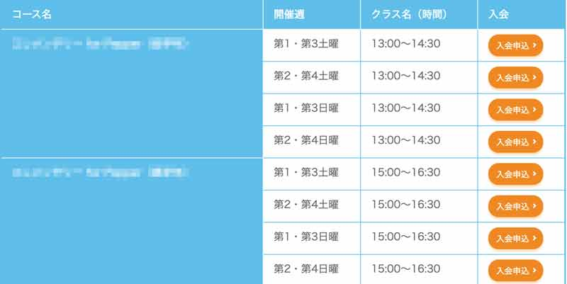

WordPressのフォームプラグインの鉄板・MWWPでフォームに（パラメータ）を渡して値を自動入力する機能をつけました。出力されるフォームパーツに属性（readonly）を付与する方法も紹介しています。WordPressをカスタムフィールドやカスタム投稿を軽くカスタマイズしたことがある方ならすんなりわかると思います。

<prof></prof>


## この記事でできること
ある程度カスタムフィールドやカスタム投稿の追加の仕方やある程度カスタマイズできることです。

できることは以下です。

* カスタム投稿などのタイトルを値としてフォームに自動挿入する
* セレクトボックスの値を自動で出力する

## プラグインMW WP Formとは？
MW WP FormはWordPressのフォーム専用プラグインです。お問い合わせ内容をデータベースに保存したり、無料で使えるのに何かと高機能です。


自作したフォームはショートコードを貼るだけで実装できます。

[プラグインページMW WP Form](https://plugins.2inc.org/mw-wp-form/)

今回はフォームの作り方や実装の仕方は割愛します。

## フォームに値を渡す方法はMW WP Formに用意されている
早速フォームに値を渡す方法です。

MW WP FormではURLのパラメーター（引数）を使って値を渡すことができます。

設定項目から、「*URL引数を有効にする*」へチェックを入れておきます。

チェックを入れてない場合、引数はページ遷移した時に消去されます。


引数は値をそのまま渡せます。

> 有効にした場合、MW WP FormはURL引数を取得します。また、URL引数 ”post_id” をもとに投稿を取得します。その投稿（$post） のプロパティを使用できるようになります。
>
> 例：{ID}、{post_title}、{post_meta}など…

たとえば、遷移前のページ情報を取得したい場合。

```
<a href="<?php bloginfo('url')/contact/?post_id=<?php echo get_the_ID();?>">
```
MW WP From設定側はこんな感じ。

```
[mwform_text name="name" value="{post_title}"]
```
ここまではググればソッコーでわかりますが、当時私がやりたかったのはあるページのカスタムフィールドなどの値を加工して一部だけ取得するというものです。

## 習い事などのコース詳細ごとの申し込みフォームを作る
ある習い事の膨大な日程表から選んだ日時の予定に申し込みをするという設定を作らなければなりませんでした。



教室は拠点だけで10個前後あり、学べるコースも6種類くらいありました。開催している時間帯が曜日などの数が拠点によってかなり違いました。

教室はカスタム投稿の1投稿として登録すればいいとして、クラス名や時間帯などを1個づつカスタムフィールドに入力するのはクライアント側もしんどいと考えました。

### 遷移元から値を渡せるようにする

なので入力規則を決めて以下のようにdetailという名前のカスタムフィールドへ登録してもらうことにしました。

コース・曜日・時間帯の詳細を|(パイプ)でくぎり、それぞれ改行して入力してもらうようルールを決めました。

今回は*detail*というカスタムフィールドに格納します。

カスタムフィールドは自作しても、[プラグインAdvanced Custom Fields](https://ja.wordpress.org/plugins/advanced-custom-fields/)を使ってもいいと思います。

```
コースA|第1・第3土曜|13:00～14:30
コースA|第2・第4土曜|13:00～14:30
コースB|第2・第4土曜|13:00～14:30
コースC|第1・第3日曜|13:00～14:30
```

フォームではURL引数にコース詳細の行（何番目か）とIDを渡します。
カスタムフィールドに格納された値はメソッド`explode()`を使って配列化します。

> explode()は文字列を文字列により分割するメソッド。
>
> [PHPマニュアル　explode](https://www.php.net/manual/ja/function.explode.php)

同じ名前のコースはセルを結合したかったのでちょっとコードが複雑です。

```php
    /* カスタムフィールドdetailを取得し改行で分割し配列化 */
    $detail = get_post_meta( $id, 'detail', true );
    $detail = explode( "\n", $detail );

    /* 後ほどコードを格納するために空の変数を用意 */
    $table  = '';

    for ( $i = 0; $i <= count( $detail ); ++$i ) {
        if ( $i < count( $detail ) ) {
            if ( $th != '' & $th != explode( '|', $detail[ $i ] )[0] ) {
                $ths[] = array( $th, $cnt );
            }
            if ( $th != explode( '|', $detail[ $i ] )[0] ) {
                $th  = explode( '|', $detail[ $i ] )[0];
                $cnt = 1;
            }
        } else {
            $ths[] = array( $th, $cnt );
        }

        ++$cnt;
    }

      /* 初期化 */
    $cousename = '';
    $cnt       = 0;

    foreach ( $detail as $key => $value ) {
        $tag     = explode( '|', $value );
        $table .= '<tr class="add-bottom-border">';
        if ( $cousename != $tag[0] ) {
            $col = '';
            if ( $ths[ $cnt ][1] !== 1 ) {
                $col = ' rowspan="' . ( $ths[ $cnt ][1] - 1 ) . '"';
            }
            $table   .= '<th' . $col . '>' . $tag[0] . '</th>';
            $cousename = $tag[0];
            ++$cnt;
        }
        $table .= '<td>' . $tag[1] . '</td>';
        $table .= '<td>' . $tag[2] . '</td>';
        /* ページのIDとコース詳細の行番号を渡す */
        $table .= '<td><a href="' . home_url( '/entry' ) . '?post_id=' . $post_id . '&line=' . $key . '">入会申込</a></td>';
        $table .= '</tr>';
    }
```
あとは変数`$table`に格納された値をhtmlとして出力するだけ。

```html
<table>
  <thead>
    <tr>
    <th>コース名</th>
    <th>開催週</th>
    <th>クラス名（時間）</th>
    <th>入会</th>
    </tr>
  </thead>
  <tbody>
    <?php echo $table; ?>
  </tbody>

</table>
```
入会申し込みボタンからそれぞれの教室やコース詳細の引数を遷移先のフォームへ渡せるようになります。

### 遷移先のフォームに値を渡すコードを書く
functions.phpへ受け取ったパラメーターを元にデータを各フォームへ値を渡すコードを書きます。

```php
function mwform_value( $value, $name ) {

    if ( ! empty( $_GET['post_id'] ) && ! is_array( $_GET['post_id'] ) && get_post( $_GET['post_id'] ) ) {
        if ( isset( $_GET['line'] ) && $_GET['line'] != '' ) {
            /* 行番号取得 */
            $order     = $_GET['line'];
            /* ページIDが一致するdetail取得 */
            $details   = get_post_meta( $_GET['post_id'], 'detail', true );
            /* 改行で分割し配列化し、必要な行を取り出す */
            $detail    = explode( "\n", $details )[ $order ];
            /* |で分割し配列化 */
            $detail    = explode( '|', $detail );
            /* 書く値を格納 */
            $course    = $detail[0];
            $date      = $detail[1];
            $classname = $detail[2];

            if ( $name == 'course' ) {
                return $course;
            }
            if ( $name == 'date' ) {
                return $date;
            }
            if ( $name == 'classname' ) {
                return $classname;
            }
        }
    }

    return $value;
}

// 管理画面で作成したフォームの場合、フック名の後のフォーム識別子は「mw-wp-form-xxx」
add_filter( 'mwform_value_mw-wp-form-xxxx', 'mwform_value', 10, 2 );
```

<br>*関数名 + _ + mw-wp-form-xxx*で`add_filter`を使ってフックさせます。<br>
xxxはフォームのIDです。

ショートコードの*keyの値*がそれに当たります。


これでname属性へ値がそのまま渡り、自動で格納されます。

```html
<dt>コース名</dt>
<dd>[mwform_text name="course" placeholder="コース名"]</dd>
<dt>開催週</dt>
<dd>[mwform_text name="date" placeholder="開催週"]</dd>
<dt>クラス名（時間）</dt>
<dd>[mwform_text name="classname" placeholder="クラス名（時間）"]</dd>
```
### 出力されるタグにreadonly属性を追加する
もし入力された値を自由に変更されたくなかったら、HTMLの`readonly`属性でコントロールしてあげると良いかもです。

> readonly属性は、入力コントロールに対する変更を禁止にするための属性です。

一応コードを記載しておきます。テストしていないので、動くかどうかはご自身で確認してください。

```php
function my_mwform_input_shortcode_tag( $output, $tag, $attr ) {
    if ( $tag == 'mwform_input'){
        if ( $attr['name'] == 'course' ||  $attr['name'] == 'date' ||  $attr['name'] == 'classname') {
            $output = str_replace( '<input ', '<input readonly ', $output );
        }
    }
    return $output;
}

add_filter( 'do_shortcode_tag', 'my_mwform_input_shortcode_tag', 10, 3 );
```

[MW WP Formでtextareaにreadonly属性を追加する](https://ja.wordpress.org/support/topic/mw-wp-form%E3%81%A7textarea%E3%81%ABreadonly%E5%B1%9E%E6%80%A7%E3%82%92%E8%BF%BD%E5%8A%A0%E3%81%99%E3%82%8B/)

### 教室項目のセレクトボックスの値を自動生成し出力する

次にやりたかったのが、セレクトボックスの値を選択項目として自動出力するというものでした。

この場合、教室はclassroomという名前のカスタム投稿を使っていて、投稿タイトルがそのまま教室名になっています。

すべてのカスタム投稿を`get_posts`で取得し、タイトルを$children配列に格します。*school*というname属性のオームがあった時に格納します。

*mwform_choices_mw-wp-form-xxx*（xxxはフォームのID）を`add_filter`を使ってフックできます。。

```php
function add_school_list( $children, $atts ) {
	if ( 'school' == $atts['name'] ) {
		$classroom = get_posts(
			array(
				'post_type'      => 'classroom',
				'posts_per_page' => -1,
			)
		);
		$children  = array();
		foreach ( $classroom as $item ) {
			$children[] = $item->post_title;
		}
	}

	return $children;
}

add_filter( 'mwform_choices_mw-wp-form-xxx', 'add_school_list', 10, 2 );

```

フォームに以下のコードを書いて格納完了。
```
[mwform_select name="school"]
```

JSでselected属性を付与します。

```html
  <?php $current = get_the_title( $_GET['post_id'] );?>
  <script>
		var classes = document.getElementsByName("school")[0].children;
		for( var i = 0; classes.length > i; i++){
		  if( classes[i].textContent.trim() == "' . $current . '") classes[i].selected = "selected"
		}
	</script>
```

## まとめ
ちょっと長くなりましたが、遷移元からURL引数を使って任意の値をフォームに入力できるようにカスタマイズしました。

もう少し、整理して短くかけるとは思いますが、まずは以前書いたまんまをそのまま出します。

この記事が皆さんのWordPressライフの一助となれば幸いです。

最後までお読みいただきありがとうございました。
