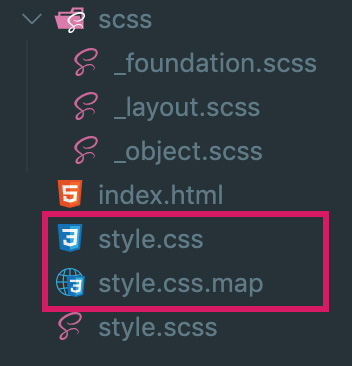

コーディング初心者に贈るVS Code完全マニュアル第3弾！<br>拡張機能をフルに生かして難しいことを出来るだけ飛ばしてHTMLやSCSSを書ける環境を作ります。1弾インストールとセッティングは必須、2弾のスニペット、Git連携、ターミナルなどがわかっているとスムーズに理解できるかと思います。サンプルコード付きです！

<prof></prof>

## この記事のゴール：VS Codeの拡張機能などを駆使してさらに便利にコードを書く

この記事ではサンプルをクローン、もしくはダウンロードしてVS Codeの各機能が使えるように練習できます。

第1弾のVS Codeがインストールされていることは必須、セッティングや拡張機能なども理解しておくとスムーズです。

<card id="/blogs/entry266/"></card>

スニペットに関しては第2弾に詳しく書いてあります。

<card id="/blogs/entry280/"></card>


## エディターの機能をフル活用しながらHTMLコードを書く
早速ですが、HTMLコーディングをしましょう。

テキトーにサイトを作ってみます。皆さんも一緒にやってみましょう！！

```
project/
  ├ index.html
  ├ style.scss
  ├ script.js
  └ img/
    ├ key-visual.jpg
    └ key-visual-sp.jpg
```

以下からファイルをクローンできます。[VS Code入門2](/blogs/entry280/)を参考にやってみましょう！

* [コーディング練習用リポジトリ](https://github.com/yuririn/vs-code-3)


### Emmetでサクッとhtmlテンプレを追加

index.htmlをコーディングします。

ファイルを開いたら拡張機能*Live Server*を起動しておきましょう！ファイルを更新するたびにブラウザも更新され、リロードする必要がなくなります。これだけでも相当時短できます。


[VS Code入門2](/blogs/entry280/)で作成した、HTMLテンプレのスニペットを追加します。

```
html:temp
```
<br>展開コードはこちら。気持ちいいくらい秒殺です。

ちなみにEmmetのチートシートは[こちら](https://docs.emmet.io/cheat-sheet/)。

```html
<!DOCTYPE html>
<html lang="ja">
  <head>
    <meta charset="UTF-8">
    <meta http-equiv="X-UA-Compatible" content="IE=edge,chrome=1">
    <meta name="viewport" content="width=device-width,initial-scale=1">
    <meta name="format-detection" content="telephone=no">
    <title>タイトル</title>
    <meta name="description" content="説明">

    <!-- style -->
    <link rel="stylesheet" href="style.css">
    <!-- js -->
    <script src="script.js" defer></script>
  </head>
  <body>

  </body>
</html>
```


### header追加

headerにサイトタイトルとメニューを追加します。
```
header.l-header>h1.o-header-title{Camille Site}|c
```
展開後はこちら。
```html
<header class="l-header">
  <h1 class="p-header-title">Camille Site</h1>
  <!-- /.o-header-title -->
</header>
<!-- /.l-header -->
```
<br>メニューも追加します。<br>
ここではEmmetだけではなく、拡張機能*htmltagwrap*と*短形選択*を使ってみてください。

* FEATURE
* NEWS
* CONTACT
* LOCATION

ナビゲーションを展開して、中に上のテキストコピペします。
```
nav.o-global-nav
```
短形選択で全行選択します。
最初の行の先頭にカーソルが当たった状態で「Shift+Option（Win:Shift+Alt）」押しながら選択したいところまで下矢印を押します。
*htmltagwrap*は選択した箇所を特定のタグでラップできます。Shift+Cmd+矢印で「Option+W」で各選択箇所が`p`タグで囲まれるので、aタグに書き換えます。

さらに同じ要領で、`li`タグで囲みます。

<blockquote class="twitter-tweet"><p lang="ja" dir="ltr">VS Codeの拡張機能と短形選択と使おう！<br>のんびりコーディングしても、グロナビ追加30秒でした。<a href="https://twitter.com/hashtag/%E9%A7%86%E3%81%91%E5%87%BA%E3%81%97%E3%82%A8%E3%83%B3%E3%82%B8%E3%83%8B%E3%82%A2%E3%81%A8%E7%B9%8B%E3%81%8C%E3%82%8A%E3%81%9F%E3%81%84?src=hash&amp;ref_src=twsrc%5Etfw">#駆け出しエンジニアと繋がりたい</a> <a href="https://t.co/THVoaZAIJG">pic.twitter.com/THVoaZAIJG</a></p>&mdash; かみーゆ@セブ島呑んだくれフロントエンジニア (@LirioY) <a href="https://twitter.com/LirioY/status/1368385521290862595?ref_src=twsrc%5Etfw">March 7, 2021</a></blockquote>

最後に`ul`タグで全体を囲んだら完成。<br><br>

<div class="box">
<em>htmltagwrap</em>を使うときの注意点です。入力モードが英数になっていることを確認の上やらないと記号Σ（シグマ）が入力されてしまいます。
</div>

### main追加
mainタグを追加します。
```
main.l-main|c
```

展開後。

```html
<main class="l-main">
</main>
<!-- /.l-main -->
```

さらにキービジュアルを追加しましょう。<br><br>

キービジュアルはウィンドウ幅（スマホ・PC）に応じて画像の切り替えをしています。

pictureタグを使用したいのですが**コードが長い**。

なのでスニペットを作っておくと便利です。

スニペットの追加方法は[VS Code入門2](/blogs/entry280/)を参考にしてください。

```js
"picture": {
		"prefix": "pic:src:media",
		"body": [
			"<picture>",
			"  <source srcset=\"$1\" media=\"${2:(max-width: 798px)}\" />",
			"  ",
			"</picture>"
		],
		"description": "pictureタグ用のスニペット"
	}
```
展開して、パスなどのコードを追加します。残念ながら`source`タグのsrcset属性には拡張機能の*Path Intellisense*が効きません。。。

```html
<main class="l-main">
  <picture class="p-key-visual">
    <source srcset="img/key-visual-sp.jpg" media="(max-width: 798px)" />
    
  </picture>
  <!-- /.o-key-visual -->
</main>
<!-- /.l-main -->
```

### footer追加
フッターを作りましょう！
3つのタグの入れ子を一気に書きます。
```
footer.l-footer>p.o-copyright>small{（C）Camille Site}|c
```
これだけコンボすると気持ちいいです。
```html
<footer class="l-footer">
  <p class="p-copyright"><small>（C）Camille Site</small></p>
  <!-- /.o-copyright -->
</footer>
<!-- /.l-footer -->
```


[index.htmlの全コード](https://github.com/yuririn/vs-code-3/blob/complete/index.html)

### 行の折りたたみ機能を使おう！

VS Codeは不要なコードを行を折りたたんで隠すことができます。


必要に応じて隠せば、作業したい箇所に集中できます。

## Sass（SCSS）でCSSを書く
> Sassとは「CSSのメタ言語」と呼ばれるもので、CSSをより便利に記述するための言語です。

Sass（SCSS）を使うと、変数を使ってプログラムチックにコードが書けたり、ファイルを分けたりソースコードの管理もカンタンです。

Sass（SCSS）を使えるようにするため、拡張機能*Live Sass Compiler*をインストールします。

用意してなければ、*style.scss*ファイルをワークスペース直下に追加し、**ステータスバーにある*Watch Sass*をクリック**します。


### パーツごとにスタイルを分けて書く！

CSS設計をなんちゃってレベルで取り入れてコーディングしてみようと思います。

scssフォルダに`_foundation.scss`、`_layout.scss`、`_object.scss`の3つのファイルを作ります。

```
project/
  ├ scss/
  │ ├ _foundation.scss
  │ ├ _layout.scss
  │ └ _object.scss
  ├ style.scss
・・・省略
```

style.scssに各ファイルを読み込みます。*_（アンダースコア）*は不要です。
```scss
@import 'scss/foundation';
@import 'scss/layout';
@import 'scss/object';
```
保存すると、style.cssとstyle.css.mapが作成されます。style.css.mapはGoogleなどの開発者ツールでのデバッグに役立ちます。



#### foundationにコードを記述
foundationにCSSコードを書きます。ベーシックな共通のCSSはここに書きます。

```scss
// リセットCSS
@import url("https://cdnjs.cloudflare.com/ajax/libs/meyer-reset/2.0/reset.min.css");

// 変数
$font-color:#333;
$font-family: "Helvetica Neue", "Helvetica", "Hiragino Sans", "Hiragino Kaku Gothic ProN", "Arial", "Yu Gothic", "Meiryo", sans-serif;
$header-height: 80px;//ヘッダーの高さ

// ベースの設定
html {
    font-size: 62.5%;
}

body {
    color: $font-color;
    font-family: $font-family;
    line-height: 1.8;
    font-size: 1.6rem;
}

img {
    max-width: 100%;
    height: auto;
}
```
Googleなどの開発者ツールでのデバッグすると、_foundation.scssの何行目にコードが書いてあることがわかります。


#### ヘッダー周りをコーディング
ヘッダーのレイアウトをコーディングします。*_layout.scss*に以下を記述します。

*_layout.scss*に記述するCSSはクラスの接頭辞に`l-`をつけています。

他のファイルも同様、接頭辞でどのファイルに記述してるかもわかるし、タグがレイアウトなのかオブジェクト（ナビやボタンなどのパーツ）ざっくりとした判断ができます。

headerの高さは*_foundation.scss*で設定した変数を使います。これでもしやっぱり高さを微調整したいって時に後ほど変更可能です。

```scss
.l-header {
    max-width: 1020px;
    margin: 0 auto;
    display: flex;
    padding: 0 20px;
    justify-content: space-between;
    align-items: center;
    height: $header-height;
}
```

ナビも整えます。ネスト（入れ子）が深くなりすぎないようにします。

```scss
.o-global-nav {
    height: 100%;
    display: flex;
    align-items: center;

    ul {
        height: 100%;
        display: flex;
        justify-content: end;
    }

    li {
        display: flex;
    }

    a {
        align-items: center;
        height: 100%;
        display: flex;
        text-decoration: none;
        color: $font-color;
        padding: 0 20px;
        position: relative;
        letter-spacing: .1em;

        &::after {
            content: '';
            display: block;
            height: 2px;
            width: 100%;
            position: absolute;
            left: 0;
            bottom: 0;
            background: #1cb335;
            transform: scale(0, 1);
            transition: .3s;
        }

        &:hover {
            &::after {
                transform: scale(.5, 1);
            }
        }
    }
}
```

スッキリしました^ ^


#### メイン（キー）ビジュアルを整える

メイン（キー）ビジュアルは謎のリゾート感を出すためにヘッダーを差し引いてウィンドウいっぱいにします。

```css
.o-key-visual {
    height: calc(100vh - #{$header-height});
    display: block;

    img {
        height: 100%;
        width: 100%;
        object-fit: cover;
    }
}
```
#### footerを追加する

footerの追加します。*_layout.scss*に追記します。

```css
.l-footer {
    padding: 10px 20px;
    text-align: center;
}
```

コピーライトの部分は部品と見なすのでスタイルを*_object.scss*へ記載します。
```css
.o-copyright {
    letter-spacing: .1em;
    font-size: 1.2rem;
}
```

ざっくりですがこんな感じに仕上がりました。わーい。


### Live Sass Compilerを設定する
設定、setting.jsonから設定を変更できます。

コンパイルの方法や出力先を指定できます。compressedにするとコードをガツンと圧縮できます。

```json
"liveSassCompile.settings.formats": [ //Sassの出力内容の設定
  {
    "format": "compressed", //nested、compact、expanded（デフォルト）
    "extensionName": ".min.css", //デフォルトは.css
    "savePath": "/css" //デフォルトはnull
  }
]
```
ベンダープレフィックスの指定です。
```json
"liveSassCompile.settings.autoprefix": [
  "last 2 versions",
  "ie >= 11",
  "Android >= 4",
  "ios_saf >= 8"
]
```

コンパイル対象外にしたいときはこんな感じ。

test/以下のファイルは対象外にできます。

```json
"liveSassCompile.settings.excludeList": [
  "test/**"
]
```
[vscode-live-sass-compiler](https://github.com/ritwickdey/vscode-live-sass-compiler/blob/master/docs/settings.md)のドキュメントを参考にするといいかも！！

## JavaScriptでスマホ用のナビゲーションに変えてみる
JavaScriptも書いてみましょう！

せっかくなのでスマホ用メニューを作ってみましょう。ナビ周りのコードを変更します。
```html
<nav class="o-global-nav js-toggle-nav">
  <button class="js-toggle-nav-btn o-global-nav-btn" aria-label="ナビゲーションボタン"></button>
  <ul>
    <li><a href="#">FEATURE</a></li>
    <li><a href="#">NEWS</a></li>
    <li><a href="#">CONTACT</a></li>
    <li><a href="#">LOCATION</a></li>
  </ul>
</nav>
```

script.jsファイルにボタンをクリックしたらナビとボタンにクラスがつくように調整。

```js
"use strict";
// ボタンとナビゲーションを取得
const nav = document.querySelector(".o-global-nav");
const btn = document.querySelector(".o-global-nav-btn");

//ボタンクリックで開閉
btn.addEventListener("click", () => {
  nav.classList.toggle("open");
  btn.classList.toggle("open");
});
```

変数とmixinを*_foundation.scss*に追加します。

```scss
$breakpoints: (
  'sm': 'screen and (min-width: 400px)',
  'md': 'screen and (min-width: 768px)',
  'lg': 'screen and (min-width: 960px)',
  'xl': 'screen and (min-width: 1170px)',
) !default;

@mixin mq($breakpoint: md) {
  @media #{map-get($breakpoints, $breakpoint)} {
    @content;
  }
}
```
上記コードはプロジェクトごとにヘビロテしているので

scss用のスニペットも作っておくと便利です。

```json
"Media Query": {
  "prefix": "mq",
  "body": [
    "@include mq(\\$breakpoint: ${1:md}) {",
    "  $2",
    "}//Media Query"
  ],
  "description": "メディアクエリ用スニペット"
}
```
*_object.scss*を変更します。

まずはボタンのスタイリング。

```scss
.o-global-nav-btn {
    border: none;
    position: fixed;
    top: 30px;
    right: 15px;
    width: 30px;
    height: 26px;
    background: none;

    //ボタン
    &::after,
    &::before {
        position: absolute;
        background: #1cb335;
        content: '';
        height: 2px;
        width: 100%;
        left: 0;
        display: block;
        transition: transform .3s;
    }

    &::before {
        top: 0;
        box-shadow: 0 12px 0  #1cb335;
    }

    &::after {
        top: 24px;
    }

    //開閉時のアニメーション
    &.open {
        &::before {
            top: 0;
            box-shadow: none;
            transform: rotate(45deg) translate(9px, 9px);
        }
        &::after {
            top: 24px;
            transform: rotate(-45deg) translate(8px, -8px);
        }
    }

    @include mq($breakpoint: md) {
        display: none;
    }//Media Query
}
```

ナビゲーションのスタイルを変更します。

```scss
.o-global-nav {
    z-index: 2;
    position: fixed;
    right: 0;
    top: $header-height;
    height: calc(100vh - #{$header-height});

    &.open {
        ul {
            transform: translateX(0);
        }
    }

    ul {
        position: relative;
        transform: translateX(100%);
        background: rgba(#fff, .3 );
        padding: 20px 30px;
        transition: .3s;
        height: 100%;
    }

    a {
        text-decoration: none;
        color: $font-color;
        height: 30px;
        margin-bottom: 10px;
        display: flex;
    }

    //PCの設定はすべてここへ
    @include mq($breakpoint: md) {
        background: none;
        position: inherit;
        height: 100%;
        display: flex;
        align-items: center;

        ul {
            height: 100%;
            display: flex;
            justify-content: end;
            background: none;
            padding: 0;
            transform: translateX(0);
        }

        li {
            display: flex;
        }

        a {
            align-items: center;
            height: 100%;
            display: flex;
            margin-bottom: 0;

            padding: 0 20px;
            position: relative;
            letter-spacing: .1em;

            &::after {
                content: '';
                display: block;
                height: 2px;
                width: 100%;
                position: absolute;
                left: 0;
                bottom: 0;
                background: #1cb335;
                transform: scale(0, 1);
                transition: .3s;
            }

            &:hover {
                &::after {
                    transform: scale(.5, 1);
                }
            }
        }
    }//Media Query
}
```
ボタンがついてトグルメニューになりました！わーいわーい＼(^o^)／

<div class="box">
<h4>長いコード一気に削除したい時の裏ワザ</h4>
ナビゲーションのようにコードが長くなってしまった時は、VS Codeの機能「行の折りたたみ機能」を使って、行をたたんでまとめて削除すると早いです！
</div>


以下からソースコードは落とせるので、興味がある方は確認してみてください。

* [マスター](https://github.com/yuririn/vs-code-3/)
* [CSS追加まで](https://github.com/yuririn/vs-code-3/tree/complete)
* [JS追加まで](https://github.com/yuririn/vs-code-3/tree/complete-advance)

## まとめ
VS Codeを使えば、Gulpなどを使って複雑なタスクランナーを組まなくても十分にコーディングできます！！

まずはEmmetやCSSを書けるようになりましょう。

CSS設計に興味がある方はこちらを参考に[CSS設計 私のためのFLOCSSまとめ](https://qiita.com/super-mana-chan/items/644c6827be954c8db2c0)

*記事が鬼長くなってしまいました*が、この記事が皆さんのコーディングライフの一助となれば幸いです。

今回も最後までお読みいただきありがとうございました。
