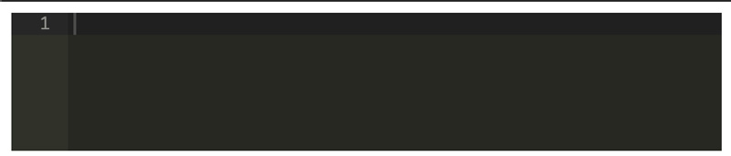
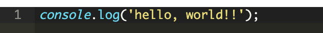
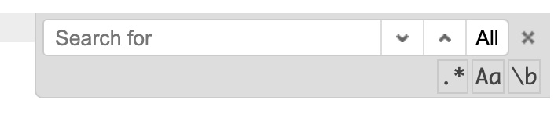
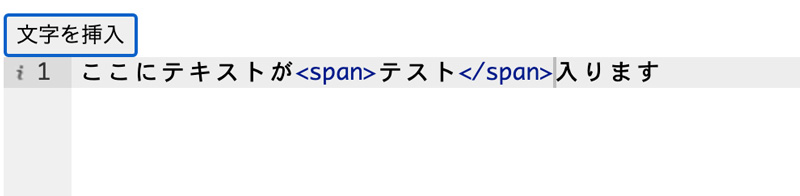

CMSなどの管理画面に組み込めるJS製Aceエディターというものを先日使ってみました。使い方等、まとめましたので参考にしてくだい。

<prof></prof>


## Aceエディターとは？
出会いは必然にして突然。。。

今回お仕事で出会った、JS製埋め込み式エディターの使い方をご紹介します。


> Ace is an embeddable code editor written in JavaScript.<br>
> AceはJSで書かれた埋め込み可能なエディター。

https://ace.c9.io/

コードを紹介するためのエディターというよりはむしろ、コードを書くためのエディターを埋め込めるライブラリです。

### 特徴
めっちゃ高機能です。主には以下のような特徴があります。

* 110以上の言語をサポート
* 20以上のテーマ
* 膨大な行でも大丈夫（100万行以下）
* 正規表現で置換や検索が使える
* リアルタイムでチェック可能 (現在JavaScript/CoffeeScript/CSS/XQuery)

## Aceエディター基本の使い方
では、実際に実装してみましょう！
リファレンスを参考にしつつ、CDNに上がっているライブラリを使ってみます。

```html
<script src="https://cdnjs.cloudflare.com/ajax/libs/ace/1.2.0/ace.js"></script>
```
以下のような設定にします。

1. 言語・JS
2. ID「editor」のタグにセット
3. テーマ「monokai」とつかう

```html
<div id="editor" style="min-height: 100px"></div>
<script src="https://cdnjs.cloudflare.com/ajax/libs/ace/1.2.0/ace.js"></script>
<script>
  const editor = ace.edit("editor",{
    theme: "ace/theme/monokai",
    mode: "ace/mode/javascript",
    minLines: 2
  });
</script>
```

コードはシンプルに7行。

カンタンに実装できました！！



実際にテキスト（JS）を打ち込んでみるときちんとハイライトがリアルタイムで効きます。



エディター上でCmd+Fを押すと検索バーが出てくるというスグレモノ。。。すげー高機能です。



### いくつかの実装方法をご紹介

ID「editor」にセットした場合の説明です。

```html
<div id="editor" style="min-height: 100px"></div>
<script src="https://cdnjs.cloudflare.com/ajax/libs/ace/1.2.0/ace.js"></script>
<script>
  const editor = ace.edit("editor");

  // 続きを書く
</script>
```

要素にエディターをセットしてテーマや言語などをあとで設定も可能です。

```js
// テーマ追加
editor.setTheme("ace/theme/monokai");
// 言語設定
editor.session.setMode("ace/mode/javascript");
```
テーマを確認したいときはこちらをご覧ください。

https://ace.c9.io/build/kitchen-sink.html

#### オプションだけ渡すパターン
```js
editor.setOptions({
  autoScrollEditorIntoView: true,
  copyWithEmptySelection: true,
});
```

#### オプションを取得
```js
editor.getOption("optionName");
```

#### 折り返しをつける
```js
editor.getSession().setUseWrapMode(true);
```

#### タブサイズ変更
```js
editor.getSession().setTabSize(2);
```
#### 文字の挿入
```js
editor.insert('文字');
```
#### カーソルの位置を取得
```js
editor.selection.getCursor();
```
#### ソフトタブの使用（タブにスペースを使用）
```js
editor.session.setUseSoftTabs(true);
```
#### フォントサイズ設定
```js
editor.setFontSize(14);
```
## ボタンを利用してコード内のテキストに文字を追加したい
コード内にボタンを使ってタグやテキストをを追加したい場合です。


```html
<div id="editor" style="height: 100px"></div>
<button id="insert-btn">文字を挿入</button>
```

`editor.selection.getCursor()`でエディター内のカーソルのある位置を取得して、` editor.session.insert()`で文字列を挿入します。

```js
$("#insert-btn").on("click", function () {
  editor.session.insert(
    editor.selection.getCursor(),
    "<strong>よくできました！！</strong>"
  );
});
```

## コードの内容を他のフォームに移動
今回やったのが任意のフォームパーツ（テキストエリア）へAceエディターに入力された内容を転記するというものでした。

textareaにhtmlコードを記載したかったので、どうしてもAceエディターが使いたかったです。

<br>Aceエディターに変更があったらテキストエリアの内容も変更できるようにしました。

### HTMLの紹介
```html
<div id="editor" style="min-height: 100px"></div>
<texstarea name="message" style="display:none"></texarea>
```
### JSコードの紹介
```js
var textarea = $('textarea[name="message"]');
editor.getSession().setValue(textarea.val());

//Aceエディター内の変更があれば中身をtextareaのvalueとしてセット
editor.getSession().on('change', function(){
  textarea.val(editor.getSession().getValue());
});
```
これでコードを書き換えるたび、コードが任意の`textarea`タグに転記されていい感じになりました！

## トグルボタンでテキストエリアのサイズ変更
次にやりたかったのが、コードを各エリアのサイズ変更です。

AceエディターはJSを読み込んだ時に、サイズを取得します。なのでエリアのサイズ変更する場合は再読み込みしなければなりません。

なので`const editor = ace.edit("editor");`などで作成したAceエディターを一度削除する必要があります。

```html
<div id="editor" style="height:200px;"></div>
<textarea name="message" style="display: none"></textarea>
<button id="resize-btn">入力欄を拡大する</button>
```

JSコードです。

`destroy()`で作ったAceエディターの設定を削除し、htmlのコードも削除します。

```JS
$(function () {
  // エディターをタグにセット
  var editor = ace.edit("editor");

  // 初期化用の関数
  function aceinit(editor) {
    editor.setFontSize(14);
    editor.getSession().setMode("ace/mode/html");
    editor.getSession().setUseWrapMode(true);
    editor.getSession().setTabSize(2);
  }

  //初期化
  aceinit(editor);

  $("#resize-btn").on("click", function () {
    // #editorの設定したを削除
    editor.destroy();
    //htmlも削除
    console.log(editor);

    //高さでサイズ変更
    if ($("#editor").height() < 300) {
      $("#editor").height("600");
      $(this).text("入力欄を縮小する");
    } else {
      $("#editor").height("200");
      $(this).text("入力欄を拡大する");
    }
    // 再構築
    editor = ace.edit("editor");
    aceinit(editor);
  });
});
```
<small>※ jQuery使用前提で書いてるのでCDNとかで読み込んでね！</small>

## まとめ
ウィンドウのリサイズでテキストエリアサイズを変更するオプションとかあるみたいでしたが、調べるの面倒だったのと急いでたので力技で実装しました。気が向いたら追記します。

Emmetやインテリセンスを効かせることもできるみたいです。ここまでしたらもう、CMSとかをガチ開発するようになりますねww

[ブラウザ上で使えるJavaScript製テキストエディタAce入門](https://qiita.com/naga3/items/1bc268243f2e8a6514e5)

おそらく、CMSに組み込むようなマニアックな実装をする人はあまり数少ないと思いますがお役に立てれば幸いです。

最後までお読みいただきありがとうございました。
