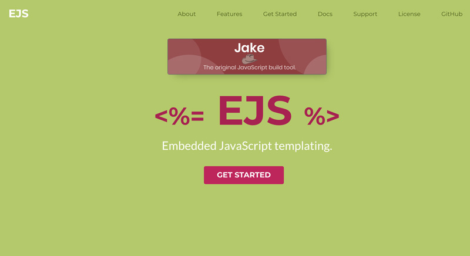
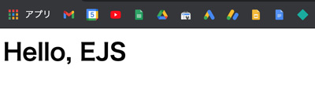
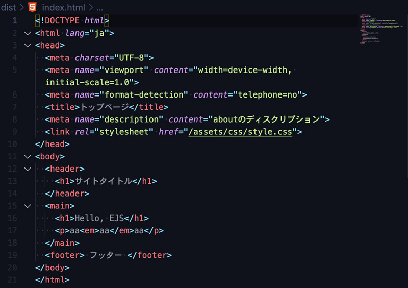
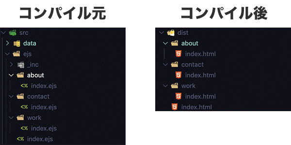
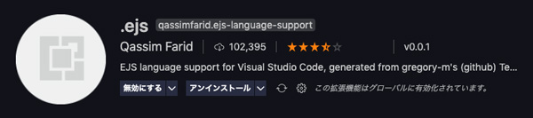

最近GulpでEJSというテンプレートを使ってHTMLのファイルを量産しました。

JavaScriptがそのまま書けるのでとても魅力的でした。類似するPugと比較しつつ、導入の仕方、やincludeを始めとしたメソッドの使い方などをご紹介します。

この記事はGulp4バージョン用にコードを修正しました。

<prof></prof>

## このブログの対象者
* CMSなしでHTMLを量産しなければならない
* Pugと比べてみたい
* npm scriptやgulpが多少理解できる

10 ~ 30ページくらいの規模でページのレイアウト構成がある程違うことを想定しています。


## EJSとは？


公式サイト:[EJS Embedded JavaScript templating](https://ejs.co/)

> Embedded JavaScript templating.<br>
> 埋め込み型JavaScriptテンプレート

### EJS6つの特徴
1. プレーンなJSが使える
2. 開発に時間がかからない
3. 構文がシンプル
4. 早い
5. デバックがカンタン
6. 開発がアクティブ

### Pugとの比較
|テンプレート|メリット|デメリット|
|-|-|-|
|*Pug*|コードが短い|ルールが独特<br>インデント間違えたら地獄|
|*EJS*|コードが長い|JSライクに書ける<br>インデントを気にせず書ける|

私はコーダー、デザイナーにはPugがオススメ。コードが短くて済むからです。
<br>コーディングが早く終わる。

<card slug="entry428"></card>

<ad location="/blogs/entry459/"></ad>


## まずは基本の「き」から。Gulpを使って導入する
Gulpでの導入方法の紹介です。<br>
まずはテキトーにプロジェクトを格納するフォルダーを作ります。<br>
フォルダーをVS Codeなどのテキストエディターで開き、以下コマンドでpackage.jsonファイル作成。

```bash:title=コマンド
npm init -y
```

以下コマンドでまとめて、`gulp` `gulp-ejs` `gulp-rename` `plumber`をインストールします。

```bash:title=コマンド
npm i -D gulp gulp-ejs gulp-rename plumber
```

以下ディレクトリ構造を参考にしながらファイルやフォルダーを作成してください。

```
プロジェクトフォルダ/
  ├ package.json（編集）
  │ gulpfile.js（作成・編集）
  ├ src/（作成）
  │  ├ data/（作成）
  │  └ ejs/index.ejs
  └ dist/（自動生成）
```
`package.json`の`scripts`に追記。
```json:title=package.json
"scripts": {
  "start": "gulp"
},
```

`gulpfile.js`のコードを編集します。

```js:title=gulpfile.js
const { src, dest, series, parallel, watch } = require("gulp");
const ejs = require("gulp-ejs");
const rename = require("gulp-rename");
const plumber = require("gulp-plumber");//エラーでビルドを中止させない

function ejs(done) {
  src(["src/ejs/**/*.ejs"])
    .pipe(plumber())
    .pipe(ejs())
    .pipe(rename({ extname: ".html" }))
    .pipe(dest("dist/"));
  done();
}

exports.default = series(ejs);
```

EJSで文字列などをHTMLに出力する方法は以下。

<ad location="/blogs/entry459/"></ad>

```ejs
<!-- 出力 -->
<%= 【出力内容】; %>。
```

`ejs`フォルダーに`index.ejs`（ejsの拡張子は.ejsです）を作成し、テキトーなhtmlコードを追加します 。

```ejs:title=index.ejs
<h1><%= 'Hello, EJS'%></h1>
```

以下コマンドでコンパイルします。

```bash:title=コマンド
npm start
```

`dist`フォルダー内にindex.htmlが生成されます。



### headerとfooterなどのファイルを分け、テンプレート化する
それではテンプレート化してみましょう！<br>
`ejs/_inc/`ディレクトリーに、`_header.ejs`と`_footer.ejs`を作ります。

```
プロジェクトフォルダ/
  ├ package.json
  │ gulpfile.js（修正）
  ├ src/
  │  ├ data/
  │  └ ejs/index.ejs
  │    └ _inc/
  │      ├ _header.ejs（作成）
  │      └ _header.ejs（作成）
  └ dist/ index.html（自動生成）
```

Gulpのタスクを修正。接頭辞に`-（ハイフン）`がつくejsファイルはコンパイルから外します。

```js:title=gulpfile.js
function ejs(done) {
  src(["src/ejs/**/*.ejs", "!" + "src/ejs/**/_*.ejs"])//修正
    .pipe(plumber())
    .pipe(ejs())
    .pipe(rename({ extname: ".html" }))
    .pipe(dest("dist/"));
  done();
}
```
```ejs
<!-- 変数 -->
<% let 【変数名】 = 【変数の中身】; %>
<!-- ファイルのインクルード -->
<%- include(【相対パス＋ファイル名】, { 【変数など値をインクロード先に渡す】 }) %>
```

`index.ejs`の中身を書き換えます。

```ejs:title=index.js
<% let title = 'トップページ'; %>
<% let description = 'ディスクリプション'; %>
<% let pageId = 'home'; %>
<%- include('./_inc/_header', { title: title, description: description, pageId: pageId }) %>

<h1><%= 'Hello, EJS'%></h1>

<%- include('./_inc/_footer')  %>
```

`_header.js`でif文を使って、トップページの時はサイト名をh1タグ、それ以外はトップに戻れるように調整します。

```ejs:title=_header.js
<!DOCTYPE html>
<html lang="ja">
<head>
  <meta charset="UTF-8">
  <meta name="viewport" content="width=device-width, initial-scale=1.0">
  <meta name="format-detection" content="telephone=no">
  <title><%= title %></title>
  <meta name="description" content="<%= description %>">
  <link rel="stylesheet" href="/assets/css/style.css">
</head>
<body>
  <header>
    <% if (pageId === 'home'){ %>
      <h1>サイトタイトル</h1>
    <% } else { %>
      <p><a href="/">サイトタイトル</a></p>
    <% } %>
  </header>
  <main>
```
`_footer.ejs`にもコンテンツを追加します。
```ejs:title=_footer.js
  </main>
  <footer>
  フッター
  </footer>
</body>
</html>
```
<ad location="/blogs/entry459/"></ad>

### ライブリロードとコードをキレイにするnodeモジュールを追加
`BrawserSync`と`gulp-html-beaitufy`でもっと作業しやすくします。

コードが長くなってしまいましたので`gulpfile.js`のコードごっそり載せます！

```js:title=gulpfile.js
const { src, dest, series, parallel, watch } = require("gulp");

//ライブリロード
const bs = require("browser-sync").create();

const ejs = require("gulp-ejs");
const rename = require("gulp-rename");
const plumber = require("gulp-plumber");
const htmlbeautify = require("gulp-html-beautify");

// browserSync初期化
function bsInit(done) {
  bs.init({
    server: {
      baseDir: "./dist",
    },
    reloadDelay: 1000,//リロードの遅延
    open: false, //起動時のライブリロードを止める
  });
  done();
}

function ejs(done) {
  src(["src/ejs/**/*.ejs", "!" + "src/ejs/**/_*.ejs"])
    .pipe(plumber())
    .pipe(ejs())
    .pipe(
      htmlbeautify({
        indent_size: 2, //インデントサイズ
        indent_char: " ", // インデントに使う文字列はスペース1こ
        max_preserve_newlines: 0, // 許容する連続改行数
        preserve_newlines: false, //コンパイル前のコードの改行
        indent_inner_html: false, //head,bodyをインデント
        extra_liners: [], // 終了タグの前に改行を入れるタグ。配列で指定。head,body,htmlにはデフォで改行を入れたくない場合は[]。
      })
    )
    .pipe(rename({ extname: ".html" }))
    .pipe(bs.stream()) // 変更を感知
    .pipe(dest("dist/"));
  done();
}

// ファイルの監視
function watchTask(done) {
  watch(["src/ejs/**/*.ejs"], ejs);
  done();
}

exports.default = parallel(series(bsInit, ejs, watchTask));
```
以下のコマンドで起動します。
```bash:title=コマンド
npm start
```
こちらが出力されたコードです。うん、美しい❤️


## いよいよページ量産。jsonファイルを使ってコンテンツを管理する
EJSのいいところは、ファイル構造を保ったままコンパイルできます。

データ管理するためにJSONデータを利用します。

JSONデータをEJSで利用するために、node moduleの`fs`を追加します。
```bash:title=コマンド
npm i fs -D
```
`gulpfile.js`にコードを追加してください。
```js{6-7,12-14}:title=gulpfile.js
const fs = require("fs");//追加

//省略

function ejs(done) {
  const json_path = "./src/data/site.json";
  const json = JSON.parse(fs.readFileSync(json_path));

  src(["src/ejs/**/*.ejs", "!" + "src/ejs/**/_*.ejs"])
    .pipe(plumber())
    .pipe(
      ejs({
        jsonData: json,
      })
    )
    //省略
    .pipe(bs.stream());
  done();
});
//省略
```

<ad location="/blogs/entry459/"></ad>

```
プロジェクトフォルダ/
  ├ package.json
  │ gulpfile.js
  ├ src/
  │  ├ data/
  │  │  └ site.json（追加）
  │  └ ejs/
  │    ├ index.ejs
  │    ├ contact/index.ejs（追加）
  │    ├ about/index.ejs（追加）
  │    ├ work/index.ejs（追加）
  │    └ _inc/
  │      ├ _header.ejs
  │      └ _header.ejs
  └ dist/
     ├ index.html
     ├ contact/index.html
     ├ about/index.html
     └ work/index.html
```
`site.json`ファイルを作成しdada/内に追加。基本のサイト情報やページごとの設定を書いていきます。

```json:title=site.json
{
  "siteInfo": {
    "name": "サイト名",
    "siteUrl": "サイトのドメイン"
  },
  "pages": {
    "home": {
      "name": "ホーム",
      "description": "ページの説明"
    },
    //・・・・ページ分追記作成
  }
}
```
ちゃんとデータが取得できるか確認します。<br>
index.ejsの空きスペースに以下コードを仕込んでみてください。

```ejs:title=index.ejs
<% console.log(jsonData) %>
```
`index.ejs`を修正します。<br>基本情報はJSONデータで管理するのでpageIdだけあればOKです。
```ejs:title=index.ejs
<% let pageId = 'home'; %>
<%- include('./_inc/_header', { pageId: pageId }) %>

ここにコンテンツ
<%- include('./_inc/_footer', {pageId: pageId })  %>
```
`_header.ejs`を修正します。<br>
ページタイトルはトップページの時のみサイト名を出力するようにしています。<br>
ページのメニューをforin文でループして書き出します。pageIdと項目名が一致する時は、リンクを外し、クラス`current`を付与しています。
```ejs:title=_header.ejs
<% let title = (pageId === 'home') ? jsonData.siteInfo.name : jsonData.pages[pageId].name + jsonData.siteInfo.name%>
<% let description = jsonData.pages[pageId].description %>
<!DOCTYPE html>
<html lang="ja">
<head>
  <meta charset="UTF-8">
  <meta name="viewport" content="width=device-width, initial-scale=1.0">
  <meta name="format-detection" content="telephone=no">
  <title><%= title %></title>
  <meta name="description" content="<%= description %>">
  <meta name="description" content="">
  <link rel="stylesheet" href="/assets/css/style.css">
</head>
<body>
  <header>
    <% if (pageId === 'home'){ %>
      <h1><%= jsonData.siteInfo.name %></h1>
    <% } else { %>
      <a href="/"><%= jsonData.siteInfo.name %></a>
    <% } %>
  </header>
  <nav>
    <ul>
      <% for(let page in jsonData.pages){ %>
        <% if (page === pageId) { %>
          <li class="current"><%= jsonData.pages[page].name %></li>
        <% } else { %>
          <li><a href="/<%= page %>/"><%= jsonData.pages[page].name %></a></li>
        <% } %>
      <% }; %>
    </ul>
  </nav>
  <main>
```
`_footer.ejs`も似た感じで修正します。
```ejs:title=_footer.ejs
  </main>
  <footer>
    <nav>
      <ul>
        <% for(let page in jsonData.pages){ %>
          <li><a href="/<%= page %>/"><%= jsonData.pages[page].name %></a></li>
        <% }; %>
      </ul>
    </nav>
    <p><small>（c）<%= jsonData.siteInfo.name %></small></p>
  </footer>
</body>
</html>

```
work、about、contactなどのファイルを作成します。<br>
階層が変わるので*インクルードファイルのパス*を間違わないように注意してください。

```ejs:title=work.ejs
<% let pageId = 'work'; %>
<%- include('./../_inc/_header', {pageId: pageId }) %>

<h1><%= jsonData.siteInfo.name%></h1>
<%- include('./../_inc/_footer', {pageId: pageId })  %>
```

## おまけ。EJSお役立ち情報
### EJS使い方
JSと使い方は一緒なので、特殊な書き方などだけ抜粋しておきます。

|コード|説明|
|-|-|
|`<% %>`|この中にjsを書ける|
|`<%= %>`|出力。エスケープする|
|`<%- %>`|出力。エスケープしない|
|`<% let text = "文字" %>`|変数。文字などを代入|
|`<%# コメント %>`|htmlに出力されない。ここの中で変数宣言とかしても無効|
|`<% include _inc/_header %>`|ファイルのインクルード|
|`<%- include('_inc/_header', {data: 'test'}) %>`|ファイルのインクルード引数を渡すバージョン|

<ad location="/blogs/entry459/"></ad>

### VS Codeの設定
VS Codeの設定を変えて、さらに快適にコードを書きましょう！

#### Emmetを使えるようにする
EJSでもエメットを使えるようにしておきましょう。<br>
設定から設定JSONを開き、"emmet.includeLanguages"に以下を追加します。
```json
  "emmet.includeLanguages": {
    "ejs": "html"//これを追加。
  },
  // 省略
```

#### 拡張機能.ejsを入れてシンタックスハイライターを使う
慣れないと何で詰まってるかわからなくなります。<br>
.ejsという拡張機能をVS Codeに入れておきましょう。



インストールしたら再起動しましょう。

## まとめ・EJSはJSライクに書け、量産に向いている！
今回は10 ~ 20ページ程度で量産する方法をまとめました。<br>
パンくずリストやコンバージョンエリアなどのインクルードファイルをさらに細かく分けたら、さらに保守性の高いサイトが作れそうですね！

今の時代でも、セキュリティ上どうしてもHTMLの静的ファイルで作らないといけないこともあります。

ページ数が多いと大変だけど、導入の敷居が、、、なんてこともありますが、EJSならさほど学習コストもかからない気がします！

この記事が皆さんのコーディングライフの一助となれば幸いです。

最後までお読みいただきありがとうございました。

### EJSの関数に関しても記事を書きました
関数についてはこちらを参考にしてください。
<card slug="entry495"></card>
