仕事でSlackを使わないといけなくなった！多機能すぎて何から覚えればいいかわからない。。<br>そんなお悩みありませんか？

Slack は最近注目を集めている *ビジネスチャットツール* ですよね。

カスタムレスポンスを始めとした私がよく使う「Slack7つの活用法」をまとめました！

よろしければ参考にしてみてください。

めちゃめちゃ記事が長くなってしまったので目次を使ってお好きな項目だけ、読んでください。
<br>最近人気があり「導入しよう！」という企業や個人も増えているのではないでしょうか？

* Slackやや初心者・覚えたて
* Slackを楽しく活用したい
* 楽しくコミュニケーションをとりたい

<msg txt="Slack歴5年の私がそんな方のために^ ^<br>楽しく仕事ができる使い方を厳選してご紹介します！"></msg>

<small>※ すでにアプリやアカウントをお持ちで、多少使いこなせることを前提に進めます！<br/>※ Slackにはブラウザー・ディスクトップアプリ・スマホアプリがあります。</small>

<prof></prof>


## 文字や文章の装飾がカンタン！
チャットツールによってはプレーンな文章しか書けず、<br>大事な部分を読んでもらえてないこともあります(´・ω・｀)ｶﾞｯｶﾘ…

<msg txt="伝わらないのは「伝え方が悪い」と思うようようにしています。"></msg>

Slackは適度に投稿内容を装飾しながら書くことができます。

装飾はカンタン！ボタンでポチポチ文字を装飾できます。（前はなかった気がする！！）
<br>**初心者に優しい！**

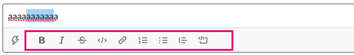

ショートカットやマークダウンで書いた方が**圧倒的に効率がいい**です。

よく使うものは覚えておくとベンリです。

|装飾|用途|ショートカット|マークダウン|
|-|-|-|-|
|*太字*|文字を強調したいとき|ctrl/cmd + b|*（アスタリスク）で囲む||
|*斜体*|文字を強調したいとき|ctrl/cmd + i|_（アンダースコア）で囲む|
|*打消*|文字に打消したいとき|ctrl/cmd + shift + x|-（ハイフン）で囲む|
|*コード*|コードを書きたいとき|ctrl/cmd + shift + c|\`（バッククォート）で囲む|
|*コード（ブロック）*|コードをブロック単位で書きたいとき|ctrl/cmd + shift + c|文章を\`\`\`（バッククォート）で挟む|
|*箇条書き*|文章をリスト形式で書きたいとき|ctrl/cmd + shift + 8|先頭に*（アスタリスク）+ スペース|
|*番号箇条書き*|文章を順を追ってリスト形式で書きたいとき|ctrl/cmd + shift + 7|先頭に数字 + .（ピリオド）+ スペース|
|*引用*|誰かの投稿内容などを引用したいとき|ctrl/cmd + shift + 9|先頭に>（大なり）+ スペース|

<ad location="/blogs/entry460/"></ad>

### コミュニケーションがおもしろくなる！絵文字（Emoji)を活用しよう
絵文字をコメントのリアクションとしても使えることです。

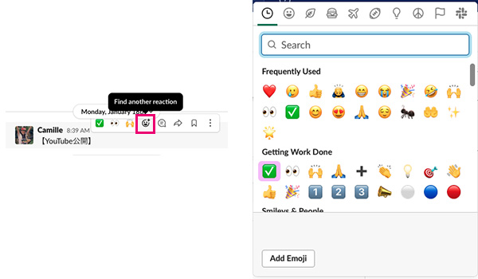

もちろん、スタンプのような使い方もできます。<br>*ありがとう（アリが10匹）*みたいに、~~昭和生まれな~~くだらない使い方もできます。

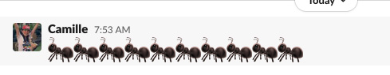

Slackのおもしろいところは、**独自の絵文字を作れる**ところです。
<br>自分たちのワークスペースに必要な絵文字（リアクション）を追加できます。

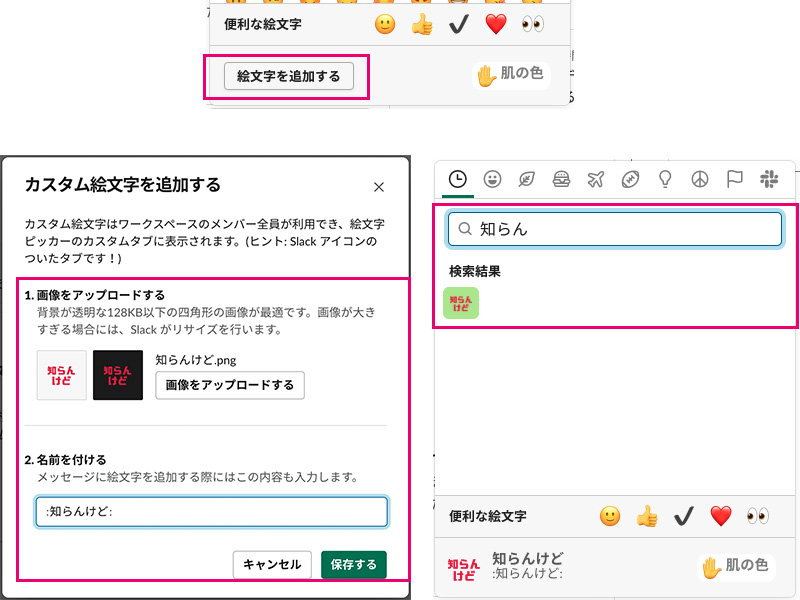

<small>※ ダークモードなどにも対応するために透過PNGで作成することをオススメします！</small>

削除するときは、左上の「ワークスペース名」をクリックし、「以下をカスタマイズ~」をクリックします。

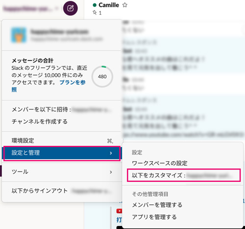

現在使用中のワークスペース設定（ブラウザー）へ飛びます。もちろん、ここからも絵文字を追加できます！

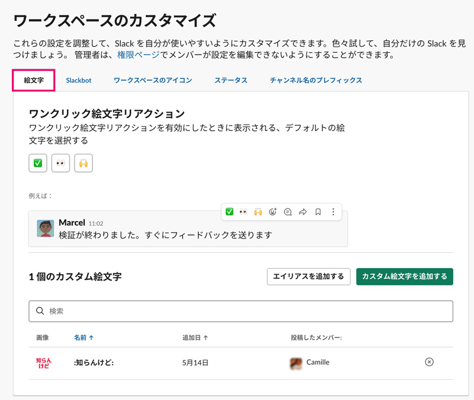

追加した絵文字の右側のバツアイコンをクリックします。

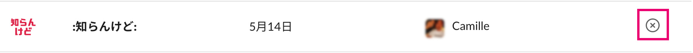

<small>※ 自分以外の作ったものは管理者権限がないと削除できません。</small>

## 大切な投稿はピン留めやブックマークを活用してすぐ読み返そう！
みんなと共有したい大切な投稿は右サイドバーにピン留めとして置いておくこともできます。<br>
右サイドバーの開閉は（アプリorブラウザー）以下のアイコンをクリックします。


右サイドバーの開閉のためのショートカットもあります。（*ctrl/cmd + shift + i*）

サイドバーのピン留めを確認するとこんな感じでカードがあります。<br>バツアイコンをクリックするとピンを外せます。

<small>※ ピン留めがない場合、カードはありません。</small>

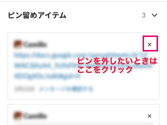

### 自分だけが見返したい投稿はブックマーク機能
自分には大切だけど、他人には関係ない投稿はブックマークしておきます。

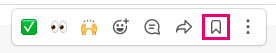

ブックマークの用途の説明が上部に書いてあるのですが、使い方わかってしまえば不要です。<br>なのでバツボタンをクリックして非表示にしておきましょう。

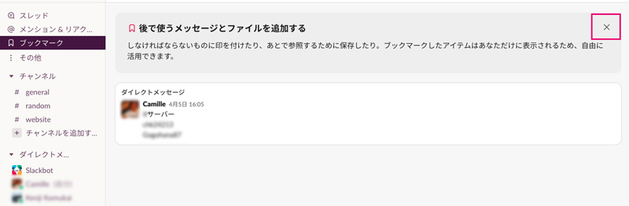

### 自分へのDMをメモとして活用
私はよく、LINEなどで受け取ったメッセージや、外出中にあとで見たいリンクなど見つけたらSlackの自分自身にDMします。

内容に応じて大事なものをピン留めや、ブックマークして整理しつつメモ帳感覚で使っています。

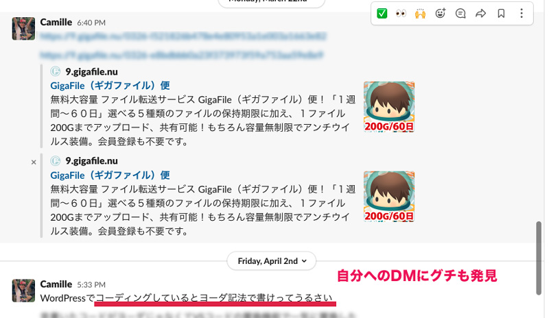

## 誤爆防止！たくさんワークスペースがあるときはテーマを変えよう！
現在私はSlackで9ワークスペースぐらい使っており、主要なワークスペースはテーマを変えるようにしています。<br><br>

理由は、**誤爆防止（間違えて投稿しないようにするため）** です。<br><br>

昔全然違うワークスペースへ投稿して*寿命が縮む思い*をしたことがあります。

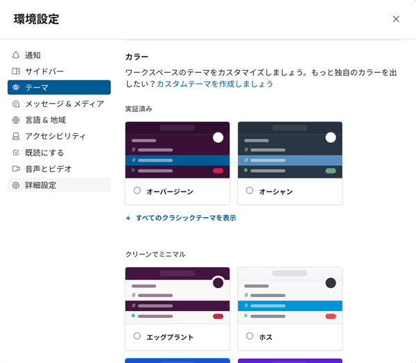

Slackのいいところはテーマもスマホアプリなどと同期します。

どの端末からSlackを使っていても、どのワークスペースにいるかがわかりやすいです。

<ad location="/blogs/entry460/"></ad>

## Slackbot、返事をお願い！カスタムレスポンス
Slackにはカスタムレスポンスという機能があります。特定のワードに対して、Slackbotが反応してくれます。
<br>よくある質問などはSlackbotに答えてもらうと仕事が減ります。

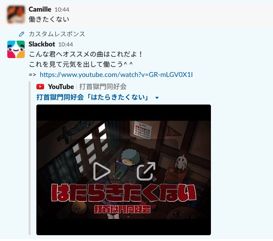

絵文字の削除の時と同様、左上の「ワークスペース名」をクリックし、以下を「カスタマイズ~」からワークスペースの設定へ移動します。


タブをSlackbotに切り替えて、新しいレスポンスを追加します。

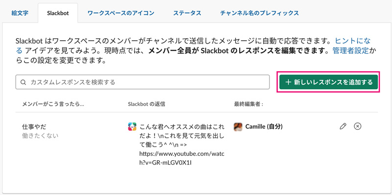

「メンバーがこう言ったら」の部分は、Slackbotに反応させたいワードです。<br> *,（カンマ）* 区切りで複数設定可能です。

botのメッセージを改行したいときは\n（バックスラッシュ + n、Windowsは¥（円）記号）を使います。

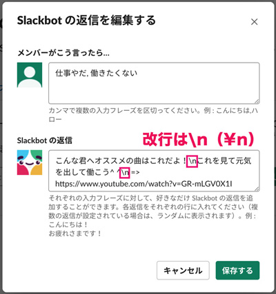

改行した後にリンクを貼りたい場合、スペースなどを挟むなどして工夫しないと表示されなかったり、リンクが飛ばなかったりしますのでご注意を。

<div class="box">
  <h4>Slackbotの残念なところ</h4>
  文章によってはワードの前後にスペースなどがないと、botが反応しないことがあります。<br>英語圏で作られたビジネスチャットツールなので、スペースなしに続けて文章を書く日本語にフィットしないところもあります。
</div>

## 高機能な検索で重要な投稿を探しだそう！
Slackは検索が*超！！！高機能*です。

Slack上部に検索窓から検索できます。<br>フリーワードでも検索できますが、長く運用しているワークスペースでは効率が悪いので**的を絞って検索することをオススメ**します。

ざっくり*メッセージ*、*ファイル*、*チャネル*、*メンバーディレクトリー（誰が所属しているチャンネルか）* の4つの項目を選びつつ検索できます。

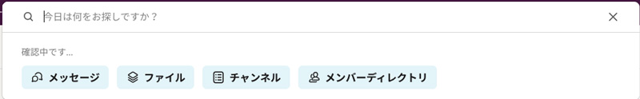

余談ですがTwitterでもいろんな検索方法使えます^ ^
<card slug="entry456"></card>

<br>Slackの検索機能はめちゃくちゃ高度で説明したらキリがないので、私がよくやるパターンを2つご紹介します。

### その1・いついつくらいに〇〇さんからもらったPDF資料どこやっけ。。。
これめちゃくちゃ使います！<br>
ファイルを選んだ後、人、期間、ファイルタイプなどで記憶を元に検索します。

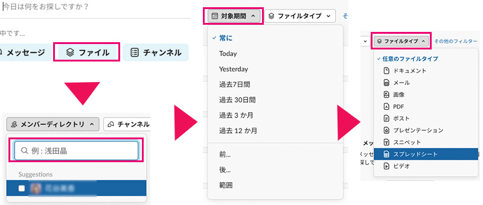

「私探偵？」って思うくらい見つけられます。

<small>※ フリープランの1ワークスペースのファイルストレージの上限は5GBまでです。古いものからアーカイブ（削除）されます。</small>

### その2・過去の投稿を遡（さかのぼ）り証拠を突きつけろ！
上司や部下が「*そんなこと言ったっけ？*」とか、トボけ出したら検索の出番です！！

<msg txt="言った言わないで揉めるのが一番イヤ！<br>証拠さえ見つかれば「あなたがこう言ったんでしょ？」が確実に突きつけることができます。"></msg>

*アカウント*、*期間*、*どんな発言だったか大体のキーワード*などを組み合わせて調べます。<br>探したい投稿によって組み合わせるものは変わってきます。

なので、検索術「その1」を参考にしつつ、検索してみてください。

<ad location="/blogs/entry460/"></ad>

私はこのSlack検索のおかげで何度も救われましたw<br>
そして事件が連発しすぎて、検索窓へ直打ちして検索できるようになりました。

```
キーワード from:誰から to:誰へ before:終了日時 after:開始日時 in:#チャンネル名
```

```
fugafuga from:@アカウント名 to:@アカウント名 before:2021-05-15 after:2021-04-30 in:#hogehoge
```

<div class="box">
  <h4>編集期間をセットして隠蔽（いんぺい）を防止しよう</h4>
  中に一度投稿内容を削除して証拠隠滅（いんめつ）する人もいます。<br>防止するために、編集できる期間を設けることをオススメします。<br>
  <a href="https://slack.com/intl/ja-jp/help/articles/115004868646-%E3%83%A1%E3%83%83%E3%82%BB%E3%83%BC%E3%82%B8%E3%81%AE%E7%B7%A8%E9%9B%86%E3%81%A8%E5%89%8A%E9%99%A4%E6%A8%A9%E9%99%90%E3%82%92%E7%AE%A1%E7%90%86%E3%81%99%E3%82%8B-" target="_blank" rel="noopener">メッセージの編集と削除権限を管理する | Slack</a>
</div>

## 忘れっぽいあなたにリマインダー
Slackではbotを通じて決まった日時や時間にリマインダーとして通知を送ることができます。

<msg txt="昨日の晩ご飯も思い出せないのに、<br>2週間先に思い出せるワケないですw（個人の意見です）"></msg>

投稿入力欄にコマンドを打ち込めば、リマインダー登録できます。

<small>※ コマンドは投稿欄に入力して実行します。</small>

```
/remind アカウント名やチャンネル 内容 期間
```
実際のコマンドサンプルはこんな感じ。これで30分後にアカウントcamilleさんへ通知が行きます。
```
/remind @camille お昼寝の時間ですよ！ in 30 min
```

<br>コマンドって一般人にはちょーーっと敷居が高いですよね？

なので、私のオススメのやり方は最低限コマンドで設定し、日時は後から追加する方法です。

```
/remind @camille お昼寝しましょう
```
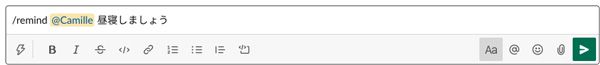

botに「いつこのリマインドしましょうか？」って聞かれるので、曜日や時間を設定します。

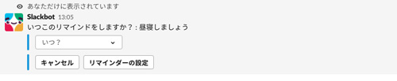

SlackとGASを連携するともっと高度に定期メッセージが送信できます。少しテクニカルですが参考にしてください。
<card slug="entry504"></card>

### リマインダーの一覧を確認したり、削除したい
以下コマンドでremindの一覧が見れます。

```
/remind list
```
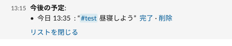

使わなくなったリマインダーは順次削除しましょう！リマインダー一覧の右側「削除」をクリックします。

## 心の安寧（あんねい）を。状況に応じて通知を切って過ごす
ずっと通知が来ると集中を妨げますよね？<br>そんな時は各々のワークorライフスタイルで通知設定を変えましょう！

いつでも設定は変えられるので大丈夫です。

<ad location="/blogs/entry460/"></ad>

### 時間帯や曜日で設定
環境設定から通知される時間帯や曜日など変更できます。

<small>※ 環境設定はショートカットでも開けます。*ctrl/cmd + ,（カンマ）* </small>

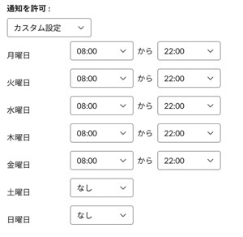

### チャンネル毎のミュート
ミュートしたいチャンネルを右クリックしたら、チャンネルごとの設定を変更できます。

「たまに確認すればいいや！」ぐらいのチャンネルであればチャンネルもろともミュート。
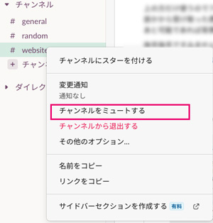

自分への呼びかけのみ、通知を受け取りたい場合は「変更通知」から「メンションのみ」にします。

@here（アクティブなステータスで作業をしているメンバー）と@channel（そのチャンネルに所属している全員）を含めるかはお好みで。
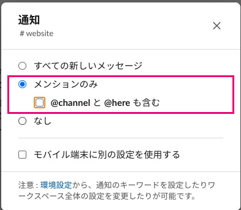

### 特定のワークスペースの通知をオフ
あまり通知が来ると困る場合は、バッサリオフしてしまいましょう。
<br>「環境設定」「通知」より設定できます。
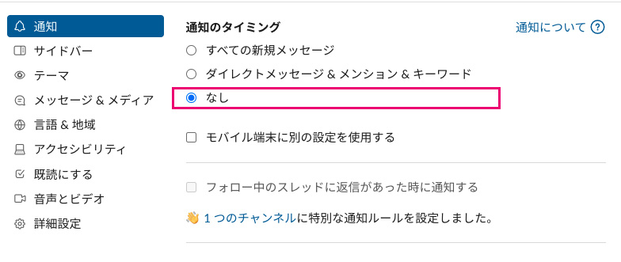

<ad location="/blogs/entry460/"></ad>

## まとめ・Slackは自分に必要な機能を優先的に使うとベンリ!!
私が普段ヘビーに活用しているSlackの使い方をご紹介いたしました。


慣れてきたらアプリなどと連携してWebサイトからのお問い合わせ・GitHubのコミットなどを、特定チャンネルに振り分けて通知させることもできます。

この記事で紹介していることは初心者から抜け出ることができる、ごく一部です。

必要だったり興味のある機能あれば参考にしていただければ幸いです。

最後までお読みいただきありがとうございました。

