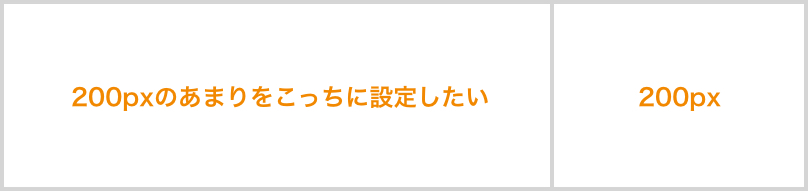
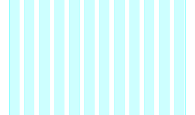
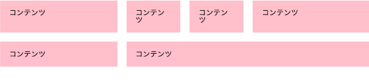
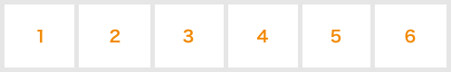
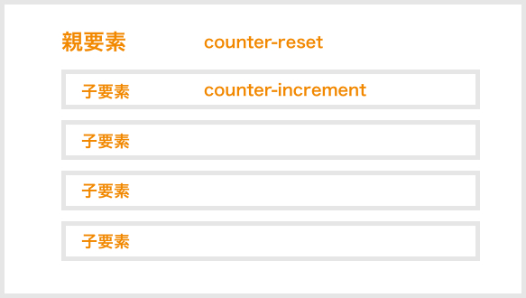
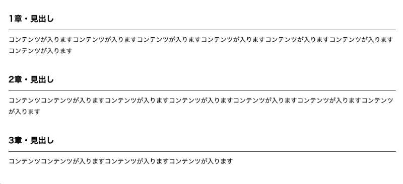
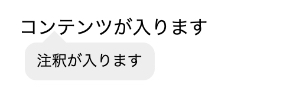
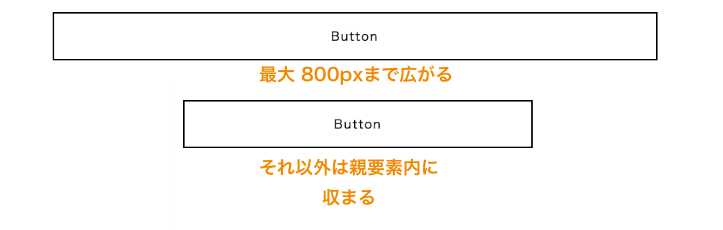

CSSって関数があるのをご存知ですか？気づかず使っている人多いはずです。

2022年6月15日にIEがいなくなるので、大手を振って使えるCSS関数がたくさんあります！

私が普段使っている関数と今後バンバン使っていきたい関数を事例とともに12選紹介します！関数は目次にあるので、お好きなものだけ飛ばし読みしてください。

<prof></prof>

<msg txt="ちょっとマニアックな関数も紹介します！<br>CSS大好きな方、ワクワクでお付き合いください^ ^"></msg>

*この記事の対象者*
* CSSが少しわかる
* Webデザイン・コーディング勉強中
* CSS関数を追求したい
* SCSSが分かっている

今回SCSSを中心としたCSSの記述になってますのでご注意を。

<small>※ リセットCSSを使うことが前提条件です。</small>

## もはやヘビーユーズ！calc関数
px、%、emどんな単位でもかかってこいや！全部計算してやんよ！！

ってのが*calc関数*です。<br>もはや「愛してます」って言いたいレベルに大好きです。

### 使用例その1・2カラムレイアウトで片方の幅を固定したい
右側のサイズを200px固定、余りを左側へ設定したい場合に役立ちます。



```html
<div class="row">
  <div class="col-left">左</div>
  <div class="col-right">右</div>
</div>
```

SCSS使います。

```scss
//sassの変数で幅を設定しておく
$rightWidth: 200px;

.row {
  display: flex;
}

.col-left {
  width: calc(100% - #{$rightWidth});
}

.col-right {
  width: $rightWidth;
}
```

[2カラムレイアウトで片方の幅を固定したい|CodePen](https://codepen.io/camile/pen/abJJZPM)
<div class="box">
<h4>gridを使ったらもっとカンタンです。。。</h4>
</div>

### 使用例その2・グリッドレイアウトを使いたいとき
カラムを12コに分ける12grid layaout systemという考え方があります。



使うメリットはデザインに規則性を持たせることもでき、レイアウトが揃ってきれいです。

規則性があるので、ムダなコード量も減ります。

コーダーもデザイナーもハッピーになります。

一個の列の幅は全体100%とし、12に分けるので`8.33333333333%`になります。



一個の列をいくつ使うかでレイアウトを決めていきます。

```html
<div class="container">
  <div class="row">
    <div class="col-4">コンテンツ</div>
    <div class="col-2">コンテンツ</div>
    <div class="col-2">コンテンツ</div>
    <div class="col-4">コンテンツ</div>
    <div class="col-4">コンテンツ</div>
    <div class="col-8">コンテンツ</div>
  </div>
</div>
```

SCSSはこんな感じ

```scss
$col-unit: 8.33333333333%;
$gap: 20px;//余白

.container {
  max-width: 100%;
}

.row {
  display: flex;
  flex-wrap: wrap;
  margin-left: -#{$gap};
}

@for $col from 1 through 12 {
  .col-#{$col} {
    width: calc(#{$col-unit} * #{$col} - #{$gap});
    margin: 0 0 #{$gap} #{$gap};
    background: pink;
    padding: 20px;
    box-sizing: border-box;
  }
}
```
[グリッドレイアウトを使いたいとき|CodePen](https://codepen.io/camile/pen/wvJJWNd)

## step関数でコマ送りアニメーションを実装
最近のCSSアニメーションはめっちゃ優秀なんですが、*step関数*を使うとこんなものも作れます！

<figure class="animation"></figure>

コマ数分のイラストを置いた画像素材を作ります。並べる方向は縦でも横でもOK!!

画像の種類は透過PNGでもOKです。



コマ数をstep関数にセットします。

```scss
animation: アニメーション名 1s steps(ステップ数) infinite;
```

```scss
@keyframes アニメーション名 {
  to{
      background-position: -画像の長さ 0;
  }
}
```
上記は画像が横方向の場合です。たて簿場合は以下のようになります。

`background-position: 0 -画像の長さ;`

昔のファミコンのキャラクターぽいものを作成します。あえてレトロ感を出すため、step数を少なめにしています。


```html
<body>
  <span class="btn"></span>
</body>
```
```css
body {
  background: #333;
  display: flex;
  justify-content: center;
  align-items: center;
  height: 100vh;
}

.chara {
  display: inline-block;
  height: 135px;
  width: 145px;
  animation: tekuteku 1.3s steps(4) infinite;
  background: url(tekuteku.png) 0 0 / 100% auto;
}

@keyframes tekuteku {
  to{
      background-position: 0 -540px;
  }
}
```

[step関数でステップアニメーション|CodePen](https://codepen.io/camile/pen/dyvvWpZ)

## 自動でナンバリング出力！counter&counters関数！

counter関数はオリジナルでリストや章にナンバリング出力したいとき、便利です。


詳しくは以下記事にまとめてますが、ざっくり紹介します。この関数はCSS2からあるのでIE対応不要です。そこが好きです。

<card slug="entry363"></card>

*counter関数*を使うためには設定があります。*増やし*つつ、*リセット*する必要があります。
```css
//num（名称を任意で決める）をリセット
counter-reset: num;

//指定した要素が繰り返されるたびに数字を増やす
counter-increment: num;
```


### 使用例その1・セクションごとにナンバリング
ナンバリング表示はリストを考えがちですが、章ごとにナンバリング付きの見出しを出力することもできます。


```html
<div class="number">
  <section class="sec">
    <h2>見出し</h2>
    <p>コンテンツが入りますコンテンツが入りますコンテンツが入りますコンテンツが入りますコンテンツが入りますコンテンツが入りますコンテンツが入ります</p>
  </section>
  <section class="sec">
    <h2>見出し</h2>
    <p>コンテンツコンテンツが入りますコンテンツが入りますコンテンツが入りますコンテンツが入りますコンテンツが入りますコンテンツが入ります</p>
  </section>
  <section class="sec">
    <h2>見出し</h2>
    <p>コンテンツコンテンツが入りますコンテンツが入りますコンテンツが入ります</p>
  </section>
</div>
```
```scss
.number {
  padding: 20px;
  counter-reset: num;
  line-height: 1.75;
}

.sec {
  margin-bottom: 30px;

  h2 {
    counter-increment: num;
    font-size: 20px;
    font-weight: bold;
    margin-bottom: 10px;
    padding: 10px 0;
    border-bottom: 1px solid #000;

    &::before {
      content: counter(num) '章・';
    }
  }
}
```
[セクションごとにナンバリング|CodePen](https://codepen.io/camile/pen/bGqqezR)

### 使用例その2・入れ子ナンバリング
*counters関数*を使うと入れ子のナンバリングができます！

こういうのやりたいですよね？？


```html
<ol>
  <li>リスト</li>
  <li>リスト
    <ol>
      <li>リスト</li>
      <li>リスト</li>
      <li>リスト</li>
      <li>リスト</li>
    </ol>
  </li>
  <li>リスト</li>
</ol>
```

```scss
ol {
  counter-reset: num;
  & > li {
    text-indent: -1.5em;
    margin-left: 1.5em;
    margin-bottom: 10px;
    counter-increment: num;
    margin-bottom: 10px;

    &::before {
      content: counter(num)  ;
      display: inline-block;
      font-weight: bold;
      color: red;
      width: 1.5em;
      text-indent: 0;
    }

    & > ol {
      margin-top: 10px;

      li{
        text-indent: -2.5em;
        margin-left: 2.5em;

        &::before {
          width: 2.5em;
          content: counters(num, "-") ;
        }
      }
    }
  }
}
```
[入れ子ナンバリング|CodePen](https://codepen.io/camile/pen/NWppRbY)

## カスタムデータ（data-**）の値を取得できるattr関数
今更いうまでもないですがhtml5からカスタムデータ（data-）が取得できるようになりました。

`data-任意の名前`

JSではへビーに使ってますが、これめっちゃ便利でCSSで値を取り出して使うこともできるんです！

```html
<p data-annotation="注釈が入ります">コンテンツが入ります</p>
```
取得方法は、beforeやafterでcontentで出力します。
```scss
attr(data-annotation);
```

### 使用例・Tooltipsとして使う
ツールチップス（マウスオーバーで注釈や説明を表示）の使い方です。



```html
<p data-annotation="注釈が入ります">コンテンツが入ります</p>
```
```css
p[data-annotation]{
  position: relative;

  &::before {
    left: 20px;
    bottom: -5px;
    content: '';
    position: absolute;
    display: block;
    border-style: solid;
    border-width: 0 10px 10px 10px;
    border-color: transparent  transparent #eee transparent ;
    display: none;
  }

  &::after {
    display: none;
    position: absolute;
    content: attr(data-annotation);
    background: #eee;
    left: 5px;
    bottom: -5px;
    padding: 10px;
    font-size: 0.8em;
    border-radius: 10px;
    transform:translateY(100%)
  }

  &:hover {
    &:after {
      display: block;
    }

    &:before {
      display: block;
    }
  }
}
```
[Tooltipsの作り方|CodePen](https://codepen.io/camile/pen/oNZZzoL)

## rgba関数で色だけじゃなく透明度を設定する
*rgb関数*というものがあり、R（赤）、G(緑)、B（青）（光の三原色）と色を設定する方法です。<br>
255が最大値なので、3色とも最大値に設定すると白になります。

```css
rgba(255, 255, 255)
#fff //16進数
```
*rbba関数*は*rgb関数*にアルファ値（透明度）が加わったものです。

アルファ値（透明度）は1 ~ 0で設定できます。

```css
rgba(255, 255, 255, .5)
```

ちょい長いですよね？<br>コード書いていると、16進数が記述量も少なく便利です。

scssだと16進数+α（アルファ・透明度）値で設定できるので便利です。
```scss
rgba(#fff, .5)
```

### 使用例・グラデーションをかぶせる。rgba関数とlinear-gradient関数の合わせ技
微妙な色を表現するには*linear-gradient関数*（線形グラデーション）が便利です。

画像は写真の上に白グラデをCSSでほんのり乗っけたものです。


```html
<div class="mainvisual">
  
</div>
```
```scss
.mainvisual {
  position: relative;

  &::before {
    position: absolute;
    display: block;
    content: "";
    width: 100%;
    top: 0;
    left: 0;
    height: 100px;
    background: linear-gradient(to bottom, rgba(#fff, .5) 0%, rgba(#fff, 0) 100%);
  }
}

img {
  width: 100%;
}
```

[Tooltipsの作り方|CodePen](https://codepen.io/camile/full/ZEeeLjo)

## 最小値や最大値を決めて挙動を制御できるmin&max&clamp関数
minmax関数はgridレイアウトとセットで使用しますが、min関数とmax関数の使い方を紹介します。

混乱しないように注意して欲しいのが、最大値を設定できるのが*min関数*、最小値を設定できるのが*max関数*です。

<small>※ min関数とmax関数はIE未対応です。</small>

### 使用例その1・min関数でボタンの幅を制御
ボタンなど最大幅を決めて、それ以上は広がらないようにしたいというような制御をよく行います。

いつもはこんな感じで書いていました。
```css
max-width: 最大値;
width: 通常の幅;
```
min関数ではこんな感じに書けます。
```css
width: min(最大の幅, 最大値);
```



```html
<p><a href="#" class="btn">Button</a></p>
```
```css
body {
  padding: 20px;
}

.btn {
  margin-left: auto;
  margin-right: auto;
  display: flex;
  width: min(100%, 800px);
  align-items: center;
  justify-content: center;
  text-decoration: none;
  height: 60px;
  color: #000;
  border: 2px solid #000;
  letter-spacing: .1em;
}
```

[min関数でボタン幅を制御|CodePen](https://codepen.io/camile/pen/wvJJoxV)

### 使用例その2・max関数でロゴ幅を制御
先ほどとは逆でヘッダーロゴなどの最小値を決めて、それ以下は広がらないようにしたいこともあります。


```css
min-width: 最大値;
width: 通常の幅;
```
min関数ではこんな感じに書けます。
```css
width: max(最大値, 最小の幅);
```
```html
<p class="logo">
  
</p>
```

今回は単位をVW（ブラウザ幅）を使ってみました。

```css
.logo svg{
  width: max(20vw, 180px);
}
```

[max関数でロゴ幅を制御|CodePen](https://codepen.io/camile/pen/NWppdxN)

### 使用例その3・clamp関数で幅の最大と最小値を制御
レスポンシブ対応をしていると最大値も最小値も制御したい！てことが出てきます。
そんな時は*clamp関数*を使います。

clamp関数はmin関数とmax関数を同時に使ってる感じです。
```css
.element {
  width: clamp(最小値, 通常の値, 最大値);
  /* 以下と同等です */
  width: max(最小値, min(通常の値, 最大値));
}
```
コードをすべて書くとこんな感じです。
```html
<p class="logo">
  
</p>
```
```css
.logo svg{
  width: clamp(180px,100%, 500px);
}
```

## var関数（カスタムプロパティ）でよく使う値を登録し、効率よくコードを書く
var関数（カスタムプロパティ）は繰り返し使う値を登録しておくことができる便利機能です。

この「銀ねこアトリエ」でもvar関数（カスタムプロパティ）でこのように登録してあります。

```scss
:root {
  --color: #335;
  --font-color: #232a41;
  --color-sec: #464675;
  --color-blue: #264785;
  --color-link: #1231b8;
  --color-d-blue: #18347a;
  --accent-color: #c03363;
  --shadow: 0 0 4px rgba(0,0,0,.3);
  --milk: rgba(225,225,225,.9);
}
```

変数は`--` + `任意の名前`で登録できます。

呼び出す時は以下のように書くだけ。

```scss
body {
  color:var(--font-color);
}
```
[css-vars-ponyfill|GitHub](https://jhildenbiddle.github.io/css-vars-ponyfill/#/)

## image-set関数で背景画像もディバイスごとに解像度を調整
html同様に*image-set関数*というものがCSSにも存在します。
Chrome、Firefox、Safariは表示されました。Edge仮想環境で確認したけど表示されず（Chromeと一緒なのになー汗）。。。

背景画像もディバイスによって画像の出し分けできたら、便利！

ちなみに[image-set()|MDN](https://developer.mozilla.org/ja/docs/Web/CSS/image-set())通りに書いたら動きません。必ず*url関数*の中に画像パスを書いてください。

img画像は解像度を変えたものを用意したらいい感じになると思います！

```scss
.firstView {
  display: flex;
  align-items: center;
  justify-content: center;
  height: 100vh;
  background: url(image/bg-original.jpg) center / cover no-repeat;
  background-image:
    image-set(
      url(image/bg-original.jpg) 1x,
      url(image/bg-original-x2.jpg) 2x,
    );

  h1 {
    color: #fff;
    font-size: 20vw;
  }
}
```
[image-set関数で画像のディバイスごとの解像度を調整|CodePen](https://codepen.io/camile/pen/xxqqgme)
## まとめ・CSSの関数を使って便利に
今回は12コのCSS関数を紹介させていただきました。

他にもたくさんあるんですが、厳選してみました。

この記事が皆さんのコーディングライフの一助となれば幸いです。

最後までお読みいただきありがとうございました。

