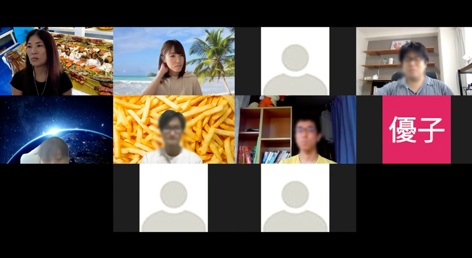

2021/6/12でんか塾に参加しました。当日の様子をまとめると同時に、私のLT「海外ノマドを始めてやめたこと」のスライドなどを紹介します。
<prof></prof>

## でんか塾とは？
でんかじゅくとは、でんか主催の広島にあるこぢんまりとした、LT中心のIT勉強会です。

でんかじゅくについてさらに詳しく知りたい方は前回の様子も併せてお読みください。

<card slug="entry457"></card>

この勉強会の主催者、でんかとは前日オンライン飲みをしていて勢いで参加することになりました。

<msg txt="酔った勢いほど怖いものはない！！"></msg>

[オンラインでんかじゅくON ZOOM](https://connpass.com/event/215979/)

## でんか塾・当日のセッション内容のご紹介

各セッションのタイトルを忘れましたがこんな感じのお話でした。ざっくり紹介します。

* でんか ... SEOについてスーパー入門編（5m）
* ひしょー ... これからのフロントエンドの画像の最適化much betterな書き方について（30m）
* やまちゃん ... デザインエンジニアリングについて（30m）

### でんか・SEOの入り口的お話
何か困ったら「ぴえん」と野太い声で言う[でんか](https://twitter.com/sassga)です。SEOをクライアントに対して普段わかりやすく説明しているので、今回初心者向けの内容でした。

<msg txt="私も日々反省してますが、専門用語が多いと専門外の人にはわかりにくいですよね。。。"></msg>

私の元同僚がいつもアインシュタインの言葉を引用して「**6歳児にもわかるように説明できなければ理解したと言えない**」、と言っていたのを思い出しました。

でんかのLTを聞いてとても分かり易かったです。改めて勉強になりました。

### ひしょー・2021年Web制作の画像最適化のお話
現役フロントエンドエンジニアの[ひしょー](https://twitter.com/__hisho__)くん。まだまだ若いのに超優秀です。

GoogleはCore Web Vitals（コア ウェブ バイタル）をランキング要素に組み込むと言っています。

表示速度の足を引っ張る一番の原因と言ってもいい、**画像**の最適化についてです。 軽量化し、いかにスムーズに読み込むのかが今後の課題になってくるところ。

現時点の画像形式やコードの書き方についてbetterな方法を教えてくれました。

* *WebP（ウェッピー）* ... Googleが開発している画像フォーマット。ほぼ同等の画質でPNGよりも約26％、 JPGより約25〜34％軽くできるらしい。IE以外は対応しているので使わない理由はない。Photoshopやコマンドから変換可能。
* *srcset* ... 画像を何個か用意してブラウザや端末によって最適なサイズを選んでくれる。
* *pictureタグ* ... デバイス幅や端末によって画像を出し分けます。srcsetに比べると、強制的。PSとPCでメインビジュアルを使い分けたいときなどに利用。
* *loading="lazy"* ... スクロールして可視領域に達する直前で、画像を読み込ませるための属性。
* *decoding="async"* ... 画像のデコード処理を非同期にバッググラウンド処理し、他のコンテンツの表示処理終了時に更新処理するやつ。

コードの書き方は複雑になりますが2 ~ 3つでも組み合わせれば読み込みスピードは劇的に改善します。

### やまちゃん・デザインエンジニアリングについて
[やまちゃん](https://twitter.com/ymnk4919)は歩くWikipediaみたいな人です。

今回はデザインとエンジニアリングの話でした。マインドのお話でした。

* *OODA* ... Observe （観察）Orient （状況判断、方向づけ）、 Decide（意思決定）、Act （行動）

これをloopで回すことをOODA loopと言うそうです。（音が似ているからUber Eatsとかくだらないこと言ってごめんなさい）

* *[JOB理論](https://media.bizmake.jp/method/about-jtbd/)* ... サービスや商品、アプリケーションなどを利用するとき必ず「成し遂げたい目的」があります。ジョブ理論はその目的を「ジョブ」と位置付けて、ニーズを探っているのです。

 実例を交えて紹介してくれたのでとても分かりやすかったです。

 ざっくり言うとデザインもエンジニアリングも「**お困りごとを解決する手段**」よねーって話だったと思います。

お困りごとを解決する手段を提案したり、実現するためにハンドリングするのは結局**ディレクター**だよね、って言うオチでもありました。

## LT「やめる勇気」について
今回私は「やめる勇気」について話しました。

海外ノマド始めて、なんとなくだけどやめたことがたくさんあり、気がラクになったってお話です。

ここで私の言う「*やめる*」とは、**一般的に常識だけど本当はやりたくないと思いつつやっていることを*やめる***ことです。

<msg txt="「これ、しないと社会人としてダメなんじゃないか？」とか 「ねばならないこと」って、ある種強迫観念にも近い気がします。"></msg>

<iframe src="//www.slideshare.net/slideshow/embed_code/key/yQnAy54IytrPEl" width="595" height="485" frameborder="0" marginwidth="0" marginheight="0" scrolling="no" style="border:1px solid #CCC; border-width:1px; margin-bottom:5px; max-width: 100%;" allowfullscreen> </iframe> 
 <strong> <a href="//www.slideshare.net/yurikamimori/ss-249332007" title="やめる勇気 〜人生も仕事も想像以上にシンプル〜" target="_blank">やめる勇気 〜人生も仕事も想像以上にシンプル〜</a> </strong> from <strong><a href="https://www.slideshare.net/yurikamimori" target="_blank">Yuriko Kamimori</a></strong> 

最近、日本にいる人とたまに話していて感じることがあります。

<msg txt="日本って「ねばならない」が溢れかえっていて生き辛そうだなぁ。。。 それの考え方をやめたらもっとラクになるだろうに。"></msg>

私の今回のLT、実は「*嫌われる勇気*」の影響を受けてお話しさせていただきました。

最近ギャップを感じているタイミングで、「*嫌われる勇気*」という本をススメられました。

前からベストセラーの本ですよね。 ミーハー嫌いな私は以前興味ありませんでしたが、この人がすすめるならと思い読んでみました。

[嫌われる勇気 Kindle版](https://amzn.to/3pX2UqV)

読んでみると、仕事に対する考え、人付き合い、すべてにおいて私にとっては答えあわせのような内容でした。

 私も昔は「ねばならない思想」でがんじがらめになって生きてきました。

たとえば、こんな感じ。

* 離婚や恋愛で失敗ばかりしてきたらか怖くて恋愛ができない。

好きな人ができたところでふられるのも悲しいし、恋愛したくないからしたくない理由を離婚のせいにしている（**アドラー心理学でいう*目的論***）。

確かに、失敗って怖いですもんね。とくに、歳をとればとるほど怖くなりますwww

 私の生き方を推奨する訳じゃありませんが、こんな生き方もあるくらいに思ってもらえれば幸いです。

## まとめ・インプットしないとアウトプットもできない
今回ひょんなことで勉強会に参加させてもらって勉強になり、でんかに感謝です。

IT業界の技術や情報って自分が意識してインプットしていないとあっという間に陳腐化してしまいます。 
それを爆速ですでに知識を持っている人から知ることができるのって、めっちゃラッキーですよ。IT勉強会、活用した方が絶対いいです。

もちろん、インプットして満足している人、次回ぜひアウトプットしてもらいたいですね。

<msg txt="アウトプットとインプットはセットです！！"></msg>

そして、マインドもアウトプットとインプットするのって大事。健康な心が学びへの探究心を育みますから！

とりとめのない記事になってしまいましたが、最後までお読みいただきありがとうございます。

次回はぜひどこかのIT勉強会でお会いしましょう！
