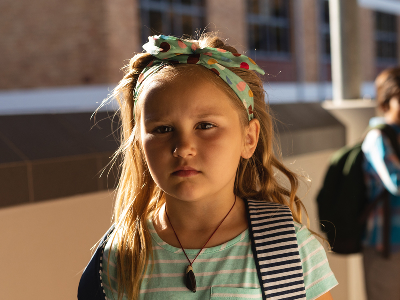

日本には辛そうに生きている長女が多い気がします。

私は中間子として親の期待や責任から免れてきた子。一方長女は成長しきった今でも期待と呪縛から逃げられないみたいで辛そうです。そんな長女を第三者の立場から考察してみます。

当の長女の方には共感は生まないかもしれません。どうみられてるかは参考になるかと思います。

<prof></prof>

以前「中間子ってどんな性格？」というブログを書きました。私は 4 人兄弟の絶賛代表的な中間子です。

<card id="/blogs/entry420/"></card>

個人的には血液型、星座はあてにならないけど、やっぱり兄弟順がめちゃ性格がわかりやすいと思っています。

中でも長女はその典型で、成長の過程でその性格が形成されているのではないかと言う仮説を立てました。

## なぜ長女は拗らせるのか？

私の出会った長女はなぜか拗らせてる人が多いです。

なぜ、長女は拗らせるのか。その原因について、周りの長女を参考に私なりの分析です。

<ad location="/blogs/entry473/"></ad>

### 長女は両親の期待をダイレクトに受けるから

一番最初に生まれたがゆえに長女は両親の期待を一心に受けがちです。

うちの家を例にとります。
 両親とも実家が貧しく、父は高卒。ちなみに母は中卒です。貧困で進学できなかったからです。
 私が記憶する 5 歳ぐらいまでは超貧乏で市営住宅の 4 畳半の 1 室に兄弟 3 人放り込まれていました。

父は大学の推薦状をもらえていたほどの努力家でした。金銭的な理由で大学進学は叶いませんでした。 高校卒業後、土木関係の仕事でしたが並々ならぬ努力で当時広島市内の新興住宅地へ引っ越すことができました。高度成長期、周りはホワイトカラーのお父さんばかりでした。

そんな父は子どもに多大な夢を託します。期待を一番にされるのは一番最初に生まれた長女です。

姉には広島で一番頭のいい大学に行ってほしいと、そんなプレッシャーをかけていたようです。

### 「お姉ちゃんだから〜」という殺し文句でやりたくないことをするようになる

生まれ順はあるものの、みんな子供っちゃ子供。

親は決まり文句として、つい「_お姉ちゃんだから我慢しなさい_」「_お姉ちゃんだからしっかりしなさい_」なんか言います。

お姉ちゃんの心境はいつも「妹・弟たちは遊んでるのに自分だけ我慢したり、手伝いたくないことを手伝わなきゃいけないのか」だったと想像します。

そんな時の長女の心境は惨めになる。

 でも母親は必殺技を持っています。

「_やっぱり、お姉ちゃんは偉いね！_」「_さすが、お姉ちゃん！_」

 親に褒められることは長女にとって最大のご褒美。 妹や弟に勝てる瞬間だから。

母親や父親に褒められたいがために必死で言うことをきく「いい子」ができ上がります。

### やり場のないストレスから陰で妹をいじめる

姉は常にやり場のないフラストレーションを抱えています。

たかが年齢が数年しか違わない子供同士なのに**親からの期待や責任に差がある**んです。理不尽ですよね？

いい子にしてもっと親に褒めてもらいたい。でも何もしなくても可愛がられてる妹や弟が憎らしくなる。

 と言うことで、**長女のやり場のない怒りの矛先**は弱い妹や弟に向きます。

どの家庭でも長男は母親にとってかわいいことが多いです。母親に嫌われたくない時の長女のターゲットは当然妹に向きがちです。

だからか知りませんが、私は小さい頃子どもの頃からコテンパンにいじめられました。

おばあちゃんに愛想よく挨拶できなかったという理由で、隠れてカバンでぶん殴られたこともあります。

<small>※ 今でも根に持ってるので 500 回ぐらい姉には言ってます。</small>

 私も理不尽に姉にいじめられたフラストレーションを妹に派手にぶつけました。

<ad location="/blogs/entry473/"></ad>

## だから、「長女病」になってしまう

長女は「お姉ちゃん」だからと言う理由で親の期待に応えることで褒められ、幼い頃から**自己肯定感を得ることを学びます**。

「_3 つ子の魂 100 まで_」

家族の**長女というポジション**に育まれた性格は大人になっても続きます。

- いつも誰かと自分を比較して妬んだり*劣等感を感じる*（妹や弟の存在が原因）
- *我慢*したり*弱音が吐けなくなる*（自分は常にいい子でいなければならないと言う思い込み）
- やなことや苦しいことも*評価されるためにやる*（お母さんやお父さんに褒められたい）

 だから、拗らせてしまう人が多いんじゃないかと言うのが私の見解です。

## 愛情不足なんて存在しない。親の愛情に満足していない自分がいるだけ

ここからは私の意見です。

**愛情不足なんて存在しません**。

 *愛情不足だと思っているあなたがいるだけ*です。

 状況だけあげれば中間子である私の方が不幸と言えるでしょう。

そんなに写真も残ってないし、洋服もほぼいつもお古です。

 同じ両親から生まれた兄弟でも、物事の受け止め方が違っただけ。

実際、いつか着たい！と思っていた姉のフルーツ柄のセーターがお下がりされた時は本当に嬉しかったですし。

不幸なんて探そうと思えばいくらでも理由は探せるんです。

<ad location="/blogs/entry473/"></ad>

## お母さんへ。赤ちゃんの頃の記憶なんてないから、妹や弟なんて最低限必要なお世話さえすればいい

> 兄と私が生まれたことでお母さんはいつも 2 人の手を繋いでいる。弟と妹が生まれたからお母さんと手が繋げなくなった。

姉は子供の頃そう思ってたそうです。すごく、寂しかったと想像します。

 当の私といえばお母さんと手を繋いでいたことすら覚えてません。親よりも、虫やレゴで遊んだ楽しい思い出の方が鮮明です。赤ちゃんの頃なんて覚えているわけないんです。

<msg txt="子どもが本当に小さいうちなんて最低限必要な世話すればいい 記憶が鮮明なお姉ちゃんを優先してください"></msg>

記憶が鮮明な長女こそ可愛がってあげた方がいいです。それだけで、長女が抱きがちな劣等感を減らすことができるはずです。

### 長女にあなたの幼少時代のやり直しをさせないで

親って「_子どもを私の子どもの時のように育てたくない_」って思いがち。

もちろん私もいつも思っていました。

もっと言うと母親って自分と長女を混同しがちで「**自分のなりたかった姿**」を強く押し付けてしまうだけじゃなく、嫌悪感さえ抱いてしまうこともあります。

<msg txt="自分の人生のやり直しを子どもに押し付けるのはやめた方がいい あなたと子供は別です"></msg>

あなたの子供の頃のことは自由に嫌っていただいて結構です。でもあなたの子供は決してあなたではありません。

 たとえば、子どもが宿題しなくたって、ちゃんと授業受けなくたって*将来困るのは子ども*です。

日本のように誰にでも教育の機会がある恵まれた国で**勉強しないのは誰のせいでもなく子どもの責任**です。親であれば、一度は「宿題しなさい」って言って注意を促しているはずです。

 親というのは愚かな生き物ですね。自分が大した人間でもないのに子供に高望みしてしまいます。

## 子供たちへ。親にも期待しないで。親ほど不完全なものはない

ついでに、つい口うるさく言ってしまう親の気持ちを弁解します。

「_自分のようになってほしくない_」と子どものため思ってやってしまったことは親にとって精一杯の行動。自分の行動がベストではなくベターだったと、受け止めるようにしています。

私も若くして子供を産んで、無知や経験不足で子育て中の私の発言や行動は間違っていたと今更後悔することも多いです。でもやってしまった後では変えることはできません。

一生懸命やろうが間違えます。とりわけ子供を正しい道へ導こうとしてやった行動こそ裏目に出ます。

親の立場として、大切なのは事実を受け止めること。

<ad location="/blogs/entry473/"></ad>

## さいごに・長女は本当に優しい

いつも彼女にとって専門外のちんぷんかんぷんのブログを読んでくれて、応援してくれている姉。
 感謝します。

ほとんどの長女は生まれた順番のせいでいろんな感情を抑え、他の幸せを優先するのが正しいと思い込んで成長します。

 実はそんなこと何 1 つする必要ないんです。

そんなことしなくていいとすべての長女に伝えたいです。

拗らせているすべての長女が、「**いい子でいなければならない**」呪縛から解き放たれることを願ってこの記事を書きました。

この記事が人生を豊かにする一助となれば幸いです。

最後までお読みいただきありがとうございました。

<a href="https://hb.afl.rakuten.co.jp/hgc/g000001d.j0byi5ae.g000001d.j0byj7d4/kaereba_main_202303200343478922?pc=https%3A%2F%2Fproduct.rakuten.co.jp%2Fproduct%2F-%2F77c4dcfe14fcf31d4b021af1eba42338%2F&m=http%3A%2F%2Fm.product.rakuten.co.jp%2Fproduct%2F77c4dcfe14fcf31d4b021af1eba42338%2F" target="_blank" >性格心理学がとってもよくわかる本 /東京書店/滝本孝雄</a>
posted with <a href="https://kaereba.com" rel="nofollow" target="_blank">カエレバ</a>

<a href="https://hb.afl.rakuten.co.jp/hgc/g000001d.j0byi5ae.g000001d.j0byj7d4/kaereba_main_202303200343478922?pc=https%3A%2F%2Fproduct.rakuten.co.jp%2Fproduct%2F-%2F77c4dcfe14fcf31d4b021af1eba42338%2F&m=http%3A%2F%2Fm.product.rakuten.co.jp%2Fproduct%2F77c4dcfe14fcf31d4b021af1eba42338%2F" target="_blank" >楽天市場</a>

<a href="https://www.amazon.co.jp/gp/search?keywords=%E6%80%A7%E6%A0%BC%E5%BF%83%E7%90%86%E5%AD%A6%E3%81%8C%E3%81%A8%E3%81%A3%E3%81%A6%E3%82%82%E3%82%88%E3%81%8F%E3%82%8F%E3%81%8B%E3%82%8B%E6%9C%AC&__mk_ja_JP=%E3%82%AB%E3%82%BF%E3%82%AB%E3%83%8A&tag=camille603-22" target="_blank" >Amazon</a>

母親版も書きました！よろしければ併せてお読みください。
<card id="/blogs/entry505/"></card>

くすっと笑える昭和のお父さん版はこちら。
<card id="/blogs/entry521/"></card>

私の祖父のお話。
<card id="/blogs/entry529/"></card>
