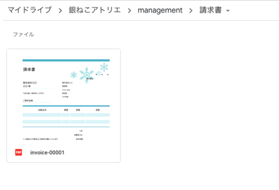
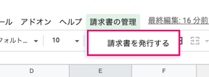
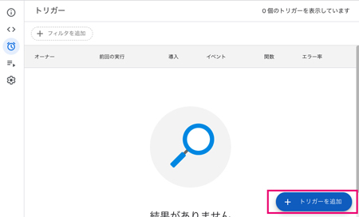

プログラミングで事務作業を自動化してラクしよう！

前回に続き、Google Apps Scriptを使ってファイルを管理する方法を紹介します。 この記事では

1. スプシ（Googleスプレッドシート）からファイルアップロード
2. ルール通りにファイルをリネーム保存 3.スプシにファイル情報を自動で追記する方法

を解説します。


## スプシからファイルをアップロードしてドライブに保存するまでざっくり
<msg txt="この記事は「人のやる作業を減らしたい」、「書類を管理するためにルールを厳格に守りたい」、「個人で会社や仕事を切り盛りしている」方にオススメです。"></msg>

この記事は、[【GAS】スプシからファイルアップロードし、ドライブに保存する・UI編](/blogs/entry475/)の続編です。

ファイルアップロード用のコードを書きます。手順としては以下の流れです。

1. スプシを準備（済）
1. GASのプロジェクト作成（済）
2. アップロード用のモーダルパーツを作成（UI追加）（済）
3. バリデーションで保存するファイルのサイズやタイプを判定（済）
4. *Googleドライブでファイルを保存しリネーム*
5. *スプシにファイル情報を書き出す*
6. *メニュー操作で保存処理を常に実行できるようにする*


<small>※ （済）は前回の記事で紹介しています。</small>

1 ~ 4を確認したい方は前回の記事をお読みください。

<card id="/blogs/entry475/"></card>

請求書の整理を例にとって進めていきます。

<br>*ファイルがフォルダーに格納されるイメージ*
```
請求書/
 ├ invoice-00001.pdf
 ├ invoice-00002.png
 ├ invoice-00002.jpg
 │   ・・・
 └ invoice-00008.png
```


## Googleドライブにファイルを格納する
ファイルを格納するフォルダーを作ってコードを書いていきましょ！

### 請求書を格納するフォルダーを作る
請求書を格納するためのフォルダーをGoogleドライブ上に作成します。

今回はフォルダー名を*請求書*としました。IDをメモっておきます。URLのfolders/以降がIDです。

`https://drive.google.com/drive/u/0/folders/【ID】`


### ファイルを格納するコード
[【GAS】スプシからファイルアップロードし、ドライブに保存する・UI編](/blogs/entry470/)で作った関数`sendForm`を書き換えます。ファイルを取得し、フォルダーに格納するまでのコードです。
```js
function sendForm(form) {
  const folder = DriveApp.getFolderById(【フォルダーID】);
  const file = form.file;

  if(file) {
    const doc = folder.createFile(file);
  }
}
```

### ファイルをリネームする
ファイルを管理用のIDでリネームします。

今回は請求書なので*invoice + -（ハイフン） + 五桁の数字*としました。

```
invoice-00001
```

ID生成のコードはこちらです。スプシに登録された請求書数からIDを作っていきます。

```js
  const spreadsheet = SpreadsheetApp.getActiveSpreadsheet();
  const accounting = spreadsheet.getSheetByName('請求書');
  const num = (accounting.getRange(2, 1).getValue() === '')? 1 : accounting.getRange(1, 1).getNextDataCell(SpreadsheetApp.Direction.DOWN).getRow();
  const fileName = 'invoice-'+("0000" + (num)).slice( -5 );
```
`getNextDataCell(SpreadsheetApp.Direction.DOWN).getRow()`は2行以上連続でセルに値がないと取得できません。

ファイルが未格納の場合は*1*にしておきます。
```js
(accounting.getRange(2, 1).getValue() === '')? 1 : accounting.getRange(1, 1).getNextDataCell(SpreadsheetApp.Direction.DOWN).getRow();
```
生成したIDでリネームします。

`setName`でファイル名を変更できます。保存が終了したら`Browser.msgBox`を使ってメッセージボックスを表示します。
```js
function sendForm(form) {
  const folder = DriveApp.getFolderById(【フォルダーID】);
  const file = form.file;

  if(file) {
    const spreadsheet = SpreadsheetApp.getActiveSpreadsheet();
    const accounting = spreadsheet.getSheetByName('請求書');
    const num = (accounting.getRange(2, 1).getValue()==='')? 1 : accounting.getRange(1, 1).getNextDataCell(SpreadsheetApp.Direction.DOWN).getRow();
    const fileName = 'invoice-'+("0000" + (num)).slice( -5 );
    var doc = folder.createFile(file);
    doc.setName(fileName);
    Browser.msgBox('新しい請求書「' + fileName + "」を保存しました");
  }
}
```

実行すると権限を求められるので許可します。許可の仕方が分からない方は前回の記事[権限の許可](/blogs/entry475/#権限の許可)を参考にしてください。

処理が終わると*新しい請求書「invoice-xxxxx」を保存しました*と表示されます。


リネームされたファイルがちゃんと指定されたGoogleドライブのフォルダー内に格納されます。



できた！！

<msg txt="ドライブには同じ名前のファイルがアップロードできますよね？<br>ファイル名を自動でつけると重複することがないので、後々困らずにすみますよ！"></msg>

## スプシにファイル情報を書き出す
ファイル以外のデータも取得します。

```js
const file = form.file;//ファイルデータ
const date = form.date;//日時データ
const project = form.project;//プロジェクト名
var client = "";//顧客名。あとで値を取得します
```
顧客名はデータシートからデータを引っ張ってきて照合します。

```js
const data = spreadsheet.getSheetByName('データ');
const projectsLastRow = data.getRange(1, 1).getNextDataCell(SpreadsheetApp.Direction.DOWN).getRow();//最終行を取得
const clients = data.getRange(2, 1, projectsLastRow-1, 2).getValues();//プロジェクトと顧客の列のみ取得

//プロジェクト名から顧客名を割り出す
for(var i in clients){
  if(clients[i][0] === project) client = clients[i][1];
}
```
それぞれデータができたら、シートに出力します。
```js
  accounting.getRange(num + 1, 1).setValue('=HYPERLINK("' + doc.getUrl() + '","' + fileName + '")');
  accounting.getRange(num + 1, 2).setValue(project);
  accounting.getRange(num + 1, 3).setValue(client);
  accounting.getRange(num + 1, 4).setValue('請求書発行済');
  accounting.getRange(num + 1, 5).setValue(date);
```
実行するとこんな感じになります。


<msg txt="請求書などのファイルを一元管理！<br>IDのリンクからファイルに飛べるので、ファイルをいちいちドライブで探す必要がなくなりますヨ！"></msg>

## sendFormのすべてのコード
ファイルをリネームしてドライブに保存し、スプシに書き出すまでの処理です。
```js
/**
 * スプシのフォームからの値の受け取り、リネーム後、スプシに詳細を追記
*/
function sendForm(form) {
  const folder = DriveApp.getFolderById([フォルダーID]);
  const file = form.file;

  //ファイルを取得したら。
  if(file) {
    const spreadsheet = SpreadsheetApp.getActiveSpreadsheet();
    const accounting = spreadsheet.getSheetByName('請求書');
    const num = (accounting.getRange(2, 1).getValue()==='')? 1 : accounting.getRange(1, 1).getNextDataCell(SpreadsheetApp.Direction.DOWN).getRow();
    const fileName = 'invoice-'+("0000" + (num)).slice( -5 );
    const doc = folder.createFile(file);
    doc.setName(fileName);
    Browser.msgBox('新しい請求書「' + fileName + "」を保存しました");

    //スプシに書き出すデータ
    const date = form.date;
    const project = form.project;
    var client = "";

    const data = spreadsheet.getSheetByName('データ');
    const projectsLastRow = data.getRange(1, 1).getNextDataCell(SpreadsheetApp.Direction.DOWN).getRow();
    const clients = data.getRange(2, 1, projectsLastRow-1, 2).getValues();

    for(var i in clients){
      if(clients[i][0] === project) client = clients[i][1];
    }

    //スプシに書き出し
    accounting.getRange(num + 1, 1).setValue('=HYPERLINK("'+doc.getUrl()+'","'+fileName+'")');
    accounting.getRange(num + 1, 2).setValue(project);
    accounting.getRange(num + 1, 3).setValue(client);
    accounting.getRange(num + 1, 4).setValue('請求書発行済');
    accounting.getRange(num + 1, 5).setValue(date);
  } else {
    Browser.msgBox('保存できませんでした');
  }
}
```

## メニューから操作して保存処理を常に実行できるようにする

メニューを表示するための関数を`コード.gs`（GAS）に追記します。

`functionName`に前回[【GAS】スプシからファイルアップロードし、ドライブに保存・UI編](/blogs/entry475)で作った、フォームをスプシ上に出力するための関数`showMdal`をセットします。

```js
/**
 * メニューの出力
*/
function setMenu(){
  const menu = [
    {name: "請求書を発行する", functionName: "showModal"},
  ];
  SpreadsheetApp.getActiveSpreadsheet().addMenu("請求書の管理", menu);
}
```

`setMenu`を実行します。


スプシ側で確認するとちゃんとメニューができました！！


### 常にメニューをスプシ側で表示する

トリガーから「トリガーを追加」を選びます。



関数に`setMenu`をセット。あとは、デフォルトのままで大丈夫です。


これでスプシ起動時にメニューが表示され、いつでもファイルをアップロードできるようになりました。


## まとめ・GASはやっぱり便利じゃわー（広島弁）
今回は前回のアップロードフォームのパーツ表示に続き、ファイルにバリデーションをかけてアップロードし、スプシにデータを書き出す方法をご紹介しました。

<msg txt="普段の事務作業を少しでも減らしたくてGASを使ってみたら便利だったのでこの記事を書きました"></msg>

フォルダー自動生成に関しては、こちらの記事を参考に！

<card id="/blogs/entry470/"></card>

トリガーで定期的にメール送信したい方はこちらを参考にしてください。
<card id="/blogs/entry504/"></card>

皆さんの事務作業軽減の一助となれば幸いです。

最後までお読みいただきありがとうございました。

<prof></prof>
