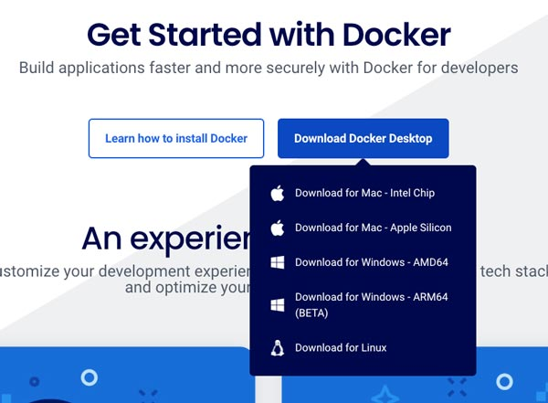

最近Docker(2021年時点。現在は完全Docker User)を使う機会が増え、自分でも構築する機会が増えました。以前はVagrantユーザーだったのですが、インストール後の立ち上げの速さは Vagrant から乗り換えました。今回は Docker で WordPress 環境を構築する方法をまとめます。

> Dockerは、アプリケーションをコンテナと呼ばれる軽量な仮想環境で実行するためのプラットフォームです。これにより、開発環境と本番環境の違いを最小限に抑え、一貫した動作を保証することができます。

*Dockerの基本要素*
1. *Dockerエンジン*: コンテナの作成、管理、実行するコア部分。
2. *Dockerイメージ*: アプリケーションとその必要なすべてのファイル、設定、および依存関係を含むテンプレートのようなもの。
3. *Dockerコンテナ*: Dockerイメージから作成される軽量な実行環境。
4. *DockerHub*: Dockerイメージを共有するためのリポジトリ。

*Dockerのメリット*
* *一貫性*: 開発環境と本番環境の違いを最小限に抑え、一貫した動作を保証。
* *効率性*: 軽量なコンテナを使用することで、リソースの消費を抑える。
* *移植性*: Dockerイメージを使用することで、異なる環境間での移植が容易。

この記事の対象者です。
* Dockerを触ってみたい
* WordPressの環境を気軽に試してみたい
* Dockerの構築を順を追ってやってみたい

<prof></prof>

こちらの記事では主に基本操作までを紹介しています。

もっと詳しくカスタマイズしたDockerを作成したい人は、こちらの記事も参考にしてください。

<card slug="entry543"></card>

<card slug="entry544"></card>

## Dockerインストール
Dockerをインストールしていない人は、Docker公式サイトよりアカウントを作成し、インストールします。


[https://www.docker.com/](https://www.docker.com/)


Docker Desktop をインストールします。



Docker Desktop のメニュー **About Docker Disctop** からでも、以下コマンドでバージョンも確認できます。


```shell:title=コマンド
docker -v
```

## インストールする環境を作成
インストールしたい場所にフォルダを作ります。

```
/myproject
  ├-- docker-compose.yml
  └-- .env
```

ここでは仮にWordPressをインストールしたいディレクトリ名を`mywordpress`とします。

## docker-compose.yml で MySQL と WordPress のコンテナ作成
`docker-compose.yml` を作成します。

ファイル名は `docker-compose.yml` でも `compose.yml` でもどちらでもかまいません。

```yaml:title=docker-compose.yml
services:
  myproject_wp:
    image: wordpress:latest
    container_name: myproject_wop #あとでたたくコマンドで必要になる
    ports:
      - "3000:80" # ポート番号
    depends_on:
      - mysql # mysqlを立ち上げた後にWordpressを立ち上げる
    env_file: .env
    volumes:
        - ./public:/var/www/html/ # マウントするディレクトリ
        # wp-contentやthemesだけでいいのであれば適宜書き換える
        # 例:
        # - ./wp-content:/var/www/html/wp-content
        # - ./themes:/var/www/html/wp-content/themes
    networks:
      - myproject_network

  myproject_db:
    image: mysql:8.0
    env_file: .env
    myproject_db #あとで叩くコマンドで必要になる
    command: --default-authentication-plugin=mysql_native_password
    ports:
      - "3306:3306" #ポート番号の設定
    networks:
      - myproject_network

# Dockerのネットワークを明示的に追加
networks:
  myproject_network:

volumes:
  db_data:
```
<msg txt="Dockerのネットワークを明示的に追加することでサービス間の通信をより制御しやすくなります。"></msg>

マウントするディレクトリは`wp-content`や`themes`だけでいいのであれば適宜書き換えてください。

それぞれのコンテナに `container_name` を明示的に付与しておくと、後々コマンドを叩くときに困りません。私はプロジェクト名、サービス名にすることが多いです。

<msg txt="マウントとは、外部のストレージやディレクトリをシステム内の特定の場所に接続し、データを読み書きできる状態にすることです！"></msg>
<div class="box">
<h4>サービス名に気をつける</h4>
<p>docker-composeファイルで定義されたサービス名が他のプロジェクトのサービス名と重複しないようにすることが重要。これにより、他のコンテナが不意に立ち上がることを防ぐことができます。</p>
<p>例）project名_php </p>
</div>

### Dockerイメージ「wordpress」
wordpressイメージはWordPress本体（最新）、PHP、サーバー、WordPressに必要なPHP拡張機能が梱包されています。latestを指定すると最新で汎用的なものがコンテナに格納されます。

[DockerHub|wordpress](https://hub.docker.com/_/wordpress)

古いWordPressをインストールしたい場合。
```yaml:title=docker-compose.yml
services:
  wordpress:
    image: wordpress:5.8 #イメージを指定
    ...
```

本番環境と合わせたPHPをインストールしたい場合は、[DockerHub](https://hub.docker.com/_/wordpress) から wordpress のDockerイメージを探してみてください。

たとえば、php8.1のイメージを使いたい場合。
```yaml:title=docker-compose.yml
services:
  wordpress:
    image: wordpress:php8.1 #イメージを指定
    ...
```

DockerHubに必要なイメージがない場合は、`Dockerfile` で独自カスタマイズする必要があります。

詳しいやり方を知りたいかたは[Docker で本番環境に忠実な開発環境を作る（nginx、PHP-FPM、MariaDB）](/blogs/entry543/)をご確認ください。

```Dockerfile:title=Dockerfile
# ベースイメージとしてWordPress 5.8を使用
FROM wordpress:5.8

# 必要なPHPバージョンをインストール
RUN apt-get update && apt-get install -y php8.1 php8.1-mysqli

# 必要なPHPバージョンに切り替える
RUN update-alternatives --set php /usr/bin/php8.1 \ #各必要なモジュールインストール
```
<!-- textlint-disable -->
### Dockerイメージ「mysql」
mysqlイメージはMySQLサーバー、MySQLの操作に必要なツール、デフォルトの設定ファイル、ySQLの動作に必要なライブラリや依存関係が含まれています。
<!-- textlint-anable -->

#### Dockerイメージ「mysql:8.0」でデータベースの接続ができなくなる場合
Dockerイメージ mysql:8.0を試そうとしたところ、データベースが接続できなくなりました。

MySQL 8.0以降ではデフォルトの認証プラグインが `caching_sha2_password` に変更されました。これが古いクライアントやライブラリとの互換性の問題を引き起こすことがあります。

その場合はMySQLの認証方式を設定するためのオプション、`default-authentication-plugin`の設定を変え、使用する認証プラグインを指定することで回避します。

```yaml:title=docker-compose.yml
  ...
  mysql:
    image: mysql:8.0
    container_name: myproject_db
    # 以下追記
    command: --default-authentication-plugin=mysql_native_password
    env_file: .env
    ports:
      - "3306:3306" #ポート番号の設定
```

### .envファイルを作成
`.env` ファイルに定数を定義します。このファイルは、Docker Composeの `docker-compose.yml` で設定した`env_file` オプションによって、WordPressとMySQLのコンテナに読み込まれます。

```env:title=.env
WORDPRESS_DB_NAME=wordpress
WORDPRESS_DB_USER=wp_user
WORDPRESS_DB_PASSWORD=hogehoge

MYSQL_ROOT_PASSWORD=rootpass
MYSQL_DATABASE=wordpress
MYSQL_USER=wp_user
MYSQL_PASSWORD=password
```

<div class="box">
<h4>.envファイルの役割</h4>
<p>.envファイルは環境変数を定義するためのファイルです。これにより、設定値をコードから分離し、セキュリティとメンテナンス性を向上させることができます。環境変数はコンテナ内で使用され、データベース名、ユーザー名、パスワードなどの機密情報を設定するために使われます。</p>
</div>

Dockerイメージによって環境変数がすでに設定されているので、これを活用します。

*WordPress のイメージの環境変数*
| 環境変数             | 説明                                               |
|---------------------|----------------------------------------------------|
| WORDPRESS_DB_NAME   | WordPressが使用するデータベースの名前。             |
| WORDPRESS_DB_USER   | WordPressがデータベースに接続するためのユーザー名。 |
| WORDPRESS_DB_PASSWORD | WordPressがデータベースに接続するためのパスワード。 |

*MySQL のイメージの環境変数*
| 環境変数                | 説明                                                        |
|------------------------|-------------------------------------------------------------|
| WORDPRESS_DB_NAME      | WordPressが使用するデータベースの名前。                      |
| WORDPRESS_DB_USER      | WordPressがデータベースに接続するためのユーザー名。          |
| WORDPRESS_DB_PASSWORD  | WordPressがデータベースに接続するためのパスワード。          |
| MYSQL_RANDOM_ROOT_PASSWORD | yesに設定すると、MySQLのrootパスワードがランダムに生成。 |
| MYSQL_DATABASE         | MySQLに作成されるデータベースの名前。                        |
| MYSQL_USER             | MySQLに作成されるユーザー名。                                |
| MYSQL_PASSWORD         | MySQLユーザーのパスワード。                                  |

## Docker を立ちあげる
docker を立ちあげます。

```bash:title=コマンド
docker-compose up -d
```
以下は`docker-compose up`のオプションです。

| オプション               | 説明                                                                                          |
|-------------------------|---------------------------------------------------------------------------------------------|
| *-d*                    | デタッチド・モード: バックグラウンドでコンテナを実行し、新しいコンテナ名を表示<br>`--abort-on-container-exit` と同時に使えない |
| *--no-color*            | 白黒で画面に表示                                                                               |
| *--no-deps*             | リンクしたサービスを起動しない                                                                 |
| *--force-recreate*      | 設定やイメージに変更がなくても、コンテナを再作成する<br>`--no-recreate` と同時に使えません         |
| *--no-recreate*         | コンテナが既に存在していれば、再作成しない<br>`--force-recreate` と同時に使えない                 |
| *--no-build*            | イメージが見つからなくても構築しない                                                           |
| *--build*               | コンテナを開始前にイメージを構築する                                                            |
| *--abort-on-container-exit* | コンテナが１つでも停止したら全てのコンテナを停止<br>`-d` と同時に使えない                        |
| *-t, --timeout TIMEOUT* | アタッチしている、あるいは既に実行中のコンテナを停止する時のタイムアウト秒数を指定 (デフォルト:10)   |
| *--remove-orphans*      | Compose ファイルで定義されていないサービス用のコンテナを削除                                    |
| *--exit-code-from SERVICE* | 指定されたサービスコンテナの終了コードを返す<br>`--abort-on-container-exit` の指定を暗に含む            |
| *--scale SERVICE=NUM*   | SERVICE のインスタンス数を指定する                                                           |
| *--follow-log*          | 指定されたサービスのログをフォローし続ける                                                     |
| *-p, --project-name NAME* | プロジェクト名を指定する<br>デフォルトはディレクトリ名                                         |
| *--profile PROFILE*     | 指定されたプロファイルを使用してサービスを起動する                                             |
| *-f, --file FILE*       | Docker Compose ファイルを指定する<br>複数のファイルを使用する場合に便利                          |

無事に起動したら、アクセスしてみましょう。<br>
[http://localhost:3000](http://localhost:3000)

フォルダ構成は次のようになっています。
```
/myproject
    ├-- docker-compose.yml
    ├-- public ←新規追加
    └-- .env
```

## dockerを終了

```bash:title=コマンド
docker-compose down
```

オプションなしで `docker-compose down` を実行すると、`docker-compose up` で作成したコンテナとネットワークが削除されます。

ボリュームも削除したい場合は、`-v` オプションをつけます。

| オプション               | 説明                                                                                          |
|-------------------------|---------------------------------------------------------------------------------------------|
| *-d*                    | デタッチド・モード: バックグラウンドでコンテナを実行し、新しいコンテナ名を表示<br>`--abort-on-container-exit` と同時に使えない |
| *--no-color*            | 白黒で画面に表示                                                                               |
| *--no-deps*             | リンクしたサービスを起動しない                                                                 |
| *--force-recreate*      | 設定やイメージに変更がなくても、コンテナを再作成する<br>`--no-recreate` と同時に使えません         |
| *--no-recreate*         | コンテナが既に存在していれば、再作成しない<br>`--force-recreate` と同時に使えない                 |
| *--no-build*            | イメージが見つからなくても構築しない                                                           |
| *--build*               | コンテナを開始前にイメージを構築する                                                            |
| *--abort-on-container-exit* | コンテナが１つでも停止したら全てのコンテナを停止<br>`-d` と同時に使えない                        |
| *-t, --timeout TIMEOUT* | アタッチしている、あるいは既に実行中のコンテナを停止する時のタイムアウト秒数を指定 (デフォルト:10)   |
| *--remove-orphans*      | Compose ファイルで定義されていないサービス用のコンテナを削除                                    |
| *--exit-code-from SERVICE* | 指定されたサービスコンテナの終了コードを返す<br>`--abort-on-container-exit` の指定を暗に含む            |
| *--scale SERVICE=NUM*   | SERVICE のインスタンス数を指定する                                                           |
| *--follow-log*          | 指定されたサービスのログをフォローし続ける                                                     |
| *-p, --project-name NAME* | プロジェクト名を指定する<br>デフォルトはディレクトリ名                                         |
| *--profile PROFILE*     | 指定されたプロファイルを使用してサービスを起動する                                             |
| *-f, --file FILE*       | Docker Compose ファイルを指定する<br>複数のファイルを使用する場合に便利                          |
| *--rmi type*            | イメージの削除。type は次のいずれか:<br>'all': あらゆるサービスで使う全イメージを削除<br>'local': image フィールドにカスタム・タグのないイメージだけ削除 |
| *-v, --volumes*         | Compose ファイルの `volumes` セクションの名前付きボリュームを削除<br>また、コンテナがアタッチしたアノニマス・ボリュームも削除 |


オプションを駆使して[dockerを完全に削除](#dockerを完全に削除)もあります！

## ダンプしてきたデータベースをエントリポイントにおく
ダンプしてきた（サーバーからダウンロード）MySQLなどのファイルを用意します。


あらかじめSQLのデータを挿入したい場合は MySQL をエントリポイントとして指定するディレクトリを置きます。
<msg txt="エントリポイントとは、プログラムやアプリケーションが実行される際に最初に実行される場所や関数のことです。Dockerでは、コンテナが起動する際に実行されるコマンドやスクリプトを指します!"></msg>

```
/myproject
    ├-- docker-compose.yml
    ├-- public
    ├-- mysql/
    |    └-- data/ (エントリポイント)
    |        └-- xx.sql
    └-- .env
```

```yaml:title=docker-compose.yml
  mysql:
    image: mysql:8.0
    ...
    volumes:
      - ./mysql/data:/docker-entrypoint-initdb.d #./mysql/dataをエントリポイントとして実行
```
ダンプしてきたMySQLファイルのURLをDocker環境に合わせて `http://localhost:3000` に変えておきます。

その他、データベースの接頭辞（通常は `wp_`）等環境に応じて適宜変更しておきましょう。

```sql:title=xx.sql
-- Host: localhost    Database: wordpress
```

## データベースのリストア・ダンプ
今回は実にシンプルな方法をご紹介します。

手動でリストア（取り込み）するケースもあります。
* エントリポイントで、MySQLデータのリストア失敗
* MySQLデータのリストアやり直したい

データのダンプ（MySQLコンテナからダウンロード）するケースももちろん発生します。

ここでは、個々のコンテナに接続するため、`Docker` コマンドを使ってアプローチします。

`exec` でコンテナにコマンドを実行(executeは英語で実行という意味)してデータベースの操作をします。

*Docker exec コマンドのオプション*
| オプション                | 説明                                           |
|-------------------------|------------------------------------------------|
| *-d, --detach=false*    | デタッチド・モード: コマンドをバックグラウンドで実行 |
| *--detach-keys*         | デタッチド・コンテナに特定のエスケープ・キー・シーケンスを設定 |
| *--help=false*          | 使い方の表示                                       |
| *-i, --interactive=false* | アタッチしていなくても STDIN をオープンにし続ける       |
| *--privileged=false*    | コマンドに拡張 Linux ケーパビリティの追加               |
| *-t, --tty=false*       | 疑似ターミナル (pseudo-TTY) の割り当て                |
| *-u, --user=*           | ユーザ名か UID (書式: <名前|uid>[:<グループ|gid>])     |


### データベースのリストア
本番などからダンプしてきたデータベースをリストアする方法です。

前述したように、URLなど適宜書き換えてください。今回はSQLファイルをルートディレクトリに直置きします。

```
/myproject
  ├-- docker-compose.yml
  ├-- public
  ├-- dump.sql
  └-- .env
```

`dump.sql` というファイルをリストアしたい場合、次のようなコマンドを叩きます。

```bash:title=コマンド
docker exec -i 【コンテナ名】 sh -c 'mysql 【データベース名】 -u root -p【ルートパスワード】' < xxx.sql
# うまく行かない場合はRootで実行
docker exec -i 【コンテナ名】 sh -c 'mysql 【データベース名】 -u 【sqlユーザー名】 -p【sqlパスワード】' < xxx.sql
```
`.env` で設定した環境変数をはめるとこんな感じです。

環境変数で実行。
```bash:title=コマンド
docker exec -i myproject_db sh -c 'mysql $MYSQL_DATABASE -u $MYSQL_USER -p$MYSQL_PASSWORD' < dump.sql
# うまく行かない場合はRootで実行
docker exec -i myproject_db sh -c 'mysql $MYSQL_DATABASE -u root -p$MYSQL_ROOT_PASSWORD' < dump.sql
```
直打ちでもOK。
```bash:title=コマンド
docker exec -i myproject_db sh -c 'mysql wordpress -u wp_user -ppassword' < dump.sql
# うまく行かない場合はRootで実行
docker exec -i myproject_db sh -c 'mysql wordpress -u root -prootpass' < dump.sql
```

### データベースのダンプ
ダンプ方法です。

```bash:title=コマンド
docker exec -i 【コンテナ名】 sh -c 'mysqldump 【データベース名】 -u 【sqlユーザー名】 -p【sqlパスワード】'> latest.sql
# うまく行かない場合はRootで実行
docker exec -i 【コンテナ名】 sh -c 'mysqldump 【データベース名】 -u root -p【ルートパスワード】'> latest.sql
```
.env で設定した環境変数をはめるとこんな感じです。

環境変数で実行。
```bash:title=コマンド
source .env && docker exec -i myproject_db sh -c "mysql -u $MYSQL_USER -p$MYSQL_PASSWORD $MYSQL_DATABASE" < dump.sql
# うまく行かない場合はRootで実行
source .env && docker exec -i myproject_db sh -c "mysql -u root -p$MYSQL_ROOT_PASSWORD $MYSQL_DATABASE" < dump.sql
```

```bash:title=コマンド
source .env && docker exec -i myproject_db sh -c "mysql -u wp_user -ppassword wordpress" < dump.sql
# うまく行かない場合はRootで実行
source .env && docker exec -i myproject_db sh -c "mysql -u root -pprootpass wordpress" < dump.sql
```

ルート直下にlatest.sqlというDBファイルが追加されます。
```
/myproject
    ├-- docker-compose.yml
    ├-- public
    ├-- latest.sql  ←これ
    └-- .env
```

### データベースの確認や削除
Dockerからデータベースの確認をします。

```bash:title=コマンド
docker exec -it 【コンテナ名】 mysql -u【ユーザー名】 -p
```

実際のコマンドはこんな感じ。パスワードを聞かれたら入力します。

```bash:title=コマンド
docker exec -it myproject_db mysql -u $MYSQL_USER -p
```
データベースを確認します。


```sql:title=sql
mysql> show databases;
```

```sql:title=sql
mysql> use wordpress;
```

テーブルを確認します。


```sql:title=sql
mysql> show tables;
```
データベース削除したい場合はデータベース名を指定して `drop`。
```sql:title=sql
mysql> drop wordpress;
```

テーブルだけ削除したい場合は削除したい場合はテーブル名を,(カンマ)で区切って `drop`。
```sql:title=sql
mysql> drop wp_users, wp_posts,....;
```

sqlの終了。

```sql:title=sql
mysql>  exit;
```

## コンテナ内に入る
Web用のサーバー用に立ち上げたコンテナ内に入って、あれこれ調べたり、設定ファイルを確認したいときがあります。

そんな時は以下コマンドで侵入します。

```bash
sudo docker exec -it [コンテナID] /bin/bash
```
## dockerを完全に削除

オプションの意味は[dockerを終了](#dockerを終了)を参考にしてください。
```bash:title=コマンド
docker-compose down --rmi all --volumes --remove-orphans
```

これで気軽に破壊したりできます。

## まとめ・Dockerやってみたらカンタンだった
イメージも用意されていて `docker-compose.yml`にカンタンなコードを書くだけなのでDockerでWordPressを構築するのは楽勝でした。

<msg txt="個人的には管理もメンテナンスもVagrantよりカンタンです"></msg>

私の場合、どうしても古い php と WordPress で環境を作る必要があり、今回めちゃ重宝しました。

この記事がみなさんのコーディングライフの一助となれば幸いです。

最後までお読みいただきありがとうございました。

### おまけ・よく使うコマンド

すべてのコンテナを強制終了。
```bash:title=コマンド
docker-compose kill
```
ネットワーク一覧を取得。
```bash:title=コマンド
docker network list
```
現在起動中のコンテナの一覧を表示 。
```bash:title=コマンド
docker ps
```
特定のコンテナに接続してコマンドを実行。
```bash:title=コマンド
docker exec -it CONTAINER_NAME bash
```
特定のコンテナのログを表示。
```bash:title=コマンド
docker logs CONTAINER_NAME
```
実行中のコンテナのリソース使用状況（CPU、メモリなど）をリアルタイムで表示。
```bash:title=コマンド
docker stats
```
ローカルに保存されているDockerイメージの一覧を表示。
```bash:title=コマンド
docker images
```
ローカルに保存されているDockerイメージの一覧を表示 。
```bash:title=コマンド
docker volume ls
```
指定したネットワークを削除。
```bash:title=コマンド
docker network rm ID
```
