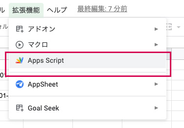
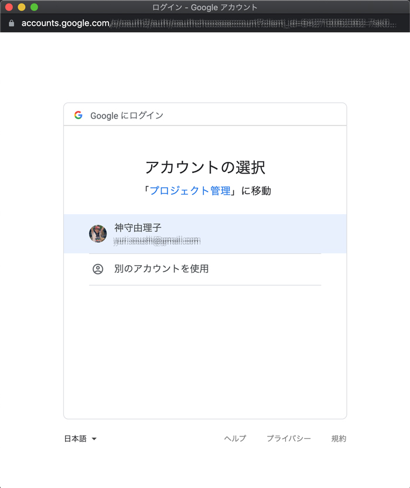

以前Googleスプレッドシートにクライアント側でデータを入力してもらい、ウェブサイトに表示する処理を紹介しました。2021年8月から使用できなくなったのでGASを使った代替方法の紹介です。

スプシの設定が分からない方のみ、以前の記事を参考にしてください。

<prof></prof>


## 2021年8月頃よりGoogleの仕様が変わったので別の方法を紹介します
*2021年8月頃よりGoogleの仕様* が変わり、以下の方法は使えなくなりました。<br>
他のやり方を紹介しますので、そちらを参考にしてください。

<card id="/blogs/entry455/"></card>

<msg txt="スプシのデータを加工したJSONにして、WordPress側で受け取ります！"></msg>

## スプシの共有権限は設定不要
[スプシのデータをJSON化してウェブサイトに取り込む（Sheets API使いません）](/blogs/entry455/#スプシをウェブ公開してJSONデータを取得しよう！)では共有権限を「リンクを知っている全員」としましたが、今回は設定不要です。

## JSONをPHP側で受け取るためのGASを書く
シートが完成したら、スプシの上のメニュー>拡張機能から*Apps script*を選択します。



GASには任意で名前をつけることができます。今回はjsonとしました。

呼び出すスプシのシートを指定します。

シートのURLのd/以下 ~ /editの前までがIDです。

```
https://docs.google.com/spreadsheets/d/[id]/edit#gid=0
```
今回使うシート名（タブ）は*data*としました。環境に応じて書き換えてください。

### 定数の設定
定数として、スプシのIDとシート名を設定しておきます。

```JS
const SPREAD_SHEET_ID = 【シートのID】;
const SHEET_NAME = 'data';
```

### 関数とシートのデータ取得
関数`doGet`を作ります。

<ad location="/blogs/entry481/"></ad>


```JS
// ~ 省略

function doGet() {
  const app = SpreadsheetApp.openById(SPREAD_SHEET_ID);
  const sheet = app.getSheetByName(SHEET_NAME);
  const values = sheet.getDataRange().getValues();
  console.log(values);
}
```

関数を実行し、`Logger.log`（GAS専用）か`console.log`で動いているか確認します。

許可を求められるので、Yesで進んでください。





```JS
// ~ 省略

function doGet() {
  const app = SpreadsheetApp.openById(SPREAD_SHEET_ID);
  const sheet = app.getSheetByName(SHEET_NAME);
  const values = sheet.getDataRange().getValues();
  console.log(values);
}
```

### スプシのデータをPHPで受け取りやすいように加工
スプシのデータを加工します。

```JS
// ~ 省略
let data = [];

values.forEach((value, index)=>{
  const keys = values[0];
  if(index !== 0){
    const param = {}
    value.forEach((item, i)=>{
      param[keys[i]] = item
    })
    data = [...data, param]
  }
})
console.log(data)
```
今回`forEach`や *スプレッド構文(...)* も使っています。使い方が分からない方は以下記事も参考にしてください。
<card id="/blogs/entry482/"></card>

デバッグして出力されたデータを確認。


いい感じに連想配列になっているのでOK.

### PHPでJSONを受け取るためのコードを書く

GASでContentServiceを使ってブラウザに値を返す。

```JS
const result = ContentService.createTextOutput()
result.setMimeType(ContentService.MimeType.JSON)
result.setContent(JSON.stringify(data))
return result
```

### すべてのコード
```JS
const SPREAD_SHEET_ID = [スプシのID];
const SHEET_NAME = 'data';

function doGet() {
  const app = SpreadsheetApp.openById(SPREAD_SHEET_ID);
  const sheet = app.getSheetByName(SHEET_NAME);
  const values = sheet.getDataRange().getValues();
  let data = [];

  values.forEach((value, index)=>{
    const keys = values[0]
    if(index !== 0){
      const param = {}
      value.forEach((item, i)=>{
        param[keys[i]] = item
      })
      data = [...data, param]
    }
  })

  const result = ContentService.createTextOutput()
  result.setMimeType(ContentService.MimeType.JSON)
  result.setContent(JSON.stringify(data))
  return result
}
```
### JSONデータをPHPで受け取るための設定
新しいデプロイを作成します。

|項目|設定|
|-|-|
|種類の選択|Webアプリ|
|次のユーザーとして実行|自分|
|アクセスできるユーザー|全員|


URLが発行されるので動くか確認。


コピーしたURLにアクセスしてJSONが帰ってきたらOK。


## PHPに組み込む

<ad location="/blogs/entry481/"></ad>


### 通常のPHPでの取得方法
以前と同じようにCurlで取得しようとしたらうまくいかなかったので`file_get_contents`で取得しました。

```php
<?php
function get_event_deta() {
	$url = デプロイしたURL;
	if ( file_get_contents( $url ) ) {
    //URLが取得できた場合
		$data = mb_convert_encoding( file_get_contents( $url ), 'UTF8', 'ASCII,JIS,UTF-8,EUC-JP,SJIS-WIN' );
		$json_decode = json_decode( $data, true );
		$events = array();
		foreach ( $json_decode as $value ) {
			$branch = $value['branch'];
			$schedule = explode( ',', $value['detail'] );
			$events[ $branch ] = $schedule;
		}
	} else {
    //URLが取得できなかった場合
		$events = 'error';
	}
	return $events;
}


$events  = get_event_deta();
$lastday = gmdate( 'd', strtotime( 'last day of this month' ) );
$c_year  = gmdate( 'Y' );
$c_month = gmdate( 'm' );
$d = array( '日', '月', '火', '水', '木', '金', '土' );

if ( 'error' === $events ) {
	echo '<p class="text-center mt-5">カレンダーの読み込みに失敗しました。<p>';
} else {
	echo '<table>';
	echo '<caption>' . $c_year . '年' . $c_month . '月</caption>';
	for ( $i = 1; $i <= $lastday; $i++ ) {
		$c_date = $c_year . '-' . $c_month . '-' . str_pad( $i, 2, 0, STR_PAD_LEFT );
		$week = date( 'w', strtotime( $c_date ) );
		$bg_color = '';

		if ( 0 === (int) $week ) {
			$bg_color = ' class="bg_sun"';
		}
		if ( 6 === (int) $week ) {
			$bg_color = ' class="bg_sat"';
		}

		echo '<tr' . $bg_color . '>';
		echo '<td>' . $i . '(' . $d[ (int) $week ] . ' ) ' . '</td>';

		$branch = '';
		foreach ( $events as $name => $items ) {
			foreach ( $items as $date ) {
				$event_date = strtotime( $date );
				if ( $c_date === gmdate( 'Y-m-d', $event_date ) ) {
					$branch .= '<span>' . gmdate( 'H:i', $event_date ) . $name . '</span>';
				}
			}
		}
		echo '<td>' . $branch . '</td>';
		echo '</tr>';
	}
	echo '</table>';
}

```

### WordPressに対応したい

`wp_remote_get()`に書き換えます。

```php
/**
 * Get event data.
 *
 * @return $events
 */
function get_event_data() {
  $url = デプロイしたURL;
	$json = wp_remote_get( $data );
	if ( ! $json->errors ) {
		$events = array();
		foreach ( $json_decode as $value ) {
			$json = $value['branch'];
			$schedule = explode( ',', $value['detail'] );
			$events[ $branch ] = $schedule;
		}
  } else {
		 $events = 'error';
	}
	return  $events;
}
```
[スプシのデータをJSON化してウェブサイトに取り込む（Sheets API使いません）](/blogs/entry455/#WordPressに対応したい)の重複しますが、以下のコードで表示可能です。

```php
/**
 * Show event schedule
 *
 * @return $table
 */
function show_event_schedule() {
	$events  = get_event_deta();

	if ( 'error' === $events ) {
		return '<p class="text-center mt-5">カレンダーの読み込みに失敗しました。<p>';
	}

	$lastday = gmdate( 'd', strtotime( 'last day of this month' ) );
	$c_year  = gmdate( 'Y' );
	$c_month = gmdate( 'm' );
	$d = array( '日', '月', '火', '水', '木', '金', '土' );

	$table  = '<table>';
	$table .= '<caption>' . $c_year . '年' . $c_month . '月</caption>';
	for ( $i = 1; $i <= $lastday; $i++ ) {
		$c_date = $c_year . '-' . $c_month . '-' . str_pad( $i, 2, 0, STR_PAD_LEFT );
		$week = gmdate( 'w', strtotime( $c_date ) );
		$bg_color = '';

		if ( 0 === (int) $week ) {
			$bg_color = ' class="bg_sun"';
		}
		if ( 6 === (int) $week ) {
			$bg_color = ' class="bg_sat"';
		}

		$table .= '<tr' . $bg_color . '>';
		$table .= '<td>' . $i . '(' . $d[ (int) $week ] . ')</td>';
		$branch = '';

		foreach ( $events as $name => $items ) {
			foreach ( $items as $date ) {
				$event_date = strtotime( $date );
				if ( gmdate( 'Y-m-d', $event_date ) === $c_date ) {
					$branch .= '<span>' . gmdate( 'H:i', $event_date ) . $name . '</span>';
				}
			}
		}
		$table .= '<td>' . $branch . '</td>';
		$table .= '</tr>';
	}
	$table .= '</table>';

	return $table;
}
add_shortcode( 'show_event_schedule', 'show_event_schedule' );
```
記事にもショートコードで貼れます。
```html
[show_event_schedule]
```

WordPressのコーディング規約に関しての記事もよろしければお読みください。
<card id="/blogs/entry452/"></card>

<ad location="/blogs/entry481/"></ad>


## まとめ・スプシをJSONすると便利
ブログが更新できず気になってはいましたが、ようやく記事まとめることができました。。。

この記事を参考になさっていた方、長らくお待たせしてすみません。

トリガーで定期的にメール送信したい方はこちらを参考にしてください。
<card id="/blogs/entry504/"></card>

この記事が皆さんのコーディングライフの一助となれば幸いです。

最後までお読みいただきありがとうございました。
