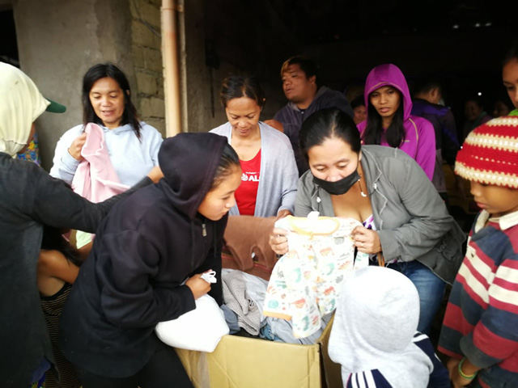
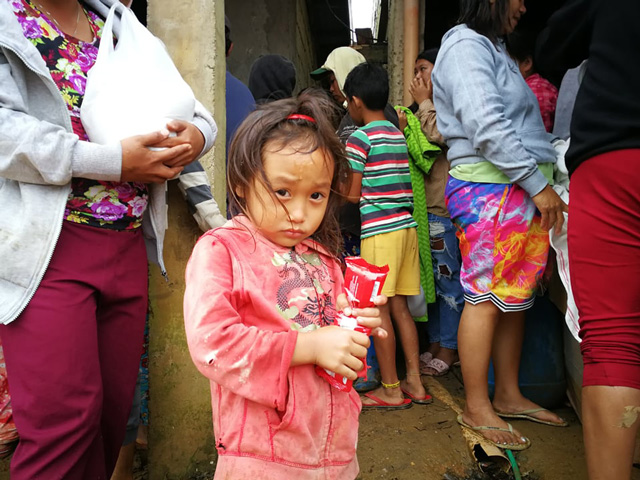

「子ども服をセブに送るプロジェクト」プロジェクトのレポートです。

台風で被災したゴミ山の子どもたちに洋服を配布しました。","今回もまた、DAREDEMO HEROさんに同行させていただきました。

<prof></prof>

## 水・食料が足りません！！

2021年12月16日到来の台風オデット（台風22号）で交通が遮断され、十分、水・食料が貧困層に届かなくなりました。

災害で煽りを食らうのは弱者です。

12/31にDAREDEMO HEROさんゴミ山の人たちに生き延びてもらうために、お米や缶詰などを配るのをお手伝いさせていただきました。

### 前日には日本人を中心としたボランティアによる炊き出しなどの支援
現在、セブ島日本人会とDAREDEMO HEROがタッグを組んでスラム地区などで支援活動を行なっています。

スラム・イナヤワンのゴミ山へ行く前日・12月30日にカレッタ（墓地スラム）で日本人を中心としたボランティアによる炊き出しなどの支援も行いました。

こちらの支援の様子はYouTube「せぶぴーセブ島なんでもランキング・[被災した子どもに食料と愛を届けます【台風22号／ライ復興プロジェクト】](https://www.youtube.com/watch?v=_NVO1yNyi-o)」にアップされています。

## ゴミ山での支援。みんなで手分けしてお米を分け、配布
大晦日、今回は別のスラム・イナヤワンのゴミ山へ。

年末で人手がなかったので、スラムの住人と手分けしてお米を分けました。スムーズに仕分け終わりました。

台風直撃から2週間。未だ電気も水道も通らない地区が多数存在します。

スラムではそもそもまともに電気・水など通ってませんが、流通が止まることは大打撃です。

この台風で流通はストップし、飲み水など物の価格は高騰しています。

極限に節約して、一ヶ月100ペソ（200円くらい）しか電気代も払っていない彼らには大ダメージです。

## Lynksさんからいただいた洋服を配る

お洋服を提供していただいたLynksさん、感謝です。

今回たまたま12月前くらいに支援用の洋服が届き、台風で家財などを失う貧困層の方々を助けることができました。

### ダンプサイト（ゴミ山）の子どもたちに洋服を配る

セブ島日本人会やDAREDEMO HEROさんによる水と食料の支援もありました。

私も微力ながら配布のお手伝いもさせていただきました。

### Lynksさんからいただいたお洋服を一部農村地区へ

山岳地帯の被害も甚大です。

山の農村部は、気温が都心部に比べて肌寒く、着る服がないと凍えるとのこと。

私は現地に行けなかったのでDAREDEMO HEROさんに託しました。

当日はセブ島日本人会やDAREDEMO HEROさんによる水と食料の支援もあったようです。

おかげさまでたくさんの人の力になることができました。

送料を寄付してくださった方（後述）、洋服を提供してくださったLynksさんには改めて感謝いたします。

## 被災者が被災者を支援する状況
私も被災者といえば被災者ですが、被災とはいえないほど軽くて他の人は停電・水が通らない中での支援をしています。

DAREDEMO HEROさんの支援地区、ゴミ山のあるイナヤワン・バランガイ（役場）には急遽（きょ）、浄水システムが設置されました。

みんな飲める水がなくて困っています。素早い処置で少しでも多くの人を救えることが間違いないと思えました。

> I'm very thunkful.
本日スタッフの一人から私が活動のお手伝い中に聞いた言葉です。

彼女もまだ、家はまともな状況じゃないでしょう。この地区の方はDAREDEMO HEROさんの素早い対応で、水を得ることができました。

彼女の一言から、心から感謝していたのだと感じました。

## まとめ・継続的な支援が必要

今回もボランティアに参加して思ったのは、**継続的な支援**が必要ということです。

世界ではボランティア活動によって*生物的貧困*、つまり飢えによる貧困は減っているといいます。現在は改善し、いわゆる*経済的貧困*が占めるといえます。

台風のような災害で、浮き彫りになったのは非常事態では弱者へのダメージが大きいということです。このような非常事態では、ボランティア団体なしでは、彼らは生き延びるのが難しかったと想像します。

この記事を読み、少しでも困っている誰かに手を差し伸べる気持ちになっていただければ幸いです。できる形でご支援いただければ幸いです。

最後までお読みいただきありがとうございました。

  <h4>「子ども服をセブに送るプロジェクト」支援者の皆様</h4>
  
送料を送るためにご支援いただきましたみなさまありがとうございます！

  <ul>
    <li><a href="https://www.ec-cube.net" rel="nofollow noopner" target="_blank">株式会社イーシーキューブ 様</a></li>
    <li>ヤマモト コウ 様</li>
    <li>中村 亜夜 様</li>
    <li>満井 美恵 様</li>
    <li><a href="https://kdl.design/" rel="nofollow noopner" target="_blank">栗原デザイン室 様</a></li>
    <li><a href="https://tantan.work/" rel="nofollow noopner" target="_blank">TanTan 様</a></li>
    <li><a href="https://www.dream-tech.jp/" rel="nofollow noopner" target="_blank">ハッピーちゃい夢 様</a></li>
  </ul>
  <h4>洋服の支援元</h4>
  <ul>
    <li><a href="https://www.lynks.jp/t" rel="nofollow noopner" target="_blank">Lynks 様</a></li>
  </ul>

  ボランティア受入先：[DAREDEMO HERO](https://daredemohero.com/)

支援に関する資料は[フィリピンセブ島の恵まれない子たちへ
支援物資送料寄付のお願い
](https://docs.google.com/presentation/d/1arV9Jb5vQHyKqKlpG0HS_nTLt4n9hdbw/edit?usp=sharing&ouid=117160028250625203295&rtpof=true&sd=true)をご覧ください。
