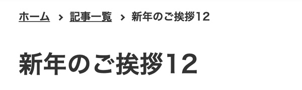
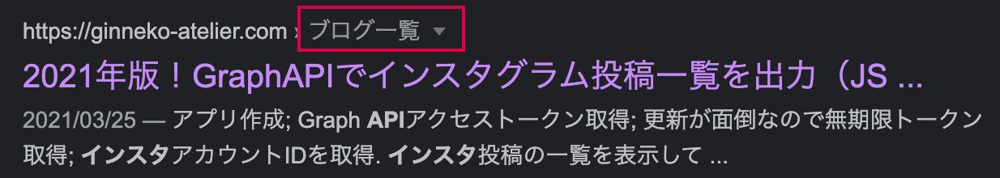

Gatsbyブログにパンくずリストを追加します。今までのコンポーネントの作り方を参考にすればできるのですが、今回はせっかくなので構造化データの一つmicrodataを埋め込みながらの作り方も紹介しようと思います。

<p><small>※ 2021年12月バージョンアップに伴いv4対応してあります。</small></p>
<prof></prof>


## 今までのGatsbyの記事と注意点
現在ここまで記載しています。<br>制作するまでを目標にUPしていくので順を追ったらGatsbyサイトが作れると思います。

1. [インストールからNetlifyデプロイまで](/blogs/entry401/)
2. [ヘッダーとフッターを追加する](/blogs/entry484/)
3. [投稿テンプレにカテゴリやらメインビジュアル（アイキャッチ）追加](/blogs/entry406/)
4. [ブログ記事、カテゴリ、タグ一覧の出力](/blogs/entry408/)
5. [プラグインを利用して目次出力](/blogs/entry410/)
6. [プラグインナシで一覧にページネーション実装](/blogs/entry413/)
7. [個別ページテンプレート作成](/blogs/entry416/)
8. [プラグインHelmetでSEO調整](/blogs/entry418/)
9. [CSSコンポーネントでオリジナルページを作ろう！！](/blogs/entry421/)
10. [関連記事一覧出力](/blogs/entry430/)
11. [タグクラウドコンポーネントを作成する](/blogs/entry486/)
12. *パンくずリストを追加する*（←イマココ）
13. [記事内で独自タグ（コンポーネント）を使えるようにする](/blogs/entry489/)

v5へのアップグレード方法はこちら。
<card id="/blogs/entry519/"></card>


このシリーズは[Github・gatsby-blog](https://github.com/yuririn/gatsby-blog/)に各内容ブランチごとで分けて格納してあります。

今回は[breadcrumb-list](https://github.com/yuririn/gatsby-blog/tree/breadcrumb-list)にあります。

### このシリーズではテーマGatsby Starter Blogを改造します
この記事は一番メジャーなテンプレート、 *Gatsby Starter Blog* を改造しています。同じテーマでないと動かない可能性があります。


## プレーンなパンくずリストを作ってみる
breadcrumb-list.jsを作成します。

```
プロジェクト/
  └ src/
     ├ templates/
     |  ├ blog-post.js（編集）
     |  ├ blog-list.js（編集）
     |  ├ cate-list.js（編集）
     |  ├ tag-list.js（編集）
     |  L page-post.js（編集）
     └ components/
        └ breadcrumb-list.js（新規作成）
```

配列を作ります。記事詳細とカテゴリ&タグ一覧は親ページとして記事一覧を追加します。

```js{6-8}:title=breadcrumb-list.js
import * as React from "react"
import { Link } from "gatsby"

const BreadCrumbList = ({ parent, title, location }) => {
  let List = [{ location: "/", title: "ホーム" }]
  if (parent === "blogs") {
    List = [...List, { location: "/blogs/", title: "記事一覧" }]
  }
  return (
    <ol>
      {List.map((item, index) => {
        console.log(item.location)
        return (
          <li key={item.location}>
            <Link to={item.location}>{item.title}</Link>
          </li>
        )
      })}
      <li key={location.pathname}>{title}</li>
    </ol>
  )
}
export default BreadCrumbList
```
記事詳細のテンプレートであるblog-post.jsに追加してみます。
```js{6-10}:title=blog-post.js
<Article
  className="blog-post"
  itemScope
  itemType="http://schema.org/Article"
>
  <BreadCrumbList
    parent="blogs"
    location={location}
    title={post.frontmatter.title}
  />
  <header>
```
パンくずリストにstyled-componentsでスタイルを当てます。インストールしてない方は、プラグインをインストールしておきましょう。

```bash:title=コマンド
npm i styled-components
```

仕上がりはこんなイメージ。



すべてのコードはこちらです。

```js:title=blog-post.js
import * as React from "react"
import { Link } from "gatsby"
import styled from "styled-components"

const BreadCrumbList = ({ parent, title, location }) => {
  let List = [{ location: "/", title: "ホーム" }]
  if (parent === "blogs") {
    List = [...List, { location: "/blogs/", title: "記事一覧" }]
  }
  return (
    <BreadCrumbNav>
      <ol>
        {List.map(item => {
          console.log(item.location)
          return (
            <li key={item.location}>
              <Link to={item.location}>{item.title}</Link>
            </li>
          )
        })}
        <li key={location.pathname}>{title}</li>
      </ol>
    </BreadCrumbNav>
  )
}
export default BreadCrumbList

const BreadCrumbNav = styled.nav`
  ol {
    list-style: none;
    margin: 0;
    padding: 0;

    li {
      display: inline-flex;
      align-items: center;
      font-size: 1.4rem;
      font-weight: 700;
      margin-right: 10px;

      &::after {
        margin-left: 10px;
        content: "";
        width: 4px;
        height: 4px;
        display: inline-block;
        transform: rotate(45deg);
        border-top: 2px solid var(--black);
        border-right: 2px solid var(--black);
      }
      &:last-child::after {
        content: none;
      }
    }
    a {
      color: var(--black);
      &:hover {
        opacity: 0.5;
      }
    }
  }
`
```

そのほかのテンプレートにも、`<BreadCrumbList/>`を追加しましょう。

親ページがhomeの場合はparentの設定は不要です。

```js:title=page-post.js
<BreadCrumbList
  location={location}
  title={post.frontmatter.title}
/>
```

## 構造化データで検索結果のユーザビリティも向上させたい。microdataってなんぞ？
microdataは構造化データの一種で「ページ内のコンテンツを説明するための、標準化されたデータ形式のこと」を指します。

埋め込めるデータとして

* ページの作成者
* アップロードの日付
* 商品の金額
* お店のオープン曜日や時間など

などがあります。

パンくずリストの構造化データを埋め込むメリットとしては、次のように日本語で親ページ名が表示されます。<br>データが埋め込まれてない場合は、ページのディレクトリ名が表示されます。



現在埋め込み方法には*JSON-LD*、*microdata*、*RDFa* があり、私がよく使うのが*JSON-LD*です。

<small>※ 2021年 1月、data-vocabulary.org マークアップは Google のリッチリザルト機能でサポート終了の公式発表がありました。</small>

<br>以前、JSON-LDでの埋め込み方は「[プラグインHelmetでSEO調整](/blogs/entry418/)」で紹介しました。すでにJSON-LDでの実装している方は、microdataの埋め込む必要はありません。

### microdataを出力するためにコードを書き換える
<msg txt="HTML（マークアップ言語）を書き慣れている方は、JSON-LDの複雑な入れ子にはパニックになりそうですよね汗"></msg>

こちらの方が幾分かマシです。

```js:title=blog-post.js
// 省略
import { siteMetadata } from "../../gatsby-config"

const BreadCrumbList = ({ parent, title, location }) => {
  const domain = siteMetadata.siteUrl
  let List = [{ location: `${domain}`, title: "ホーム" }]
  if (parent === "blogs") {
    List = [...List, { location: `${domain}blogs/`, title: "記事一覧" }]
  }
  return (
    <BreadCrumbNav>
      <ol itemscope itemtype="https://schema.org/BreadcrumbList">
        {List.map((item, index) => {
          return (
            <li
              key={item.location}
              itemprop="itemListElement"
              itemscope
              itemtype="https://schema.org/ListItem"
            >
              <Link to={item.location} itemprop="item">
                <span itemprop="name">{item.title}</span>
              </Link>
              <meta itemprop="position" content={index + 1} />
            </li>
          )
        })}
        <li
          itemprop="itemListElement"
          itemscope
          itemtype="https://schema.org/ListItem"
          key={location.pathname}
        >
          <span itemprop="name">{title}</span>
          <meta itemprop="position" content={List.length + 1} />
        </li>
      </ol>
    </BreadCrumbNav>
  )
}
export default BreadCrumbList
```
出力結果はこんな感じ。
```html
<ol itemtype="https://schema.org/BreadcrumbList">
  <li itemprop="itemListElement" itemtype="https://schema.org/ListItem">
    <a itemprop="item" href="/blogs/entry12/undefined">
      <span itemprop="name">ホーム</span></a>
    <meta itemprop="position" content="1">
  </li>
  <li itemprop="itemListElement" itemtype="https://schema.org/ListItem">
    <a itemprop="item" href="/blogs/entry12/undefined/blogs">
      <span itemprop="name">記事一覧</span></a>
      <meta itemprop="position" content="2">
  </li>
  <li itemprop="itemListElement" itemtype="https://schema.org/ListItem">
    <span itemprop="name">新年のご挨拶12</span>
    <meta itemprop="position" content="3">
  </li>
</ol>
```

## まとめ・パンくずリストを実装したら使い勝手が良くなった

パンくずリストを実装したら、元いたページに戻りやすくなるのでブログサイトとしても使い勝手が良くなったと思います。

あとは404ページを整えたら本格的に運用できるぐらいの機能は整いました。

この記事が皆さんのコーディングライフの一助となれば幸いです。

最後までお読みいただきありがとうございました。


