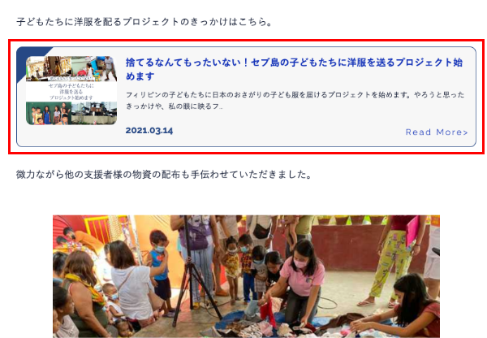
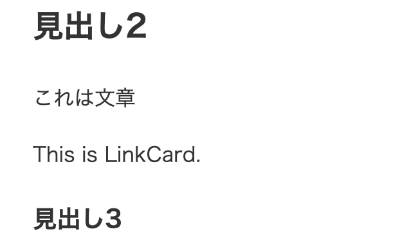
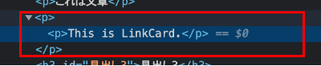
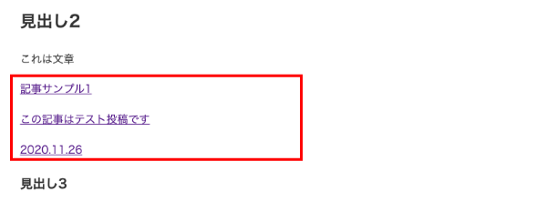
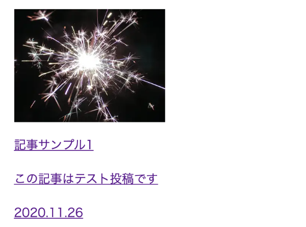
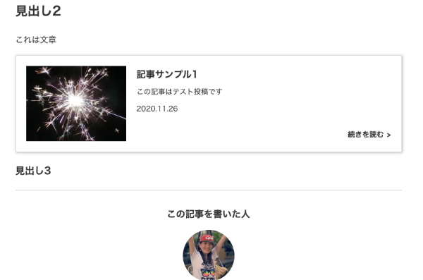

Gatsbyでは記事はMarkdownで書くのですが、関連記事のカードなどをカッコよく挿入したくなります。以前は無理やりHTMLで書いてましたが、すんごい面倒だったので独自のコンポーネント（WordPressでいうショートコードみたいなもの）を追加できるようにしました。今回は実装方法のご紹介です。

<prof></prof>


## 今までのGatsbyの記事と注意点
現在ここまで記載しています。<br>制作するまでを目標にUPしていくので順を追ったらGatsbyサイトが作れると思います。

1. [インストールからNetlifyデプロイまで](/blogs/entry401/)
2. [ヘッダーとフッターを追加する](/blogs/entry484/)
3. [投稿テンプレにカテゴリやらメインビジュアル（アイキャッチ）追加](/blogs/entry406/)
4. [ブログ記事、カテゴリ、タグ一覧の出力](/blogs/entry408/)
5. [プラグインを利用して目次出力](/blogs/entry410/)
6. [プラグインナシで一覧にページネーション実装](/blogs/entry413/)
7. [個別ページテンプレート作成](/blogs/entry416/)
8. [プラグインHelmetでSEO調整](/blogs/entry418/)
9. [CSSコンポーネントでオリジナルページを作ろう！！](/blogs/entry421/)
10. [関連記事一覧出力](/blogs/entry430/)
11. [タグクラウドコンポーネントを作成する](/blogs/entry486/)
12. [パンくずリストを追加する](/blogs/entry487/)
13. *記事内で独自タグ（コンポーネント）を使えるようにする*（←イマココ）

v5へのアップグレード方法はこちら。
<card slug="entry519"></card>

このシリーズは[Github・gatsby-blog](https://github.com/yuririn/gatsby-blog/)に各内容ブランチごとで分けて格納してあります。

今回は[original-component](https://github.com/yuririn/gatsby-blog/tree/original-component)にあります。

### このシリーズではテーマGatsby Starter Blogを改造します
この記事は一番メジャーなテンプレート、 *Gatsby Starter Blog* を改造しています。同じテーマでないと動かない可能性があります。


## 事前準備

今回のファイルとディレクトリ構成です。ディレクトリcomponents内にblog-partsディレクトリを作っておきます。コンポーネント用ファイルは後ほど追加します。
```
プロジェクト/
  ├ gatsby-config.js（編集）
  └ src/
     └ components/
        └ blog-parts/（ここにコンポーネントを格納する）
```
### タグの内容を変えるrehype-reactを追加する
rehypeReact で Markdown から変換された HTML に手を加えることができます。

```bash:title=コマンド
npm i rehype-react
```

## 記事でも使えるリンクカードコンポーネントを作る
記事リンクを表示させるためのコンポーネントを作成します。作ったコンポーネントはもちろん記事以外のテンプレートでも読み込めます。

当サイトではこんな感じで関連記事を表示させるために使っています。



link-card.jsというリンクカード用コンポーネントを作りblog-partsディレクトリに格納しておきます。

```
プロジェクト/
  ├ gatsby-config.js
  └ src/
    ├ templates/
    |  └ bloc-post.js（編集）
    └ components/
      └ blog-parts/
        └ link-card.js（新規作成）
```
まず、記事がわでコンポーネントが出力できるか確認したいので、link-card.jsに最小限の記述で出力できるようにしておきます。

```js:title=link-card.js
import * as React from "react"

const LinkCard = data => {
  return <p>This is LinkCard.</p>
}
export default LinkCard
```

### コンポーネントを取り込めるようにする
blog-post.js側で出力できるか確認します。rehype-reactとLinkCardコンポーネントをimportします。
```js:title=blog-post.js
// 省略
import rehypeReact from "rehype-react"
import LinkCard from "../components/blog-parts/link-card"

const renderAst = new rehypeReact({
  createElement: React.createElement,
  components: {
    card: LinkCard,
  },
}).Compiler

const BlogPostTemplate = ({ data, location }) => {
  // 省略
```
この場合キーである`card`がタグとして認識されます。

`new rehypeReact`のコードは`const BlogPostTemplate ~`直前に書いてください。

デフォのスターターキットではこんな感じのコードになってると思うのですが（多分）、
```js
<section
  dangerouslySetInnerHTML={{ __html: post.html }}
  itemProp="articleBody"
/>
```
この「Gatsbyブログサイト移行物語」は独自のスタイルを当てるためコンポーネントを作っていますので、こちらを使って説明します。
```js:title=blog-post.js
<BlogEntry
  dangerouslySetInnerHTML={{ __html: post.html }}
  itemProp="articleBody"
/>
```
`dangerouslySetInnerHTML={{ __html: post.html }}`を先ほどCardLinkを格納した`renderAst`に置き換えます。

```js:title=blog-post.js
<BlogEntry itemProp="articleBody">{renderAst(post.htmlAst)}</BlogEntry>
```

```js{13}:title=blog-post.js
export const pageQuery = graphql`
  query BlogPostBySlug(
    $id: String!
    $previousPostId: String
    $nextPostId: String
    $hero: String
  )
  # 省略
    markdownRemark(id: { eq: $id }) {
      id
      excerpt(pruneLength: 160)
      # htmlからhtmlAstに書き換える
      htmlAst
      # 省略
    }
  }
`
```

mdファイル側にコードを書いてみましょう。**必ず閉じタグが必要です**。
```md
<card></card>
```
出力できました！！


出力されたコードを見ると悲惨なことに。。。


<msg txt="pタグin pタグってなんじゃそりゃ汗"></card>

### gatsby-remark-component でコンポーネントの親タグをpではなくdivに

gatsby-remark-component でコンポーネントの親タグをpではなくdivに変えます。

gatsby-remark-componentはgatsby-transformer-remarkの子プラグインです。

コマンドでインストールします。

```bash:title=コマンド
npm i gatsby-remark-component
```

gatsby-remark-componentはgatsby-transformer-remarkの子プラグインなのでgatsby-config.js内に以下のように読み込みます。
```js:title=gatsby-config.js
plugins: [
  {
    resolve: "gatsby-transformer-remark",
    options: {
      plugins: ["gatsby-remark-component"]
    }
  }
]
```
中にはpタグに入れてもいいものもあると思うので、その場合は以下のようにdivに変えるコンポーネントを限定します。

オプションを指定してしまうと、指定していないものはすべてpタグでラップされます。

```js:title=gatsby-config.js
plugins: [
  {
    resolve: "gatsby-transformer-remark",
    options: {
      plugins: [
        {
          resolve: "gatsby-remark-component",
          options: { components: ["my-component", "other-component"] }
        }
      ]
    }
  }
]
```
### リンクカードのコンポーネントの中身をコーディングする
mdのコードにプロパティを追加します。

GraghQLで *fields* の *slug* が一致するものを取得します。*slug* は記事のドメインを除いたパスです。
```md
<card slug="/blogs/entry1/"></card>
```
link-card.jsの内容を大幅に書き換えます。
```js:title=link-card.js
import * as React from "react"
import { useStaticQuery, graphql } from "gatsby"

const LinkCard = data => {
  const { allMarkdownRemark } = useStaticQuery(
    graphql`
      query {
        allMarkdownRemark {
          edges {
            node {
              fields {
                slug
              }
              id
              frontmatter {
                description
                date(formatString: "YYYY.MM.DD")
                title
              }
            }
          }
        }
      }
    `
  )
  let article = allMarkdownRemark.edges.filter(
    item => item.node.fields.slug === data.slug
  )
  if (article.length !== 0) {
    article = article[0].node
    const description =
      article.frontmatter.description.length > 60
        ? article.frontmatter.description.substr(0, 60) + "..."
        : article.frontmatter.description
    return (
      <a href={article.fields.slug} className="article-link">
        <Thunmbnail
          alt={article.frontmatter.title}
          src={article.frontmatter.hero}
        ></Thunmbnail>
        <p className="article-link__main__title">{article.frontmatter.title}</p>
        <p className="description">{description}</p>
        <time dateTime={article.frontmatter.date.replace(/\./g, "-")}>
          {article.frontmatter.date}
        </time>
      </a>
    )
  } else {
    return ""
  }
}
export default LinkCard
```
出力結果は以下となります。



### サムネイルも出力してスタイルを付与
サムネイルも出力します。

link-card.jsに新しいコンポーネントthumbnail.jsを新規追加します。
```
プロジェクト/
  ├ gatsby-config.js
  └ src/
    ├ thumbnail/dummy.png（新規追加）
    ├ templates/
    |  └ bloc-post.js
    └ components/
      └ blog-parts/
        ├ thumbnail.js（新規作成）
        └ link-card.js
```

thumbnail.jsの画像を出力するコードです。サムネイル画像がないときはダミーの *thumbnail/dummy.png* を出力します。

```js:title=thumbnail.js
import * as React from "react"
import { useStaticQuery, graphql } from "gatsby"
import { GatsbyImage, getImage } from "gatsby-plugin-image"

const Thumbnail = data => {
  const { allFile } = useStaticQuery(
    graphql`
      query {
        allFile(filter: { sourceInstanceName: { eq: "images" } }) {
          edges {
            node {
              name
              relativePath
              childImageSharp {
                gatsbyImageData(
                  blurredOptions: { width: 200 }
                  width: 200
                  placeholder: BLURRED
                )
              }
            }
          }
        }
      }
    `
  )
  let src = data.src ? data.src : "thumbnail/dummy.png"
  let img = allFile.edges.find(img => img.node.relativePath === src)
  return (
    <GatsbyImage
      image={getImage(img.node.childImageSharp.gatsbyImageData)}
      alt={data.alt}
      key={data.alt}
    />
  )
}
export default Thumbnail
```

link-card.jsに`Thunmbnail`コンポーネントを読み込みます。

```js{2,14-17}:title=link-card.js
// 省略
import Thunmbnail from "./thumbnail"

const LinkCard = data => {
  // 省略
  let article = allMarkdownRemark.edges.filter(
    item => item.node.fields.slug === data.slug
  )
  if (article.length !== 0) {
    // 省略
    return (
      <a href={article.fields.slug} className="article-link">
        <Thunmbnail
          alt={article.frontmatter.title}
          src={article.frontmatter.hero}
        ></Thunmbnail>
        <p className="article-link__main__title">
          {article.frontmatter.title}
        </p>
        <p className="description">{description}</p>
        <time dateTime={article.frontmatter.date.replace(/\./g, "-")}>
          {article.frontmatter.date}
        </time>
      </a>
    )
  } else {
    return ""
  }
}
export default LinkCard
```
画像出力できました。


styled-components でスタイルを当てます。styled-componentsをインストールしていない方は下記コマンドでインストールします、

```bash:title=コマンド
npm i styled-components
```
styled-componentsをインポートしてリンクカードを装飾します。

```js{2,12-29}:title=link-card.js
// 省略
import styled from "styled-components"

const LinkCard = data => {
  // 省略
  let article = allMarkdownRemark.edges.filter(
    item => item.node.fields.slug === data.slug
  )
  if (article.length !== 0) {
    // 省略
    return (
      <Card href={article.fields.slug} className="article-link">
        <div className="wrapper">
          <div className="img">
            <Thunmbnail
              alt={article.frontmatter.title}
              src={article.frontmatter.hero}
            ></Thunmbnail>
          </div>
          <div className="main">
            <p className="title">{article.frontmatter.title}</p>
            <p className="description">{description}</p>
            <time dateTime={article.frontmatter.date.replace(/\./g, "-")}>
              {article.frontmatter.date}
            </time>
            <span className="seemore">続きを読む</span>
          </div>
        </article>
      </Card>
    )
  } else {
    return ""
  }
}
export default LinkCard

const Card = styled.a`
  display: block;
  padding: 10px;
  border: 1px solid #ddd;
  text-decoration: none;
  color: #333;
  margin-bottom: 20px;

  .wrapper {
    display: flex;

    .img {
      width: 100px;
    }

    .main {
      width: calc(100% - 100px);
      padding-left: 20px;
      position: relative;
      padding-bottom: 20px;

      .seemore {
        position: absolute;
        right: 0;
        bottom: 0;
        font-size: 14px;
        font-weight: bold;
        display: inline-block;

        &::after {
          padding-left: 6px;
          content: ">";
        }
      }

      .title {
        margin: 0 0 5px;
        font-weight: bold;
      }
      .description {
        font-size: 14px;
        margin: 0 0 5px;
      }
      time {
        font-size: 14px;
      }
    }
  }
  @media screen and (min-width: 768px) {
    padding: 20px;
    transition: 0.3s;

    &:hover {
      box-shadow: 1px 1px 5px rgba(0, 0, 0, 0.3);
    }
    .wrapper {
      .main {
        width: calc(100% - 200px);

        .title {
          font-size: 18px;
        }
      }
      .img {
        width: 200px;
      }
    }
  }
`
```
仕上がりイメージです。<br>
今回はCSSをあまり書かなかったので質素に仕上がりました。


## まとめ・コンポーネントをマークダウンでも追加できたらブログが華やかになった
サムネイル付きリンクカードだとテキストリンクより目立つし、クリックしたい気持ちになりますよね？

<msg txt="実はこのメッセージバルーンもコンポーネントです！！"></msg>

コンポーネントを読み込むとページが少し重くなるデメリットもありますが、個人的には書いているとモチベの上がる方がやる気出ます。

この記事がみなさんのコーディングライフの一助となると幸いです。

最後までお読みいただきあありがとうございました。
