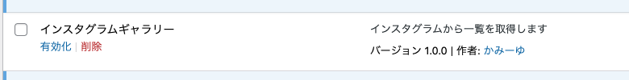
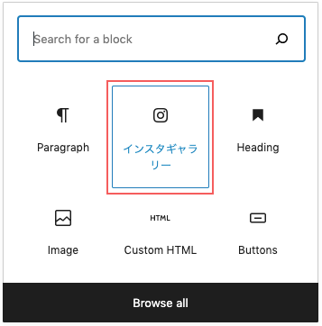
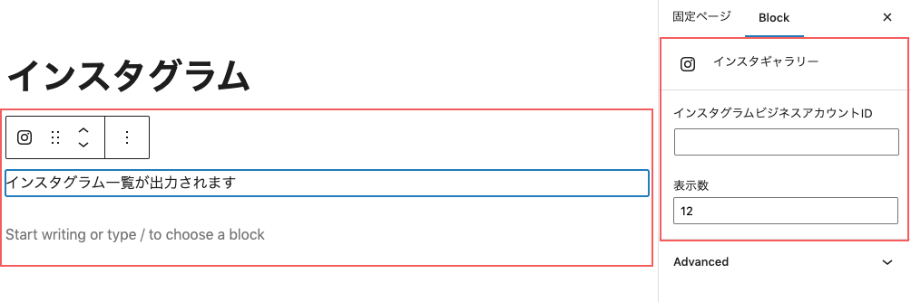
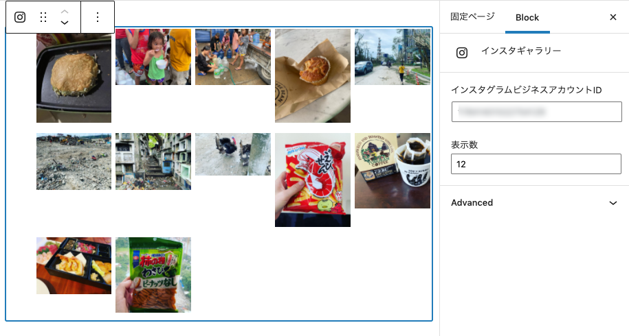

インスタ一覧出力用のブロックを @wordpress/scripts（React、Webpack） を使って作ってみました！

この記事ではその実装方法をご紹介します。

事前準備としてインスタのアクセストークンとビジネスアカウントIDを用意しておく必要があります。一覧は useEffect と axios を使って非同期処理で表示しています。<br>サンプルコードあります。

<prof></prof>


## 事前準備
このブロックを作る前にやっておくことがあります。

1. WordPressブロック開発用に **npmのインストールやpackage.jsonの編集** など環境を作っておく
2. **Graph APIのアクセストークン取得** と **インスタビジネスアカウントID** を調べておく
3. WordPress開発仮装環境などを自分のマシーンに用意しておく

以下記事にGraph APIのアクセストークン取得とインスタビジネスアカウントIDの方法を紹介してますので参考にしてください。
<card id="/blogs/entry448/"></card>

自分のマシーンでのWordPress環境はLocalなどのお手軽ツールでもいいのですが、Dockerでも作れます。

<card id="/blogs/entry480/"></card>


## インスタ一覧をブロックエディターで追加編集できるプラグインを作る
今回はプラグインで作ります！
pluginsの中に、insta-galleryというディレクトリを作ります。

```
ルートディレクトリ/
  └ wp-content/
     └ plugins/
      └ insta-gallery/
```

このディレクトリに移動し、`@wordpress/scripts`をインストールしておきます。

インストールとコマンドなどの使い方はこちらを参考に。

<card id="/blogs/entry488/"></card>

```
ルートディレクトリ/
  └ wp-content/
     └ plugins/
      └ my-insta-gallery/
        ├ node_modules/
        ├ my-nsta-gallery.php（追加）
        ├ package.json
        ├ build/
        | ├ index.js（オートで作成）
        | ├ index.assets.js（オートで作成）
        | └ index.js.map（オートで作成）
        └ src/
          └ index.js（追加）
```

srcディレクトリにindex.jsを作ったらコマンドを叩いて作業しましょう！

```bash:title=コマンド
npm start
```
### my-insta-gallery.phpプラグインを登録できるようにする
my-insta-gallery.phpに以下のようなコードを書きます。

これはこのフォルダー以下をプラグイン化するためのコードです。

```php:title=my-insta-gallery.php
<?php
/**
 * Show instagram gallery plugin.
 *
 * @link https://ginneko-atelier.com
 * @package Insta gallery
*/

/*
Plugin Name: インスタグラムギャラリー
Description: インスタグラムから一覧を取得します
Author: かみーゆ
Version: 1.0.0
Requires at least: 5.5
Requires PHP: 7.3
Author URI: https://ginneko-atelier.com
License: GPLv3
*/
```

インスタグラムギャラリーを有効化します。

index.jsを読み込むコードを追記します。

```php:title=my-nsta-gallery.php
// 省略
defined( 'ABSPATH' ) || exit;
/**
 * Instagram Gallery
 *
 * @return void
 */
function my_instagram_gallery() {
	$asset_file = include __DIR__ . '/build/index.asset.php';

	wp_enqueue_script(
		'my-new-block-script',
		plugins_url( '/build/index.js' , __FILE__ ),
		$asset_file['dependencies'],
		$asset_file['version'],
		true
	);
}
add_action( 'enqueue_block_editor_assets', 'my_instagram_gallery' );
```
### インスタの表示数とビジネスアカウントIDを入力するUIを作成
インスタの表示数とビジネスアカウントIDを入力するUIを先に作成します。

```js:title=index.js
import { registerBlockType } from "@wordpress/blocks";
import {
  TextControl,
  PanelBody,
  __experimentalNumberControl as NumberControl,
} from "@wordpress/components";

import { InspectorControls } from "@wordpress/block-editor";

registerBlockType("myblock/insta-list", {
  title: "インスタギャラリー",
  icon: "instagram",
  category: "layout",
  attributes: {
    count: {
      type: "number",
      default: 12,
    },
    insta_id: { type: "string", default: "" },
  },
  edit: ({ attributes, setAttributes }) => {

    return (
      <div>
        <InspectorControls key="setting">
          <PanelBody>
            <TextControl
              label="インスタグラムビジネスアカウントID"
              value={attributes.insta_id}
              onChange={(value) => setAttributes({ insta_id: value })}
            />
            <NumberControl
              label="表示数"
              isShiftStepEnabled="true"
              shiftStep="3"
              min="1"
              max="30"
              value={attributes.count}
              onChange={(value) => setAttributes({ count: parseInt(value) })}
            />
          </PanelBody>
        </InspectorControls>
      </div>
      <p>インスタグラム一覧が出力されます。</p>
    );
  },
});
```
今回はinstagramのアイコンがあったので使ってみました。<br>
「インスタグラムギャラリー」ブロックが増えるので追加すると



ちゃんと反映しました！


ちなみに、`insta_id`の`type`をあえて`number`にしなかったのは数字が多すぎて認識できなかったです。

インスタグラムのビジネスアカウントIDは18桁くらいあるので無理もない。
```js
insta_id: { type: "string", default: "" }
```
### instagramをエディター側で出力
Graph APIから取得したinstagramの投稿のデータをエディター側で出力します。出力するためには`useEffect`と`axios`を使います。

```js{10-11}:title=index.js
import { registerBlockType } from "@wordpress/blocks";
import {
  TextControl,
  PanelBody,
  __experimentalNumberControl as NumberControl,
} from "@wordpress/components";

import { InspectorControls } from "@wordpress/block-editor";

import { useEffect } from "@wordpress/element";
import axios from "axios";
```
取得したデータは、新たに追加した `attributes`（属性）の `insta_list` に格納します。

```js{6-9,13-24}:title=index.js
// 省略
registerBlockType("myblock/insta-list", {
  // 省略
    attributes: {
      // 省略
      insta_list: {
        type: "array",
        default: [],
      },
    }
  },
  edit: ({ attributes, setAttributes }) => {
    const accessToken = [アクセストークン];
    useEffect(() => {
      if (String(attributes.insta_id).match(/^\d+$/)) {
        const url = `https://graph.facebook.com/v12.0/${attributes.insta_id}?fields=name%2Cmedia.limit(${attributes.count}){media_url,thumbnail_url,like_count,comments_count,media_type}&access_token=${accessToken}`;
        axios
          .get(url)
          .then((res) => {
            attributes.insta_list = res.data.media.data;
          })
          .catch((error) => {console.log(error});
      }
    }, [attributes]);
    // 省略
```
`useEffect`は第二引数で値などを渡せます。
```js
useEffect(() => {
, [何かしら]);
```
エディター側の出力用のコードを書きます。
```js:title=index.js
{/*省略*/}
</InspectorControls>
  {attributes.insta_list.length > 0 ? (
    <ul
      style={{
        display: `flex`,
        flexWrap: `wrap`,
        listStyle: `none`,
      }}
    >
      {attributes.insta_list.map((post) => (
        <li
          key={post.id}
          className="c-insta-list__item"
          style={{
            width: `20%`,
          }}
        >
          <figure
            className="c-insta-list__img"
            style={{
              margin: `3px`,
            }}
          >
            
        </li>
      ))}
    </ul>
  ) : (
    <p>インスタグラム一覧が出力されます</p>
  )}
</div>
  );
},
// 省略
```
エディター側の実装結果はこちら。今回は**どんな画像が何個表示されるのかだけわかればいい**ので最低限のスタイルだけ当てました。



インスタは写真だけではなく動画もUPできます。`media_type`が`VIDEO`だった場合は`media_url`がありません。なので、投稿のサムネイル（`thumbnail_url`）を取得するようにしています。
```js

```

### 表側の実装
サイトの表側にはいいねの数も表示するようにしました。

```js:title=index.js
// 省略
registerBlockType("myblock/insta-list", {
  // 省略
  save: ({ attributes }) => {
    return (
      <ul className="c-insta-list">
        {attributes.insta_list.length > 0 &&
          attributes.insta_list.map((post) => (
            <li key={post.id} className="c-insta-list__item">
              <figure className="c-insta-list__img">
                
                <figcaption>
                  <i class="fas fa-heart"></i>
                  {post.like_count}
                </figcaption>
              </figure>
            </li>
          ))}
      </ul>
    );
  },
});
```
ブロックを追加したページ側にはこんな感じでインスタグラムの投稿一覧が出力できるようになりました。


今回はCSSの紹介はしてません。[2022年版！GraphAPIでインスタグラム投稿一覧を出力（JS/PHPサンプルコードあり）](/blogs/entry448/)を参考にしていただくか、お好みでスタイルを当ててみてください。

## まとめ・インスタをWordPressのブロック開発するのは大変だけど楽しかった
この記事を書くにあたって、まだブロックエディターのことがよくわかってなくて、手探りで調べながら進めました。

思わぬnpmインストールでハマりポイントなどもあり記事を書くのに丸1日かかりました笑

<msg txt="今日ハマった分はきっと明日の肥やしになる！"></msg>

そう信じてます。。。。

何はともあれ、この記事が皆さんのコーディングライフの一助となれば幸いです。

今回も最後までお読みいただきありがとうございました。
