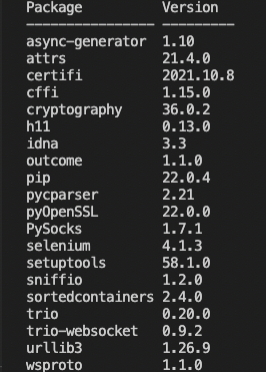
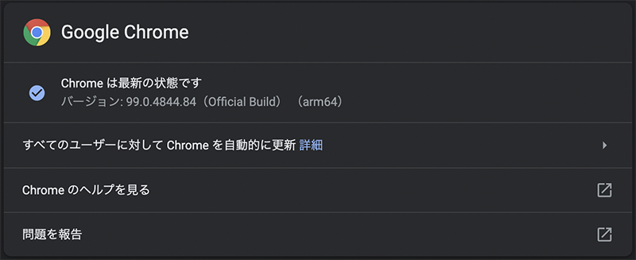
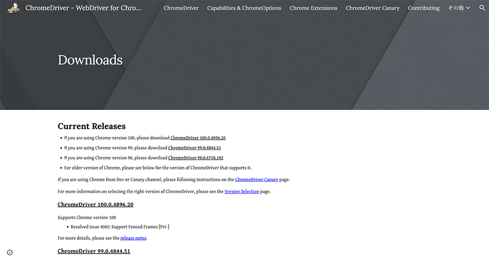
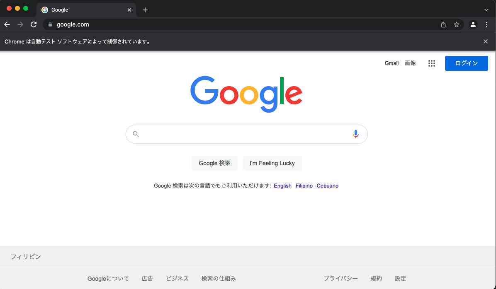
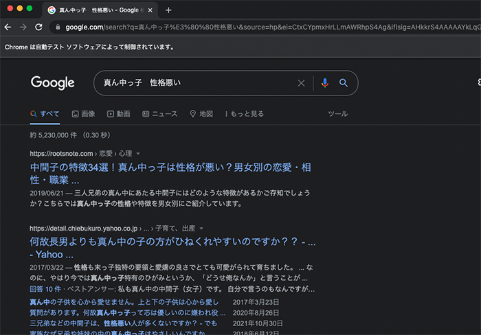

仕事を自動化して効率化したい！

それだけの思いで、1週間前くらいからpythonの勉強始めました。今回はseleniumを使って検索上位100件のデータをcsvに出力するプログラムを作ってみたので忘れないうちにメモっておきます。

<prof></prof>


前提条件です。

<msg txt="今回はインストールとかの説明を省きます。ちなみにパソコン買い替えたばかり。M1チップで検証しました。"></msg>

homebrew経由でインストールしました。バージョンは以下コマンドで確認できます。
<br><small>windowsは多少コマンドが違うのでご注意ください。</small>


```bash:title=コマンド
python3 -V
```
自分のマシーンにインストールしたpythonのバージョンはPython 3.10.4です。

Macだと以下コマンドだとpythonの2系しか操作できないので必ずコマンドに<strong>python3 ...</strong>という感じで。

```bash:title=コマンド
python -V
```

## 仮想環境を作る

コマンドでpythonを書くファイル©を格納するルートディレクトリに移動しておきます。
```
web-scraping/（ルートディレクトリ）
  └ .env/（後ほど自動で生成される）
```

グローバルにあれこれ入れたくないので仮想環境を作ります。

pythonには仮想環境を作るコマンドが用意されています。<br>コマンドを実行します。

```bash:title=コマンド
python3 -m venv .env
```
.envディレクトリが自動生成されます。

### 仮想環境を実行する
仮想環境を立ち上げます。

```bash:title=コマンド
source .env/bin/activate
```
コマンドを実行をすると、頭に(.env)が付きます。

仮想環境をディアクティベートする（落とす）ときは以下コマンド。
```bash:title=コマンド
deactivate
```
## 検索結果を python で取得する
<em>web-scraping.py</em>ファイルを追加します。
python のファイルの拡張子は`.py`になります。
```
web-scraping/（ルートディレクトリ）
  ├ .env/
  └ web-scraping.py（新規作成）
```

今回は selenium を使って Chrome を操作し特定のキーワードを検索、検索結果を取得します。<br>selenium は python のライブラリの一つでブラウザを操作できます。

### ライブラリ selenium をインストール
selenium を仮想環境にインストールします。

```bash:title=コマンド
pip3 install selenium
```
以下コマンドでインストールされたパッケージが確認できます。
```bash:title=コマンド
pip3 list
```

アンインストールしたい場合。

```bash:title=コマンド
pip3 uninstall -y selenium
```
### webdriver で Chrome を操作する
ライブラリにはたいてい複数のモジュールが用意されているので、必要に応じて呼び出して使います。

モジュールはライブラリをインストールしなくても使えるものもあります。

selenium から webdriver(モジュール) を import します。<br>今回は webdriver を使ってChromeを操作します。

現在使用しているChromeのバージョンと同じものをDLします。<br>バージョンは Google Chrome を起動して調べることができます。




以下URLよりダウンロードできます。

https://chromedriver.chromium.org/downloads



chromedriver は driver ディレクトリに格納しておきます。

```
web-scraping/（ルートディレクトリ）
  ├ .env/
  ├ driver/chromedriver（格納）
  └ web-scraping.py
```
まずは webdriver を使って Chrome を起動してみましょう。

```python:title=web-scraping.py
import time
from selenium import webdriver
from selenium.webdriver.chrome import service
from selenium.webdriver.chrome.options import Options

url = 'https://www.google.com'
interval = 5
options = Options()
options.add_argument('--window-size=1200,700')
driver_path = 'driver/chromedriver'
chrome_service = service.Service(executable_path=driver_path)
driver = webdriver.Chrome(service=chrome_service, options=options)
time.sleep(interval)
driver.get(url)
time.sleep(interval)
driver.close()
```

以下コマンドで python を実行します。
```bash:title=コマンド
python3 web-scraping.py
```
Chromeが立ち上がります。スリープ時間は5秒なので、5秒後に閉じるはずです。


```python
driver_path = 'driver/chromedriver'
chrome_service = service.Service(executable_path=driver_path)
options = Options()
options.add_argument('--window-size=1200,700')
```
options でウィンドウサイズなどの設定し、service を使って chromedriver を呼び出します。

各設定はまとめて webdriver に読み込みます。

```python
driver = webdriver.Chrome(service=chrome_service, options=options)
```
ブラウザ起動し、閉じます。
```python
time.sleep(interval) # 5秒スリープ
driver.get(url) # Chromeのホーム画面を開く
time.sleep(interval) # 5秒スリープ
driver.close() # driverを閉じる
```
変数 interval の値を変えるとスリープ時間を調整できます。あまり短縮しすぎると、処理が追いつかないこともあるので注意です。

モジュール By を追加し、Chromeホーム画面の要素を操作します。
```python{3,9-13}:title=web-scraping.py
# 省略
from selenium.webdriver.chrome.options import Options
from selenium.webdriver.common.by import By #追加

url = 'https://www.google.com'
# 省略
time.sleep(interval)

search_string = input('キーワード> ')

driver.find_element(By.NAME, 'q').send_keys(search_string)
driver.find_elements(By.NAME, 'btnK')[1].click()
time.sleep(interval)
driver.close() # 最後の行に移動
```
実行。
```bash:title=コマンド
python3 web-scraping.py
```
対話形式でキーワードを入力。


検索できました。


`https://www.google.com`にアクセスして要素を検証してみると、検索のinputタグのname属性は`q`。送信ボタンのname属性は`btnK`です。同じname属性のボタンが2個あるので2つ目を取得。

chromedriverを使って取得したinputタグ（検索窓）にキーワードを入力、検索ボタンをクリックさせる操作をしています。

### 100件分の検索結果を取得し、配列（リスト）に格納
pythonでは単純な配列をリスト、連想配列をディクショナリーと呼ぶようです。

```python{5-23}:title=web-scraping.py
# 省略
driver.find_elements(By.NAME, 'btnK')[1].click()
time.sleep(interval)

results = []
flag = False
while True:
  g_ary = driver.find_elements(By.CLASS_NAME,'g')
  for g in g_ary:
    result = {}

    if g.find_element(By.TAG_NAME, 'h3').text != '' and g.find_element(By.CLASS_NAME,'yuRUbf').find_element(By.TAG_NAME,'a').get_attribute('href') != '':
        result['url'] = g.find_element(By.CLASS_NAME,'yuRUbf').find_element(By.TAG_NAME,'a').get_attribute('href')
        result['title'] = g.find_element(By.TAG_NAME,'h3').text
        results.append(result)
    if len(results) >= 100:
      flag = True
      break
  if flag:
    break
  driver.find_element(By.ID,'pnnext').click() # ページ送りをクリックして次のページに移動
  time.sleep(interval)
driver.close() # 最後の行に移動
```
検索内容一個一個がクラス`g`に格納されているの取得し、ループ処理をします。
```python
g_ary = driver.find_elements(By.CLASS_NAME,'g')
for g in g_ary:
  # ここに処理
```
URLとタイトルを格納したディクショナリをリストに格納します。

タイトルとリンクが取得できたもののみ格納し、リストresultの長さが100になるまで繰り返します。

```python
result = {}
if g.find_element(By.TAG_NAME, 'h3').text != '' and g.find_element(By.CLASS_NAME,'yuRUbf').find_element(By.TAG_NAME,'a').get_attribute('href') != '':
  result['url'] = g.find_element(By.CLASS_NAME,'yuRUbf').find_element(By.TAG_NAME,'a').get_attribute('href')
  result['title'] = g.find_element(By.TAG_NAME,'h3').text
  results.append(result)
if len(results) >= 100:
  flag = True
  break
```
要素の取得は以前は以下のような記述方法をしていましたが、非推奨となりました。

Byで取得してください。

```python
# 非推奨
driver.find_element_by_id('pnnext').click()

# Byで取得
driver.find_element(By.ID,'pnnext').click()
```
|セレクター|記述例|
|-|-|
|<em>class</em>|`driver.find_element(By.CLASS_NAME, "hoge")`|
|<em>ID</em>|`driver.find_element(By.ID, "hoge")`|
|<em>name</em>|`driver.find_element(By.NAME, "hoge")`|
|<em>タグ</em>|`driver.find_element(By.TAG_NAME, "h1")`|

タグやクラスなどは複数ある時、以下のような取得の仕方ができます。
```python
h3 = driver.find_elements(By.TAG_NAME, 'h3')

# 三個目のh3タグのテキスト
h3[2].text
```
他にもこんな指定ができる。
```python
# リンクの文字の一部一致
driver.find_element(By.PARTIAL_LINK_TEXT, "element_partial_link_text")

# リンクの文字の完全一致
driver.find_element(By.LINK_TEXT, "element_link_text")

# XPath
driver.find_element(By.XPATH, "/html/body/h1")
```
## 取得したデータをcsvに格納
取得したデータをcsvに格納します。

csv作成するだけでなく、命名時にタイムスタンプを付与したいので3つのモジュールを読み込みます。

```python{2-3,9-15}:title=web-scraping.py
# 省略
import csv # csv操作のモジュール
import math # 計算系のモジュール
from datetime import datetime # 日付取得のモジュール

# 省略
driver.close()

if len(results) > 0:
  timestamp = math.floor(datetime.now().timestamp())
  with open(f'output_{timestamp}.csv', 'w') as f:
    writer = csv.writer(f)
    writer.writerow(["URL", "title"])
    for result in results:
      writer.writerow([result["url"], result["title"]])
```

実行すると`output_1648594514.csv`みたいな感じでファイルができます。

以下コードでタイムスタンプが取得できますが、小数点以下が出ちゃうので、
```python
datetime.now().timestamp()
```
`math.floor()`で切り捨てます。
```python
timestamp = math.floor(datetime.now().timestamp())
```


## いちいちブラウザが開くのは面倒
いちいちブラウザが開くのが鬱陶しいときは、optionsに`--headless`を追加します。

```python
options.add_argument('--headless')
```

## pythonは記述方法が簡潔で初心者には敷居が低いかも
python書いてみた感想です。

記述方法が簡潔でビギナーでも、とっつきやすい言語だと感じました。
<msg txt="コマンド操作さえ乗り越えられればね！"></msg>

今回はスクレイピングをご紹介しましたが、対象サイトや負荷を書けてしまう場合、違法だったりもするので注意しましょう。

<msg txt="Twitterなんかはスクレイピング禁止みたいですしね。"></msg>

現在は pandas の勉強中です。<br>またブログにしようと思います。

ぜひもっと仕事を自動化し、効率化できる役に立つサンプルをご紹介できたら幸いです。

皆さんのコーディングライフの一助となれば幸いです。<br>最後までお読みいただきありがとうございました。

