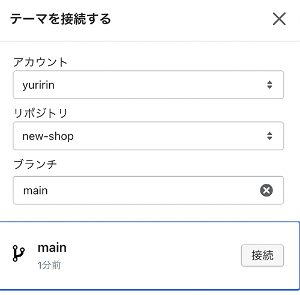

*前提条件*

* VS Code をインストールしてある
* GitHub アカウントを持っている
* Git 操作ができる

この記事ではMacのみの開発方法を紹介しています。


<!-- ## Shopify パートナープログラムに参加し開発用アカウントを作成する
Shopify の開発用アカウントを作成します。


[Shopify パートナープログラム](https://www.shopify.jp/partners)

名前や住所、電話番号などを登録していきます。


最後にアンケートに答えて、


パートナープログラム契約を読み、同意にチェック。

 -->

## Shopify　CLI をインストール
Shopify CLI をインストールします。公式に書いてあるとおりインストールしますが、私はインストール系のものは Homebrew で一元管理しているので、今回は Homebrew でのインストール方法をご紹介します。

Homebrewでインストール。

```bash:title=コマンド
brew tap shopify/shopify
brew install shopify-cli
```

https://shopify.dev/apps/tools/cli/installation

バージョン確認。

```bash:title=コマンド
shopify version
# 2.15.2
```

Sshopify は Ruby で動いています。
```bash:title=コマンド
ruby -v
# 2.15.2
```

## ベースとなる Theme　Dawn を落として git リポジトリと連携しておく
Dawn は Shopify の基本の Theme です。

今回はこの Dawn をもとにThemeを作成していきます。

```bash:title=コマンド
shopify theme init new-shop
```
テーマのインストールされたディレクトリに移動します。

```
new-shop
```
GitHub でリポジトリを作って、リモートリポジトリと連携しておきます。
```bash:title=コマンド
echo "# new-shop" >> README.md
git init
git add README.md
git commit -m "first commit"
git branch -M main
git remote add origin https://github.com/アカウント/new-shop.git
git push -u origin main
```
対象のストアにログインします。

```bash:title=コマンド
shopify login --store xxxxx.myshopify.com
```
Shopify 管理画面左メニューからオンラインストアに移動します。テーマライブラリーからgithub と連携しておきます。


ユーザーアカウント（Organizationでも大丈夫）、リポジトリ、ブランチを選んでおきます。


`shopify theme pull`で設定した先程セットしたテーマ名を選びます。
```bash:title=コマンド
shopify theme pull
```
開発環境を起動。
```bash:title=コマンド
shopify theme serve
```


開発環境でサイトが確認できるようになりました。


サイトは開発モードなのでURLを踏んだ直後、パスワードを促される可能性があります。

パスワードはオンラインストア、各種設定、パスワード保護から確認できます。

## Shopfy の基本のディレクトリ構造

|ディレクトリ|内容|
|-|-|
|<em>assets</em>|CSSやJAS画像など|
|<em>config</em>|テーマ全体や管理画面で設定を保存するjsonデータを格納|
|<em>layout</em>|レイアウトに関するhtmlなど|
|<em>locales</em>|言語に関する設定|
|<em>sections</em>|各ページの大きめの共通パーツ|
|<em>snippets</em>|各ページの小さめの共通パーツ|
|<em>templates</em>|各ページのテンプレート|

環境構築に不便なM1チップ。5ヶ月くらい前は `shopify theme serve` が動かないとかあったみたいですが問題なく動きました。
<msg txt="私の記事はだいたい公開備忘録です。案件で過去やったことを守秘義務内でまとめてます。"></msg>

<!-- 参考サイト:<br>
https://tokyofreelance.jp/shopify_theme_self_made/#outline__1_1 -->

<prof></prof>
