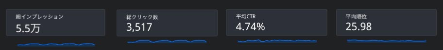

この記事は 2025 年に大幅にリライトしました。

この記事では、GASとLooker Studioを使って、記事ごとにより詳細に分析する方法をご紹介しています。

> Looker Studio (旧データポータル)は、Googleが提供するデータ分析およびビジュアライゼーションツールです。これを使うと、データを視覚的に整理し、インサイトを得ることができます。例えば、Google Analyticsデータを使ってウェブサイトのパフォーマンスを分析したり、Google Adsのキャンペーン効果を評価したりすることができます。

今まで手作業でスプシに書き出していたページの出力を GAS などを使って自動でできるようにしています。

リライトは公開後、60 ~ 90 日経過したあたりが良いとされています。

* 記事をいつ公開、ないしはリライトしたかを調べたい
* タイトルはリライトによって変わることもあるので常に最新のものを取得したい
* URL も取得したい
* 記事のジャンルも把握しておきたい（キーワードとのミスマッチがないか知りたいため）

<prof></prof>

## GAS で Web サイトの sitemap.xml を元に自動でサイト情報を出力する
サイトの状態を調べるために、Google のクローラーにサイト構造を伝えるために使っている sitemap.xml を利用します。GAS を使って Web サイトの構造を一気に取得します。

> Google Apps Script（GAS）とは、Googleが開発し、提供しているプログラミング言語のことです。 Webブラウザ上で動作する「JavaScript」をベースに開発された言語であり、JavaScriptを日々学んでいる方は比較的容易に習得できるようになっています。

ウチのブログは整理しまくっているのであってもせいぜい200記事くらいしかありません。なので一回の GAS で取得できますが、記事の多いサイトは途中で処理が止まる可能性があります。そういう場合は、処理を分けたほうがいいかもしれません。

今回は GAS の始め方など、細かいことは省きます。GAS に関しての記事を参考にしてください。

<card id="/blogs/entry470/"><card>

プロジェクト名などを、GetSitemap 等としておきます。
コードの大まかな概要です。
```js:title=GAS
function fetchSitemap() {
  // サイトマップのURLを指定
  var sitemapUrl = 'https://xxx.com/sitemap.xml';
  //シートを取得
  urls.forEach(function(urlElm) {
    // urlElmからURLからページを解析し各情報をシートに格納
    var url = urlElement.getChildText('loc', namespace);
    //ウチのブログは entry の文字列が含まれている。なのでそれだけ取得。
    //サイトによってルールがあると思うので適宜条件を変更してください。
    if(url.includes('entry')){
      sheet.getRange(row, 1).setValue(url);
      var getPageInfo = fetchPageDetails(url);
      sheet.getRange(row, 2).setValue(getPageInfo.title);
    }
  })
}
function fetchPageDetails(url) {
  // URLを取得して
  var response = UrlFetchApp.fetch(url);
  //各処理をし、各取得したいデータを格納
  return {
    title: title,
    publishDate: publishDate,
    maintenanceDate: maintenanceDate,
    genre: genre
  };
}
```
分解して解説します。
`UrlFetchApp` を利用して、ページを解析してサイト情報を取得します。
> UrlFetchAppは、Google Apps Script（GAS）で提供される組み込みのサービスで、ウェブ上のデータを取得したり送信したりするためのHTTPリクエストを行うために使用されます。 APIとの通信やウェブスクレイピングにおいて、データの取得や更新、処理を簡単に行うことができます。

このブログの構造はこんな感じ。サイトによって構造が違うので、適宜取得したい HTML を変えると良いと思います。
正確な構造化データがあるのであれば、そこから取得できます（[取得方法](#構造化データが設置されている場合)）。

```HTML:title=HTML
<html>
  <head>
  ...
  <title>タイトル（取得）</title>
  ...
</head>
<body>
  ...
  <ol>
    ...
    <li><a href="">ジャンル名（取得）
  </ol>
  投稿日<time date-time="0000-00-00（取得）"></time>
  更新日<time date-time="0000-00-00（取得）"></time>
</body>
</html>
```
`fetchPageDetails()` では引数から取得したURLごとに、上記のようなHTMLから取得できる、タイトル、投稿日、メンテナンス日、ジャンルを取得します。

```js:title=GAS
function fetchPageDetails(url) {
  try {
    var response = UrlFetchApp.fetch(url);
    var html = response.getContentText();

    // headタグ内の<title>を取得
    var headContent = html.match(/<head[^>]*>([\s\S]*?)<\/head>/i);
    var title = 'タイトルを取得できませんでした';
    if (headContent) {
      var titleMatch = headContent[1].match(/<title[^>]*>(.*?)<\/title>/i);
      if (titleMatch) {
        title = titleMatch[1];
      }
    }

    // 公開日を取得
    // 適宜設定を変えてください
    var publishDateMatch = html.match(/<dl class="date">.*?<dt>公開日<\/dt><dd><time date="(.*?)">.*?<\/time><\/dd>/s);
    var publishDate = publishDateMatch ? publishDateMatch[1] : '';

    // メンテナンス日を取得
    // 適宜設定を変えてください
    var maintenanceDate = '';
    if (publishDateMatch) {
      var maintenanceDateMatch = html.match(/<dl class="mentenance_date">.*?<dt>メンテナンス日<\/dt><dd><time date="(.*?)">.*?<\/time><\/dd>/s);
      maintenanceDate = maintenanceDateMatch ? maintenanceDateMatch[1] : '';
    }

    // パンくずリストの3つ目に格納されているジャンルを取得
    var genreMatch = html.match(/<ol class="bread-crumb-list[^>]*>.*?<li>.*?<\/li>.*?<li>.*?<\/li>.*?<li>.*?<a[^>]*>(.*?)<\/a>.*?<\/li>/s);
    var genre = genreMatch ? genreMatch[1] : '';

    return {
      title: title,
      publishDate: publishDate,
      maintenanceDate: maintenanceDate,
      genre: genre
    };
  } catch (e) {
    return 'エラーが発生しました: ' + e.message;
  }
}
```

`match` で使っている正規表現に関しては、こちらの記事を参考にしてください。

<card id="/blogs/entry336/"></card>

```js:title=GAS
function fetchSitemap() {
  // サイトマップのURLを指定します
  var sitemapUrl = 'https://xxx.com/sitemap.xml';
  var response = UrlFetchApp.fetch(sitemapUrl);
  var document = XmlService.parse(response.getContentText());
  var root = document.getRootElement();
  var namespace = root.getNamespace();
  var urls = root.getChildren('url', namespace);
  
  var sheet = SpreadsheetApp.getActiveSpreadsheet().getActiveSheet();
  sheet.clear();

  // ヘッダーを設定
  sheet.getRange(1, 1).setValue('URL');
  sheet.getRange(1, 2).setValue('タイトル');
  sheet.getRange(1, 3).setValue('公開日');
  sheet.getRange(1, 4).setValue('メンテ日');
  sheet.getRange(1, 5).setValue('ジャンル');

  var row = 2;
  urls.forEach(function(urlElement) {
    var url = urlElement.getChildText('loc', namespace);
    if(url.includes('entry')){
      sheet.getRange(row, 1).setValue(url);
      var getPageInfo = fetchPageDetails(url);
      sheet.getRange(row, 2).setValue(getPageInfo.title);
      sheet.getRange(row, 3).setValue(getPageInfo.publishDate);
      sheet.getRange(row, 4).setValue(getPageInfo.maintenanceDate);
      sheet.getRange(row, 5).setValue(getPageInfo.genre);
    }
    row++;
  }) 
}
```


実行すると、データが書き出されます。

タイマーの設定に関しては[GASのトリガーの設定](/blogs/entry504/#メールで通知するgasのトリガーの設定)をご確認ください。

### 構造化データが設置されている場合
構造化データが設置されている場合は、いちいちタグから解析するよりも構造化データを解析したほうが正確ですし、設置されている構造化データごとの解析も可能です。

```js:title=GAS
function fetchPageDetails(url) {
  try {
    var response = UrlFetchApp.fetch(url);
    var html = response.getContentText();
    var title = 'タイトルを取得できませんでした';
    var publishDate = '';
    var maintenanceDate = '';
    var genre = '';
    var hasFAQPage = false;
    var structuredDataMatch = html.match(/<script type="application\/ld\+json" data-gatsby-head="true">(.*?)<\/script>/s);
    var structuredStringData = structuredDataMatch ? structuredDataMatch[1] : [];
    structuredjsonData = JSON.parse(structuredStringData)
    structuredjsonData.forEach((data)=>{
      if(data['@type'] === 'BlogPosting') {
        title = data.headline;
        publishDate = data.datePublished;
        maintenanceDate = data.dateModified;
        
      }
      // 2番目のパンくずが記事のジャンル
      if(data['@type'] === 'BreadcrumbList') {
        genre = data['itemListElement'][1]['item']['name'];
      }
      // FAQの構造化データを持っていた場合
      if(data['@type'] === 'FAQPage') {
        hasFAQPage = true;
      }
    })
    return {
      title: title,
      publishDate: publishDate,
      maintenanceDate: maintenanceDate,
      genre: genre,
      hasFAQPage: hasFAQPage
    };
  } catch (e) {
    return 'エラーが発生しました: ' + e.message;
  }
}
```
ヘッダーを足します。
```js:title=GAS
function fetchSitemap() {
  ...
  sheet.getRange(1, 6).setValue('FAQ');
  ...
  urls.forEach(function(urlElement) {
    ...
    sheet.getRange(row, 6).setValue(getPageInfo.hasFAQPage);
    ...
  })
}
```

例えば、FAQの構造化データを持っているページとそうでないページなどを比べることができます。

<card id="/blogs/entry524/"></card>

### 記事が大量にある場合、処理を分ける（バッチ処理）
GASの1つのスクリプト実行あたり6分（360秒）とされています。それを超えると強制終了されます。

記事が大量にある場合、一度に処理すると様々な問題が発生します。
* 速度アップ: 一度に大量のデータを処理すると遅くなるので、少しずつ処理する
* エラー対応: 小分けにすると、エラーが起きても他のデータに影響しにくくなる
* 安定性: リソースを分散して使うのでシステムが安定

また、`UrlFetchApp.fetch` の1日の実行回数は無料アカウントで最大20,000回、Google Workspace アカウントであれば最大100,000回です。

またサーバーへの負担も配慮する必要があります。
* 短時間で大量のリクエストを送信すると、サーバー側に負担がかかり、応答速度が低下したり、サーバーが過負荷状態になったりダウンする
* サーバーによってはレートリミット（クライアントが一定時間内に送信できるリクエストの数を制限）を超えると、一時的にアクセスが制限されることがある。
* 大量のデータを送受信する場合、ネットワークの帯域幅が影響を受けることがある。

GASの問題も、サーバーへの負担もバッチ処理で解消できます。

```js:title=GAS
function fetchSitemap() {
  var sitemapUrl = 'https://xxxx.com/sitemap.xml';
  var response = UrlFetchApp.fetch(sitemapUrl);
  var document = XmlService.parse(response.getContentText());
  var root = document.getRootElement();
  var namespace = root.getNamespace();
  var urls = root.getChildren('url', namespace);
  
  // Dataに記事データを格納
  var sheet = SpreadsheetApp.getActiveSpreadsheet().getSheetByName('Data') || SpreadsheetApp.getActiveSpreadsheet().insertSheet('Data');
  // Logger.log()で記録できないバッチ処理のデータをLogSheetに格納
  var logSheet = SpreadsheetApp.getActiveSpreadsheet().getSheetByName('Log') || SpreadsheetApp.getActiveSpreadsheet().insertSheet('Log');
  
  // バッチサイズとインデックスの設定
  var batchSize = 100; // 一度に処理するページ数
  var startIndex = PropertiesService.getScriptProperties().getProperty('startIndex') || 0;
  startIndex = parseInt(startIndex, 10);
  var endIndex = Math.min(startIndex + batchSize, urls.length);
  var totalBatches = Math.ceil(urls.length / batchSize);

  // ログの記録
  Logger.log('実行開始');
  Logger.log('startIndex: ' + startIndex);
  Logger.log('endIndex: ' + endIndex);
  Logger.log('総バッチ処理回数: ' + totalBatches + '回');

  logSheet.appendRow(['実行開始', new Date()]);

  // 初回のみシートクリアおよびヘッダー設定
  if (startIndex === 0) {
    sheet.clear();
    sheet.getRange(1, 1).setValue('URL');
    sheet.getRange(1, 2).setValue('タイトル');
    sheet.getRange(1, 3).setValue('公開日');
    sheet.getRange(1, 4).setValue('メンテ日');
    sheet.getRange(1, 5).setValue('ジャンル');
  }

  // ページの処理
  for (var i = startIndex; i < endIndex; i++) {
    var urlElement = urls[i];
    var url = urlElement.getChildText('loc', namespace);
    if (url.includes('entry')) {
      var row = i + 2; // ヘッダー行を避けるため+2
      var getPageInfo = fetchPageDetails(url);
      sheet.getRange(row, 1).setValue(url);
      sheet.getRange(row, 2).setValue(getPageInfo.title);
      sheet.getRange(row, 3).setValue(getPageInfo.publishDate);
      sheet.getRange(row, 4).setValue(getPageInfo.maintenanceDate);
      sheet.getRange(row, 5).setValue(getPageInfo.genre);
    }
  }

  // バッチ処理のログ記録
  var batchCount = Math.ceil((startIndex + batchSize) / batchSize);
  Logger.log(batchCount + '回目の処理が終了しました。');
  logSheet.appendRow([batchCount + '回目の処理が終了しました。', new Date()]);

  if (endIndex < urls.length) {
    PropertiesService.getScriptProperties().setProperty('startIndex', endIndex);

    // 既存のトリガーを削除
    deleteTriggers();

    // 新しいトリガーを設定
    ScriptApp.newTrigger('fetchSitemap')
      .timeBased()
      .after(5 * 60 * 1000) // 15分後に次のバッチを実行
      .create();
  } else {
    PropertiesService.getScriptProperties().deleteProperty('startIndex');
    logSheet.appendRow(['総バッチ処理回数: ' + batchCount + '回。すべてのURLが処理されました。', new Date()]);
    Logger.log('すべてのURLが処理されました。');
  }

  Logger.log('実行完了');
}

function fetchPageDetails(url) {
  try {
    var response = UrlFetchApp.fetch(url);
    var html = response.getContentText();
    var title = 'タイトルを取得できませんでした';
    var publishDate = '';
    var maintenanceDate = '';
    var genre = '';
    var hasFAQPage = false;
    var structuredDataMatch = html.match(/<script type="application\/ld\+json" data-gatsby-head="true">(.*?)<\/script>/s);
    var structuredStringData = structuredDataMatch ? structuredDataMatch[1] : [];
    structuredjsonData = JSON.parse(structuredStringData);
    structuredjsonData.forEach((data) => {
      if(data['@type'] === 'BlogPosting') {
        title = data.headline;
        publishDate = data.datePublished;
        maintenanceDate = data.dateModified;
        
      }
      // 2番目のパンくずが記事のジャンル
      if(data['@type'] === 'BreadcrumbList') {
        genre = data['itemListElement'][1]['item']['name'];
      }
      // FAQの構造化データを持っていた場合
      if(data['@type'] === 'FAQPage') {
        hasFAQPage = true;
      }
    });
    return {
      title: title,
      publishDate: publishDate,
      maintenanceDate: maintenanceDate,
      genre: genre,
      hasFAQPage: hasFAQPage
    };
  } catch (e) {
    Logger.log('エラーが発生しました: ' + e.message);
    return {
      title: 'エラーが発生しました',
      publishDate: '',
      maintenanceDate: '',
      genre: '',
      hasFAQPage: false
    };
  }
}

// 既存のトリガーを削除する関数
function deleteTriggers() {
  var triggers = ScriptApp.getProjectTriggers();
  for (var i = 0; i < triggers.length; i++) {
    ScriptApp.deleteTrigger(triggers[i]);
  }
}

// PropertiesServiceの値を初期化するための関数
function resetScriptProperties() {
  PropertiesService.getScriptProperties().deleteAllProperties();
  var logSheet = SpreadsheetApp.getActiveSpreadsheet().getSheetByName('Log') || SpreadsheetApp.getActiveSpreadsheet().insertSheet('Log');
  logSheet.appendRow(['スクリプトプロパティが初期化されました。', new Date()]);
  Logger.log("スクリプトプロパティが初期化されました。");
}
```
## Looker Studioにアクセス、無料で利用するでスタート
[Looker Studio](https://marketingplatform.google.com/intl/ja/about/data-studio/) にアクセスし、無料で利用するをクリックします。


もしくは、[直接アクセス](https://lookerstudio.google.com/)しましょう。

## 空のレポートを作成しておく
まずは空のレポートを作成します。


無題のレポートができました。


## データの連携処理

空のレポートからデータの連携処理を行っていきます。


無題のレポートが出来上がりますので編集をクリックします。


使用したいスプシを選び、先頭行をヘッダーとして使用するにチェックをし、右下の追加ボタンをクリック。


### グラフを追加し、ディメンション設定
試しに、URLとタイトルを表示してみます。まずは、適当にグラフを追加してみます。ここでは表の一番右「ヒートマップ付きデータ表」を選択しました。


データを後ほど Search Console と統合したいので、ここではデータの統合をクリック。


ディメンション に URL、ジャンル を追加。


後で何を統合したのかわからなくならないように統合名を変更しておきましょう。


### 加工して使いたいデータがある場合は計算フィールドを使う
公開からの経過日と、リンクつきのタイトルを表示したいので2つの計算フィールドを追加します。
> 計算フィールドとは、データソース内の既存のフィールドを基に、計算式を設定して新しいフィールドを作成する機能です。計算フィールドでは、演算子や関数、正規表現などを使用して、数値や日付、日時などの計算結果を表示できます。


ディメンションにリンク付きの文字を追加したい時は `HYPERLINK` を使います。Looker Studio からページを直接飛べるようにします。

```SQL:title=HYPERLINK関数
HYPERLINK(リンク, テキスト)
```
リンク付きタイトルをディメンションに追加します。


計算フィールドを「リンク付きタイトル」と名付けました。このケースだと、コードは以下のようになります。
```SQL:title=リンクつきタイトル
HYPERLINK(URL, タイトル)
```
ちゃんとデータが取り込めている場合は、グリーンにハイライトされます。


経過日数は以下のように `CASE - WHEN` を使って条件分岐して計算する必要があります。
```SQL:title=CASE‐WHEN
CASE
WHEN 条件 THEN 出力結果
ELSE 出力結果
END
```
| 条件 | 処理 |
| - | - |
| メンテ日がNULLで公開日が90日以上 | 公開日からの経過日を出力 |
| メンテ日が90日以上 | メンテ日から90日経ったものを出力 |
|その他 | 0 出力　|


出力する値の型（数字→文字列）が変わるとエラーを吐くので、今回は 90 日を経過していないものを 0 としました。*指標* に追加します。

```SQL:title=経過（90日以上経過）
CASE
WHEN メンテ日 IS NULL AND DATE_DIFF(TODAY("Asia/Tokyo"), 公開日) > 90 THEN DATE_DIFF(TODAY("Asia/Tokyo"), 公開日)
WHEN DATE_DIFF(TODAY("Asia/Tokyo"), メンテ日) > 90 THEN DATE_DIFF(TODAY("Asia/Tokyo"), メンテ日)
ELSE 0
END
```

ここまでできたら、一度データソースの編集を閉じグラフのディメンションと指標を編集していきます。

| ディメンション | 指標 |
| ---- | ---- |
| リンク付きタイトル, ジャンル | 経過日数(90日以上) |


表ヒートマップにするとこんな感じで出力されます。


## さらにスプシデータに Search Console を統合する
このスプシデータに、Search Console のデータを統合します。データを追加します。


対象のドメイン、URLのインプレッション、Webを選びます。<br>
スクショでは切れてますが、右下に *追加ボタン* があるのでクリック。


パラメーター（URLの末尾の `?xxx=aaaa` みたいなやつ）やハッシュ（アンカーリンクなどにつくURLの末尾の`#xxx`）を排除したいので、「ランディングページの正規化URL」という計算フィールドを作成します。

```SQL:title=ランディングページの正規化URL
CASE
WHEN ENDS_WITH(REGEXP_REPLACE(Landing Page, "[?#].*$", ""), "/") THEN REGEXP_REPLACE(Landing Page, "[?#].*$", "")
ELSE CONCAT(REGEXP_REPLACE(Landing Page, "[?#].*$", ""), "/")
END
```
分析したい Search Console のデータはスプシに書き出したブログ記事と一致した、検索に引っかかっている記事だけなので *内部結合* で結合を選択します。<br>
スプシと Search Console から一致しないものはすべて排除します。

結合条件は スプシの URL Search Console の ランディングページの正規化URL を選択します。


後ほど日付で絞り込めるようにしたいので、ディメンションに Date を追加します。インプレッションなど出力したいデータを追加します。

| ディメンション | 指標 |
| ---- | ---- |
| ランディングページの正規化URL, Date | URL Clicks, Impressions, Average Position, URL CTR |


保存。

### 出力する表でデータをセット
結合した Search Console のデータを持っていない場合は Null が返ってくるのでその場合は空をセットします。


### コントロールを追加して日付で絞り込めるようにする
日付ごとに絞り込めるように、コントロールの期間設定を追加します。


今回はデフォルトの数値を、過去30日としておきます。


これで期間ごとに値が絞り込めるようになりますね！！！


## テーマ変更
味気ないのでテーマを変更します。


## スコアカードを追加して全体のデータを追加


スコアカードで更に全体像がわかりやすくします。

| 指標 | 名前 | 集計方法 |
| ---- | ---- | ---- |
| Impressions | 総インプレッション | 合計 |
| URL Clicks | 総クリック数 | 合計 |
| URL CTR | CTR | 平均値 |
| Average Position | 平均順位 | 平均値 |



スクショのようにスパークラインをDATEに設定すると、lookerstudioを再読込するとエラーで表示されなることがあるので、折れ線グラフなどを設置することをおすすめします。

## ページタイトルでの検索できるようにする
タイトルで記事の指標を絞り込めるようにします。コントロールからプルダウンリストを追加します。「ブログとsearch console統合」のディメンションにタイトルがない場合は先に追加しておきます。


「記事」という名前で指標はImpressionsあたりにセットしておきます。


こうすることで、記事をタイトルで検索し絞り込めるようになります。


## まとめ・Looker Studio を使って各種データを統合すると全貌が把握できる
Looker Studio でデータを統合すると、総合的に見てどの記事を分析すればいいかなど把握しやすくなります。

まだまだ紹介できていない機能があるのでまた記事にまとめられたらなーと思っています。

この記事が皆さんのWeb解析ライフの一助となれば幸いです。

最後までお読みいただきありがとうございました。
