Googleタグマネージャーで設置したタグが発火してなくて焦ったこと有りませんか？

Googleタグマネージャーにはちゃんと確認する機能プレビュー/タグアシスタント（Tag Assistant）がついているので、この機能をしっかり使うことができればタグが発火しないトラブルは回避できます！","そこでデバッグ（タグたちゃんと発火してるか）方法を事例付きでわかりやすく解説します。
## Googleタグマネージャー（GTM）で設置したタグがなんで発火しないの？そんな方向けに書きました！
* プレビュー/タグアシスタント（Tag Assistant）の使い方を知りたい
* GA4のイベント設置したいけどどうしていいかわからない
* マニュアル通りに設置したのにクリックイベントがうまく動かない
* 正しく設置しているはずなのにクリックイベントが発火するときとしない時がある


*前提条件*<br>
Googleタグマネージャー（GTM）を設置していてGoogleアナリティクスが計測できていること。


そもそもタグマネの設置の仕方がわからない方はこちらをご覧ください。

<card slug="entry474"></card>

## Googleタグマネージャーのプレビューの使い方
設置したイベントが発火したかは、プレビューで確認できます。

この機能はコンテナーを公開する前でもタグがきちんと動くか（発火）確認できます。

対象のコンテナーのワークスペースの右上にある「プレビュー」をクリックします。


*タグアシスタント（Tag Assistant）* というツールが別タブで開くので、確認したいサイトのURLを入力し、「Connect」ボタンをクリック。


## コンテナーが読み込まれたタイミングで、GAやアドセンスのタグが読み込まれる
タグアシスタントを見ると、この銀ねこアトリエでは以下のようにイベントが順次読み込まれています。

1. Content Initialization
1. Initialization
1. *Container Loaded（GAやアドセンスなどのタグを読み込み）*
1. Gatsby-route-change
1. DOM Ready
1. Window Loaded

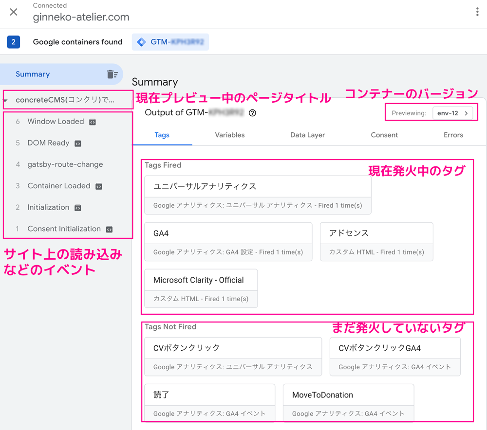

各右側の項目をクリックすると度のタイミングでどのタグが発火したか切り替わり、確認することができます。

## 実際にタグを設置し、プレビューとタグアシスタントを使って確認してみよう
銀ねこアトリエでは「読了（記事を読み終わったか）」を確認するためのイベントを設定しています。

要素の表示（Element Visibility）というイベントを設定できるのですが、CTAエリアが50％表示されたら、「読了タグ」が発火するようになっています。

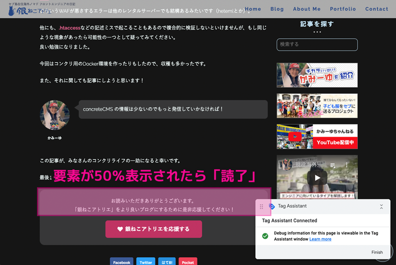

### 要素の表示イベントを利用して「読了」を計測するタグ作成
要素の表示イベントを利用して *読了を計測するタグ* を作成し、*プレビューとタグアシスタントで確認する方法* をご紹介します。

タグの作り方は[【GA4】 Analytics と Google タグマネージャーを連携（画像解説28枚アリ）](/blogs/entry474/)でも紹介しているので、かなり端折ってご紹介します。

#### トリガー作成
新規トリガー作成でユーザーエンゲージメントから要素の表示を選択します。

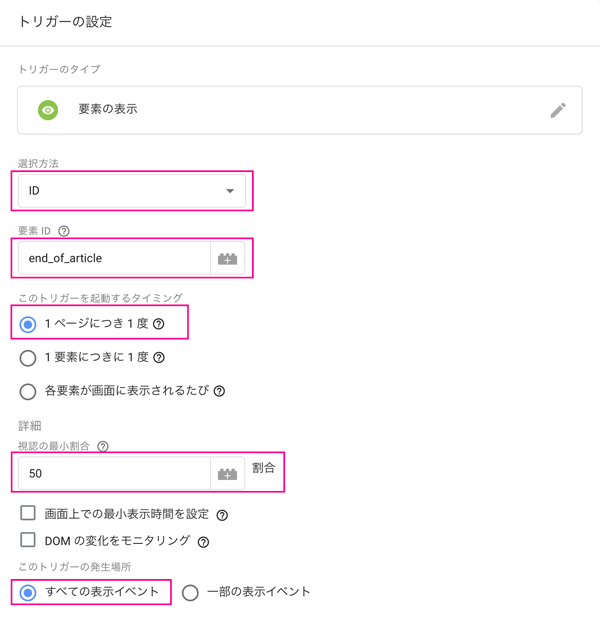

|選択|要素ID|タイミング|割合|発生場所|
|-|-|-|-|-|
|ID|end_fo_article|1ページに付き1度|50％|すべての表示イベント|

#### タグを作りトリガーをセットしておく
「読了」というGA4のタグを作成します。トリガーは先程作成したものをセットします。

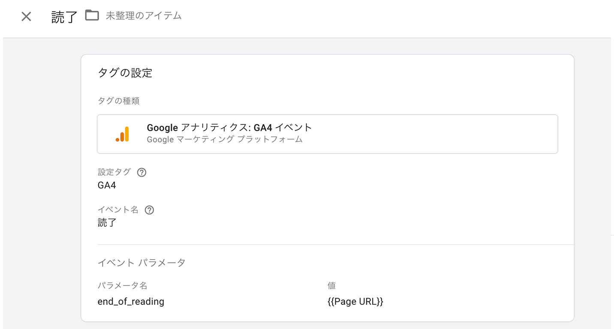

イベント名を「読了」とし、パラメーターをセットしておきます。

|パラメータ名|値|
|-|-|
|end_of_reading|{{Page URL}}|

後日、GA側でカスタムディメンションとして使います。

### 「読了タグ」をプレビューとタグアシスタントを使ってデバッグ
「読了タグ」をデバッグしてみましょう！


コンバージョンエリアが表示されると7項目に*Element Visibility*が追加され、発火済みのタグ（Tags Fired）に「読了タグ」が移動します。タグが発火したことが確認できました。「読了」をクリックして詳細をチェック。

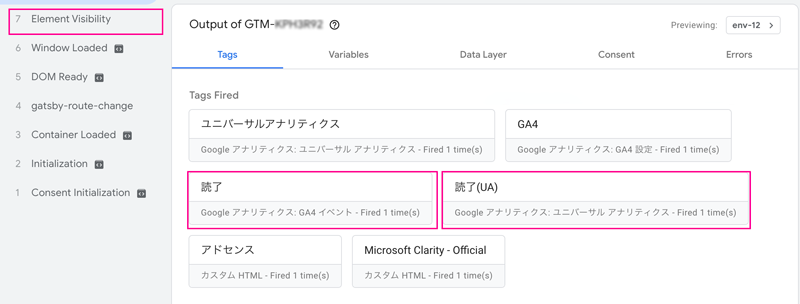

発火中のトリガー（Firing Triggers）にチェックがついていれば問題なく動いています。<br>
<small>※ Display Valueは非エンジニアの方は「Name」にしておきましょう。「Values」にするとJSON形式になってしまい見づらくなります。</small>

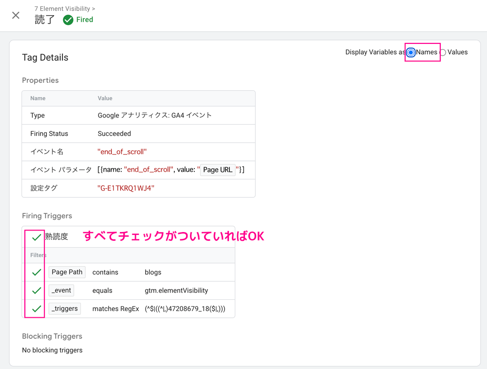

## タグが発火しない原因の探り方
イベントのタグが発火しない原因はフィルター（filter）の設定が間違えている可能性が一番高いです。

* IDとクラス名を間違えてないか？
* 値との設定が「含む」、「完全一致」などを条件を間違えていないか？
* ページのパスやリンクの値を間違えていないか？

またレアですがHTMLやCSSの問題で発火しないこともあります。

探り方を2つご紹介します。

### フィルター（filter）の設定が間違えている場合
必要があればプレビューもリロードしタグに設定したイベントが発生する状態（この場合は所定の位置までスクロール）にします。

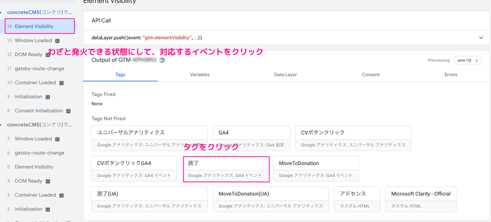

条件を満たしているはずなのにTag Not Firedに分類されていたら、右側のイベントを選んだ状態にして調べたいタグをクリックしてみます。

この場合Page Pathの値が間違えているのでタグが発火していない事がわかります。

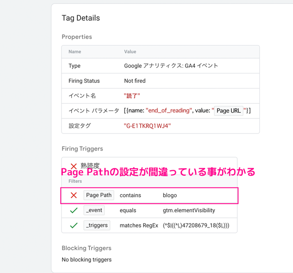

原因が分かったら、修正してもう一度プレビューしタグアシスタントでタグのトリガーが発火するか確認します。

<div class="box">うまく行かない場合は、タグマネージャーのコンテナーからプレビューをクリックするところからやり直しましょう。</div>

### 正しく設置しているはずなのにクリックイベントがうまく発火しない
クリックイベントがうまく発火しないのはGTMタグの設置方法だけが問題では有りません。

要素に派手なSVGのanimationなどを実装し、大半がボタンではなくSVGと認識してしまい、指定した要素をクリックしづらくなることがあります。

<msg txt="それが原因でタグが発火しないなんてことも、実際にありました！"></msg>

#### まずはどの要素をクリックされているか調べる
どの要素をクリックされたかを調べるためには、タグが発火する状況を作ります。

対象の箇所をクリックしたあと、タグアシスタントでAPI Callを開きgtm.elementが対象の要素とクリックした要素が一致しているか調べます。

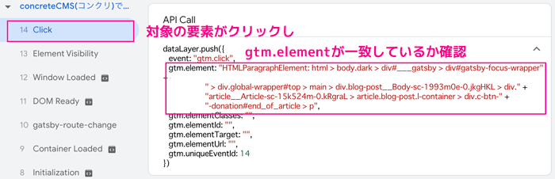

一致したりしなかったりする場合は以下の対処を考えます。

<msg txt="あれ？測定されるときもあればしないときもある。。。<br>なんでやろ？"></msg>


#### クリックしたものが対象の要素と違うときの対処法
根本的にHTMLやCSSを思い切り変えれば解決する場合も多いと思いですがそうも行かない場合がありますよね?

<msg txt="HTMLの書き方を変えるか、GTMタグを2つ作るしか有りません。"></msg>

```html
<button id="request">
  <svg id="likeAnimation"><!--/こちらが反応している-->
</button>
```

今回はGTM専用のカスタムデータ`data-gtm-click`を追加します。

```html:title=HTMLを変更する場合
<button id="request" data-gtm-click="request">
  <svg id="likeAnimation" data-gtm-click="request">
</button>
```
GTM側でカスタムデータ用の変数を作成します。

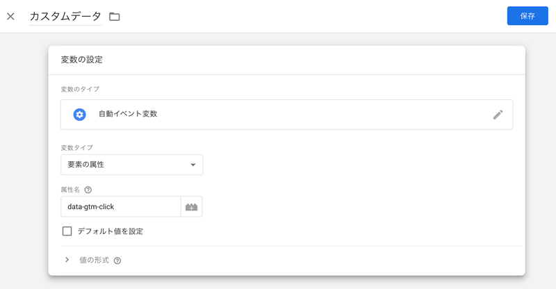

|変数のタイプ|変数タイプ|属性名|
|-|-|-|
|自動イベント変数|要素の属性|data-gtm-click|

トリガーの方へ一部のクリック、カスタムデータ=requestにしておけばOK。

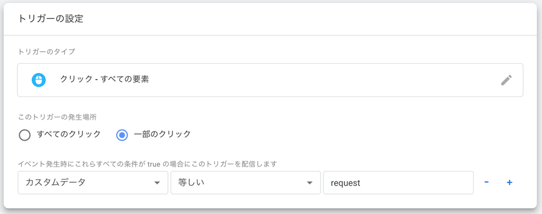

これでどちらがクリックされても問題なくクリックイベントが発火するようになります。

タグをさわれない場合はGTMでタグを2つ作ります。

ID `request` とID `likeAnimation` でクリックされた場合の2通りです。

#### ダブルカウントが気になる場合は除外トリガーを設定
除外トリガー（または「ブロック トリガー」）は、特定の条件下で別のトリガー機能が発動するのをブロックするために使用できるトリガーの一種です。

ダブルカウントが怖い場合は除外トリガーを作成して登録したほうがいいかもしれません。


## プレビュー/タグアシスタント（Tag Assistant）を丁寧に使えばタグは正しく設置できる

今回は **正しく設置しているはずなのに*クリックイベントがうまく発火しない*** ことがきっかけでGoole タグマネージャーのプレビューとタグアシスタント（Tag Assistant）を突き詰めてみました。

実はGoole タグマネージャーは昨年から触り始め今年ようやく一年目です。今まではイベントタグのコード直埋めでしたが、使えるようになるとなんと便利かと日々目を丸くしています。

私はブログ7年目という遅咲きでGoole タグマネージャーを設置して一昨年末くらいから、ゆるりとこのブログのSEO対策してます。

<msg txt="もっと勉強しておけばさっさと設置したのに後の祭り！"></msg>

イベントはGoogle アナリティクスに登録されても、**蓄積され活かせるようになるまで* ***。蓄積されたデータは宝になるので初期でできるだけ正しく設定しておくことをオススメします。

この記事が皆さんのSEOライフの一助となれば幸いです。

最後までお読みいただきありがとうございました。

<prof></prof>
