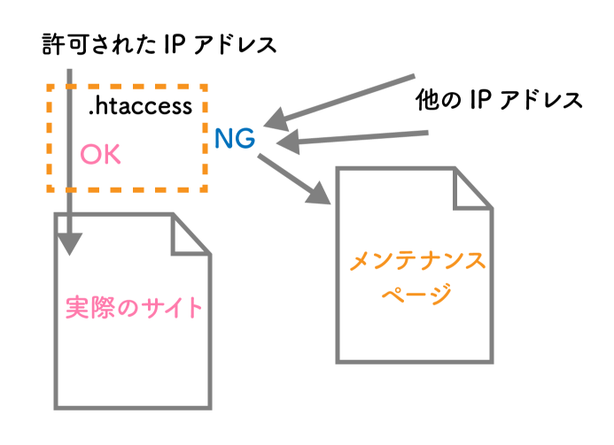
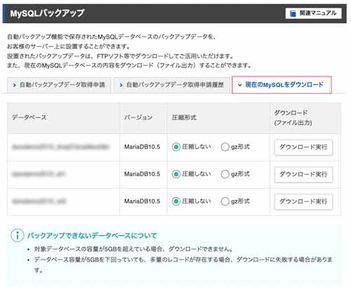
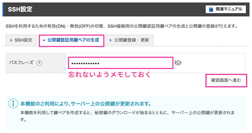
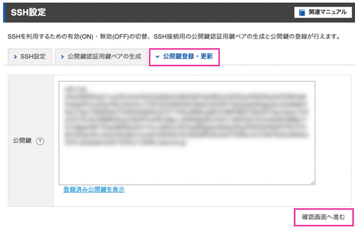
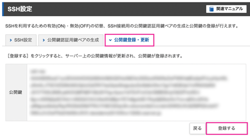
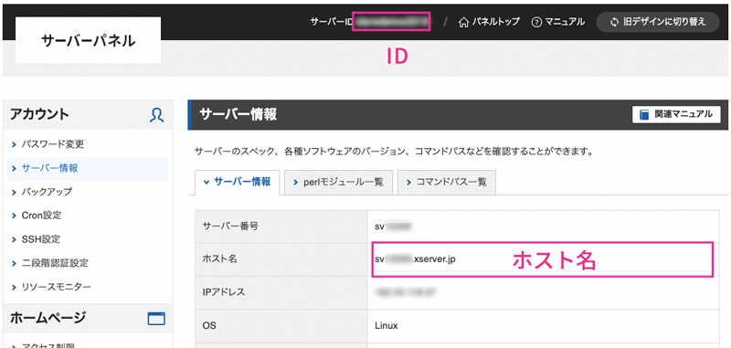
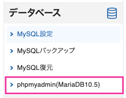
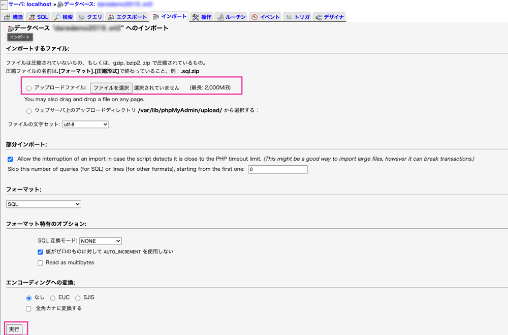
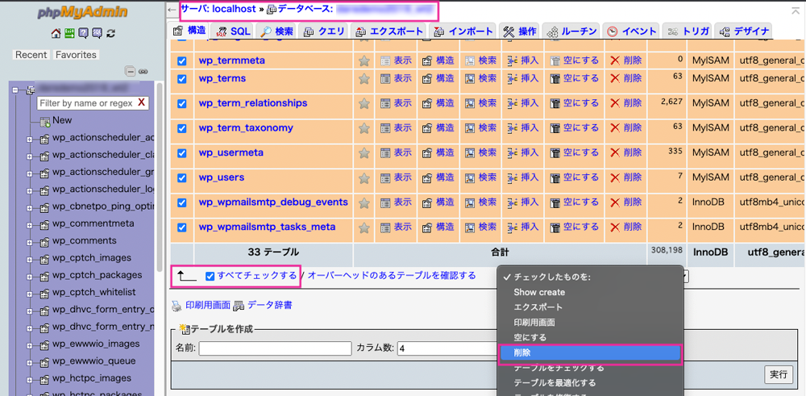

先日エックスサーバーでWordPressの簡単移行ツールを使った際に、データが大きすぎて何度もタイムアウトになり困ったことがありました。

そこで、WordPressなどのWebサイトをSSHを使って引っ越しする方法をご紹介します。

初心者の方のためにもわかりやすく、リダイレクト処理などの下準備や公開前のチェックポイントなど、実践を踏まえてかな〜〜り詳しく説明しました。

この記事はこんな方におすすめです。

* 移行するサイトのデータ量が大きすぎて移行ツールが使えなかった
* SSHでデータ移行をしたい
* tarコマンドを使いたい
* サーバ移行に時間をかけたくない

長いので目次からすっ飛ばして必要な項目だけ読んでください。


*前提条件*<br>SSHが使えるサーバー

今回はエックスサーバー、コマンドツールはiTermを使いました。

## 下準備。リダイレクト用の.htaccessやメンテナンス中のhtmlを準備しておく

作業中はWebサイトが表示されなくなってしまうこともあるので、メンテナンス中を告知するページを作成しておきます。作業でトラブルが合ったときも *maintenance.html* が表示されるのでこれでなんとか乗り切ります。



```
public_html/
  ├ maintenance.html
  └ .htaccess
```

*.htaccess* に特定のIP以外は *maintenance.html* に飛ばせるように準備しておきます。

実際の作業に移ったら、*.htaccess* を書き換えましょう！

```shell:title=.htaccess
ErrorDocument 503 /maintenance.html

<IfModule mod_rewrite.c>
RewriteEngine On
RewriteCond %{REQUEST_URI} !^/maintenance\.html$
RewriteCond %{REMOTE_ADDR} !^xxx.xxx.xxx.xxx$
RewriteRule ^(.*)$ / [R=503,L]
</IfModule>
```

### データベースを落としておく
エックスサーバーではデータベースは管理画面からカンタンにバックアップデータが落とせます。

「データベース」「MySQLバックアップ」から「現在のMySQLをダウンロード」を選び対象のDBを取得しておきましょう。



ユーザー名、データベース名、パスワードが分からないときは対象のWordPressの *wp-config.php* ファイルから調べることができます。

```php:title=wp-config.php
define( 'DB_NAME', 'db_name' );

/** Database username */
define( 'DB_USER', 'db_user' );

/** Database password */
define( 'DB_PASSWORD', 'db_password' );

/** Database hostname */
define( 'DB_HOST', 'localhost' );
```

SQLファイルの必要に応じて文字を置換しておきます。置換の仕方がわからない方は以下を参考にしてください。

<card id="/blogs/entry336/"></card>

```bash:title=置換する文字
http://dev.xxxxx.com
https://prod.xxxxx.com
```

## SSHで接続

SSHとは、**Secure Shell（セキュアシェル）** の略称で、リモートコンピュータと通信するためのプロトコルです。

私のケースで言うと、テスト環境用のドメインに作ったWordPressを同じサーバー内にある本番用ドメインの当たったディレクトリに移行しただけなので、SSH接続する必要があるのは1箇所ですみました。

データを移行するためには、移行元と移行先両方の接続する必要があるかもしれませんのでよくサーバーの情報を調べておきます。

### SSHの準備。秘密鍵と公開鍵を作成

SSHで接続するために、パスワード、公開鍵、ワンタイムパスワードなどの承認後接続するのが一般的です。

今回はエックスサーバーでのSSHの設定方法をご紹介しておきます。

SSHをオンにします。


パスフレーズを決め、秘密鍵(公開鍵認証用鍵ペア)を作ります。



「生成する」をクリックすると秘密鍵(公開鍵認証用鍵ペア)がダウンロードされます。


パスフレーズは自分で設定しますが、必ずメモするなど、忘れないようにしてください。

続けて公開鍵を作ります。エックスサーバーでは公開鍵は設定さえしてしまえば勝手に適切な箇所に保存されます。





#### 秘密鍵をローカルマシンに格納する
```bash:title=コマンド
[ユーザー]/
  ├ .ssh/(なければ新規作成)
  └ Downloads/
    └ secret.key(DLした秘密鍵ファイル)
```

秘密鍵ファイルは一般的に、ローカルマシンのご自身のユーザーアカウントの直下に *.ssh* というディレクトリを作成し、保管します。

*.ssh* が存在するかまず確認してみて、ない場合は作成します。
```bash:title=コマンド
cd ~/
mkdir .ssh
```

接頭辞に.（ドット）がつくディレクトリやファイルは *隠しファイル/ディレクトリ* なので通常の状態ではファインダーなどのファイルやディレクトリ管理ツールから見ることができません。

Macであれば `⌘+Shift+.` で隠しファイル/ディレクトリの表示非表示を切り替えることが可能です。

秘密鍵をリネームしてローカルマシンの *.ssh* フォルダに入れておきます。

```bash:title=コマンド
mv ~/Downloads/secret.key ~/.ssh
cd ~/.ssh
mv secret.key id_xserver_rsa
```

### パーミッションの確認変更

```bash
l -l
```
パーミッションに関してはよく忘れるので表にしてまとめておきます。

|文字の位置|パーミッション|
|-|-|
|2~4|ファイルの所有者|
|5~7|所有グループ|
|8~10|その他|

|種類|意味|
|-|-|
|-|ファイル|
|d|ディレクトリ|
|l|シンボリックリンク|

|モード(数字)|モード(アルファベット)|パーミッション|
|-|-|-|
|4|r|読み取り|
|2|w|書き込み|
|1|x|実行|

`chmod` コマンドでフォルダとファイルのパーミッションを変えます。<br>
パーミッションは数で指定する際は足した数字を使います。

1桁目ファイルの所有者、2桁目所有グループ、3桁目その他に対するパーミッションという感じで3桁で表せます。

```bash
chmod 700 ~/.ssh
chmod 600 ~/.ssh/id_xserver_rsa
```
パーミッションが正しいかコマンドで確認します。

*.ssh* ディレクトリはパーミッションが700なので、所有者のみに実行、読み取り、書き込みの権限が与えられるので、以下のようになります。
```bash:title=鍵ファイルの権限
drwx------
```

鍵ファイルはパーミッションが600なので、所有者のみに読み取りと書き込みの権限が与えられるので、以下のようになります。
```bash:title=鍵ファイルの権限
-rw-------
```


### 接続する
ホスト名とサーバーIDを調べておきます。
サーバーのIDは上部バーに有り、ホスト名はサーバー情報から調べることができます。



接続します。

```bash:title=コマンド
ssh -l [ID] -i [鍵のファイルの場所] [ホスト名] -p [ポート番号（Xserverは10022を指定）]
```


実行できない場合は `sudo` を付与してみてください。

```bash:title=コマンド
sudo ssh ~
```

|オプション|説明|
|-|-|
|`-l`|ログイン名（サーバーID）|
|`-i`|ファイルの場所|
|`-p`|ポート番号を指定してホスト→クライアントのポート転送|

今は *.ssh/* のディレクトリにいますが、どこからでも実行したい場合は鍵のファイルの場所は以下にしておくといいです。

```bash:title=鍵ファイルの場所
~/.ssh/id_xserver_rsa
```

対話形式で「本当に接続してもいいですか？」と聞かれるので、「yes」でいいです。
> Are you sure you want to continue connecting (yes/no/[fingerprint])?

known_hostsというファイルが生成されます。
<div class="box"><h4>known_hostsファイル</h4>はじめて特定ホストに接続しようとしたときにエントリが追加され、生成されるファイルです。特別なことがない限りそのまま置いておいて大丈夫です。</div>

対話形式で秘密鍵のパスフレーズを入力するよう求められるので、パスフレーズを入力し接続します。
> Enter passphrase for key '/Users/[ユーザー名]/.ssh/id_xserver_rsa':


接続できたら、エックスサーバーの場合は以下のように表示されます。

```bash:title=コマンド
[ID@サーバー番号 ~]$
```


接続を切りたいときは `exit` と入力します。
```bash:title=コマンド
[ID@サーバー番号 ~]$ exit
```

### Configに登録しておく
よく使う場合は、あらかじめSSHの実行コマンドを登録しておくと楽です。

```
[ユーザー]/
  └ .ssh/
    ├ id_xserver_rsa
    └ config
```
configファイルを作成
```bash:title=config
touch config
```
`vi`や`vim`でコマンドから作成もできますが、ファイルをファイルソフトなどで開いて編集するほうが楽です。

フォルダを探すのが面倒な場合はコマンドで開いて、VSコードでファイルを開いて編集しても大丈夫です。

```shell:title=コマンド
open ~/.ssh
```

編集内容は次のとおりです。

```bash:title=config
Host server01
  HostName svxxxxx.xserver.jp(xserver)
  User [ID]
  Port [ポート番号]
  IdentityFile ~/.ssh/［ファイル名］
  IdentitiesOnly yes
```

次からは少ない記述で開けるようになります。
```shell:title=コマンド
ssh server01
```
## tarコマンドを使ってみる
`tar` コマンドは複数のファイルを1つにまとたアーカイブ（複数のファイルを一つにまとめる）ファイルを作成／展開するコマンドです。`tar` コマンドはオプションを付与することで圧縮・解凍を行うことも可能になります。

```bash:title=コマンド
tar -h
```

|オプション|説明|
|-|-|
|`-c`|作成|
|`-r`|追加、入れ替え|
|`-t`|リスト化|
|`-u`|アップデート|
|`-x`|展開|
|`-z`|gzipフォーマット|
|`-j`|zip2フォーマット|
|`-J`|xzフォーマット|
|`-v`|処理したファイルを詳しく出力する|
|`-f`|アーカイブファイル名を指定する|

### 移行したいディレクトリをtarコマンドでアーカイブ化し圧縮する
```
home/(サーバー内)
  ├ dev.xxxxx.com/(test環境)
  |  └ public_html/
  |    └ wordpress/(移動したいディレクトリ)
  └ prod.xxxxx.com/(本番環境)
    └ public_html/
```

SSHでサーバーに入れたら、 `tar` コマンドでディレクトリのアーカイブファイルを作成します。

```bash:title=コマンド
tar cvf [ファイル名.tar] [圧縮したいディレクトリ]
# フォーマットをgzipにしたい場合
tar cvzf [ファイル名.tar.gz] [圧縮したいディレクトリ]
```
移行したいのは dev.xxxxx.com の中にある wordpressディレクトリ なのでこちらを圧縮します。

```bash:title=コマンド
cd ~/dev.xxxxx.com/public_html/
tar cvzf wordpress.tar.gz ~/dev.xxxxx.com/public_html/wordpress/
```
アーカイブファイルを移動させます。移行先が同じサーバー内ではない場合はFTPなどでダウンロードしておくといいです。tar.gz形式だとFTPでのダウンロードも時間もかからないと思います。

<msg txt="すべてコマンドで処理するとつかれるので、GUIツール（FTPソフトなど）もうまく利用するといいですよ！"></msg>

```bash:title=コマンド
mv ~/dev.xxxxx.com/public_html/wordpress.tar.gz ~/prod.xxxxx.com/public_html/
```

アーカイブファイルが移動しているか確認します。もちろんFTPソフトで確認してもOKです！！
```bash:title=コマンド
cd ~/prod.xxxxx.com/public_html/
ls -l
```
### 移行したデータを解凍する
いよいよ公開作業に移ります。展開する前に、*maintenance.html* と *.htaccess* を設置し、それ以外の不要なファイルはサーバー内から削除しておきます。
<br><small>※ 念の為バックアップを取って置くことをオススメします。</small>
```
home/(サーバー内)
  ├ dev.xxxxx.com/(test環境)
  |  └ public_html/
  |    └ wordpress/
  └ prod.xxxxx.com/(本番環境)
    └ public_html/
      ├ .htaccess(設置)
      ├ maintenance.html(設置)
      └ wordpress.tar.gz(解答したいファイル)
```
*wordpress.tar.gz* を展開します。

```bash:title=コマンド
cd ~/prod.xxxxx.com/public_html/
tar xvzf wordpress.tar.gz
```
*wordpress.tar.gz* を削除します。もちろんFTPから削除してもOKです。

```bash:title=コマンド
rm -rf wordpress.tar.gz
```
作業が終わったら `exit` コマンドでSSHを抜けておきます。

## データベースをインポートする
新規立ち上げの場合は空のデータベースを事前に作っておきます。


ユーザーがいない場合はユーザーとパスワードを追加します。**パスワードは忘れないようにメモ**しておきます。


データベース名、データベースアクセス権所有ユーザー、データベースパスワード、ホスト名が必要になります。

管理画面のphpMyAdminからログインし



予め置換しておいたSQLファイルをインポートします。



ファイルを移行後に、*wp-config.php* のDB設定を書き換えます。

```php:title=wp-config.php
define( 'DB_NAME', 'db_name' );

/** Database username */
define( 'DB_USER', 'db_user' );

/** Database password */
define( 'DB_PASSWORD', 'db_password' );

/** Database hostname */
define( 'DB_HOST', 'localhost' );
```

### データ移行に失敗した場合
置換をミスったりした場合も焦る必要はありません。

PhpMyAdminから対象のDBを選択しテーブルをすべて削除。


あとは先程同様、ファイル置換し直したものをインポートすればOKです。

## htaccessのリダイレクトを解除しサイトをオープンさせる
以下を十分にチェックした上で、サイトをオープンさせましょう。

* プラグインの設定方法が動いてるか
* 正しく遷移するか
* リンク切れ画像などないか
* WordPressがデバッグモードのままじゃないか
* noindexが設定されたままになっていないか

<div class="box">カスタマイザーで設定したものや、コンタクトフォームセブンなどの設定は一からやり直しになる可能性があります。<br>設定をメモに残しておくなどしてリカバリーできるようにしておきましょう。</div>

## まとめ・落ち着いてやればSSHでのサイト移行も難しくはない
時間をかければFTPでも大容量のデータの移行はできますが、とても非効率的です。

<msg txt="以前画像の移動だけでセブ島でやったら丸２日かかりました！"></msg>

色んな便利な方法はありますがプラグインを無駄にインストールするのも嫌ですし、SSH接続での処理が一番安定感があります。

コーダーも含めた非エンジニアにとってコマンドはとても敷居が高いですが、必要に応じて使えるようになるととても強い味方になります。

<msg txt="私は必要なコマンドだけ集めたチートシートを作ってます。"></msg>

この記事が皆さんのWeb制作の一助となれば幸いです。

最後までお読みいただきありがとうございました。

<prof></prof>
